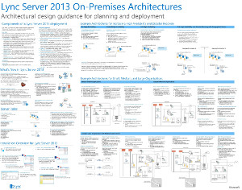

# Lync Server 2013 的技術圖表

 

_**上次修改主題：** 2014年-03-14_

**摘要：** 這些圖表採用 Lync 2013 的建議解決方案的視覺表示法。

這些資源可提供 Visio (.vsd) 格式 （Visio 2010 或 Visio 2013） 及 PDF 格式。 如需如何在列印文件資訊，請參閱列印海報祕訣。

您可能需要其他軟體才能檢視這些檔案。 如需詳細資訊，請參閱下表。

<table>
<colgroup>
<col style="width: 50%" />
<col style="width: 50%" />
</colgroup>
<thead>
<tr class="header">
<th>檔案類型</th>
<th>軟體</th>
</tr>
</thead>
<tbody>
<tr class="odd">
<td>
.vsd
</td>
<td>
Visio 2010、 Visio 2013 或<a href="https://go.microsoft.com/fwlink/?linkid=393676">免費的 Visio 檢視器</a>

If you use the Visio viewer, right-click the VSD link, click <strong>Save Target As</strong>, save the file to your computer, and then open the file from your computer.
</td>
</tr>
<tr class="even">
<td>
.pdf
</td>
<td>
任何 PDF 檢視器，例如 <a href="https://go.microsoft.com/fwlink/?linkid=393675">Adobe Reader</a>
</td>
</tr>
<tr class="odd">
<td>
.zip
</td>
<td>
任何檔案壓縮公用程式。 Windows 7 和 8 原生開啟這些檔案。
</td>
</tr>
</tbody>
</table>

## 海報

這些海報詳細說明特定技術區域中，而來搭配對應的文件上 TechNet 或下載中心上可用的內容。

<table>
<colgroup>
<col style="width: 50%" />
<col style="width: 50%" />
</colgroup>
<thead>
<tr class="header">
<th>職稱</th>
<th>描述</th>
</tr>
</thead>
<tbody>
<tr class="odd">
<td>
<strong>Lync Server 2013 內部部署架構</strong>

<a href="https://go.microsoft.com/fwlink/?linkid=392974">Zoom.it 放大海報的完整詳細資料與 microsoft 的 Zoom.it</a>（適合使用桌上型電腦或筆記型電腦）

<a href="https://go.microsoft.com/fwlink/?linkid=392578">PDF 版本</a>（適合使用行動裝置或平板電腦）

<a href="https://go.microsoft.com/fwlink/?linkid=392579">Visio 版本</a>（適合使用 Visio 的使用者）
</td>
<td>
海報提供規劃及部署的架構指南。 海報包含 Lync Server，規劃部署、 新功能、 伺服器角色，以及安裝概觀時所使用的術語的一般元件的相關資訊。 除了海報包含增加高可用性與災害復原，以及小型、 中型或大型的範例拓撲的範例架構。

規模： 34-44 英吋

使用 Visio 2013 建立此海報。 未修改應所需的特定環境。
</td>
</tr>
<tr class="even">
<td>
<strong>Lync 通話品質方法</strong>

<a href="https://go.microsoft.com/fwlink/?linkid=392972">Zoom.it 放大海報的完整詳細資料與 microsoft 的 Zoom.it</a>（適合使用桌上型電腦或筆記型電腦）

<a href="https://go.microsoft.com/fwlink/?linkid=391841">Visio 和 PDF 版本一起.zip 檔案中</a>
</td>
<td>
海報中描述 Lync 系統疑難排解，尤其影響企業語音品質的問題。 使用此海報中的具有：

<ul>
<li>
<a href="https://go.microsoft.com/fwlink/p/?linkid=390677">Lync Server 網路指南</a>
</li>
<li>
<a href="lync-server-2013-poster-lync-call-quality-methodology.md">Lync Server 2013 中 Lync 通話品質方法</a>（協助工具文件）
</li>
<li>
<a href="lync-server-2013-poster-key-health-indicators.md">Lync Server 2013 中的機碼健康狀態指標</a>（協助工具文件）
</li>
</ul>

規模： 34-44 英吋

使用 Visio 2010 建立此海報。 未修改應所需的特定環境。
</td>
</tr>
<tr class="odd">
<td>
<strong>主要的健康狀態指標</strong>

<a href="https://go.microsoft.com/fwlink/?linkid=392971">Zoom.it 放大海報的完整詳細資料與 microsoft 的 Zoom.it</a>（適合使用桌上型電腦或筆記型電腦）

<a href="https://go.microsoft.com/fwlink/?linkid=391838">Visio 和 PDF 版本一起.zip 檔案中</a>
</td>
<td>
海報中描述疑難排解計量的基本伺服器健康狀況和 Lync 實作中指定的伺服器角色的伺服器。 使用此海報中的具有：

<ul>
<li>
<a href="https://go.microsoft.com/fwlink/p/?linkid=390677">Lync Server 網路指南</a>
</li>
<li>
<a href="lync-server-2013-poster-lync-call-quality-methodology.md">Lync Server 2013 中 Lync 通話品質方法</a>（協助工具文件）
</li>
<li>
<a href="lync-server-2013-poster-key-health-indicators.md">Lync Server 2013 中的機碼健康狀態指標</a>（協助工具文件）
</li>
</ul>

規模： 17-22 英吋

使用 Visio 2010 建立此海報。 未修改應所需的特定環境。
</td>
</tr>
<tr class="even">
<td>
<strong>Lync 2013 平台選項</strong>

<a href="https://go.microsoft.com/fwlink/p/?linkid=391840">Microsoft 提供的 zoom.it 放大海報中利用 microsoft 提供的完整詳細資料</a>

<a href="https://go.microsoft.com/fwlink/p/?linkid=391837">PDF 版本</a>（適合使用行動裝置或平板電腦）

<a href="https://go.microsoft.com/fwlink/p/?linkid=391839">Visio 版本</a>（適合使用 Visio 的使用者）
</td>
<td>
此海報說明可用的平台 Lync 2013 Bdm 及架構師客戶的選項可以選擇從 Lync Online 與 Office 365，混合式 Lync Lync Server 內部部署和主控 Lync。 海報包含每個架構選項的詳細資訊，包括每個最理想情況下的授權需求以及 IT 專業人員的責任。

規模： 34-44 英吋

使用 Visio 2013 建立此海報。 未修改應所需的特定環境。
</td>
</tr>
<tr class="odd">
<td>
<strong>Microsoft Lync Server 2013 通訊協定工作負載</strong>

<a href="https://go.microsoft.com/fwlink/?linkid=392970">Microsoft 提供的 zoom.it 放大海報中利用 microsoft 提供的完整詳細資料</a>

<a href="https://go.microsoft.com/fwlink/?linkid=392512">PDF 版本</a>（適合使用行動裝置或平板電腦）

<a href="https://go.microsoft.com/fwlink/?linkid=392513">Visio 版本</a>（適合使用 Visio 的使用者）
</td>
<td>
下載此海報以了解的功能和 Lync 2013、 Lync 電話、 Lync Web App、 Lync for Mac 和 Lync Mobile w 的需求。 請參閱 < Lync Server 工作負載促進通訊整個組織的方式。

規模： 24 至 36 英吋

使用 Visio 2013 建立此海報。 未修改應所需的特定環境。
</td>
</tr>
</tbody>
</table>

## 列印海報祕訣

如果您有繪圖機，則可以用海報的完整大小來列印這些海報。 如果您沒有繪圖機，請使用下列步驟在較小的紙張上列印。

**在較小的紙張上列印海報**

1.  在 Visio 中開啟海報。

2.  在 [檔案]**** 功能表上，按一下 [版面設定]****。

3.  在 [列印設定]**** 索引標籤的 [印表機紙張]**** 區段中，選取想要在其上列印的紙張大小。

4.  在 [列印設定]**** 索引標籤的 [列印比例]**** 區段中，按一下 [調整成]****，然後輸入 [1 sheet across by 1 sheet down]****。

5.  在 [紙張大小]**** 索引標籤上，按一下 [大小符合繪圖內容]****，然後再按一下 [確定]****。

6.  在 [檔案]**** 功能表上，按一下 [列印]****。

 

