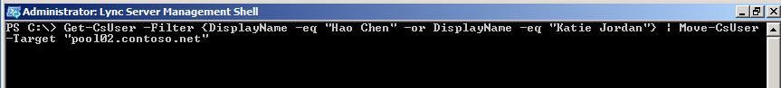

# <a name="move-multiple-users-to-the-pilot-pool"></a><span data-ttu-id="d2db6-103">將多個使用者移至 [試驗] 池</span><span class="sxs-lookup"><span data-stu-id="d2db6-103">Move multiple users to the pilot pool</span></span>

<span data-ttu-id="d2db6-104">您可以使用商務用 Skype Server 2019 控制台或商務用 Skype Server 2019 管理命令介面，從舊版池中將多個使用者移至您的商務用 skype Server 2019 試用版。</span><span class="sxs-lookup"><span data-stu-id="d2db6-104">You can move multiple users from your legacy pool to your Skype for Business Server 2019 pilot pool using Skype for Business Server 2019 Control Panel or Skype for Business Server 2019 Management Shell.</span></span>

 <span data-ttu-id="d2db6-105">**本文內容**</span><span class="sxs-lookup"><span data-stu-id="d2db6-105">**In this article**</span></span>
  
<span data-ttu-id="d2db6-106">[使用商務用 Skype Server 2019 的 [控制台] 移動多個使用者](#sectionSection0)</span><span class="sxs-lookup"><span data-stu-id="d2db6-106">[To move multiple users by using the Skype for Business Server 2019 Control Panel](#sectionSection0)</span></span>
  
[<span data-ttu-id="d2db6-107">使用商務用 Skype Server 2019 管理命令介面來移動多位使用者</span><span class="sxs-lookup"><span data-stu-id="d2db6-107">To move multiple users by using the Skype for Business Server 2019 Management Shell</span></span>](#sectionSection1)
  
[<span data-ttu-id="d2db6-108">使用商務用 Skype Server 2019 管理命令介面，同時移動所有使用者</span><span class="sxs-lookup"><span data-stu-id="d2db6-108">To move all users at the same time by using the Skype for Business Server 2019 Management Shell</span></span>](#sectionSection2)
  
  
## <a name="to-move-multiple-users-by-using-the-skype-for-business-server-2019-control-panel"></a><span data-ttu-id="d2db6-109">使用商務用 Skype Server 2019 的 [控制台] 移動多個使用者</span><span class="sxs-lookup"><span data-stu-id="d2db6-109">To move multiple users by using the Skype for Business Server 2019 Control Panel</span></span>
<span data-ttu-id="d2db6-110"><a name="sectionSection0"> </a></span><span class="sxs-lookup"><span data-stu-id="d2db6-110"></span></span>

1. <span data-ttu-id="d2db6-111">開啟商務用 Skype Server 的 [控制台]。</span><span class="sxs-lookup"><span data-stu-id="d2db6-111">Open Skype for Business Server Control Panel.</span></span>
    
2. <span data-ttu-id="d2db6-112">按一下 [**使用者**]，按一下 [**搜尋**]，然後按一下 [**尋找**]。</span><span class="sxs-lookup"><span data-stu-id="d2db6-112">Click **Users**, click **Search**, and then click **Find**.</span></span>
    
3. <span data-ttu-id="d2db6-113">選取兩個您要移至商務用 Skype Server 2019 池的使用者。</span><span class="sxs-lookup"><span data-stu-id="d2db6-113">Select two users that you want to move to the Skype for Business Server 2019 pool.</span></span> <span data-ttu-id="d2db6-114">在這個範例中，我們會將使用者唐到 [陽入] 和 [Claus Hansen]。</span><span class="sxs-lookup"><span data-stu-id="d2db6-114">In this example, we will move users Chen Yang and Claus Hansen.</span></span>
    
     
  
4. <span data-ttu-id="d2db6-116">從 [**動作**] 功能表中，選取 [**將選取的使用者移至資源庫**]。</span><span class="sxs-lookup"><span data-stu-id="d2db6-116">From the **Action** menu, select **Move selected users to pool**.</span></span>
    
5. <span data-ttu-id="d2db6-117">從下拉式清單中，選取 [商務用 Skype Server 2019] 池。</span><span class="sxs-lookup"><span data-stu-id="d2db6-117">From the drop-down list, select the Skype for Business Server 2019 pool.</span></span>
    
6. <span data-ttu-id="d2db6-118">按一下 [**動作**]，然後按一下 [**將選取的使用者移至資源庫**]。</span><span class="sxs-lookup"><span data-stu-id="d2db6-118">Click **Action**, and then click **Move selected users to pool**.</span></span> <span data-ttu-id="d2db6-119">按一下 [確定]\*\*\*\*。</span><span class="sxs-lookup"><span data-stu-id="d2db6-119">Click **OK**.</span></span>
    
     ![移動使用者，[目的地登錄器集區] 對話方塊](../media/Migration_LyncServer_from_LyncServer2010_CPanelMoveUserSelectPoolDialog.png)
  
7. <span data-ttu-id="d2db6-121">確認使用者的 [**註冊機構池**] 欄現在包含商務用 Skype Server 2019 pool，這表示使用者已順利移動。</span><span class="sxs-lookup"><span data-stu-id="d2db6-121">Verify that the **Registrar pool** column for the users now contains the Skype for Business Server 2019 pool, which indicates that the users have been successfully moved.</span></span> 
    
## <a name="to-move-multiple-users-by-using-the-skype-for-business-server-2019-management-shell"></a><span data-ttu-id="d2db6-122">使用商務用 Skype Server 2019 管理命令介面來移動多位使用者</span><span class="sxs-lookup"><span data-stu-id="d2db6-122">To move multiple users by using the Skype for Business Server 2019 Management Shell</span></span>
<span data-ttu-id="d2db6-123"><a name="sectionSection1"> </a></span><span class="sxs-lookup"><span data-stu-id="d2db6-123"></span></span>

1. <span data-ttu-id="d2db6-124">開啟商務用 Skype Server 2019 管理命令介面。</span><span class="sxs-lookup"><span data-stu-id="d2db6-124">Open the Skype for Business Server 2019 Management Shell.</span></span> 
    
2. <span data-ttu-id="d2db6-125">在命令列中，輸入下列內容，並將 [ **User1** **] 和 [** 使用者 2] 替換為您想要移動的特定使用者名稱，然後將**pool_FQDN**取代為目的地池的名稱。</span><span class="sxs-lookup"><span data-stu-id="d2db6-125">At the command line, type the following and replace **User1** and **User2** with specific user names you want to move, and replace **pool_FQDN** with the name of the destination pool.</span></span> <span data-ttu-id="d2db6-126">在這個範例中，我們會將使用者 Hao 唐和她約旦。</span><span class="sxs-lookup"><span data-stu-id="d2db6-126">In this example we will move users Hao Chen and Katie Jordan.</span></span> 
    
   ```PowerShell
   Get-CsUser -Filter {DisplayName -eq "User1" -or DisplayName - eq "User2"} | Move-CsUser -Target "pool_FQDN"
   ```

    
  
3. <span data-ttu-id="d2db6-128">在命令列中，輸入下列內容：</span><span class="sxs-lookup"><span data-stu-id="d2db6-128">At the command line, type the following:</span></span> 
    
   ```PowerShell
   Get-CsUser -Identity "User1"
   ```

4. <span data-ttu-id="d2db6-129">**註冊機構池**標識現在應該指向您在上一個步驟中指定為**pool_FQDN**的池。</span><span class="sxs-lookup"><span data-stu-id="d2db6-129">The **Registrar Pool** identity should now point to the pool you specified as **pool_FQDN** in the previous step.</span></span> <span data-ttu-id="d2db6-130">此身分識別的狀態會確認使用者已順利移動。</span><span class="sxs-lookup"><span data-stu-id="d2db6-130">The presence of this identity confirms that the user has been successfully moved.</span></span> <span data-ttu-id="d2db6-131">重複步驟，**確認已移動到您的操作**者。</span><span class="sxs-lookup"><span data-stu-id="d2db6-131">Repeat step to verify that **User2** has been moved.</span></span> 
    
     
  
## <a name="to-move-all-users-at-the-same-time-by-using-the-skype-for-business-server-2019-management-shell"></a><span data-ttu-id="d2db6-133">使用商務用 Skype Server 2019 管理命令介面，同時移動所有使用者</span><span class="sxs-lookup"><span data-stu-id="d2db6-133">To move all users at the same time by using the Skype for Business Server 2019 Management Shell</span></span>
<span data-ttu-id="d2db6-134"><a name="sectionSection2"> </a></span><span class="sxs-lookup"><span data-stu-id="d2db6-134"></span></span>

<span data-ttu-id="d2db6-135">在這個範例中，所有使用者都已回到舊版資源（pool01.contoso.net）。</span><span class="sxs-lookup"><span data-stu-id="d2db6-135">In this example, all users have been returned to the legacy pool (pool01.contoso.net).</span></span> <span data-ttu-id="d2db6-136">使用商務用 Skype Server 2019 管理命令介面，我們會同時將所有使用者移至商務用 Skype Server 2019 （pool02.contoso.net）。</span><span class="sxs-lookup"><span data-stu-id="d2db6-136">Using the Skype for Business Server 2019 Management Shell, we will move all users at the same time to the Skype for Business Server 2019 pool (pool02.contoso.net).</span></span>
  
1. <span data-ttu-id="d2db6-137">開啟商務用 Skype Server 2019 管理命令介面。</span><span class="sxs-lookup"><span data-stu-id="d2db6-137">Open the Skype for Business Server 2019 Management Shell.</span></span>
    
2. <span data-ttu-id="d2db6-138">在命令列中，輸入下列內容：</span><span class="sxs-lookup"><span data-stu-id="d2db6-138">At the command line, type the following:</span></span> 
    
   ```PowerShell
   Get-CsUser -OnLyncServer | Move-CsUser -Target "pool_FQDN"
   ```

     
  
3. <span data-ttu-id="d2db6-140">針對其中一個試驗使用者執行**move-csuser** 。</span><span class="sxs-lookup"><span data-stu-id="d2db6-140">Run **Get-CsUser** for one of the pilot users.</span></span> 
    
   ```PowerShell
   Get-CsUser -Identity "Hao Chen"
   ```

4. <span data-ttu-id="d2db6-141">每個使用者的**註冊機構池**標識現在會指向您在上一個步驟中指定為**pool_FQDN**的池。</span><span class="sxs-lookup"><span data-stu-id="d2db6-141">The **Registrar Pool** identity for each user now points to the pool you specified as **pool_FQDN** in the previous step.</span></span> <span data-ttu-id="d2db6-142">此身分識別的狀態會確認使用者已順利移動。</span><span class="sxs-lookup"><span data-stu-id="d2db6-142">The presence of this identity confirms that the user has been successfully moved.</span></span> 
    
5. <span data-ttu-id="d2db6-143">此外，我們還可以在商務用 Skype Server 2019 的 [控制台] 中查看使用者清單，並確認 [註冊機構] 池值現在會指向 [商務用 Skype Server 2019] 池。</span><span class="sxs-lookup"><span data-stu-id="d2db6-143">Additionally, we can view the list of users in the Skype for Business Server 2019 Control Panel and verify that the Registrar Pool value now points to the Skype for Business Server 2019 pool.</span></span>
    
     ![商務用 Skype Server 2019 的 [控制台] 使用者清單](../media/Migration_LyncServer_CPanel_fromLyncServer2010_Move-CSUserVerifyHao.JPG)
  

