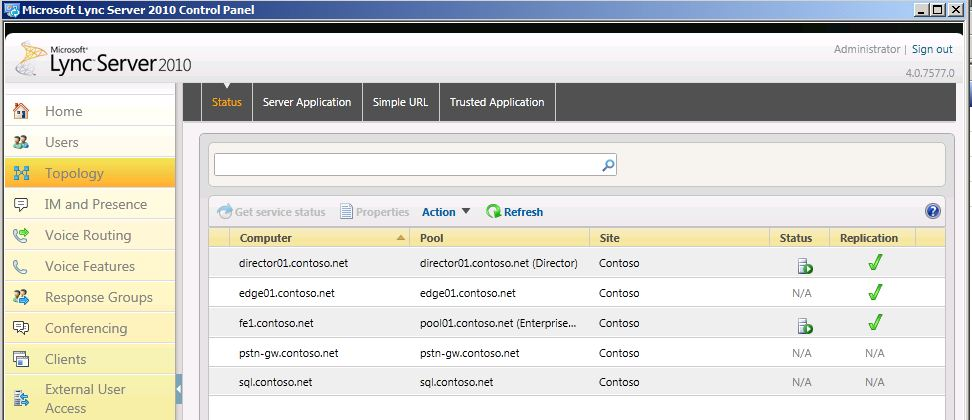

# 驗證舊版環境

在共存狀態中部署商務用 Skype Server 2019 之前，您必須確認已設定並啟動舊版服務。 在部署商務用 Skype Server 2019 試驗集區之前，請務必先識別舊環境中存在的重要服務和功能。 在使用舊版 XMPP 部署的共存狀態中部署 Microsoft 商務用 Skype Server 2019 XMPP 之前，您必須確認已設定並啟動舊版 XMPP 服務，以及識別舊版 XMPP 設定所支援的同盟合作夥伴。 驗證舊版部署需要下列各項：
  
- 驗證舊版服務是否已啟動
    
- 查看拓撲和使用者
    
- 驗證同盟及 Edge server 設定
    
- 驗證 XMPP 服務和同盟夥伴
    
## 確認舊版服務已啟動

1. 在舊版前端伺服器上，流覽至 [管理工具 \ 服務] 小程式。
    
2. 確認下列服務正在前端伺服器上執行：
    
     
  
## 在商務用 Skype Server 控制台中檢查舊版拓撲

1. 使用 RTCUniversalServerAdmins 群組的成員帳戶、CsAdministrator 成員帳戶或 CsUserAdministrator 系統管理角色的成員帳戶，登入前端伺服器。
    
2. 開啟 [商務用 Skype Server 控制台]。
    
3. 選取 [ **拓撲**]。 確認舊版部署中的各種伺服器都已列出。
    
     
  
## 在商務用 Skype Server 控制台中檢查舊版使用者

1. 開啟 [商務用 Skype Server 控制台]。
    
2. 選取 [ **使用者**]，然後按一下 [ **尋找**]。
    
3. 確認 [ **註冊集** 區] 欄針對所列的每個使用者，指向舊版集區。 
    
     
  
## 驗證舊版 Edge 及同盟設定

1. 啟動拓撲產生器。
    
2. 選取 [ **從現有的部署下載拓撲**]。
    
3. 選擇檔案名，並以預設的 redmond.tbxml 檔案類型儲存拓撲。
    
4. 展開 [舊版安裝] 節點，以顯示部署中的各種伺服器角色。
    
5. 選取 [網站] 節點，並確認已設定 [ **網站同盟路由指派** ] 值。 
    
     
  
6. 選取 [Standard Edition 伺服器] 或 [Enterprise Edition 前端集區]。 決定是否已為下列的媒體設定 Edge 集區的 **關聯** 性。 
    
     
  
7. 選取 Edge 集區，並識別下一個躍點集區是否已在 **下一個躍點選取範圍** 下設定。
    
     
  
## 驗證舊版 XMPP 同盟協力廠商設定

1. 在舊版 XMPP 伺服器上，流覽至 [管理工具 \ 服務] 小程式。
    
2. 確認已啟動 Office 通訊伺服器 XMPP 閘道服務。 
    
     
  

