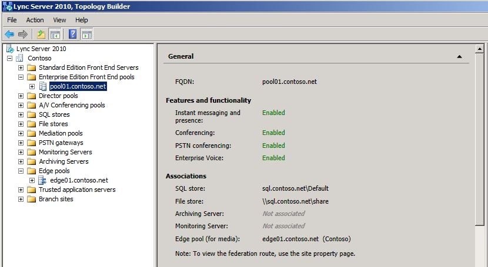
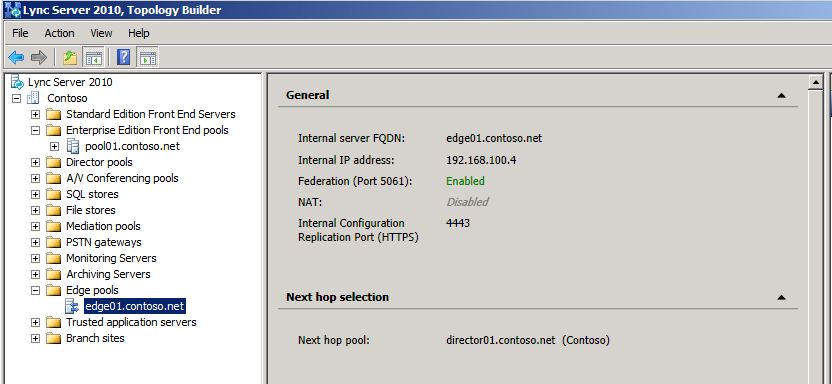

# 驗證舊版環境

在共存狀態中部署商務用 Skype Server 2019 之前, 您必須確認已設定並啟動舊版服務。 在部署商務用 Skype Server 2019 試驗池之前, 請務必先找出舊版環境中存在的主要服務和功能。 在部署 Microsoft 商務用 Skype Server 2019 XMPP 的共存狀態與舊版 XMPP 部署之前, 您必須確認已設定並啟動舊版 XMPP 服務, 並找出舊版 XMPP 的聯盟夥伴配置支援。 驗證舊版部署需要進行下列作業:
  
- 確認舊版服務已啟動
    
- 查看拓撲和使用者
    
- 驗證同盟和 Edge 伺服器設定
    
- 驗證 XMPP 服務和聯盟夥伴
    
## 確認舊版服務已啟動

1. 從舊版前端伺服器流覽至 [管理 Tools\Services] 小程式。
    
2. 確認下列服務正在前端伺服器上執行:
    
     
  
## 在商務用 Skype Server [控制台] 中查看舊版拓撲

1. 使用 RTCUniversalServerAdmins 群組成員的帳戶或 CsAdministrator 或 CsUserAdministrator 系統管理角色的成員登入前端伺服器。
    
2. 開啟商務用 Skype Server 的 [控制台]。
    
3. 選取 [**拓撲**]。 確認舊版部署中的各種伺服器都已列出。
    
     ![[控制台拓撲] 頁面](../media/migration_lyncserver_2010_topology.JPG)
  
## 在商務用 Skype Server [控制台] 中查看舊版使用者

1. 開啟商務用 Skype Server 的 [控制台]。
    
2. 選取 [**使用者**], 然後按一下 [**尋找**]。
    
3. 確認 [**註冊機構池**] 欄會針對所列的每位使用者, 指向舊版資源區。 
    
     ![[控制台] 列出使用者](../media/migration_lyncserver_2010_allusers.JPG)
  
## 驗證舊版邊緣與同盟設定

1. 啟動拓撲建立器。
    
2. 選取 [**從現有的部署下載拓撲**。
    
3. 選擇檔案名, 然後使用預設的 tbxml 檔案類型來儲存拓撲。
    
4. 展開舊版 [安裝] 節點, 以顯示部署中的各種伺服器角色。
    
5. 選取 [網站] 節點, 然後確認已設定 [**網站同盟路由指派**] 值。 
    
     
  
6. 選取 [標準版伺服器] 或 [企業版頂層端] 池。 判斷是否已針對低於 [**關聯**性] 的媒體設定 Edge 池。 
    
     
  
7. 選取 [邊緣] 池, 並識別下一個躍點池是否已設定在**下一個躍點選取範圍**下方。
    
     
  
## 驗證舊版 XMPP 聯盟合作夥伴設定

1. 從舊版 XMPP 伺服器流覽至 [管理 Tools\Services] 小程式。
    
2. 確認已啟動 Office 通訊伺服器 XMPP 閘道服務。 
    
     
  

