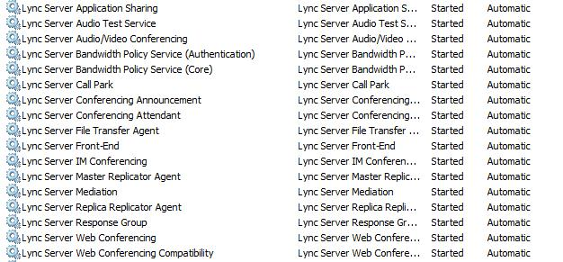
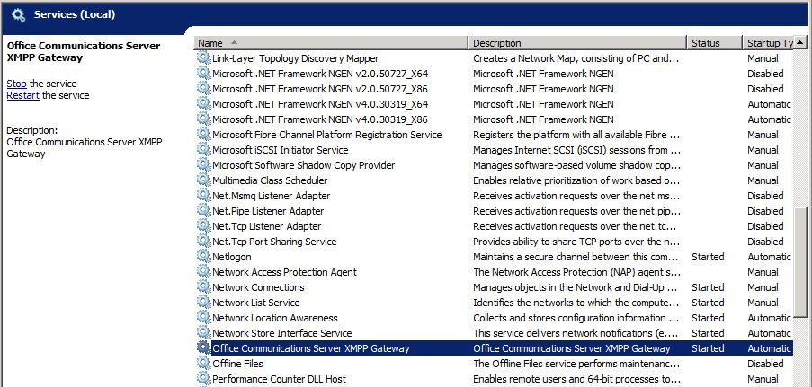

# 驗證舊版環境Verify the legacy environment

在共存狀態中部署商務用 Skype Server 2019 之前，您必須確認已設定並啟動舊版服務。Before deploying Skype for Business Server 2019 in a coexistence state, you need to verify that legacy services have been configured and started. 在部署商務用 Skype Server 2019 試驗集區之前，請務必先識別舊環境中存在的重要服務和功能。It is important to identify key services and features that exist in your legacy environment prior to deploying a Skype for Business Server 2019 pilot pool. 在使用舊版 XMPP 部署的共存狀態中部署 Microsoft 商務用 Skype Server 2019 XMPP 之前，您必須確認舊版 XMPP 服務已設定並啟動，並識別舊版的 XMPP 設定所支援的同盟合作夥伴。Before deploying Microsoft Skype for Business Server 2019 XMPP in a coexistence state with a legacy XMPP deployment, you need to verify that the legacy XMPP services have been configured and started, and identify which federated partner the legacy XMPP configuration is supporting. 驗證舊版部署需要下列各項：Verifying your legacy deployment entails the following:
  
- 驗證舊版服務是否已啟動Verifying that the legacy services are started
    
- 查看拓撲和使用者Reviewing the topology and users
    
- 驗證同盟及 Edge server 設定Verifying the federation and Edge server settings
    
- 驗證 XMPP 服務和同盟夥伴Verifying XMPP services and federated partners
    
## 確認舊版服務已啟動Verify that legacy services are started

1. 在舊版前端伺服器上，流覽至 [管理工具 \ 服務] 小程式。From the legacy Front End Server, navigate to the Administrative Tools\Services applet.
    
2. 確認下列服務正在前端伺服器上執行：Verify that the following services are running on the Front End Server:
    
     
  
## 在商務用 Skype Server 控制台中檢查舊版拓撲Review the legacy topology in Skype for Business Server Control Panel

1. 使用 RTCUniversalServerAdmins 群組的成員帳戶、CsAdministrator 成員帳戶或 CsUserAdministrator 系統管理角色的成員帳戶，登入前端伺服器。Log on to the Front End Server with an account that is a member of the RTCUniversalServerAdmins group or a member of the CsAdministrator or CsUserAdministrator administrative role.
    
2. 開啟商務用 Skype Server 控制台。Open the Skype for Business Server Control Panel.
    
3. 選取 [**拓撲**]。Select **Topology**. 確認舊版部署中的各種伺服器都已列出。Verify that the various servers in your legacy deployment are listed.
    
     
  
## 在商務用 Skype Server 控制台中檢查舊版使用者Review legacy users in Skype for Business Server Control Panel

1. 開啟商務用 Skype Server 控制台。Open the Skype for Business Server Control Panel.
    
2. 選取 [**使用者**]，然後按一下 [**尋找**]。Select **Users**, and then click **Find**.
    
3. 確認 [**註冊集**區] 欄針對所列的每個使用者，指向舊版集區。Verify that the **Registrar Pool** column points to the legacy pool for each user listed. 
    
     
  
## 驗證舊版 Edge 及同盟設定Verify legacy Edge and federation settings

1. 啟動拓撲產生器。Start Topology Builder.
    
2. 選取 [**從現有的部署下載拓撲**]。Select **Download Topology from existing deployment**.
    
3. 選擇檔案名，並以預設的 redmond.tbxml 檔案類型儲存拓撲。Choose a file name, and save the topology with the default .tbxml file type.
    
4. 展開 [舊版安裝] 節點，以顯示部署中的各種伺服器角色。Expand the legacy installs node to reveal the various server roles in the deployment.
    
5. 選取 [網站] 節點，並確認已設定 [**網站同盟路由指派**] 值。Select the site node and verify that a **Site federation route assignment** value is set. 
    
     
  
6. 選取 [Standard Edition Server] 或 [Enterprise Edition 前端集區]。Select the Standard Edition Server or Enterprise Edition front end pool. 決定是否已為下列的媒體設定 Edge 集區的**關聯**性。Determine whether an Edge pool has been configured for media below **Associations**. 
    
     
  
7. 選取 Edge 集區，並識別下一個躍點集區是否已在**下一個躍點選取範圍**下設定。Select the Edge pool and identify whether a Next hop pool is configured below **Next hop selection**.
    
     
  
## 驗證舊版 XMPP 同盟協力廠商設定Verify legacy XMPP federated partner Configuration

1. 在舊版 XMPP 伺服器上，流覽至 [管理工具 \ 服務] 小程式。From the legacy XMPP server, navigate to the Administrative Tools\Services applet.
    
2. 確認已啟動 Office 通訊伺服器 XMPP 閘道服務。Verify that the Office Communications Server XMPP Gateway service is started. 
    
     
  

