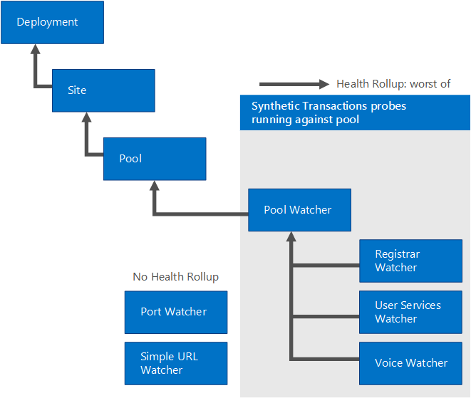

# 使用 SCOM 管理套件管理商務用 Skype Server 2019Manage Skype for Business Server 2019 using SCOM Management pack
 
**摘要:** 瞭解如何設定您的商務用 Skype Server 2019 基礎結構, 以搭配 System Center Operations Manager 使用。**Summary:** Learn how to configure your Skype for Business Server 2019 infrastructure to work with System Center Operations Manager.
  
在理想世界中, 您不會在商務用 Skype Server 2019 中遇到問題。In an ideal world, you'd never encounter issues with Skype for Business Server 2019. 不過, 商務用 Skype Server 可能受外部因素影響, 例如網路故障和硬體失敗。However, Skype for Business Server can be affected by external factors—for example, network crashes and hardware failures. 透過使用商務用 Skype Server 2019 管理套件, 您可以預先找出並解決可能的問題。By using Skype for Business Server 2019 Management Packs, you can identify and address potential issues proactively. 如此一來, 商務用 Skype Server 2019 管理套件延伸了 System Center Operations Manager 的功能。In this way, the Skype for Business Server 2019 Management Packs extend the capabilities of System Center Operations Manager.
  
此資訊是根據商務用 Skype Server 2019 通訊軟體之監視套件版本9319.0 撰寫。This information was written based on version 9319.0 of the Monitoring Pack for Skype for Business Server 2019 communications software.
  
## 配置概覽Configuration overview

 若要設定您的商務用 Skype Server 2019 基礎結構以搭配 System Center Operations Manager 使用, 您必須執行下列三項操作:To configure your Skype for Business Server 2019 infrastructure to work with System Center Operations Manager, you must do three things:
  
找出並[設定主要管理伺服器](../../SfbServer/management-tools/use-scom-management-pack/configure-the-primary.md)。Identify and [Configure the Primary Management Server](../../SfbServer/management-tools/use-scom-management-pack/configure-the-primary.md). 若要這樣做, 您必須安裝 System Center Operations Manager 2012 SP1 或 R2。To do this, you must install System Center Operations Manager 2012 SP1 or R2. 
  
 找出並[設定要監視的商務用 Skype 伺服器電腦](../../SfbServer/management-tools/use-scom-management-pack/configure-computers-to-monitor.md)。Identify and [Configure the Skype for Business Server computers that will be monitored](../../SfbServer/management-tools/use-scom-management-pack/configure-computers-to-monitor.md). 若要使用 System Center Operations Manager 監視商務用 Skype Server 電腦, 您必須安裝 System Center Operations Manager 代理檔案, 並將每個伺服器設定為使用 proxy。To monitor a Skype for Business Server computer by using System Center Operations Manager, you must install the System Center Operations Manager agent files, and configure each server to act as a proxy. 
  
 識別及[安裝及設定觀察程式節點](../../SfbServer/management-tools/use-scom-management-pack/watcher-nodes.md)。Identify and [Install and configure watcher nodes](../../SfbServer/management-tools/use-scom-management-pack/watcher-nodes.md). [觀察程式] 節點是定期執行商務用 Skype Server 綜合交易的電腦, 這些 Cmdlet 會驗證該重要的商務用 Skype Server 元件, 例如登入系統或 exchange 立即功能的功能。訊息會如預期的方式運作。Watcher nodes are computers that periodically run Skype for Business Server synthetic transactions—Windows PowerShell cmdlets that verify that key Skype for Business Server components, such as the ability to log on to the system or the ability to exchange instant messages, are working as expected. 
  
## 系統中心作業管理員根管理伺服器與代理程式支援System Center Operations Manager Root Management Server and Agent Support

管理套件可與 System Center Operations Manager 2007 R2 (64 位) 搭配使用 (僅支援遷移) 或 System Center Operations Manager 2012 SP1 &amp; R2 (64)。The Management Packs can be used with System Center Operations Manager 2007 R2 (64-bit) (Supported for Migration purposes only) or System Center Operations Manager 2012 SP1 &amp; R2 (64-bit). 下表顯示商務用 Skype Server 2019 的管理套件支援的設定:The following table shows the supported configurations for the Management Packs for Skype for Business Server 2019: 
  
|**Configuration****Configuration**|**受?****Supported?**|
|:-----|:-----|
|Windows Server 2008 R2 作業系統Windows Server 2008 R2 operating system    Windows Server 2012 R2 作業系統Windows Server 2012 R2 operating system    |是的。Yes. 在商務用 Skype Server 2019 server 和綜合交易觀察程式節點上。Both on Skype for Business Server 2019 server and synthetic transaction watcher nodes.    |
|叢集服務器Clustered servers    |不支援。Not supported.    |
|無代理監視Agentless monitoring    |不支援。Not supported.    |
|虛擬環境Virtual environment    |是的。Yes.    |
|加入網域的伺服器角色Domain-joined server roles    |所有內部商務用 Skype Server 2019 伺服器角色都必須加入網域。All internal Skype for Business Server 2019 server roles must be domain-joined.    |
|獨立伺服器角色Stand-alone server roles    |商務用 Skype Server 2019 Edge 伺服器不需要加入網域。Skype for Business Server 2019 Edge Servers are not required to be domain-joined.    |
|拓撲限制Topology limitations    |部署中的所有伺服器角色, 都必須從同一個 Operations Manager 管理群組監視。All server roles in a deployment must be monitored from the same Operations Manager Management Group.    |
|綜合交易觀察程式節點Synthetic transactions watcher node    |支援使用 [綜合交易觀察程式] 節點監視案例可用性 (需要其他設定)。Monitoring scenario availability with a synthetic transactions watcher node is supported (additional configuration required). 不需要將觀察程式節點加入網域。Watcher nodes are not required to be domain-joined.    |
   
下表顯示綜合交易觀察程式節點的容量及作業系統需求:The following table shows the capacity and operating system requirements for a synthetic transaction watcher node:
  
|**硬體元件****Hardware component**|**最低需求****Minimum requirement**|
|:-----|:-----|
|CPUCPU    |下列其中一項:One of the following:    64-位處理器、四核、2.33 GHz 或更新版本64-bit processor, quad-core, 2.33 GHz or higher    64位雙路處理器、雙核、2.33 GHz 或更新版本64-bit 2-way processor, dual-core, 2.33 GHz or higher    |
|儲存體Memory    |8 GB8 GB    |
|作業系統Operating system    |Windows Server 2008 R2Windows Server 2008 R2    Windows Server 2012 R2Windows Server 2012 R2    |
|局域網Network    |1 Gbps 的1個網路介面卡1 network adapter at 1 Gbps    |
   
## 先決條件Prerequisites

若要執行綜合交易觀察程式節點, 您必須先安裝下列各項:To run a synthetic transaction watcher node, you must first install the following:
  
- System Center Operations Manager 代理System Center Operations Manager Agent 
    
-  Microsoft .NET Framework 4。5Microsoft .NET Framework 4.5
    
- 商務用 skype Server 核心安裝檔案 (OcsCore) 和整合通訊管理 API (UCMA) (版本必須符合商務用 Skype Server WatcherNode .msi 版本)Skype for Business Server core installation files (OcsCore.msi) and Unified Communications Managed API (UCMA) (versions must match the Skype for Business Server WatcherNode.msi version)
    
## 此監視套件中的檔案Files in this Monitoring Pack

商務用 Skype Server 2019 的監視套件包含下列檔案:The Monitoring Pack for Skype for Business Server 2019 includes the following files:
  
- Microsoft.LS.2019.Monitoring.ActiveMonitoring.mpMicrosoft.LS.2019.Monitoring.ActiveMonitoring.mp
    
- Microsoft.LS.2019.Monitoring.ComponentAndUser.mpMicrosoft.LS.2019.Monitoring.ComponentAndUser.mp
    
- WatcherNodeWatcherNode.msi
    
## 新增功能What's New

下列功能是商務用 Skype Server 2019 管理套件的新增功能。The following features are new to Skype for Business Server 2019 Management Packs.
  
- **用戶端登入的自動探索**登入商務用 Skype Server 2019 的用戶端應用程式通常會自動探索要登入的伺服器。**Automatic discovery for Client Sign-In** Client applications that sign-in to Skype for Business Server 2019 often automatically discover the server to sign-in to. 綜合交易立即支援驗證正確設定自動探索。Synthetic transactions now support verification that automatic discovery is configured correctly.
    
- **自訂的綜合交易執行間隔**為了簡化觀察程式節點的設定程式, 綜合交易可以共用使用者帳戶。**Customized synthetic transaction run intervals** To simplify the set up process of Watcher Nodes, synthetic transactions can share user accounts. 這會降低測試執行的頻率, 因為測試是系列化的, 以避免發生衝突。This slows down the frequency at which the tests are run as the tests are serialized to avoid conflicts. 根據預設, 綜合交易會每隔15分鐘執行一次, 以確保所有測試都有時間執行。By default, synthetic transactions run every 15 minutes to ensure all tests have time to run. 針對每個使用者選擇使用更多使用者或較少測試的系統管理員, 現在也可以減少執行時間間隔。Administrators who choose to use more users or fewer tests per user may now reduce the run interval, as well.
    
- **影片交互操作服務綜合交易**從其他供應商解決方案遷移到商務用 Skype Server 2019 的客戶, 通常想要繼續使用來自這些其他廠商的視頻 teleconferencing 裝置 (VTCs)。**Video Interop Services synthetic transaction** Customers who are migrating to Skype for Business Server 2019 from other vendor solutions often desire to continue using the video teleconferencing devices (VTCs) from these other vendors. 影片交互操作伺服器是新的商務用 Skype Server 2019 伺服器角色, 可讓客戶透過視頻 SIP 幹線連線至 Cisco CUCM, 繼續使用其會議室中的 Cisco VTCs。Video Interop Server is a new Skype for Business Server 2019 server role that enables customers to continue to use Cisco VTCs in their conference rooms by connecting to Cisco CUCM via a video SIP trunk. 此功能也會新增綜合交易, 以協助驗證視頻互通性伺服器是否已啟動, 並可在視頻 SIP 主幹上處理傳入的連線。This feature also adds a synthetic transaction to help verify that the Video Interop Server is up and can handle incoming connections over a video SIP trunk.
    
- **應用程式共用會議綜合交易**現在支援適用于應用程式共用會議的端對端案例驗證。**Application Sharing Conferencing synthetic transaction** End-to-end scenario validation for Application Sharing Conferences is now supported.
    
## 監控案例Monitoring Scenarios

商務用 Skype Server 2019 管理套件利用各種功能來協助您偵測及診斷問題。The Skype for Business Server 2019 Management Pack leverages a variety of features to help you detect and diagnose issues. 這些功能可讓您即時看到商務用 Skype Server 2019 環境的健康情況。These features provide real-time visibility into the health of a Skype for Business Server 2019 environment.
  
|**監控案例****Monitoring scenario**|**說明****Description**|
|:-----|:-----|
|綜合交易Synthetic transactions    | Windows PowerShell Cmdlet 以進行測試, 並協助確保案例的高可用性, 例如登入、目前狀態、IM 和會議供使用者查看。Windows PowerShell cmdlets to test and help ensure high availability of scenarios such as sign in, presence, IM, and conferencing for users.   綜合交易可以從任何地理位置執行, 包括企業外部與分支辦公室以外的企業內部。The synthetic transactions can be run from any geographic location including inside the enterprise, outside of the enterprise and in branch offices.    當綜合交易失敗時, 系統會建立 HTML 記錄 s 來協助判斷失敗的確切性質。When a synthetic transaction fails, HTML log s are created to help determine the exact nature of the failure. 這包括瞭解哪個動作失敗、每個動作的延遲、用於執行測試的命令列, 以及所發生的特定錯誤。This includes understanding which action failed, the latency of each action, the command line used to run the test, and the specific error that occurred.    |
|通話可靠性警報Call reliability alerts    |商務用 Skype Server 2019 伺服器所撰寫的通話詳細資料記錄 (CDRs) 反映使用者是否可以連線到通話或來電終止的原因。Call Detail Records (CDRs) written by Skype for Business Server 2019 Servers reflect whether users are able to connect to a call or why a call is terminated. [通話可靠性警報] 會查詢 CDR 資料庫, 以產生警示, 指出當大量使用者遇到對等通話或基本會議功能的連接問題時。Call reliability alerts query the CDR database to produce alerts that indicate when a high number of users experience connectivity issues for peer-to-peer calls or basic conferencing functionality.    案例覆蓋範圍包括音訊通話、對等立即訊息 (IM) 及其他會議功能。Scenario coverage includes audio calls, peer-to-peer instant messaging (IM) and other conferencing features.    |
|媒體質量警示Media quality alerts    |在每次通話結束時, 會查看商務用 Skype Server 2019 用戶端所發佈的經驗品質 (QoE) 報告的資料庫查詢。Database queries that look at Quality of Experience (QoE) reports published by Skype for Business Server 2019 clients at the end of each call. 這些查詢會產生警示, 以找出使用者在通話和會議期間最有可能遇到受損媒體質量的情況。These queries produce alerts that pinpoint scenarios where users are most likely to experience compromised media quality during calls and conferences. 資料是根據主要度量單位 (例如 [資料包延遲] 和 [遺失]) 來建立, 這會直接影響使用者的使用體驗品質。The data is built on key metrics, such as packet latency and loss, which directly contribute to the quality of user experience.    |
|元件健康情況警示Component health alerts    |個別伺服器元件會透過事件日誌和效能計數器產生警示, 以指出可能會對使用者案例產生嚴重影響的失敗情況。Individual server components raise alerts via event logs and performance counters to indicate failure conditions that may significantly affect user scenarios. 這些警示會指出各種情況, 例如未執行的服務、高失敗率、高資訊延遲或連線問題。These alerts indicate a variety of conditions, such as services not running, high failure rates, high message latency, or connectivity issues.    |
|相依性狀況監視Dependency health monitoring    |商務用 Skype 伺服器可能會因為各種外部原因而失敗。Skype for Business Server can fail for a variety of external reasons. 管理套件會監視和收集資料, 以尋找可能表示嚴重問題的重要外部相依性。The Management Pack monitors and collects data for critical external dependencies that can indicate severe issues. 這些相依性包括網際網路資訊服務 (IIS) 可用性, 以及適用于商務用 Skype Server 的伺服器 CPU。These dependencies include Internet Information Services (IIS) availability, and CPU of servers used for Skype for Business Server.    |
   
### 警示優先順序Alert Prioritization

警報分為下列類別:Alerts are classified into the following categories: 
  
 **高優先順序警示:** 這些警示代表會針對大型使用者群組造成服務中斷的情況, 且需要立即採取行動。**High Priority alerts:** These alerts indicate conditions that cause service outages for large groups of users and require immediate action. 綜合交易和離線服務 (例如商務用 Skype Server 音訊/視訊會議) 檢測到的中斷是合格的高優先順序警示。Outages detected by synthetic transactions and offline services (such as Skype for Business Server Audio/Video Conferencing) qualify as High Priority alerts. 相反地, 單一電腦上的元件失敗不是高優先順序的警示。In contrast, a component failure on a single machine is not a High Priority alert. 商務用 Skype Server 2019 在這些情況下具有內建的高可用性功能, 例如, 在負載平衡器背後有多個前端伺服器。Skype for Business Server 2019 has built-in high-availability features for these situations—for example, multiple Front End Servers behind load balancers.
  
 **中等優先順序警示:** 這些警示代表會影響使用者子集的條件, 或代表通話品質問題, 例如元件失敗、通話中的延遲, 或通話中的音訊品質降低。**Medium Priority alerts:** These alerts indicate conditions that affect a subset of users or indicate issues in call quality—for example, component failures, latency in call establishment, or lower audio quality in calls. 此類別中的警示是全狀態的 (也就是根據網路連線的狀態, 通知的性質變更。)例如, 如果通話建立時間指出延遲, 但接著又回到正常閾值, 此媒體優先順序通知將在 System Center Operations Manager 中自動解決, 而管理員則不需要採取動作。Alerts in this category are stateful (that is, the nature of the alert changes based on the state of the network connection.) For example, if call establishment times indicate latency but then return to a normal threshold, this Medium Priority alert would be auto-resolved in System Center Operations Manager and administrators would not need to take action. 無法自動解析的警示, 通常是由系統管理員在同一個工作日中解決。Alerts that cannot be auto-resolved are typically addressed by administrators on the same business day.
  
 **其他通知:** 這些警示是從可能會影響特定使用者或使用者子集的元件產生的。**Other alerts:** These alerts are generated from components that might affect a specific user or subset of users. 例如, 「通訊錄服務」可能無法分析使用者: testuser@contoso.com 的 Active Directory®網域服務 (AD DS) 專案。For example, a typical alert would be that the Address Book service could not parse the Active Directory® Domain Services (AD DS) entry for user: testuser@contoso.com. 當使用者有可用的時間時, 系統管理員可以處理這些通知。Administrators can address these alerts whenever they have time available.
  
### 綜合交易Synthetic Transactions

商務用 Skype Server 2019 管理套件可透過綜合交易, 為警報增加覆蓋範圍。Skype for Business Server 2019 Management Packs provide increased coverage for alerts through synthetic transactions. 綜合交易是集成到 Operations Manager 管理套件中以測試端對端使用者案例的 Windows PowerShell Cmdlet。Synthetic transactions are Windows PowerShell cmdlets integrated into the Operations Manager management pack to test end-to-end user scenarios. 當您指派伺服器來執行綜合交易時, 系統會定期由管理套件觸發這些 Cmdlet。When you designate a server to execute synthetic transactions, these cmdlets are triggered periodically by the management pack. 綜合交易產生全狀態報警時產生的失敗。Failures resulting from a synthetic transaction generate a stateful alert. 以下是商務用 Skype Server 2019 支援的綜合交易:Here are supported synthetic transactions for Skype for Business Server 2019:
  
**登記、目前狀態和連絡人支援的綜合交易****Supported Synthetic Transactions for Registration, Presence, and Contacts**

||||
|:-----|:-----|:-----|
|sr-11    |註冊 (使用者登入)Registration (user login)    |可用的 Lync Server 2010 及以上版本Available Lync Server 2010 and beyond    |
|pplx-22    |通訊錄服務 (檔案下載)Address Book Service (file download)    |可用的 Lync Server 2010 及以上版本Available Lync Server 2010 and beyond    |
|33    |通訊錄 Web 查詢Address Book Web Query    |可用的 Lync Server 2010 及以上版本Available Lync Server 2010 and beyond    |
|44    |平臺Presence    |可用的 Lync Server 2010 及以上版本Available Lync Server 2010 and beyond    |
|5005    |整合連絡人存放區Unified Contact Store    |可用的 Lync Server 2013 及以上版本Available Lync Server 2013 and beyond    |
   
**對等服務支援的綜合交易****Supported Synthetic Transactions for Peer-to-Peer Services**

||||
|:-----|:-----|:-----|
|66    |對等立即訊息Peer-to-Peer Instant Messaging    |適用于 Lync Server 2010 及以上版本Available in Lync Server 2010 and beyond    |
|utf-77    |對等音訊影片Peer-to-Peer Audio Video    |適用于 Lync Server 2010 及以上版本Available in Lync Server 2010 and beyond    |
|型8    |MCX 對等立即訊息 (行動電話)MCX Peer-to-Peer Instant Message (mobile)    |在2011年9月發行的 Lync Server 2010 發佈至商務用 Skype 2019Available in the September 2011 release of Lync Server 2010 to Skype for Business 2019    |
 
> [!NOTE]
> MCX (行動服務) 對舊版行動用戶端的支援已不再提供給商務用 Skype Server 2019。MCX (Mobility Service) support for legacy mobile clients is no longer available in Skype for Business Server 2019. 所有目前的商務用 Skype 行動用戶端都已使用整合通訊 Web API (UCWA) 來支援立即訊息 (IM)、目前狀態和連絡人。All current Skype for Business mobile clients already use Unified Communications Web API (UCWA) to support instant messaging (IM), presence, and contacts. 使用 MCX 的舊版用戶端的使用者將需要升級至目前的用戶端。Users with legacy clients using MCX will need to upgrade to a current client.
  
**支援的會議和持續聊天的綜合交易****Supported Synthetic Transactions for Conferencing and Persistent Chat**

||||
|:-----|:-----|:-----|
|99    |音訊視訊會議Audio Video Conferencing    |適用于 Lync Server 2010 及以上版本Available in Lync Server 2010 and beyond    |
|第10    |資料會議Data Conferencing    |適用于 Lync Server 2013 及以上版本Available in Lync Server 2013 and beyond    |
|1111    |立即訊息會議Instant Message Conferencing    |適用于 Lync Server 2010 及以上版本Available in Lync Server 2010 and beyond    |
|之間12    | 持續聊天Persistent Chat   |適用于 Lync Server 2013 及以上版本Available in Lync Server 2013 and beyond    |
|合13    |加入啟動器 (排程的會議)Join Launcher (scheduled meetings)    |適用于 Lync Server 2013 及以上版本Available in Lync Server 2013 and beyond    |
|414    |電話撥入式會議Dial in Conferencing    |適用于商務用 Skype Server 2015 及以上版本Available in Skype for Business Server 2015 and beyond   |
|工資15    |應用程式共用會議Application Sharing Conferencing    |適用于商務用 Skype Server 2015 及以上版本Available in Skype for Business Server 2015 and beyond   |
|位16    |UCWA 會議 (網路會議加入)UCWA Conference (web meeting join)    |適用于商務用 Skype Server 2015 及以上版本Available in Skype for Business Server 2015 and beyond   |
   
**網路與合作夥伴相依性支援的綜合交易****Supported Synthetic Transactions for Network and Partner Dependencies**

||||
|:-----|:-----|:-----|
|11x1717    |AV 邊緣連接AV Edge Connectivity    |適用于 Lync Server 2013 及以上版本Available in Lync Server 2013 and beyond    |
|滿18    |AV 邊緣連通性 Exchange 整合郵件連線 (語音信箱)AV Edge Connectivity Exchange Unified Message Connectivity (voicemail)    |適用于 Lync Server 2013 及以上版本Available in Lync Server 2013 and beyond    |
|合19    |PSTN 對等通話PSTN Peer-to-Peer Call    |適用于 Lync Server 2010 及以上版本Available in Lync Server 2010 and beyond    |
|2020    |XMPP 立即訊息 (同盟)XMPP Instant Messaging (federation)    |適用于 Lync Server 2013 及以上版本Available in Lync Server 2013 and beyond    |
|日前21    |影片交互操作伺服器Video Interop Server    |適用于商務用 Skype Server 2015 及以上版本Available in Skype for Business Server 2015 and beyond    |
   
## 健康情況匯總How Health Rolls Up

下表顯示商務用 Skype Server monitoring pack 物件的健康狀態。The following Table shows the health states of objects the Skype for Business Server monitoring pack.
  
|**管理套件物件****Management Pack Object**|**說明****Description**|
|:-----|:-----|
|商務用 Skype Server 部署Skype for Business Server Deployment    |代表組織中商務用 Skype Server 2019 的部署。Represents the deployment of Skype for Business Server 2019 in the organization.    |
|商務用 Skype Server 網站Skype for Business Server Site    |代表部署服務的不同地理位置。Represents different geographical locations where services are deployed.    |
|商務用 Skype 伺服器池Skype for Business Server Pool    |在網站內提供通訊服務 (例如立即訊息和會議) 給使用者的文件庫。A Pool (within a Site) that provides communications services, such as instant messaging and conferencing, to users. 適用于前端池、邊緣池及控制器池, 即使在指定的池中只有一台電腦也一樣。Applicable to Front End pools, Edge pools, and Director pools, even if there is only a single machine in a given pool.    |
|商務用 Skype Server 角色Skype for Business Server Role    |主持商務用 Skype Server 服務的伺服器角色。A server role that hosts Skype for Business Server Service.    |
|商務用 Skype Server 服務Skype for Business Server Service    |代表在特定電腦上部署的功能 (例如, fp01.contoso.com 上的使用者服務)。Represents a functionality deployed on a specific machine (for example, user service on fp01.contoso.com).    |
|商務用 Skype Server 元件Skype for Business Server Component    |服務的元件 (例如, 通訊錄下載元件是 Web 服務的一部分)。A component of the Service (for example, the Address Book Download component is a part of the Web Service).    |
|商務用 Skype Server Pool 觀察程式Skype for Business Server Pool Watcher    |針對一個池執行的綜合交易實例。An instance of synthetic transactions that are running against one pool.    |
|商務用 Skype 伺服器註冊程式觀察程式Skype for Business Server Registrar Watcher    |針對單一註冊機構池執行的綜合交易的實例。An instance of synthetic transactions that run against one Registrar pool.    |
|商務用 Skype Server 使用者服務池觀察程式Skype for Business Server User Services Pool Watcher    |針對單一使用者服務池執行的綜合交易實例。An instance of synthetic transactions that run against one User Services pool.    |
|商務用 Skype Server 語音信箱觀察程式Skype for Business Server Voice Pool Watcher    |在單一語音池中執行的綜合交易的實例。An instance of synthetic transactions that run against one Voice pool.    |
|商務用 Skype 伺服器埠觀察程式Skype for Business Server Port Watcher    |針對一個池執行埠檢查的實例。An instance of Port checks running against one pool.    |
|簡單的 URL 觀察程式Simple URL Watcher    |在部署中執行已設定的簡單 Url 的 HTTPS 探測。Performs HTTPS probing of the configured simple URLs in a deployment.    |
   

  
商務用 Skype 伺服器池可以包含多個個別的商務用 Skype 伺服器系統 (有一個以上的商務用 skype 伺服器角色、商務用 Skype Server 服務, 以及商務用 Skype Server 元件)。A Skype for Business Server pool can contain multiple individual Skype for Business Server systems (with more than one Skype for Business Server role, Skype for Business Server service, and Skype for Business Server component). 因此, 個別伺服器或元件的失敗對商務用 Skype 伺服器池的整體健康情況不太重要, 因為相同池中的其他伺服器可以為用戶端提供應用程式服務。Therefore, the failure of an individual server or component is less critical to the overall health of the Skype for Business Server pool, because other servers in the same pool can provide the application service to the client. [健康情況] 會將百分比階層累加到商務用 Skype 伺服器池。The health will roll up on a percentage level to the Skype for Business Server pool. 
  
商務用 Skype 伺服器池觀察程式會針對商務用 Skype 伺服器池執行綜合交易。The Skype for Business Server Pool Watcher performs synthetic transactions against a Skype for Business Server pool. 一或多個綜合交易連續失敗 (稱為連續輪詢間隔的程式) 會將重要健康情況狀態累加至池層級 (任何綜合交易的最差), 如下圖所示。Consecutive failure of one or more synthetic transactions (a process known as the consecutive polling interval) will roll up the critical health state to the pool level (worst of any synthetic transaction), as shown in the following diagram. 
  

  
## 最佳做法: 建立自訂的管理套件Best Practice: Create a Management Pack for Customizations

根據預設, Operations Manager 會儲存所有自訂專案, 例如對預設管理套件的覆寫。By default, Operations Manager saves all customizations, such as overrides to the Default Management Pack. 最佳做法是, 針對您要自訂的每個密封管理套件建立一個單獨的管理套件。As a best practice, you should create a separate management pack for each sealed management pack that you want to customize. 
  
當您建立用來儲存密封管理套件之自訂設定的管理套件時, 建議您適當地命名新的管理套件, 例如「商務用 Skype Server 2019 自訂」。When you create a management pack for storing customized settings for a sealed management pack, we recommend naming the new management pack appropriately, such as "Skype for Business Server 2019 Customizations."
  
建立新的管理套件來儲存每個密封管理套件的自訂, 讓您可以更輕鬆地將自訂從測試環境匯出到生產環境。Creating a new management pack for storing customizations of each sealed management pack makes it easier to export the customizations from a test environment to a production environment. 這也可以讓您更容易刪除管理套件, 因為您必須先刪除任何相依性, 才能刪除管理套件。This also makes it easier to delete a management pack, because you must delete any dependencies before you can delete a management pack. 如果所有管理套件的自訂都儲存在預設的管理套件中, 而且您需要刪除單一管理套件, 您必須先刪除預設管理套件, 這也會刪除其他管理套件的自訂專案。If customizations for all management packs are saved in the Default Management Pack and you need to delete a single management pack, you must first delete the Default Management Pack, which also deletes customizations to other management packs. 
  
## 鏈路Links

下列連結可將您連線至與 System Center 2012 監視套件相關聯之一般工作的相關資訊:The following links connect you to information about common tasks that are associated with System Center 2012 Monitoring Packs:
  
- [管理套件生命週期Management Pack Life Cycle](https://technet.microsoft.com/en-us/library/hh212732.aspx)
    
- [如何在 Operations Manager 2012 中匯入管理套件How to Import a Management Pack in Operations Manager 2012](https://technet.microsoft.com/en-us/library/hh212691.aspx)
    
- [如何覆寫規則或監視器How to Override a Rule or Monitor](https://technet.microsoft.com/en-us/library/hh212869.aspx)
    
- [如何在 Operations Manager 2012 中建立執行方式帳戶How to Create a Run As Account in Operations Manager 2012](https://technet.microsoft.com/en-us/library/hh321655.aspx)
    
- [管理執行方式帳戶和設定檔Managing Run As Accounts and Profiles](https://technet.microsoft.com/en-us/library/hh212714.aspx)
    
- [如何匯出 Operations Manager 管理套件How to Export an Operations Manager Management Pack](https://technet.microsoft.com/en-us/library/hh320149.aspx)
    
- [如何移除 Operations Manager 管理套件How to Remove an Operations Manager Management Pack](https://technet.microsoft.com/en-us/library/hh230746.aspx)
    
下列連結可將您連線至與 System Center 2007 監視套件相關聯之一般工作的相關資訊:The following links connect you to information about common tasks that are associated with System Center 2007 Monitoring Packs:
  
- [管理套件生命週期Administering the Management Pack Life Cycle](https://go.microsoft.com/fwlink/p/?LinkId=211463)
    
- [如何在 Operations Manager 2007 中匯入管理套件How to Import a Management Pack in Operations Manager 2007](https://go.microsoft.com/fwlink/p/?LinkID=142351)
    
- [如何使用覆寫進行監視How to Monitor Using Overrides](https://go.microsoft.com/fwlink/p/?LinkID=117777)
    
- [如何在 Operations Manager 2007 中建立執行方式帳戶How to Create a Run As Account in Operations Manager 2007](https://go.microsoft.com/fwlink/p/?LinkID=165410)
    
- [如何修改現有的執行方式設定檔How to Modify an Existing Run As Profile](https://go.microsoft.com/fwlink/p/?LinkID=165412)
    
- [如何匯出管理套件自訂How to Export Management Pack Customizations](https://go.microsoft.com/fwlink/p/?LinkId=209940)
    
- [如何移除管理套件How to Remove a Management Pack](https://go.microsoft.com/fwlink/p/?LinkId=209941)
    
如需 Operations Manager 及監視套件的相關問題, 請參閱[System Center Operations Manager 社區論壇](https://go.microsoft.com/fwlink/p/?LinkID=179635)。For questions about Operations Manager and monitoring packs, see the [System Center Operations Manager community forum](https://go.microsoft.com/fwlink/p/?LinkID=179635).
  
「[系統中心」作業管理員 Unleashed](https://opsmgrunleashed.wordpress.com/)博客是一種有用的資源, 其中包含特定監視套件的「依範例」文章。A useful resource is the [System Center Operations Manager Unleashed](https://opsmgrunleashed.wordpress.com/) blog, which contains "By Example" posts for specific monitoring packs.
  
如需有關 Operations Manager 的其他資訊, 請參閱下列博客:For additional information about Operations Manager, see the following blogs: 
  
- [Operations Manager 團隊博客Operations Manager Team Blog](https://blogs.technet.com/momteam/default.aspx)
    
- [古柯 Holman 的 OpsMgr 博客Kevin Holman's OpsMgr Blog](https://blogs.technet.com/kevinholman/default.aspx)
    
- [OpsMgr 上的想法Thoughts on OpsMgr](https://thoughtsonopsmgr.blogspot.com/)
    
- [Raphael Burri 的博客Raphael Burri's blog](https://rburri.wordpress.com/)
    
- [BWren 的管理空間BWren's Management Space](https://blogs.technet.com/brianwren/default.aspx)
    
- [Ops Mgr + +Ops Mgr ++](https://blogs.msdn.com/boris_yanushpolsky/default.aspx)
    
> [!IMPORTANT]
> 非 Microsoft 網站上的所有資訊和內容都是由網站的擁有者或使用者所提供。All information and content on non-Microsoft sites is provided by the owner or the users of the website. Microsoft 不會針對此網站上的資訊, 進行任何明示、默示或法定保證。Microsoft makes no warranties, express, implied, or statutory, as to the information at this website. 
  
## 另請參閱See also

[商務用 Skype Server 2019 管理工具Skype for Business Server 2019 Management Tools](../management-tools-2019.md)
