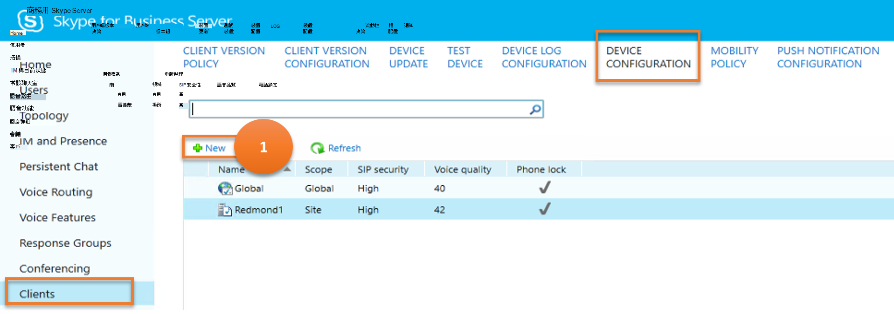

# <a name="client"></a>用戶端

本文說明舊版控制台中的 [ **用戶端** ] 功能表項目可透過 Cmdlet 取得的結果類似。

本文說明下列子功能表：

- [用戶端](#client)
  - [用戶端版本原則](#client-version-policy)
  - [用戶端版本組態](#client-version-configuration)
  - [裝置更新](#device-update)
  - [測試裝置](#test-device)
  - [裝置記錄組態](#device-log-configuration)
  - [裝置組態](#device-configuration)
  - [行動性原則](#mobility-policy)
  - [推播通知設定](#push-notification-configuration)

## <a name="client-version-policy"></a>用戶端版本原則

[**用戶端**] 功能表底下的 [**用戶端版本原則**] 子功能表項會傳回商務用 Skype Server 環境中所支援之用戶端的相關資訊。 用戶端版本原則可讓您指定那些可登入商務用 Skype Server 系統的用戶端。

請考慮使用者可對 **用戶端版本原則** 執行的各項工作，以及這些工作對應的商務用 Skype Cmdlet。

---
> **案例 1**：列出所有用戶端版本原則

   

***指令程式***

[Get-CsClientVersionPolicy](/powershell/module/skype/get-csclientversionpolicy)

***範例***

```powershell
 Get-CsClientVersionPolicy
```

---

> **案例 2**：建立新的用戶端版本原則

   

***指令程式***

[New-CsClientVersionPolicy](/powershell/module/skype/new-csclientversionpolicy)  

***範例***

```powershell
 New-CsClientVersionPolicy -Identity site:Redmond
```

---

> **案例 3**：取得所選用戶端版本原則的詳細資料

   

***指令程式***

[Get-CsClientVersionPolicy](/powershell/module/skype/get-csclientversionpolicy)

***範例***

```powershell
 Get-CsClientVersionPolicy -Identity site:Redmond
```

---

> **案例 4**：刪除選取的用戶端版本原則

   

***指令程式***

[Remove-CsClientVersionPolicy](/powershell/module/skype/remove-csclientversionpolicy)

***範例***

```powershell
 Remove-CsClientVersionPolicy -Identity site:Redmond
```

---

> **案例 5**：更新用戶端版本原則

   

- **批註 1-結果**

    圖像上的此批註表示結果，也就是所要檢索及顯示的資料。

    ***指令程式***

    [Get-CsClientVersionPolicyRule](/powershell/module/skype/get-csclientversionpolicyrule)

    ***範例***

    ```powershell
    Get-CsClientVersionPolicyRule -Filter "Global/*"
    ```

- **批註 2-user 的選項 ()**

    圖像上的此批註表示使用者要執行的選項，也就是取得用戶端版本原則規則的詳細資料。

    ***指令程式***

    [Get-CsClientVersionPolicyRule](/powershell/module/skype/get-csclientversionpolicyrule)

    ***範例***

    ```powershell
    Get-CsClientVersionPolicyRule -Identity "Global/2336c611-a243-4c5d-994b-eea8a524d0e4"
    ```

- **(使用者) 的批註 3-選項**

    圖像上的此批註表示使用者要執行的選項，也就是建立新的用戶端版本原則規則。

    ***指令程式***

    [New-CsClientVersionPolicyRule](/powershell/module/skype/new-csclientversionpolicyrule)

    ***範例***

    ```powershell
    $x = \[guid\]::NewGuid()

    New-CsClientVersionPolicyRule -Parent "site:Redmond" -RuleId $x -MajorVersion 4 -UserAgent InHouse
    ```

- **(使用者) 的批註 4-選項**

    圖像上的此批註表示使用者要執行的選項，也就是要認可/儲存新建立的用戶端版本原則規則。

    ***指令程式***

    [Set-CsClientVersionPolicy](/powershell/module/skype/set-csclientversionpolicy)

    ***範例***

    ```powershell
    Set-CsClientVersionPolicy -Identity site:Redmond -Rules $Null

    $x = Get-CsClientVersionPolicy -Identity site:Dublin | Select-Object -ExpandProperty Rules

    Set-CsClientVersionPolicy -Identity site:Redmond -Rules $x
    ```

---

## <a name="client-version-configuration"></a>用戶端版本組態

 [**用戶端版本** 設定] 子功能表項會傳回商務用 Skype Server 環境中所支援之用戶端的相關資訊。

讓我們考慮使用者可以在 **用戶端版本** 設定上執行的各種工作，以及這些工作對應的商務用 Skype Cmdlet。

---
> **案例 1**：列出所有用戶端版本設定

   

***指令程式***

[Get-CsClientVersionConfiguration](/powershell/module/skype/get-csclientversionconfiguration)

***範例***

```powershell
 Get-CsClientVersionConfiguration
```

---

> **案例 2**：建立新的用戶端版本設定

   

***指令程式***

[新 Set-csclientversionconfiguration](/powershell/module/skype/new-csclientversionconfiguration)  

***範例***

```powershell
 New-CsClientVersionConfiguration -Identity site:Redmond -Enabled $False
```

---

> **案例 3**：取得所選用戶端版本設定的詳細資料

   

***指令程式***

[Get-CsClientVersionConfiguration](/powershell/module/skype/get-csclientversionconfiguration)

***範例***

```powershell
 Get-CsClientVersionConfiguration -Identity site:Redmond
```

---

> **案例 4**：刪除選取的用戶端版本設定

   

***指令程式***

[Remove-Set-csclientversionconfiguration](/powershell/module/skype/remove-csclientversionconfiguration)

***範例***

```powershell
 Remove-CsClientVersionConfiguration -Identity site:Redmond
```

---

> **案例 5**：更新用戶端版本設定

   

***指令程式***

[Set-CsClientVersionConfiguration](/powershell/module/skype/set-csclientversionconfiguration)

***範例***

```powershell
Get-CsClientVersionConfiguration | Set-CsClientVersionConfiguration -DefaultURL "https://litwareinc.com/csclients"
```

---

> **案例 6**：啟用/停用用戶端版本設定


***指令程式***

[Set-CsClientVersionConfiguration](/powershell/module/skype/set-csclientversionconfiguration)

***範例***

```powershell
Set-CsClientVersionConfiguration -Identity site:Redmond -Enabled $False
```

---

## <a name="device-update"></a>裝置更新

**裝置更新** 規則是用來將固件更新與執行商務用 Skype 電話 Edition 的裝置相關聯。

讓我們考慮使用者可對 **裝置更新** 執行的各種工作，以及這些工作對應的商務用 Skype Cmdlet。

---
> **案例 1**：列出所有裝置更新

   

***指令程式***

[Get-CsDeviceUpdateRule](/powershell/module/skype/get-csdeviceupdaterule)

***範例***

```powershell
 Get-CsDeviceUpdateRule
```

---

> **案例 2**：刪除裝置更新

   

***指令程式***

[Remove-CsDeviceUpdateRule](/powershell/module/skype/remove-csdeviceupdaterule)  

***範例***

```powershell
 Remove-CsDeviceUpdateRule -Identity service:WebServer:atl-cs-001.litwareinc.com/d5ce3c10-2588-420a-82ac-dc2d9b1222ff9
```

---

> **案例 3**：取消裝置更新

   

***指令程式***

[Clear-CsDeviceUpdateFile](/powershell/module/skype/clear-csdeviceupdatefile)

***範例***

```powershell
 Clear-CsDeviceUpdateFile -Identity "service:WebServer:atl-cs-001.litwareinc.com"
```

---

> **案例 4**：核准裝置更新

   

***指令程式***

[核准-CsDeviceUpdateRule](/powershell/module/skype/approve-csdeviceupdaterule)

***範例***

```powershell
 Approve-CsDeviceUpdateRule -Identity service:WebServer:atl-cs-001.litwareinc.com/d5ce3c10-2588-420a-82ac-dc2d9b1222ff9
```

---

> **案例 5**：還原裝置更新

   

***指令程式***

[Restore-CsDeviceUpdateRule](/powershell/module/skype/restore-csdeviceupdaterule)

***範例***

```powershell
 Restore-CsDeviceUpdateRule -Identity service:WebServer:atl-cs-001.litwareinc.com/d5ce3c10-2588-420a-82ac-dc2d9b1222ff9
```

---

## <a name="test-device"></a>測試裝置

**測試裝置** 子功能表專案為系統管理員提供一種方法，讓您可以在將這些更新散佈至組織中的所有裝置之前，先測試固件更新。

讓我們考慮使用者可以在 **測試裝置** 上執行的各種工作，以及這些工作對應的商務用 Skype Cmdlet。

---
> **案例 1**：列出所有測試裝置

   

***指令程式***

[Get-CsTestDevice](/powershell/module/skype/get-cstestdevice)

***範例***

```powershell
 Get-CsTestDevice
```

---

> **案例 2**：建立新的測試裝置

   

***指令程式***

[新 CsTestDevice](/powershell/module/skype/new-cstestdevice)  

***範例***

```powershell
 New-CsTestDevice -Identity site:Redmond/UCPhone -IdentifierType SerialNumber -Identifier "07823-A345"
```

---

> **案例 3**：取得所選測試裝置的詳細資料

   

***指令程式***

[Get-CsTestDevice](/powershell/module/skype/get-cstestdevice)

***範例***

```powershell
 Get-CsTestDevice -Identity site:Redmond/UCPhone
```

---

> **案例 4**：刪除選擇的測試裝置

   

***指令程式***

[Remove-CsTestDevice](/powershell/module/skype/remove-cstestdevice)

***範例***

```powershell
 Remove-CsTestDevice -Identity site:Redmond
```

---

> **案例 5**：更新測試裝置

   

***指令程式***

[CsTestDevice](/powershell/module/skype/set-cstestdevice)

***範例***

```powershell
Set-CsTestDevice -Identity site:Redmond/UCPhone -IdentifierType SerialNumber -Identifier "09768-ABDR-83295"
```

---

## <a name="device-log-configuration"></a>裝置記錄組態

「**裝置記錄** 檔設定」子功能表專案可協助管理裝置更新 Web 服務，這是一種商務用 Skype Server 元件，可讓系統管理員將固件更新散佈至執行商務用 Skype 的電話及其他裝置。

讓我們考慮使用者可對 **裝置記錄** 檔進行的各項工作，以及這些工作對應的商務用 Skype Cmdlet。

---
> **案例 1**：列出所有裝置記錄檔設定

   

***指令程式***

[Get-CsDeviceUpdateConfiguration](/powershell/module/skype/get-csdeviceupdateconfiguration)

***範例***

```powershell
 Get-CsDeviceUpdateConfiguration
```

---

> **案例 2**：建立新的裝置記錄檔設定

   

***指令程式***

[New-CsDeviceUpdateConfiguration](/powershell/module/skype/new-csdeviceupdateconfiguration)  

***範例***

```powershell
 New-CsDeviceUpdateConfiguration -Identity site:Redmond "07823-A345"
```

---

> **案例 3**：取得所選裝置記錄檔設定的詳細資料

   

***指令程式***

[Get-CsDeviceUpdateConfiguration](/powershell/module/skype/get-csdeviceupdateconfiguration)

***範例***

```powershell
 Get-CsDeviceUpdateConfiguration -Identity Global
```

---

> **案例 4**：刪除選擇的裝置記錄檔設定

   

***指令程式***

[Remove-CsDeviceUpdateConfiguration](/powershell/module/skype/remove-csdeviceupdateconfiguration)

***範例***

```powershell
 Remove-CsDeviceUpdateConfiguration -Identity site:Redmond
```

---

> **案例 5**：更新裝置記錄檔設定

   

***指令程式***

[CsDeviceUpdateConfiguration](/powershell/module/skype/set-csdeviceupdateconfiguration)

***範例***

```powershell
Set-CsDeviceUpdateConfiguration -Identity global -MaxLogFileSize 2048000 -MaxLogCacheLimit 1024000
```

---

## <a name="device-configuration"></a>裝置設定

**裝置** 設定子功能表專案可協助管理 UC 電話之管理選項的相關資訊。 這些選項包含必要的安全性模式，以及電話是否應該在指定的閒置期限後自動鎖定。

讓我們考慮使用者可對 **裝置** 設定執行的各種工作，以及這些工作對應的商務用 Skype Cmdlet。

---

> **案例 1**：列出所有行動性原則

   

***指令程式***

[Get-CsUCPhoneConfiguration](/powershell/module/skype/get-csucphoneconfiguration)

***範例***

```powershell
 Get-CsUCPhoneConfiguration
```

---

> **案例 2**：建立新的裝置設定

   

***指令程式***

[新 CsUCPhoneConfiguration](/powershell/module/skype/new-csucphoneconfiguration)  

***範例***

```powershell
 New-CsUCPhoneConfiguration -Identity site:Redmond -CalendarPollInterval "00:10:00" -LoggingLevel "Medium"
```

---

> **案例 3**：取得所選裝置設定的詳細資料

   

***指令程式***

[Get-CsUCPhoneConfiguration](/powershell/module/skype/get-csucphoneconfiguration)

***範例***

```powershell
 Get-CsUCPhoneConfiguration -Identity site:Redmond
```

---

> **案例 4**：刪除選擇的裝置設定

   

***指令程式***

[Remove-CsUCPhoneConfiguration](/powershell/module/skype/remove-csucphoneconfiguration)

***範例***

```powershell
 Remove-CsUCPhoneConfiguration -Identity site:Redmond
```

---

> **案例 5**：更新裝置設定

   

***指令程式***

[Set-CsUCPhoneConfiguration](/powershell/module/skype/set-csucphoneconfiguration)

***範例***

```powershell
 Set-CsUCPhoneConfiguration -Identity site:Redmond -PhoneLockTimeout "00:30:00"
```

---

## <a name="mobility-policy"></a>行動性原則

**行動性原則** 決定使用者是否可以使用商務用 Skype Mobile。 除此之外也可管理使用者是否可以使用 [從公司撥號]，在其行動電話上使用公司電話號碼，而不使用自己的行動電話號碼收發電話。 行動性原則也可以用來在撥打或接聽電話時，讓 Wi-Fi 連線的需求。

讓我們考慮使用者可以在 **行動性原則** 上執行的各種工作，以及這些工作對應的商務用 Skype Cmdlet。

---

> **案例 1**：列出所有行動性原則

   

***指令程式***

[Get-CsMobilityPolicy](/powershell/module/skype/get-csmobilitypolicy)

***範例***

```powershell
 Get-CsMobilityPolicy
```

---

> **案例 2**：建立新的行動性原則

   

***指令程式***

[New-CsMobilityPolicy](/powershell/module/skype/new-csmobilitypolicy)  

***範例***

```powershell
 New-CsMobilityPolicy -Identity site:Redmond -EnableOutsideVoice $False
```

---

> **案例 3**：取得所選行動性原則的詳細資料

   

***指令程式***

[Get-CsMobilityPolicy](/powershell/module/skype/get-csmobilitypolicy)

***範例***

```powershell
 Get-CsMobilityPolicy -Identity "site:Redmond"
```

---

> **案例 4**：刪除選取的行動性原則

   

***指令程式***

[Remove-CsMobilityPolicy](/powershell/module/skype/remove-csmobilitypolicy)

***範例***

```powershell
 Remove-CsMobilityPolicy -Identity "site:Redmond"
```

---

> **案例 5**：更新行動性原則

   

***指令程式***

[Set-CsMobilityPolicy](/powershell/module/skype/set-csmobilitypolicy)

***範例***

```powershell
Set-CsMobilityPolicy -Identity "site:Redmond" -EnableOutsideVoice $False
```

---

## <a name="push-notification-configuration"></a>推播通知設定

推播通知服務 (Apple push notification service 和 Microsoft 推播通知服務) 提供一種方法，可將有關事件的通知傳送給行動裝置（例如 iphone 和 Windows 電話），例如新增立即訊息或新語音信箱。 這些通知會設定為傳送，即使這些裝置上的商務用 Skype 應用程式目前已暫停或正在後臺執行。

讓我們考慮使用者可對 **推播通知** 設定執行的各種工作，以及這些工作對應的商務用 Skype Cmdlet。

---

> **案例 1**：列出所有行動性原則

   

***指令程式***

[Get-CsPushNotificationConfiguration](/powershell/module/skype/get-cspushnotificationconfiguration)

***範例***

```powershell
 Get-CsPushNotificationConfiguration
```

---

> **案例 2**：建立新的推播通知設定

   

***指令程式***

[New-CsPushNotificationConfiguration](/powershell/module/skype/new-cspushnotificationconfiguration)  

***範例***

```powershell
 New-CsPushNotificationConfiguration -Identity "site:Redmond" -EnableApplePushNotificationService $True -EnableMicrosoftPushNotificationService -$True
```

---

> **案例 3**：取得所選推播通知設定的詳細資料

   

***指令程式***

[Get-CsPushNotificationConfiguration](/powershell/module/skype/get-cspushnotificationconfiguration)

***範例***

```powershell
 Get-CsPushNotificationConfiguration -Identity "site:Redmond"
```

---

> **案例 4**：刪除選擇的推播通知設定

   

***指令程式***

[Remove-CsPushNotificationConfiguration](/powershell/module/skype/remove-cspushnotificationconfiguration)

***範例***

```powershell
 Remove-CsPushNotificationConfiguration -Identity "site:Redmond"
```

---

> **案例 5**：更新推播通知設定

   

***指令程式***

[Set-CsPushNotificationConfiguration](/powershell/module/skype/set-cspushnotificationconfiguration)

***範例***

```powershell
 Set-CsPushNotificationConfiguration -Identity "site:Redmond" -EnableApplePushNotificationService $False
```

---
