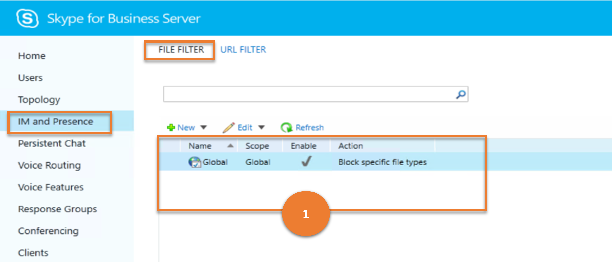
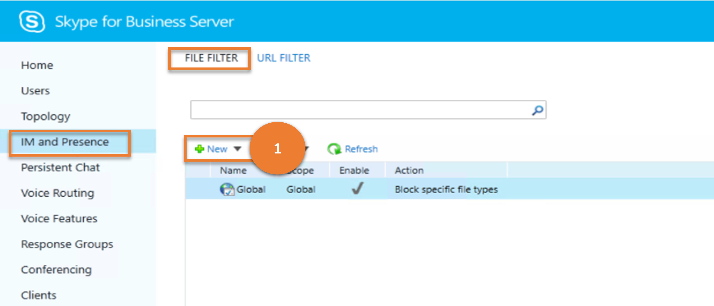
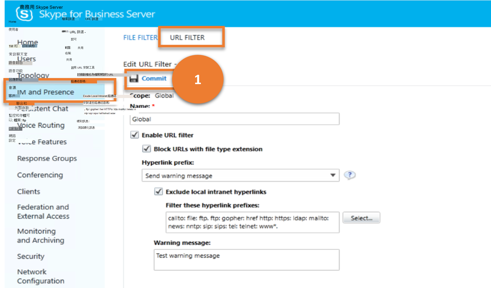

# <a name="im-and-presence"></a>IM 和目前狀態

本文說明舊版控制台中的 **IM 和目前狀態** 功能表項目可以在使用 Cmdlet 取得時，是否有相似的結果。

本文說明下列子功能表：

- [IM 和目前狀態](#im-and-presence)
  - [檔案篩選](#file-filter)
  - [URL 篩選](#url-filter)

## <a name="file-filter"></a>檔案篩選器

檔案 **篩選器** 子功能表可讓系統管理員管理組織中的檔案傳輸篩選器設定。 這些設定可用來封鎖使用者傳輸特定類型檔案的能力 (例如，使用 .vbs 或 .ps1 副檔名) 使用商務用 Skype Server 用戶端的檔案。

讓我們考慮使用者可對檔案 **篩選器** 執行的各種工作，以及這些工作對應的商務用 Skype Cmdlet。

---

> **案例 1**：列出所有檔案篩選器

   

***指令程式***

[Get-CsFileTransferFilterConfiguration](/powershell/module/skype/get-csfiletransferfilterconfiguration)

***範例***

```powershell
 Get-CsFileTransferFilterConfiguration
```

---

> **案例 2**：建立新的檔案篩選器

   

***指令程式***

[New-CsFileTransferFilterConfiguration](/powershell/module/skype/new-csfiletransferfilterconfiguration)  

***範例***

```powershell
 New-CsFileTransferFilterConfiguration -Identity site:Redmond
```

---

> **案例 3**：取得所選檔案篩選器的詳細資料

   

***指令程式***

[Get-CsFileTransferFilterConfiguration](/powershell/module/skype/get-csfiletransferfilterconfiguration)

***範例***

```powershell
 Get-CsFileTransferFilterConfiguration -Identity site:Redmond
```

---

> **案例 4**：刪除選擇的檔案篩選器

   

***指令程式***

[Remove-CsFileTransferFilterConfiguration](/powershell/module/skype/remove-csfiletransferfilterconfiguration)

***範例***

```powershell
 Remove-CsFileTransferFilterConfiguration -Identity site:Redmond
```

---

> **案例 5**：更新檔案篩選器

   

***指令程式***

[Set-CsFileTransferFilterConfiguration](/powershell/module/skype/set-csfiletransferfilterconfiguration)

***範例***

```powershell
 Set-CsFileTransferFilterConfiguration -Identity site:Redmond -Extensions @{Add=".ps1"}
```

---

## <a name="url-filter"></a>URL 篩選器

**IM 與顯示狀態** 底下的 [ **URL 篩選**] 子功能表項可讓系統管理員設定 URL 篩選，以封鎖或非作用中的某些首碼的超連結。  (換句話說，參與者無法直接按一下連結，並前往 URI 參照的網站。他們必須手動複製並貼上連結至瀏覽器。 ) 

讓我們考慮使用者可對 **URL 篩選** 執行的各種工作，以及這些工作對應的商務用 Skype Cmdlet。

---
> **案例 1**：列出所有網頁 URL 篩選器

   

***指令程式***

[Get-CsImFilterConfiguration](/powershell/module/skype/get-csimfilterconfiguration)

***範例***

```powershell
 Get-CsImFilterConfiguration
```

---

> **案例 2**：建立新的 URL 篩選器

   

***指令程式***

[新 CsImFilterConfiguration](/powershell/module/skype/new-csimfilterconfiguration)  

***範例***

```powershell
 New-CsImFilterConfiguration -Identity site:Redmond
```

---

> **案例 3**：取得所選 URL 篩選的詳細資料

   

***指令程式***

[Get-CsImFilterConfiguration](/powershell/module/skype/get-csimfilterconfiguration)

***範例***

```powershell
 Get-CsImFilterConfiguration -Identity site:Redmond
```

---

> **案例 4**：刪除選擇的 URL 篩選器

   

***指令程式***

[Remove-CsImFilterConfiguration](/powershell/module/skype/remove-csimfilterconfiguration)

***範例***

```powershell
 Remove-CsImFilterConfiguration -Identity site:Redmond
```

---

> **案例 5**：更新 URL 篩選

   

***指令程式***

[CsImFilterConfiguration](/powershell/module/skype/set-csimfilterconfiguration)

***範例***

```powershell
 Set-CsImFilterConfiguration -Identity site:Redmond -Enabled $False
```

---
