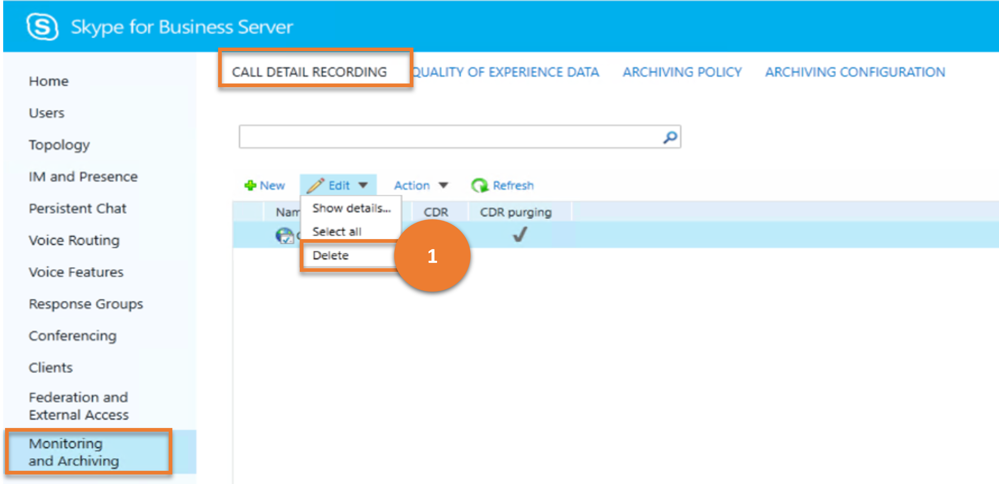
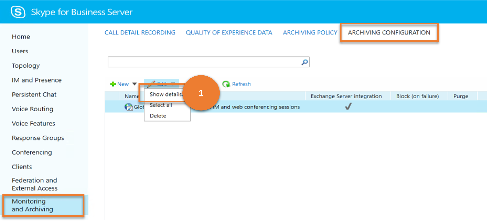

# <a name="monitoring-and-archiving"></a>監控和封存

本文說明舊版控制台中的「 **監控與** 封存」功能表項目目可以使用 Cmdlet 取得的結果。

本文說明下列子功能表：

- [監控和封存](#monitoring-and-archiving)
  - [詳細通話記錄](#call-detail-recording)
  - [經驗品質資料](#quality-of-experience-data)
  - [封存原則](#archiving-policy)
  - [封存組態](#archiving-configuration)

## <a name="call-detail-recording"></a>詳細通話記錄

[**詳細通話記錄**] 子功能表可讓系統管理員管理 (CDR) 設定的詳細通話記錄。CDR 可讓您追蹤諸如對等立即訊息會話、透過網際網路通訊協定 (VoIP) 電話和會議通話等方面的使用方式。

讓我們考慮使用者可對 **通話詳細資料記錄** 執行的各項工作，以及這些工作對應的商務用 Skype Cmdlet。

---

> **案例 1**：列出所有 CDR 設定

   

***指令程式***

[Get-CsCdrConfiguration](/powershell/module/skype/get-cscdrconfiguration)

***範例***

```powershell
 Get-CsCdrConfiguration
```

---

> **案例 2**：建立新的 CDR 設定

   

***指令程式***

[新 CsCdrConfiguration](/powershell/module/skype/new-cscdrconfiguration)  

***範例***

```powershell
 New-CsCdrConfiguration -Identity site:Redmond -EnableCDR $False
```

---

> **案例 3**：取得所選 CDR 設定的詳細資料

   

***指令程式***

[Get-CsCdrConfiguration](/powershell/module/skype/get-cscdrconfiguration)

***範例***

```powershell
 Get-CsCdrConfiguration -Identity site:Redmond
```

---

> **案例 4**：刪除選取的 CDR 設定

   

***指令程式***

[Remove-CsCdrConfiguration](/powershell/module/skype/remove-cscdrconfiguration)

***範例***

```powershell
 Remove-CsCdrConfiguration -Identity site:Redmond
```

---

> **案例 5**：更新 CDR 設定

   

***指令程式***

[Set-CsCdrConfiguration](/powershell/module/skype/set-cscdrconfiguration)

***範例***

```powershell
 Set-CsCdrConfiguration -Identity site:Redmond -PurgeHourOfDay 23
```

---

## <a name="quality-of-experience-data"></a>經驗品質資料

「 **經驗品質資料** 」子功能表可讓系統管理員管理經驗品質 (QoE) 設定。 整個組織中;這包括管理群組擴充、憑證設定及允許的驗證方法。 因為系統管理員可以在全域、網站及服務範圍內設定不同的設定，但 (僅限 Web 服務服務) ，所以可以為不同的使用者和不同位置自訂 Web 服務功能。

讓我們考慮使用者可以在 **WEB 服務** 上執行的各種工作，以及這些工作對應的商務用 Skype Cmdlet。

---
> **案例 1**：列出所有 QoE 設定

   

***指令程式***

[Get-CsQoEConfiguration](/powershell/module/skype/get-csqoeconfiguration)

***範例***

```powershell
 Get-CsQoEConfiguration
```

---

> **案例 2**：建立新的 QoE 設定

   

***指令程式***

[新 CsQoEConfiguration](/powershell/module/skype/new-csqoeconfiguration)  

***範例***

```powershell
 New-CsQoEConfiguration -Identity site:Redmond -EnableQoE $False
```

---

> **案例 3**：取得所選 QoE 設定的詳細資料

   

***指令程式***

[Get-CsQoEConfiguration](/powershell/module/skype/get-csqoeconfiguration)

***範例***

```powershell
 Get-CsQoEConfiguration -Identity site:Redmond
```

---

> **案例 4**：刪除選取的 QoE 設定

   

***指令程式***

[Remove-CsQoEConfiguration](/powershell/module/skype/remove-csqoeconfiguration)

***範例***

```powershell
 Remove-CsQoEConfiguration -Identity site:Redmond
```

---

> **案例 5**：更新 QoE 設定

   

***指令程式***

[Set-CsQoEConfiguration](/powershell/module/skype/set-csqoeconfiguration)

***範例***

```powershell
 Set-CsQoEConfiguration -Identity site:Redmond -EnableQoE $False
```

---

## <a name="archiving-policy"></a>封存原則

系統管理員可以使用封存 **原則** 來管理立即訊息 (IM) 會話封存原則。封存原則可讓您封存所有在內部使用者和/或內部使用者與外部使用者之間進行的 IM 和 web 會議會話

讓我們考慮使用者可以在封存 **原則** 上執行的各種工作，以及這些工作對應的商務用 Skype Cmdlet。

---

> **案例 1**：列出所有封存原則

   

***指令程式***

[Get-CsArchivingPolicy](/powershell/module/skype/get-csarchivingpolicy)

***範例***

```powershell
 Get-CsArchivingPolicy
```

---

> **案例 2**：建立新的封存原則

   

***指令程式***

[New-CsArchivingPolicy](/powershell/module/skype/new-csarchivingpolicy)  

***範例***

```powershell
 New-CsArchivingPolicy -Identity site:Redmond -ArchiveInternal $True
```

---

> **案例 3**：取得所選封存原則的詳細資料

   

***指令程式***

[Get-CsArchivingPolicy](/powershell/module/skype/get-csarchivingpolicy)

***範例***

```powershell
 Get-CsArchivingPolicy -Identity site:Redmond
```

---

> **案例 4**：刪除選擇的封存原則

   

***指令程式***

[Remove-Grant-csarchivingpolicy](/powershell/module/skype/remove-csarchivingpolicy)

***範例***

```powershell
 Remove-CsArchivingPolicy -Identity site:Redmond
```

---

> **案例 5**：更新封存原則

   

***指令程式***

[Set-CsArchivingPolicy](/powershell/module/skype/set-csarchivingpolicy)

***範例***

```powershell
 Set-CsArchivingPolicy -Identity global -ArchiveInternal $True
```

---

## <a name="archiving-configuration"></a>封存組態

系統管理員可以 **使用封存** 設定，設定 (，或在組織中封存) 立即訊息 (IM) 會話。

讓我們考慮使用者可對封存設定 **執行的各種工作，以及** 這些工作對應的商務用 Skype Cmdlet。

---

> **案例 1**：列出所有封存設定

   

***指令程式***

[Get-CsArchivingConfiguration](/powershell/module/skype/get-csarchivingconfiguration)

***範例***

```powershell
 Get-CsArchivingConfiguration
```

---

> **案例 2**：建立新的封存設定

   

***指令程式***

[New-CsArchivingConfiguration](/powershell/module/skype/new-csarchivingconfiguration)  

***範例***

```powershell
 New-CsArchivingConfiguration -Identity site:Redmond -EnableArchiving "ImOnly"
```

---

> **案例 3**：取得所選封存設定的詳細資料

   

***指令程式***

[Get-CsArchivingConfiguration](/powershell/module/skype/get-csarchivingconfiguration)

***範例***

```powershell
 Get-CsArchivingConfiguration -Identity site:Redmond
```

---

> **案例 4**：刪除選擇的封存設定

   

***指令程式***

[Remove-CsArchivingConfiguration](/powershell/module/skype/remove-csarchivingconfiguration)

***範例***

```powershell
 Remove-CsArchivingConfiguration -Identity site:Redmond
```

---

> **案例 5**：更新封存設定

   

***指令程式***

[Get-csarchivingconfiguration](/powershell/module/skype/set-csarchivingconfiguration)

***範例***

```powershell
 Set-CsArchivingConfiguration -Identity site:Redmond -ArchiveDuplicateMessages $False -KeepArchivingDataForDays 30
```

---
