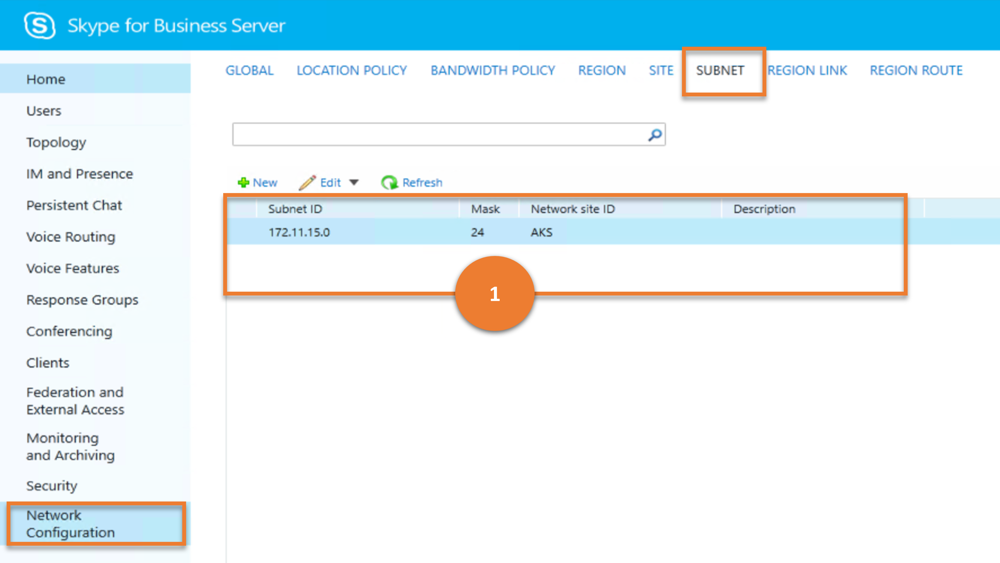

# <a name="network-configuration"></a>網路設定

本文說明舊版控制台中的「 **網路** 設定」功能表項目目與使用 Cmdlet 的實現方式類似的結果。

本文說明下列子功能表：

- [網路設定](#network-configuration)
  - [位置原則](#location-policy)
  - [頻寬原則](#bandwidth-policy)
  - [地區](#region)
  - [Site](#site)
  - [子網路](#subnet)
  - [地區連結](#region-link)
  - [地區路由](#region-route)

## <a name="location-policy"></a>位置原則

**位置原則** 子功能表是用來套用與 E9-1-1 功能相關的設定。 位置原則會判斷使用者是否已啟用 E9-1-1，如果是，則會決定緊急電話的行為。

讓我們考慮使用者可以在 **位置原則** 上執行的各種工作，以及這些工作對應的商務用 Skype Cmdlet。

---

> **案例 1**：列出所有位置原則

   

***指令程式***

[Get-CsLocationPolicy](/powershell/module/skype/get-cslocationpolicy)

***範例***

```powershell
 Get-CsLocationPolicy
```

---

> **案例 2**：建立新的位置原則

   

***指令程式***

[New-CsLocationPolicy](/powershell/module/skype/new-cslocationpolicy)  

***範例***

```powershell
 New-CsLocationPolicy -Identity site:Redmond -EnhancedEmergencyServicesEnabled $True
```

---

> **案例 3**：取得所選位置原則的詳細資料

   

***指令程式***

[Get-CsLocationPolicy](/powershell/module/skype/get-cslocationpolicy)

***範例***

```powershell
 Get-CsLocationPolicy -Identity Reno
```

---

> **案例 4**：刪除選取的位置原則

   

***指令程式***

[Remove-CsLocationPolicy](/powershell/module/skype/remove-cslocationpolicy)

***範例***

```powershell
 Remove-CsLocationPolicy -Identity Reno
```

---

> **案例 5**：更新位置原則

   

***指令程式***

[Set-CsLocationPolicy](/powershell/module/skype/set-cslocationpolicy)

***範例***

```powershell
 Set-CsLocationPolicy -Identity site:Redmond -EnhancedEmergencyServicesEnabled $True
```

---

## <a name="bandwidth-policy"></a>頻寬原則

頻寬原則為通話許可控制 (CAC) 的一部分，用於定義某些形式的頻寬限制。  (在商務用 Skype Server 中，只能對音訊和影片形式指派頻寬限制。 ) 此 Cmdlet 會建立這些原則的容器設定檔。 您可以在呼叫此 Cmdlet 時指定音訊和影片頻寬限制，以在容器內定義個別的原則。

讓我們考慮使用者可對 **頻寬原則** 進行的各種工作，以及這些工作對應的商務用 Skype Cmdlet。

---
> **案例 1**：列出所有頻寬原則

   

***指令程式***

[Get-CsNetworkBandwidthPolicyProfile](/powershell/module/skype/get-csnetworkbandwidthpolicyprofile)

***範例***

```powershell
 Get-CsNetworkBandwidthPolicyProfile
```

---

> **案例 2**：建立新的頻寬原則

   

***指令程式***

[New-CsNetworkBandwidthPolicyProfile](/powershell/module/skype/new-csnetworkbandwidthpolicyprofile)  

***範例***

```powershell
 New-CsNetworkBandwidthPolicyProfile -Identity LowBWLimits -AudioBWLimit 2000 -AudioBWSessionLimit 200 -VideoBWLimit 1400 -VideoBWSessionLimit 500
```

---

> **案例 3**：取得所選頻寬原則的詳細資料

   

***指令程式***

[Get-CsNetworkBandwidthPolicyProfile](/powershell/module/skype/get-csnetworkbandwidthpolicyprofile)

***範例***

```powershell
 Get-CsNetworkBandwidthPolicyProfile -Identity LowBWProfile
```

---

> **案例 4**：刪除選擇的頻寬原則

   

***指令程式***

[Remove-CsNetworkBandwidthPolicyProfile](/powershell/module/skype/remove-csnetworkbandwidthpolicyprofile)

***範例***

```powershell
 Remove-CsNetworkBandwidthPolicyProfile -Identity LowBWProfile
```

---

> **案例 5**：更新頻寬原則

   

***指令程式***

[Set-CsNetworkBandwidthPolicyProfile](/powershell/module/skype/set-csnetworkbandwidthpolicyprofile)

***範例***

```powershell
 Set-CsNetworkBandwidthPolicyProfile -Identity LowBWLimit -VideoBWLimit 2500 -VideoBWSessionLimit 300
```

---

## <a name="region"></a>區域

網路地區會與跨多個地理區域的網路不同部分交互連線。 每個網路地區都必須與中央網站產生關聯。 系統管理員可以使用 **地區** 功能表來管理有關一或多個網路地區的資訊，包括相關聯的中央網站和設定，以判斷是否允許音訊及視頻連線使用備用路徑，以及如何將區域內的網站與媒體旁路設定相關聯。

---

> **案例 1**：列出所有地區

   

***指令程式***

[Get-CsNetworkRegion](/powershell/module/skype/get-csnetworkregion)

***範例***

```powershell
 Get-CsNetworkRegion
```

---

> **案例 2**：建立新區域

   

***指令程式***

[New-CsNetworkRegion](/powershell/module/skype/new-csnetworkregion)  

***範例***

```powershell
 New-CsNetworkRegion -Identity NorthAmerica -Description "All North American Locations" -CentralSite Redmond-NA-MLS
```

---

> **案例 3**：取得所選區域的詳細資料

   

***指令程式***

[Get-CsNetworkRegion](/powershell/module/skype/get-csnetworkregion)

***範例***

```powershell
 Get-CsNetworkRegion -Identity NorthAmerica
```

---

> **案例 4**：刪除選取的區域

   

***指令程式***

[Remove-CsNetworkRegion](/powershell/module/skype/remove-csnetworkregion)

***範例***

```powershell
 Remove-CsNetworkRegion -Identity NorthAmerica
```

---

> **案例 5**：更新區域

   

- **批註 1-結果**

    圖像上的此批註表示結果，也就是所要檢索及顯示的資料。

    ***指令程式***

    [從區域 Get-CsNetworkSite](/powershell/module/skype/get-csnetworksite)

    ***範例***

    ```powershell
     Get-CsNetworkSite | Where-Object {$_.NetworkRegionID -eq "AKR"}
    ```

- **批註 2-user 的選項 ()**

    圖像上的此批註表示使用者要執行的選項，也就是儲存網路地區。

    [Set-CsNetworkRegion](/powershell/module/skype/set-csnetworkregion)

   ***範例***

   ```powershell
   Set-CsNetworkRegion -Identity NorthAmerica -Description "North American Region"
   ```

---

## <a name="site"></a>網站

網站是指在 CAC 或 E9-1-1 部署的每一個區域內設定的辦公室或位置。 **網站** 子功能表可協助系統管理員新增、移除或管理其設定。

讓我們考慮使用者可在 **網站** 上執行的各種工作，以及這些工作對應的商務用 Skype Cmdlet。

---

> **案例 1**：列出所有網站

   

***指令程式***

[Get-CsNetworkSubnet](/powershell/module/skype/get-csnetworksite)

***範例***

```powershell
 Get-CsNetworkSite
```

---

> **案例 2**：建立新的網站

   

***指令程式***

[New-CsNetworkSubnet](/powershell/module/skype/new-csnetworksite)  

***範例***

```powershell
 New-CsNetworkSite -Identity Vancouver -NetworkRegionID NorthAmerica
```

---

> **案例 3**：取得所選網站的詳細資料

   

***指令程式***

[Get-CsNetworkSubnet](/powershell/module/skype/get-csnetworksite)

***範例***

```powershell
 Get-CsNetworkSite -Identity Redmond
```

---

> **案例 4**：刪除選取的網站

   

***指令程式***

[Remove-CsNetworkSubnet](/powershell/module/skype/remove-csnetworksite)

***範例***

```powershell
 Remove-CsNetworkSite -Identity Vancouver
```

---

> **案例 5**：更新網站

   

- **批註 1-結果**

    圖像上的此批註表示結果，也就是所要檢索及顯示的資料。

    ***指令程式***

    [從網站 Get-CsNetworkSubnet](/powershell/module/skype/get-csnetworksubnet)

    ***範例***

    ```powershell
     Get-CsNetworkSubnet | Where-Object {$_.NetworkSiteID -eq "Vancouver"}
    ```

- **批註 2-user 的選項 ()**

    圖像上的此批註表示使用者要執行的選項，也就是儲存網路網站。

   ***指令程式***

   [CsNetworkSubnet](/powershell/module/skype/set-csnetworksite)

   ***範例***

   ```powershell
    Set-CsNetworkSite -Identity Vancouver - BWPolicyProfileID LowBWLimits
   ```

---

## <a name="subnet"></a>子網路

系統管理員可以使用 **子網** 子功能表來建立、更新及管理網路子網。

讓我們考慮使用者可以在 **子網上** 執行的各種工作，以及這些工作對應的商務用 Skype Cmdlet。

---

> **案例 1**：列出所有子網

   

***指令程式***

[Get-CsNetworkSubnet](/powershell/module/skype/get-csnetworksubnet)

***範例***

```powershell
 Get-CsNetworkSubnet
```

---

> **案例 2**：建立新的子網

   

***指令程式***

[New-CsNetworkSubnet](/powershell/module/skype/new-csnetworksubnet)  

***範例***

```powershell
 New-CsNetworkSubnet -Identity 172.11.15.0 -MaskBits 24 -NetworkSiteID Vancouver
```

---

> **案例 3**：取得所選子網的詳細資料

   

***指令程式***

[Get-CsNetworkSubnet](/powershell/module/skype/get-csnetworksubnet)

***範例***

```powershell
 Get-CsNetworkSubnet -Identity 172.11.15.0
```

---

> **案例 4**：刪除選取的子網

   

***指令程式***

[Remove-CsNetworkSubnet](/powershell/module/skype/remove-csnetworksubnet)

***範例***

```powershell
 Remove-CsNetworkSubnet -Identity 172.11.15.0
```

---

> **案例 5**：更新子網

   

***指令程式***

[CsNetworkSubnet](/powershell/module/skype/set-csnetworksubnet)

***範例***

```powershell
 Set-CsNetworkSubnet -Identity 172.11.15.0 -MaskBits 25 -NetworkSiteID Chicago
```

---

## <a name="region-link"></a>地區連結

網路內的地區是透過實體 WAN 連線來連結。系統管理員可以使用 **地區連結** 子功能表來建立、更新及管理網路子網。

讓我們考慮使用者可對 **地區連結** 執行的各種工作，以及這些工作對應的商務用 Skype Cmdlet。

---

> **案例 1**：列出所有地區連結

   

***指令程式***

[Get-CsNetworkRegionLink](/powershell/module/skype/get-csnetworkregionLink)

***範例***

```powershell
 Get-CsNetworkRegionLink
```

---

> **案例 2**：建立新的地區連結

   

***指令程式***

[新 CsNetworkRegionLink](/powershell/module/skype/new-csnetworkregionLink)  

***範例***

```powershell
 New-CsNetworkRegionLink -Identity NA_EMEA -NetworkRegionID1 NorthAmerica -NetworkRegionID2 EMEA -BWPolicyProfileID LowBWLimits
```

---

> **案例 3**：取得所選地區連結的詳細資料

   

***指令程式***

[Get-CsNetworkRegionLink](/powershell/module/skype/get-csnetworkregionLink)

***範例***

```powershell
 Get-CsNetworkRegionLink -Identity NA_EMEA
```

---

> **案例 4**：刪除選取的區域連結

   

***指令程式***

[Remove-CsNetworkRegionLink](/powershell/module/skype/remove-csnetworkregionLink)

***範例***

```powershell
 Remove-CsNetworkRegionLink -Identity NA_EMEA
```

---

> **案例 5**：更新區域連結

   

***指令程式***

[CsNetworkRegionLink](/powershell/module/skype/set-csnetworkregionLink)

***範例***

```powershell
 Set-CsNetworkRegionLink -Identity NA_EMEA -BWPolicyProfileID HighBWLimits
```

---

## <a name="region-route"></a>地區路由

CAC 組態中的每個區域都必須有存取其他每個區域的特定方法。 地區連結會設定地區間連線的頻寬限制，也代表實體連結，而路由會決定從甲地連線到乙地時要採取的連結路徑。 系統管理員可以使用 **地區路由** 子功能表來建立、更新及管理這些子功能表。

讓我們考慮使用者可對 **地區路由** 執行的各種工作，以及這些工作對應的商務用 Skype Cmdlet。

---

> **案例 1**：列出所有地區路由

   

***指令程式***

[Get-CsNetworkInterRegionRoute](/powershell/module/skype/get-csnetworkinterregionroute)

***範例***

```powershell
 Get-CsNetworkInterRegionRoute
```

---

> **案例 2**：建立新的區域路由

   

***指令程式***

[新 CsNetworkInterRegionRoute](/powershell/module/skype/new-csnetworkinterregionroute)  

***範例***

```powershell
 New-CsNetworkInterRegionRoute -Identity NA_APAC_Route -NetworkRegionID1 NorthAmerica -NetworkRegionID2 APAC -NetworkRegionLinkIDs "NA_EMEA,EMEA_APAC"
```

---

> **案例 3**：取得所選區域路由的詳細資料

   

***指令程式***

[Get-CsNetworkInterRegionRoute](/powershell/module/skype/get-csnetworkinterregionroute)

***範例***

```powershell
 Get-CsNetworkInterRegionRoute -Filter *APAC*
```

---

> **案例 4**：刪除選取的區域路由

   

***指令程式***

[Remove-CsNetworkInterRegionRoute](/powershell/module/skype/remove-csnetworkinterregionroute)

***範例***

```powershell
 Remove-CsNetworkInterRegionRoute -Identity NA_APAC_Route
```

---

> **案例 5**：更新區域路由

   

- **批註 1-使用者) 的選項 (**

    圖像上的此批註表示結果，也就是所要檢索及顯示的資料。

   ***指令程式***

   [Get-CsNetworkRegionLink](/powershell/module/skype/get-csnetworkregionLink)

   ***範例***

   ```powershell
   Get-CsNetworkRegionLink
   ```

- **批註 2-user 的選項 ()**

    圖像上的此批註表示使用者要執行的選項，也就是儲存網路地區路由。

    ***指令程式***

   [CsNetworkInterRegionRoute](/powershell/module/skype/set-csnetworkinterregionroute)

   ***範例***

   ```powershell
   Set-CsNetworkInterRegionRoute -Identity NA_APAC_Route -NetworkRegionLinkIDs "NA_SA,SA_APAC"
   ```

---
---
