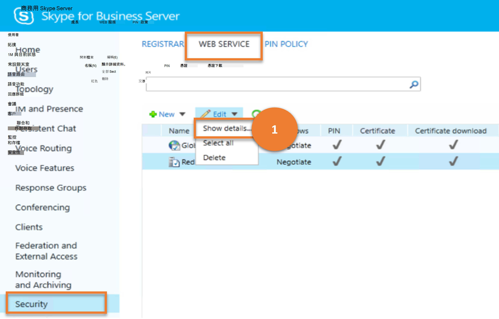

# <a name="security"></a>安全性

本文說明如何使用 Cmdlet 來達到舊版控制台中的 **安全性** 功能表項目目的類似結果。

本文說明下列子功能表：

- [安全性](#security)
  - [處長](#registrar)
  - [Web 服務](#web-service)
  - [PIN 原則](#pin-policy)

## <a name="registrar"></a>處長

「**註冊機構**」子功能表可讓系統管理員透過 proxy 伺服器設定設定來管理 proxy 伺服器。 這些設定可以同時套用全域範圍和服務範圍 (，但僅限 Edge Server 和註冊機構服務) 可讓您控制用戶端端點可使用的驗證通訊協定，以及是否要在傳入和傳出 proxy 伺服器連線上使用壓縮。

讓我們考慮使用者可以在 **註冊機** 上執行的各項工作，以及這些工作對應的商務用 Skype Cmdlet。

---

> **案例 1**：列出所有 proxy 設定

   

***指令程式***

[Get-CsProxyConfiguration](/powershell/module/skype/get-csproxyconfiguration)

***範例***

```powershell
 Get-CsProxyConfiguration
```

---

> **案例 2**：建立新的 proxy 設定

   

***指令程式***

[New-CsProxyConfiguration](/powershell/module/skype/new-csproxyconfiguration)  

***範例***

```powershell
 New-CsProxyConfiguration -Identity "service:EdgeServer:atl-edge-001.litwareinc.com" -RequestServerCompression $True -MaxClientMessageBodySizeKb 256
```

---

> **案例 3**：取得所選 proxy 設定的詳細資料

   

***指令程式***

[Get-CsProxyConfiguration](/powershell/module/skype/get-csproxyconfiguration)

***範例***

```powershell
 Get-CsProxyConfiguration -Identity "service:EdgeServer:atl-cs-001.litwareinc.com"
```

---

> **案例 4**：刪除選擇的 proxy 設定

   

***指令程式***

[Remove-Set-csproxyconfiguration](/powershell/module/skype/remove-csproxyconfiguration)

***範例***

```powershell
 Remove-CsProxyConfiguration -Identity service:EdgeServer:atl-edge-011.litwareinc.com
```

---

> **案例 5**：更新 proxy 設定

   

***指令程式***

[Set-CsProxyConfiguration](/powershell/module/skype/set-csproxyconfiguration)

***範例***

```powershell
 Set-CsProxyConfiguration -Identity service:EdgeServer:atl-edge-001.litwareinc.com -AcceptServerCompression $True
```

---

## <a name="web-service"></a>Web 服務

[**安全性**] 底下的 [ **web 服務**] 子功能表項可讓系統管理員管理整個組織中的 web 服務設定。這包括管理群組擴充、憑證設定及允許的驗證方法。 因為系統管理員可以在全域、網站及服務範圍內設定不同的設定，但 (僅限 Web 服務服務) ，所以可以為不同的使用者和不同位置自訂 Web 服務功能。

讓我們考慮使用者可以在 **WEB 服務** 上執行的各種工作，以及這些工作對應的商務用 Skype Cmdlet。

---
> **案例 1**：列出所有 web 服務設定

   

***指令程式***

[Get-CsWebServiceConfiguration](/powershell/module/skype/get-cswebserviceconfiguration)

***範例***

```powershell
 Get-CsWebServiceConfiguration
```

---

> **案例 2**：建立新的 web 服務設定

   

***指令程式***

[New-CsWebServiceConfiguration](/powershell/module/skype/new-cswebserviceconfiguration)  

***範例***

```powershell
 New-CsWebServiceConfiguration -Identity site:Redmond -EnableGroupExpansion $False -UseCertificateAuth $True
```

---

> **案例 3**：取得所選 web 服務設定的詳細資料

   

***指令程式***

[Get-CsWebServiceConfiguration](/powershell/module/skype/get-cswebserviceconfiguration)

***範例***

```powershell
 Get-CsWebServiceConfiguration -Identity site:Redmond
```

---

> **案例 4**：刪除選取的 web 服務設定

   

***指令程式***

[Remove-CsWebServiceConfiguration](/powershell/module/skype/remove-cswebserviceconfiguration)

***範例***

```powershell
 Remove-CsWebServiceConfiguration -Identity site:Redmond
```

---

> **案例 5**：更新 web 服務設定

   

***指令程式***

[Set-CsWebServiceConfiguration](/powershell/module/skype/set-cswebserviceconfiguration)

***範例***

```powershell
 Set-CsWebServiceConfiguration -Identity site:Redmond -EnableGroupExpansion $True
```

---

## <a name="pin-policy"></a>PIN 原則

系統管理員可以使用 **PIN 原則** 來管理 pin 碼驗證屬性;例如，您可以指定 PIN 碼的最小長度，並判斷是否有一個 PIN 碼是否允許使用 "通用模式" （如連續數位）的 pin 碼 (例如，如 123456) 

讓我們考慮使用者可對 **PIN 原則** 執行的各種工作，以及這些工作對應的商務用 Skype Cmdlet。

---

> **案例 1**：列出所有 PIN 原則

   

***指令程式***

[Get-CsPinPolicy](/powershell/module/skype/get-cspinpolicy)

***範例***

```powershell
 Get-CsPinPolicy
```

---

> **案例 2**：建立新的 PIN 原則

   

***指令程式***

[新 Get-cspinpolicy](/powershell/module/skype/new-cspinpolicy)  

***範例***

```powershell
 New-CsPinPolicy -Identity "site:Redmond" -MinPasswordLength 10
```

---

> **案例 3**：取得所選 PIN 原則的詳細資料

   

***指令程式***

[Get-CsPinPolicy](/powershell/module/skype/get-cspinpolicy)

***範例***

```powershell
 Get-CsPinPolicy -Identity "site:Redmond"
```

---

> **案例 4**：刪除選取的 PIN 碼原則

   

***指令程式***

[Remove-Get-cspinpolicy](/powershell/module/skype/remove-cspinpolicy)

***範例***

```powershell
 Remove-CsPinPolicy -Identity RedmondUsersPinPolicy
```

---

> **案例 5**：更新 PIN 原則

   

***指令程式***

[Set-CsPinPolicy](/powershell/module/skype/set-cspinpolicy)

***範例***

```powershell
 Set-CsPinPolicy -Identity site:Redmond -MinPasswordLength 10
```

---
