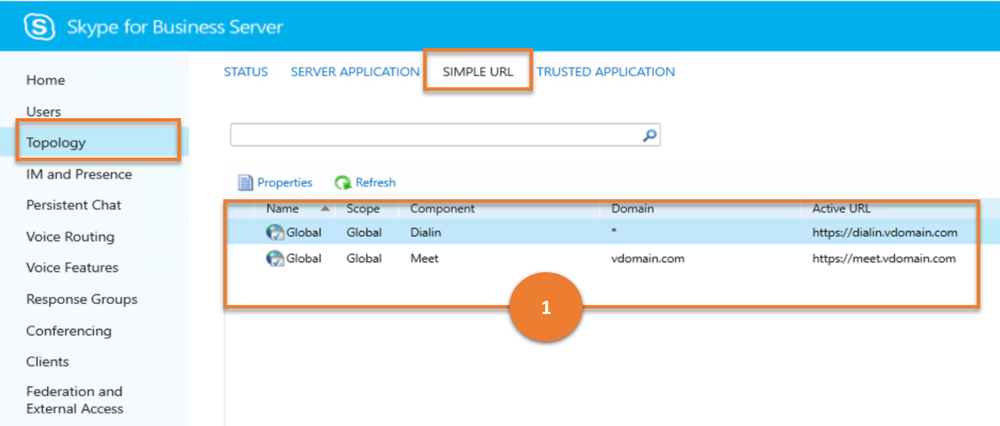

# <a name="topology"></a>拓撲

本文說明舊版控制台中的 **拓撲** 功能表項目可透過 Cmdlet 取得的結果是否類似。

本文說明下列子功能表：

- [拓撲](#topology)
  - [狀態](#status)
  - [伺服器應用程式](#server-application)
  - [簡單 URL](#simple-url)
  - [信任的應用程式](#trusted-application)

## <a name="status"></a>狀態

[**狀態**] 子功能表可讓系統管理員管理拓撲中的電腦。

讓我們考慮使用者可對 **狀態** 進行的各種工作，以及這些工作對應的商務用 Skype Cmdlet。

---

> **案例 1**：列出所有電腦及其狀態

   

   ***指令程式***

   [Get-CsPool](/powershell/module/skype/get-cspool)

   ***範例***

   ```powershell
    Get-CsPool
   ```

   ***指令程式***

   [Get-CsComputer](/powershell/module/skype/get-cscomputer)

   ***範例***

   ```powershell
    Get-CsComputer
   ```

   ***指令程式***

   [Get-CsManagementStoreReplicationStatus](/powershell/module/skype/get-csmanagementstorereplicationstatus)

   ***範例***

   ```powershell
   Get-CsManagementStoreReplicationStatus
   ```

---

## <a name="server-application"></a>伺服器應用程式

伺服器應用程式是指在商務用 Skype Server 下執行的個別程式。 **伺服器應用程式** 子功能表提供一種方法，讓系統管理員可以傳回在商務用 Skype Server 中執行之任何 (或所有) 應用程式的相關資訊。

讓我們考慮使用者可對 **伺服器應用程式** 執行的各種工作，以及這些工作對應的商務用 Skype Cmdlet。

---
> **案例 1**：列出所有伺服器應用程式

   

***指令程式***

[Get-CsServerApplication](/powershell/module/skype/get-csserverapplication)

***範例***

```powershell
 Get-CsServerApplication
```

---

> **案例 2**：啟用/停用或選取重要/取消選取重要的伺服器應用程式

   

***指令程式***

[Get-csserverapplication](/powershell/module/skype/get-csserverapplication)

***範例***

```powershell
 Set-CsServerApplication -Identity "Registrar:atl-cs-001.litwareinc.com/ExumRouting" -Enabled $True
```

---

## <a name="simple-url"></a>簡單 URL

簡單的 URLs 可讓使用者輕鬆加入會議和會議，也便於系統管理員登入商務用 Skype Server 控制台。**簡易 URL** 子功能表可協助系統管理員加以查看。

讓我們考慮使用者可以在 **簡易 URL** 上執行的各種工作，以及這些工作對應的商務用 Skype Cmdlet。

---
> **案例 1**：列出所有的簡易 URL 設定

   

***指令程式***

[Get-CsSimpleUrlConfiguration](/powershell/module/skype/get-cssimpleurlconfiguration)

***範例***

```powershell
 Get-CsSimpleUrlConfiguration | Select-Object -ExpandProperty SimpleUrl
```

---

## <a name="trusted-application"></a>信任的應用程式

信任的應用程式是由協力廠商所開發的應用程式，該應用程式是由具有信任狀態的協力廠商所開發，可作為商務用 Skype Server 的一部分執行，但不是產品的內建部分。[**信任的應用程式**] 子功能表可協助系統管理員加以查看。

讓我們考慮使用者可以在 **信任的應用程式** 上執行的各種工作，以及這些工作對應的商務用 Skype Cmdlet。

---
> **案例 1**：列出所有信任的應用程式

   

***指令程式***

[Get-CsTrustedApplication](/powershell/module/skype/get-cstrustedapplication)

***範例***

```powershell
 Get-CsTrustedApplication
```

---
