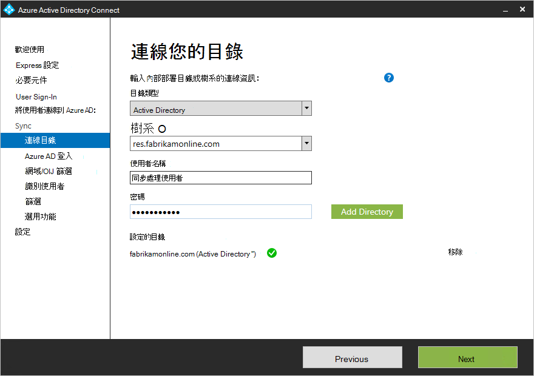
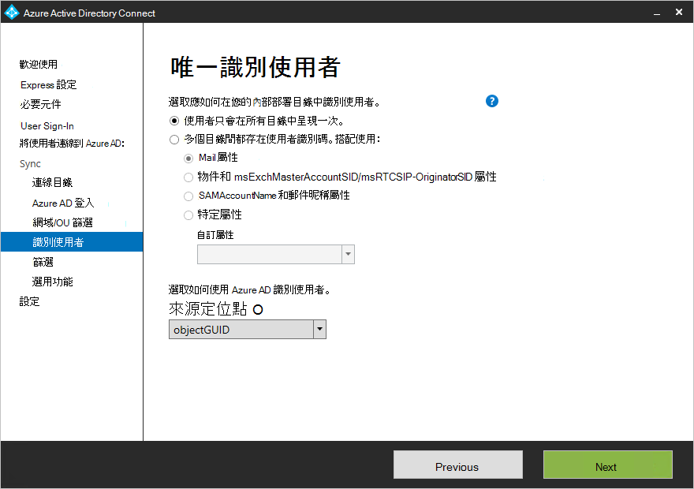

# 更新 AAD 連線至包含多個樹系Update AAD Connect to include more than one forest

Azure AD Connect 支援[多個樹系同步處理](https://docs.microsoft.com/azure/active-directory/connect/active-directory-aadconnect-topologies)。Azure AD Connect supports [syncing from multiple forests](https://docs.microsoft.com/azure/active-directory/connect/active-directory-aadconnect-topologies). 不過，它支援 Azure AD Connect 同步處理至 AAD 只能有一個執行的個體。However, it supports only one instance of Azure AD Connect syncing to AAD. 因此，在 Azure AD 已安裝在一個樹系的情況下，AAD 連線的現有執行個體必須更新以從其他樹系的同步處理。Therefore, in cases where Azure AD is already installed in one forest, the existing instance of AAD Connect must be updated to sync from the additional forest.

 - 如果這兩個樹系間只有一次表示所有的身分識別 （亦即，您還未做任何擁有郵件功能的連絡人），然後您可以只重新執行 [AAD 連線精靈]，選擇 [「 自訂同步處理選項 」，然後在 [**連線您的目錄**] 頁面中，輸入認證與其他樹系的名稱。If all identities are represented only once across both forests (that is, you haven’t made any mail-enabled contacts), then you can simply re-run the AAD Connect wizard, choose “Customize synchronization options,” and then on the **Connect Your Directories** page, enter the name of the additional forest and creds.  
 
 - 不過，如果使用者可以在於超過一個目錄和您將會合併資料 （例如，如果連絡人物件對應至另一個樹系中的使用者樹系中有），則需要解除安裝 Azure AD Connect，並重新安裝它。However, if users can exist in more than one directory and you’ll be merging the data (for example, if contact objects exist in a forest corresponding to users in another forest), you will need to uninstall Azure AD Connect and re-install it.  這是因為只可以在第一個會安裝期間設定跨樹系聯結的規則條件。This is because the cross-forest join rules condition can only be configured during the first install. 這是在下列頁面：This is done on the following page:  
 ![唯一識別您的使用者] 頁面](../media/cloud-consolidation-uniquely-identifying-your-users.png)

## 請參閱See also

[針對小組與 Skype for Business 的雲端彙總Cloud Consolidation for Teams and Skype for Business](cloud-consolidation.md)