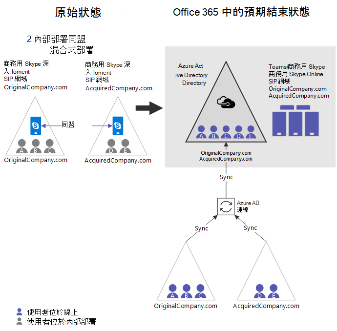

# Teams 和商務用 Skype 的雲端整合Cloud consolidation for Teams and Skype for Business

許多大型企業擁有多個內部部署 AD 樹系，在某些情況下，客戶會有多個 Exchange 和/或商務用 Skype Server (或 Lync Server) 部署。Many large enterprises have more than one on-premises AD forest, and in some cases, customers have more than one Exchange and/or Skype for Business Server (or Lync Server) deployment. 此外，即使是只有一個內部部署樹系的組織，透過企業併購的過程，也會發現自己處於類似的情況。In addition, even organizations with only one on-premises forest could find themselves in a similar situation via a business merger or acquisition. 當這些客戶移至雲端時，可以將特定內部部署工作負載的多個執行個體合併到雲端的單一 Office 365 租用戶。As these customers move to the cloud, they want to consolidate the multiple instances of a given on-premises workload into the cloud into a single Office 365 tenant. 本文說明如何達到該合併彙算的 Skype for Business （或 Lync） 給想要將其 UC 工作量移至 Microsoft 雲端，例如、 Microsoft Teams 和/或商務用 Skype 與多個內部部署組織。This article describes how to achieve that consolidation for organizations with multiple on-premises deployments of Skype for Business (or Lync) who want to move their UC workload to the Microsoft cloud, e.g., Microsoft Teams and/or Skype for Business Online.

針對這類狀況的客戶，過去的指導方針是先合併內部部署的部署，然後再移至雲端。Historically, the guidance has been for customers in this situation to consolidate deployments on-premises first and then move to the cloud. 雖然這仍然是一個選項，這篇文章說明根據新功能可讓組織具有多個 Skype for Business 部署移轉到單一 Office 365 租用戶，一次一個部署不需再做為內部的解決方案彙總。While this is still an option, this article describes a solution based on new functionality that enables organizations with multiple Skype for Business deployments to migrate one deployment at a time into a single Office 365 tenant, without doing on-premises consolidation. 請注意，即使有這項新功能，Skype for Business Online 和 Microsoft Teams 不支援多個 Skype for Business/Lync 樹系中使用單一 Office 365 租用戶混合模式。Note that even with this new functionality, Skype for Business Online and Microsoft Teams do not support multiple Skype for Business/Lync forests in hybrid mode with a single Office 365 tenant. 

> [!Important]
> 之前使用本指南的設定，請確定已閱讀並瞭解[限制](#limitations)，因為它們可能會影響您的組織。Before using this guide for configuration, be sure to review and understand the [Limitations](#limitations), as they may affect your organization.

## 雲端整合概述Overview of cloud consolidation

只要符合下列關鍵需求，任何擁有多個商務用 Skype 部署的組織，都能將內部部署的所有使用者合併到雲端的單一 Office 365 租用戶中：Consolidation of all users from on-premises into the cloud in a single Office 365 tenant can be achieved for any organization with multiple Skype for Business deployments, provided that the following key requirements are met:

- 最多只能有一個 Office 365 租用戶。There must be at most one Office 365 tenant involved. 不支援多個 Office 365 租用戶案例的合併。Consolidation in scenarios with more than one Office 365 tenant is not supported.
- 任何時候，只有一個內部部署商務用 Skype 樹系可以處於混合模式 (共用 SIP 位址空間)。At any given time, only one on-premises Skype for Business forest can be in hybrid mode (Shared SIP Address Space). 其他所有內部部署商務用 Skype 樹系都必須仍是內部部署 (而且可能會互相形成同盟)。All other on-premises Skype for Business forests must remain on-premises (and presumably federated with each other). 請注意，這些其他內部部署組織*可以*同步處理至 AAD 如果想要與[新功能，以停用線上的 SIP 網域](https://docs.microsoft.com/powershell/module/skype/disable-csonlinesipdomain?view=skype-ps)可用截至 2018 年 12 月。Note that these other on-premises organizations *can* sync to AAD if desired with [new functionality to disable online SIP domains](https://docs.microsoft.com/powershell/module/skype/disable-csonlinesipdomain?view=skype-ps) available as of December 2018.

在多個樹系中有多個商務用 Skype 部署的客戶，必須使用共用 SIP 位址空間功能，個別將單一混合式商務用 Skype 樹系的所有使用者，完全移轉到 Office 365 租用戶中，然後停用該內部部署的混合式部署，再繼續移轉下一個內部部署商務用 Skype 部署。Customers with deployments of Skype for Business in multiple forests must fully migrate all users of a single hybrid Skype for Business forest individually into the Office 365 tenant using Shared SIP Address Space functionality, and then disable hybrid with that on-premises deployment, before moving on to migrate the next on-premises Skype for Business deployment. 在移轉到雲端之前，內部部署使用者與任何不在相同使用者內部部署目錄中的使用者還是會保持同盟狀態。Prior to being migrated to the cloud, on-premises users remain in a federated state with any users that are not represented in the same user’s on-premises directory.  

## 雲端合併彙算的標準範例Canonical example of cloud consolidation

請考慮與想要合併它們線上 Microsoft Teams 中的商務用 Skype 或商務用 Skype 的兩個個別同盟的內部部署組織。Consider an organization with two separate federated on-premises deployments of Skype for Business that wants to consolidate them online in Microsoft Teams or Skype for Business Online.

|原始狀態詳細資料Original state details |需要的狀態的詳細資訊Desired state details |
|---------|---------|
|<ul><li>2 獨立商務用 Skype 內部部署在不同的 AD 樹系2 independent Skype for Business on-premises deployments in separate AD forests<li>最多 1 的樹系是在混合式架構與 Skype for Business OnlineAt most 1 forest is in hybrid with Skype for Business Online <li> 是與彼此同盟組織的 EmcOrgs are federated with each other <li>使用者不會在這些樹系之間同步處理Users are not synced across these forests<li> 組織可能會有 Office 365 租用戶，可能他們的目錄同步到 Azure ADThe org may have an Office 365 tenant and may be syncing their directory into Azure AD</ul>|<ul> <li>1 office 365 租用戶1 Office 365 tenant<li>沒有其他內部部署，所以沒有剩餘的混合式No more on-premises deployments, so no hybrid remaining<li>從內部部署的所有使用者位於商務用 Skype 和 （選用） 可能是僅限小組的使用者All users from on premises are homed in Skype for Business Online and optionally may be Teams-only users <li>無內部的磁碟使用量商務用 Skype 無所不在No on-premises footprint of Skype for Business anywhere <li>使用者仍有內部部署驗證Users still have on-premises authentication</ul> |

  

若要從原來的狀態取得想要的最終狀態的基本步驟如下。The basic steps to get from the original state to the desired end state are below.  請注意，有些組織可能會發現他們的起點是某處中間這些步驟。Note that some organizations may find that their starting point is somewhere in the middle of these steps. 本文稍後，請參閱[其他起始點](#other-starting-points)。See [Other starting points](#other-starting-points), later in this article. 最後，在某些情況下的順序可以調整，視需要而定。Finally, in some cases the order can be adjusted, depending on need. 索引鍵條件約束限制說明[及](#limitations)更新版本。[Key constraints and limitations](#limitations) are described later.

1.  如果沒有尚未存在，請取得 Office 365 租用戶。Get an Office 365 tenant if one does not yet exist.
2.  請確定所有相關跨兩個內部部署的 SIP 網域已驗證的 Office 365 網域。Make sure all relevant SIP domains across both on-premises deployments are verified Office 365 domains.
3.  選擇一個商務用 Skype 會與 Office 365 的混合式的企業部署。Pick one Skype for Business deployment that will be hybrid with Office 365. 在這個範例中，我們將使用 OriginalCompany。com。In this example, we’ll use OriginalCompany.com.
4.  [啟用 AAD 連線的樹系](configure-azure-ad-connect.md)中第一次將成為混合式 (OriginalCompany。com)。[Enable AAD Connect for the forest](configure-azure-ad-connect.md) that will first become hybrid (OriginalCompany.com). 
5.  如果您將介紹 Teams 進入您的組織，為[TeamsUpgradePolicy](https://docs.microsoft.com/powershell/module/skype/grant-csteamsupgradepolicy) SfBWithTeamsCollab 或下列其中一個其他 SfB 模式 （SfBOnly 或 SfBWithTeamsCollabAndMeetings） 的全租用戶原則。If you will be introducing Teams into your organization, set the tenant-wide policy for [TeamsUpgradePolicy](https://docs.microsoft.com/powershell/module/skype/grant-csteamsupgradepolicy) to SfBWithTeamsCollab or one of the other SfB modes (SfBOnly or SfBWithTeamsCollabAndMeetings). 這是很重要的通話路由傳送，而且聊天室的使用者移至 [僅小組會保留在內部部署的使用者。This is critical to ensure routing of calls and chats from users who move to Teams Only to users who remain on premises.
6.  它是建議使用這個時候 （但尚未必要步驟 11 之前） 若要[啟用 AAD Connect 為其他樹系](cloud-consolidation-aad-connect.md)(AcquiredCompany。com)。It is recommended at this point (but not yet required until step 11) to [enable AAD Connect for the other forest](cloud-consolidation-aad-connect.md) (AcquiredCompany.com). 假設 AAD 連線兩個樹系中已啟用，組織看起來像**[圖](#figure-a)**，這可能是常見的起點的部分組織的 emc。Assuming AAD Connect is enabled in both forests, the org looks like **[Figure A](#figure-a)**, which may be a common starting point for some orgs. 
7.  針對任何其他內部部署所主控的 SIP 網域 (在此情況下，AcquiredCompany。com)，[停用這些中的 SIP 網域 Skype for Business Online](https://docs.microsoft.com/powershell/module/skype/disable-csonlinesipdomain)使用`Disable-CsOnlineSipDomain`PowerShell 中。For any SIP domains hosted by other on-premises deployments (in this case, AcquiredCompany.com), [disable these SIP domains in Skype for Business Online](https://docs.microsoft.com/powershell/module/skype/disable-csonlinesipdomain) using `Disable-CsOnlineSipDomain` in PowerShell. （這是截至 2018 年 12 月的新功能）。(This is new functionality as of December 2018.)
8.  [設定混合式商務用](configure-federation-with-skype-for-business-online.md)為 OriginalCompany 的。com （一個部署，仍有啟用線上的 SIP 網域）。[Configure Skype for Business hybrid](configure-federation-with-skype-for-business-online.md) for OriginalCompany.com (the one deployment that still has enabled online SIP domains).
9.  混合式部署中 (OriginalCompany。com)，開始[移動使用者從內部部署到雲端的商務用 Skype](move-users-between-on-premises-and-cloud.md) (是否小組僅限與否) 以便帳戶位於 skype for Business Online。In the hybrid deployment (OriginalCompany.com), start [moving users from Skype for Business on premises to the cloud](move-users-between-on-premises-and-cloud.md) (whether Teams Only or not) so that account is homed in Skype for Business Online. 現在組織看起來像**[圖 B](#figure-b)**。圖的重要變更是：Now the organization looks like **[Figure B](#figure-b)**. The key changes from Figure A are:
    - 這兩個內部部署目錄中的使用者現在則位於 AAD。Users from both on-premises directories are now in AAD.
    - AcquiredCompany。com 是已停用線上 SIP 網域。AcquiredCompany.com is a disabled online SIP domain.
    - 一些使用者已移線上任一 skype for Business Online 或 microsoft Teams。Some users have been moved online to either Skype for Business Online or Teams. （請參閱紫色使用者 a）(See purple user A.)
10. 一旦所有使用者都移至雲端，OriginalCompany 用的 [[停用與 Skype for Business 的內部部署的混合式](cloud-consolidation-disabling-hybrid.md)。com 的 Office 365:Once all users are moved to the cloud, [disable hybrid with the Skype for Business on-premises deployment](cloud-consolidation-disabling-hybrid.md) for OriginalCompany.com from Office 365:  
    - 在 Office 365 租用戶中停用分割網域。Disable split domain in the Office 365 tenant.
    - 停用與 Office 365 中 OriginalCompany 通訊的功能。com 內部。Disable the ability to communicate with Office 365 in OriginalCompany.com on-premises.
    - OriginalCompany 更新 DNS 記錄。以指向 Office 365 的 com。Update DNS records for OriginalCompany.com to point to Office 365.
11. 如果不這麼做，[啟用 AAD 連線的下一個樹系](cloud-consolidation-aad-connect.md)，將會移混合式 (AcquiredCompany。com)。If not done already, [enable AAD Connect for the next forest](cloud-consolidation-aad-connect.md) that will go hybrid (AcquiredCompany.com). 此時，組織看起來像**[圖 C](#figure-c)**。這可能是另一個常見的起始點的某些組織。At this point, the organization looks like **[Figure C](#figure-c)**. This may be another common starting point for some organizations. 
12. 在 PowerShell 中[啟用的下一個內部部署的 SIP 網域](https://docs.microsoft.com/powershell/module/skype/enable-csonlinesipdomain?view=skype-ps)，將會移混合式，AcquiredCompany。com。In PowerShell, [enable the SIP domains for the next on-premises deployment](https://docs.microsoft.com/powershell/module/skype/enable-csonlinesipdomain?view=skype-ps) that will go hybrid, AcquiredCompany.com. 這是使用`Enable-CsOnlineSipDomain`，也就是截至 2018 年 12 月的可用的新功能。This is done using `Enable-CsOnlineSipDomain`, which is new functionality available as of December 2018.
13. 如果您使用關閉的同盟，您必須新增任何 SIP 網域 (不含 \*。 microsoftonline.com) 的純虛擬 online 中的租用戶允許的網域為**同一個**Office 365。If you are using closed federation, you must add any SIP domains (excluding \*.microsoftonline.com)  of the pure online tenant as Allowed Domains in **same** Office 365. 請注意，它可能需要一些時間前變更才會生效，而且沒有無礙早期，這項作業，我們建議這麼做也遲移至步驟 14。Note that it can take some time before the change takes effect and there is no harm in doing this early, so we suggest doing this well in advance of moving to step 14.
14. 更新以接受從 online 租用戶，任何 SIP 網域，這樣它們符合的內部部署環境。Update the on-premises environment to accept any SIP domains from the online tenant, so they match.
    - [更新所有 edge 憑證中的 SAN](cloud-consolidation-edge-certificates.md)為相同的值為之前加上的任何現有的線上 SIP 網域值 (除非 \*。 microsoftonline.com)、 在此情況下，Sip.OriginalCompany。com。[Update the SAN in all edge certificates](cloud-consolidation-edge-certificates.md) to be the same value as before, plus values for any existing online SIP domains (except \*.microsoftonline.com), in this case, Sip.OriginalCompany.com.
    - 請確定 OriginalCompany。com 是[允許的網域](https://docs.microsoft.com/powershell/module/skype/new-csalloweddomain)在內部部署中，AcquiredCompany。Make sure OriginalCompany.com is an [allowed domain](https://docs.microsoft.com/powershell/module/skype/new-csalloweddomain) in the on-premises deployment, AcquiredCompany. 加入允許的網域。Add allowed domains.
15. [啟用 Skype for Business 混合式](configure-federation-with-skype-for-business-online.md)內部部署 AcquiredCompany 之間。com 和雲端。[Enable Skype for Business hybrid](configure-federation-with-skype-for-business-online.md) between on-premises AcquiredCompany.com and the cloud.
16. 做為所需，[將使用者從內部部署到雲端移轉](move-users-between-on-premises-and-cloud.md)。As desired, [migrate users from on-premises to the cloud](move-users-between-on-premises-and-cloud.md). 您可以將使用者移轉可以直接以[TeamsOnly](/microsoftteams/teams-and-skypeforbusiness-coexistence-and-interoperability)模式或您可以移轉第一次到 Skype for Business Online。You can migrate users either directly to [TeamsOnly](/microsoftteams/teams-and-skypeforbusiness-coexistence-and-interoperability) mode or you can migrate them first to Skype for Business Online. 在此狀態下，期間組織看起來像**[圖 D](#figure-d)**。During this state, the organization looks like **[Figure D](#figure-d)**.
17. 一旦移轉所有使用者，讓*組織純雲端*的 [[停用在內部部署環境的混合式](cloud-consolidation-disabling-hybrid.md)！Once all users are migrated, [disable hybrid with the on-premises environment](cloud-consolidation-disabling-hybrid.md) to *make the organization pure cloud*!

下列圖表顯示此程序期間各種重點組態。The diagrams below show the configuration at various key points during this process.

##### 圖答：Figure A:

- 透過 AAD Connect，AAD 現在有所有的使用者，同時讓兩個組織同步處理內部部署。Both organizations sync via AAD Connect, so AAD now has all users from both on-premises deployments.
- 所有使用者都位於內部部署。All users homed on-premises.  
- Skype 混合式商務*未*尚未設定。Skype for Business Hybrid is *not* yet configured.
- 如果任一部署中的使用者使用 Teams，他們將無法與其他每] （或任何組織） 聯盟也不會有與商務版使用者任何商務用 Skype 互通性。If users in either deployment use Teams, they won’t be able to federate with each other (or any organization), nor will they have interoperability with any Skype for Business users. 在這個階段中，Microsoft 建議只使用 Teams 的通道。While in this stage, Microsoft recommends using Teams for Channels only.  
    

##### 圖 b:Figure B:

- AcquiredCompany。com 是[停用](https://docs.microsoft.com/powershell/module/skype/disable-csonlinesipdomain)線上的 SIP 網域。AcquiredCompany.com is a [disabled](https://docs.microsoft.com/powershell/module/skype/disable-csonlinesipdomain) online SIP domain. 所有使用者都是內部部署。All users are on-premises. 如果他們使用 Teams 他們沒有同盟或互通性。If they use Teams they do not have federation or interoperability. 在這個階段中，Microsoft 建議只使用 Teams 的通道。While in this stage, Microsoft recommends using Teams for Channels only.
- 其中一個內部部署組織已啟用混合式商務用 Skype。Skype for Business Hybrid has been enabled for one of the on-premises organizations.
- 混合式組織中的某些使用者已移至雲端 （使用者的紫色網底所指示）。Some users in the hybrid organization have been moved to the cloud (user A as indicated by purple shading). 這些使用者可以是商務用 Skype 商務 Online 使用者，或是只小組使用完整的互通性和同盟支援的使用者。These users can be either Skype for Business Online users or Teams Only users with full interoperability and federation support.  
    

##### 圖 c:Figure C:

- 從 OriginalCompany 的所有使用者。com 皆已在雲端 （位於 Skype for Business Online）。All users from OriginalCompany.com are now in the cloud (homed in Skype for Business Online). 建議，它們也是僅限 microsoft Teams。It’s recommended that they also be Teams Only.
- Skype 商務混合式組態與 OriginalCompany。com 部署已停用。Skype for Business hybrid configuration with the OriginalCompany.com deployment has been disabled. 在內部部署已消失。The on-premises deployment is gone.
- 如果 AcquiredCompany。com 先前未同步處理至 AAD，若要繼續從此處它必須立即同步處理。If AcquiredCompany.com wasn’t previously syncing to AAD, to continue from here it needs to be synced now. 但它尚未混合式 （共用 SIP 位址空間），且使線上小組使用者可以與彼此，單純的內部部署組織 (AcquiredCompany.com) 的線上 SIP 網域直到準備好可以移動至混合式部署組織，應保持停用]，在內部部署使用者。But it is not yet hybrid (shared SIP address space), and until the organization is ready to move to hybrid, the online SIP domain for the pure on-premises organization (AcquiredCompany.com) should remain disabled, so that online Teams users can communicate with on-premises users.  
    

##### 圖 d:Figure D:

- AcquiredCompany。com 現已啟用為線上的 SIP 網域。AcquiredCompany.com is now enabled as an online SIP domain.
- 內部部署會更新以接受 OriginalCompany。com。On-premises is updated to accept OriginalCompany.com. （同時允許的網域，而且邊緣憑證會更新）。(Both allowed domain, and edge certificates are updated).
- 間 AcquiredCompany 已啟用共用 SIP 位址空間。com 和 Office 365 租用戶。Shared SIP Address Space is enabled between AcquiredCompany.com and Office 365 tenant.
- 混合式組織中的某些使用者可能已移至雲端，例如使用者 D 下方 （紫色網底所指示）。Some users in the hybrid organization may have been moved to the cloud, such as User D below (indicated by purple shading).  
    

## 其他的起點Other starting points

在上述範例中正式步驟假設組織開頭具有沒有 Office 365 平台服務的兩個同盟的內部部署。The steps in the canonical example above assume that the organization starts with two federated on-premises deployments with no Office 365 presence. 不過，有些組織可能會有現有的 Office 365 磁碟使用量，以及可以有上述順序不同的進入點。However, some organizations may have an existing Office 365 footprint, and there can be different entry points into the sequence above. 有四個一般設定：There are four typical configurations:

- 沒有 Office 365 租用戶的多個同盟的內部部署組織。Multiple federated on-premises organizations with no Office 365 tenant. 在此情況下，從步驟 1 開始。In this case, start at step 1.
- 多個同盟的內部部署組織都已同步處理多個 Skype for Business 樹系到單一 Azure AD 租用戶。Multiple federated on-premises organizations that are already syncing multiple Skype for Business forest into a single Azure AD tenant. 此類組織的格式類似於圖，其已完成步驟 1-6，因此應開始執行步驟 7 中的假設組織。Such an organization resembles the hypothetical organization in Figure A, which has completed steps 1-6 and should start at step 7.
- 同盟 1 混合組織或多個其他單純的內部部署組織，無的同步處理至 AAD。A hybrid organization that federates with 1 or more other pure on-premises organizations, none of which sync to AAD. 此類組織會類似於假設組織**圖 E**，如下所示。Such an organization would resemble the hypothetical organization in **Figure E**, shown below.
    - 此組織就類似於圖 B，已完成步驟 1-9、 除外：This organization is similar to Figure B, which has completed steps 1-9, except:
        - 企業部署其非混合式商務用 Skype 會*不*尚未同步處理到 Azure AD。Its non-hybrid Skype for Business deployments are *NOT* yet syncing to Azure AD.
        -  未尚未停用線上的 SIP 網域。Online SIP domains are not yet disabled. 
    - 這些組織應該可以：These organizations should either:
        - 完成移轉現有的混合式組織，然後輸入上述順序在步驟 10。Complete migration of the existing hybrid organization and enter the above sequence at step 10.  OROR,
        - 如果想要同步處理其他任何 Skype for Business 樹系至 AAD 之前完成移轉的混合式部署組織，則組織必須執行 [步驟的 7 （停用任何其他內部部署商務用 Skype 會的企業部署中的所有線上 SIP 網域至 AAD sync) 再啟用 [AAD Connect，並再繼續執行步驟 10 （解除委任原始的混合式部署中）。If it is desired to sync any other Skype for Business forests into AAD prior to completing migration of the hybrid organization, then the organization must perform step 7 (disable all online SIP domains in any other on-premises Skype for Business deployment that will sync into AAD) and then enable AAD Connect, and only then continue with step 10 (decommission the original hybrid deployment).       
                **圖 E****Figure E** 
                
- 純粹 Skype 商務 Online 組織 （可能有或可能不使用 Teams） 的同盟與企業組織內部個別商務用 Skype。A pure Skype for Business Online organization (which may or may not be using Teams) that federates with a separate on-premises Skype for Business organization. 一旦此組織會停用在內部部署組織的線上 SIP 網域，並讓 AAD Connect 用於企業組織內部部署商務用 Skype，看起來像假設組織**[圖 C](#figure-c)** 完成步驟 1-11 所示。Once this organization disables the online SIP domain for the on-premises organization and enables AAD Connect for the on-premises Skype for Business organization, it resembles the hypothetical organization shown in **[Figure C](#figure-c)** that has completed steps 1-11.

## 限制Limitations

- 最多只能有一個 Office 365 租用戶。There must be at most one Office 365 tenant involved. 不支援多個 Office 365 租用戶案例的合併。Consolidation in scenarios with more than one Office 365 tenant is not supported.
- 只有一個內部 Skype for Business 樹系可以是處於混合模式 （共用 SIP 位址空間），一次。Only one on-premises Skype for Business forest can be in hybrid mode (shared SIP address space) at a time. 所有其他內部 Skype for Business 樹系必須保持純粹內部部署和應該與彼此和 Office 365 租用戶同盟。All other on-premises Skype for Business forests must remain purely on-premises and should be federated with each other and the Office 365 tenant.
- 之前要移轉至雲端，沒有非對稱經驗的使用者在此部署中，因為並非所有使用者在線上都會代表內部部署：Prior to being migrated to the cloud, there is an asymmetric experience for users in this deployment, because not all users in online are represented on-premises:
    - 體驗可以加總，如下所示：The experience can be summed up as follows:
        - 線上位於任何使用者好像使用者是混合式，將互動的混合式環境中的內部部署使用者。Any user homed online will interact with on-premises users in the hybrid environment as if the user is hybrid.
        - 混合式部署中的內部部署使用者將會與線上好像它們是混合式表示其內部部署目錄中的使用者互動。On-premises users in the hybrid deployment will interact with online users who are represented in their on-premises directory as if they were hybrid. 
        - 內部部署混合式部署中的使用者將互動 online 使用者不會出現在內部部署 AD 為同盟。On-premises users in the hybrid deployment will interact with online users who are not represented in on-premises AD as federated.
    - 在**[圖 D](#figure-d)** 上述使用者 E 是內部部署中 AcquiredCompany。com。In **[Figure D](#figure-d)** above, user E is on-premises in AcquiredCompany.com.  使用者 E 與使用者 D （位於 online） 的互動方式使用標準的混合式的經驗，但使用者 E 會有同盟的經驗與使用者 A、 B 和 C，因為它們都不會出現在內部部署目錄中。User E will interact with User D (homed online) using the standard hybrid experience,  but user E will have a federated experience with users A, B, and C because they are not represented in the on-premises directory. 不過，使用者 A、 B 和 C 將互動使用者 E 好像使用者是在混合式架構。However, users A, B, and C will interact with user E as if the user were in hybrid.
    - 互動正在同盟與混合式的影響：Implications of interaction being hybrid vs. federation:
        - 目前狀態是不會自動訂閱的同盟使用者除非使用者會標示為 [連絡人。Presence is not automatically subscribed to for federated users unless the user is marked as a contact.
        - 來電轉接同盟網域之間無法運作。Call forwarding does not work between federated domains.
        - 來電轉接案例是較小。Call transfer scenarios are more limited.
        - 節流可能會套用到同盟流量。Throttling may be applied to federated traffic.
- 指定此非對稱的經驗，正式支援在內部部署使用者與雲端使用者之間的跨單位部署案例中的通話功能不在內部部署目錄中限制為只對等。Given this asymmetric experience, official support for calling functionality in cross-premises scenarios between an on-premises user and a cloud user that is not in the on-premises directory is limited to peer to peer only. 
    - 來電轉接、 轉接、 通話佇列，這些使用者之間的等不受支援。Call forwarding, transfer, call queues, etc. between these users is not supported.
    - 這些不受支援的呼叫案例仍會出現已啟用，但在許多情況下他們將會失敗無法預期的方式。These non-supported calling scenarios will still appear enabled, but in many cases they will fail in unpredictable ways. 
    - 在**[圖 D](#figure-d)** 上述使用者 E 是內部，而會做為對等支援與使用者 A、 B 或 C 的呼叫。In **[Figure D](#figure-d)** above, user E is on-premises, and calls with users A, B, or C will be supported only as peer to peer. （與使用者 D 的通話不會有支援限制）。 不過，內部部署使用者 E 移至雲端後，此限制不會再套用。(Calls with user D would not have support limitations.)  However, after the on-premises user E is moved to the cloud, this restriction no longer applies.
- 如果您有多個部署的 Skype for Business Server 2019 環境中，這些部署的唯一 1 可以設定為使用組織的自動語音應答，因為該功能需要 Skype for Business Server 混合式組態。If you have more than one deployment of Skype for Business Server 2019 in your environment, only 1 of those deployment can be configured to use Organizational Auto Attendant, since that feature requires Skype for Business Server hybrid configuration. 
- 可以調整的一些先前的步驟順序。The order of some of the previous steps can be adjusted. 必須符合的關鍵需求是，如果所有的這些都是，則為 true:The key requirement that must be met is that if all of these are true:
    - 多個內部 Skype for Business 樹系同步處理至單一 AAD 租用戶More than one on-premises Skype for Business forest syncing to a single AAD tenant
    - 分割網域啟用其中一個內部部署樹系Split domain is enabled with one on-premises forest
    - 混合式組織中的至少一位使用者已移轉至雲端At least one user in the hybrid organization has been migrated to the cloud    然後，您*必須*停用所有其他線上的 SIP 網域從任何其他內部部署商務用 Skype 商務樹系。Then, you *must* disable all other online SIP domains from any other on-premises Skype for Business forest. 否則，online 使用者在其他組織中的混合式部署組織與內部部署使用者之間的同盟關係將會中斷一個方向。Otherwise, federation between online users in the hybrid organization and on-premises users in other organizations will break in one direction.

## 影響Implications

- 因為有進階通話功能支援的限制，上面所述**組織應該將這些非對稱狀態視為暫時性一部分移轉，並不穩定的狀態為追求它們**。Because there are limitations in support for advanced calling functionality as described above, **organizations should treat these asymmetric states as transitory as part of migration, and not pursue them as steady state**.  
- 有多個內部部署商務用 Skype 商務部署的組織通常應該開頭可以完全移轉到雲端，部署，以便彙總可以繼續。Organizations with multiple on-premises Skype for Business deployments should generally start with a deployment that can be fully migrated to the cloud, so that consolidation can continue. 它也了解在某些情況下會有 holdouts 的對象還不可行，將移至 Teams 特定使用者群組。It is understood that in some cases there will be holdouts of certain user groups for whom it’s not yet viable to move to Teams. 當這項考量涉及多個 Skype for Business 樹系案例中的，開始移轉盡可能沒有這些限制的另一個樹系。When this is a consideration in scenarios involving multiple Skype for Business forests, start migrating with another forest that does not have these limitations, if at all possible.
- 從內部部署移至雲端時，有委派關係及/或一般使用者參與案例應該視為一個單位一起移動的來電轉接。When moving from on-premises to the cloud, users that have delegation relationships and/or are typically are involved in call forwarding scenarios should be moved together as a unit.

## 移至 TeamsOnly 模式的考量Considerations for moving to TeamsOnly mode

當您將使用者從內部部署移至雲端混合式環境中時，您可以移動至任一 Skype 僅商務] 或 [TeamsOnly 模式。When you move users from on premises to the cloud in a hybrid environment, you can move them to either Skype for Business Only or TeamsOnly mode. *如果您打算將使用者移至 TeamsOnly 模式，請務必先閱讀這一節。**If you plan to move users to TeamsOnly mode, be sure to read this section first.*

- 當您將 TeamsOnly 模式指派給使用者時，所有聊天室和任何其他使用者的來電將會在該使用者的 microsoft Teams 用戶端都推送。When you assign TeamsOnly mode to a user, all chats and calls from any other user will land in that user’s Teams client. 
- 如果使用者與 Skype 商務內部部署主要是使用 Skype 商務用戶端及不 Teams，請考慮設定 TeamsUpgradePolicy，以便路由傳送至內部部署使用者永遠堡而不是小組的商務用 Skype。If users with Skype for Business on-premises primarily use Skype for Business client and not Teams, consider setting TeamsUpgradePolicy so that routing to those on-premises users always lands in Skype for Business instead of Teams. 若要確保適當的路由傳送的聊天室和 TeamsOnly 的使用者還是會仍使用內部部署，商務用 Skype 使用者呼叫內部使用者必須有有效值 TeamsUpgradePolicy 以其中一個 SfB 模式中，而不是群島 (也就是預設值）。To ensure proper routing of chats and calls between users who are TeamsOnly and users who are still using Skype for Business on premises, on-premises users must have an effective value of TeamsUpgradePolicy with one of the SfB modes, rather than Islands (which is the default). 
    - 若要這麼做，*您必須先將這些值的其中一個 TeamsUpgradePolicy 您租用戶的全域執行個體*：To do this, *you must first set your tenant’s global instance of TeamsUpgradePolicy to one of these values*:
        - SfBWithTeamsCollab （建議使用）SfBWithTeamsCollab (recommended)
        - SfBWithTeamsCollabAndMeetingsSfBWithTeamsCollabAndMeetings
        - SfBOnlySfBOnly
    - 您可以使用此命令，以授與全租用戶原則：You can grant tenant-wide policy by using this command: `Grant-CsTeamsUpgradePolicy -PolicyName SfBWithTeamsCollab -Global`
    - 附註： 您必須執行這項操作的全租用戶層級因為原則無法指派給個別使用者在線上目錄中，不需要 SIP 位址。Note: You must do this at a tenant-wide level because policy cannot be assigned to individual users who do not have a SIP address in the online directory. 雖然您已停用內部純粹 deployment(s) 線上的 SIP 網域，這些網域中的使用者不會根據設計就線上目錄中有 SIP 位址。While you have disabled online SIP domains for your pure on-premises deployment(s), users in those domains won’t have SIP addresses in the online directory by design. 因此，若要將原則套用至那些內部使用者的唯一方法是藉由指定租用戶層級。Hence, the only way to apply policy to those on-premises users is by assigning at the tenant level. 相反地，在混合式架構部署使用者將 SIP 位址的目錄中有 online 讓他們可以明確指派原則如果它需要有不同的租用戶的全域原則的值。In contrast, in the hybrid deployment users will have a SIP address in the online directory so they can be explicitly assigned a policy if it’s desired that they have a different value than the tenant global policy.
- Microsoft Teams 用戶端 UX 不會尚未接受 TeamsUpgradePolicy SfB 模式。The Teams client UX does not yet honor the SfB modes of TeamsUpgradePolicy. 例如，在這些模式中，當來電與交談初始 teams 是目前可行的雖然在未來，不會發生此情況。For example, when in these modes, call and chat initiation in Teams is currently possible, although in the future that won’t be the case. 這可能會造成使用者之間的混淆，因為回覆有時可能小組和有時商務用 Skype 中登陸狀況而定。This can cause confusion among users because replies may sometimes land in Teams and sometimes Skype for Business, depending on the circumstances. 建議您分別停用通話並透過 TeamsMessagingPolicy 和 TeamsCallingPolicy 聊天室還是內部部署使用者。It is recommended that you separately disable calling and chat via TeamsMessagingPolicy and TeamsCallingPolicy for users who are still on premises.

## 請參閱See also

[更新邊緣憑證Update the edge certificate](cloud-consolidation-edge-certificates.md)

[更新 AAD 連線至包含多個樹系Update AAD Connect to include more than one forest](cloud-consolidation-aad-connect.md)

[停用混合式以完成移轉至雲端Disable hybrid to complete migration to the cloud](cloud-consolidation-disabling-hybrid.md)
