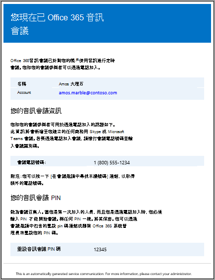
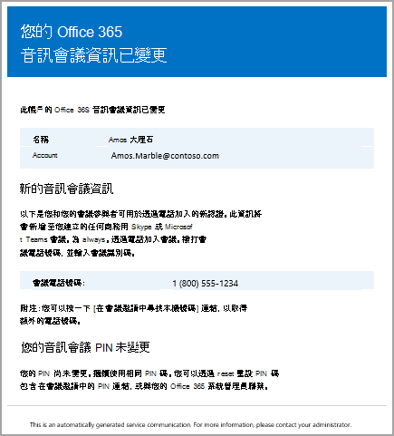
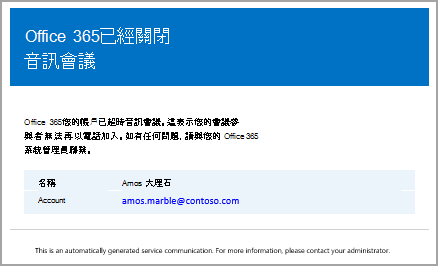

# <a name="emails-sent-to-users-when-their-settings-change-in-skype-for-business-online"></a>當使用者的設定在線上變更時，會商務用 Skype電子郵件

[!INCLUDE [sfbo-retirement](../../Hub/includes/sfbo-retirement.md)]

> [!Note]
> 如果您要在郵件中尋找自動電子郵件Microsoft Teams，請參閱當使用者的設定在 Microsoft Teams[中變更時，將電子郵件Microsoft Teams。](/MicrosoftTeams/emails-sent-to-users-when-their-settings-change-in-teams)

電子郵件會自動寄給使用 Microsoft 作為音訊會議[](set-up-audio-conferencing.md)提供者啟用音訊會議的使用者。
  
根據預設，有四種類型的電子郵件會寄給啟用音訊會議的使用者。 不過，如果您想要限制發送給使用者的電子郵件數量，您可以將其關閉。 當發生以下Microsoft 365 Office 365音訊會議會傳送電子郵件至使用者的電子郵件：
  
- **音訊會議授權會指派給他們，或是當您將音訊會議提供者變更為 Microsoft 時。**
    
     此電子郵件包含會議 ID、會議的預設會議電話號碼、使用者的音訊會議 PIN，以及使用 商務用 Skype Online 會議更新工具來更新使用者現有會議的指示和連結。 請參閱[指派商務用 Skype授權](../skype-for-business-and-microsoft-teams-add-on-licensing/assign-skype-for-business-and-microsoft-teams-licenses.md)[或指派 Microsoft 作為音訊會議提供者](assign-microsoft-as-the-audio-conferencing-provider.md)。
    
    > [!NOTE]
    > 如果貴組織已啟用動態會議 ID，他們排程的所有會議都會有唯一的會議 ID。 您可以在貴組織中[設定音訊會議動態的 ID。](./reset-a-conference-id-for-a-user.md) 
  
    以下是此電子郵件的範例：
    
     
  
    您可以查看附加商務用 Skype授權，以商務用 Skype[更多有關授權。](../skype-for-business-and-microsoft-teams-add-on-licensing/skype-for-business-and-microsoft-teams-add-on-licensing.md)
    
- **使用者的會議 ID 或預設會議電話號碼會變更。**
    
    此電子郵件包含會議 ID、預設會議電話號碼，以及使用 商務用 Skype 線上會議更新工具的指示和連結，此工具是用來更新使用者的現有會議。 但此電子郵件不包含使用者的音訊會議 PIN。 請參閱[重設使用者的會議 ID。](reset-a-conference-id-for-a-user.md)
    
    > [!NOTE]
    > 如果貴組織已啟用動態會議 ID，他們排程的所有會議都會有唯一的會議 ID。 您可以在貴組織中[設定音訊會議動態的 ID。](./reset-a-conference-id-for-a-user.md) 
  
    以下是此電子郵件的範例：
    
     
  
- **使用者的音訊會議 PIN 會重設。**
    
    此電子郵件包含召集人的音訊會議 PIN、現有的會議 ID，以及使用者的預設會議電話號碼。 請參閱 [重設音訊會議 PIN](reset-the-audio-conferencing-pin.md)。
    
    > [!NOTE]
    > 如果貴組織已啟用動態會議 ID，他們排程的所有會議都會有唯一的會議 ID。 您可以在貴組織中[設定音訊會議動態的 ID。](./reset-a-conference-id-for-a-user.md) 
  
    以下是此電子郵件的範例：
    
     
  
- **使用者授權會移除，或是音訊會議提供者從 Microsoft 變更為其他提供者或無。**
    
    從使用者移除 **音訊會議** 授權，或將使用者的音訊會議提供者從 Microsoft 變更為協力廠商音訊會議提供者，或將提供者設定為 None 時，會發生此 **情況**。 此電子郵件包含使用者使用 商務用 Skype 線上會議更新工具移除音訊會議特定資訊的指示和資訊，例如預設的會議電話號碼或會議 ID。
    
    請參閱[指派或移除 Microsoft 365 Apps 商務版。](https://support.office.com/article/997596b5-4173-4627-b915-36abac6786dc)
    
    以下是此電子郵件的範例：
    
     
  
> [!NOTE]
> [!INCLUDE [updating-admin-interfaces](../includes/updating-admin-interfaces.md)]

## <a name="make-changes-to-the-email-messages-that-are-sent-to-them"></a>變更要寄給他們的電子郵件訊息

您可以變更自動發送給使用者的電子郵件，包括電子郵件地址和包含在 From 連絡人資訊 *中的顯示名稱* 。 根據預設，電子郵件的寄件者會來自 Microsoft 365 或 Office 365，但您可以使用 Windows PowerShell 和[Set-CsOnlineDialInConferencingTenantSettings](/previous-versions//mt228132(v=technet.10)) Cmdlet 來變更電子郵件地址和顯示名稱。 若要變更傳送電子郵件給使用者的電子郵件地址，您必須：
  
- 在  _SendEmailFromAddress 參數中輸入_ 電子郵件地址。
    
- 在  _SendEmailFromDisplayName 參數中輸入電子郵件顯示_ 名稱。
    
- 將  _SendEmailOverride 參數_ 設為  _True_。
    
您可以對寄給使用者的電子郵件進行變更，例如電子郵件的寄回電子郵件地址和電子郵件的顯示名稱，方式如下：
  
```PowerShell
Set-CsOnlineDialInConferencingTenantSetting -SendEmailOverride $true -SendEmailFromAddress amos.marble -SendEmailFromDisplayName "Amos Marble"
```

> [!NOTE]
>  如果您想要變更電子郵件地址資訊，您必須確定您環境的輸入電子郵件政策允許來自從位址指定的自訂電子郵件。 如果您決定要取代 *From* 連絡人資訊，您應該確認電子郵件已正確發送給使用者。 您可以與貴組織的一個使用者測試這項功能，以執行此操作。
  
您可以使用 [Set-CsOnlineDialInConferencingTenantSettings](/previous-versions//mt228132(v=technet.10)) Cmdlet 來管理貴組織的其他設定，包括電子郵件。
  
## <a name="what-if-you-dont-want-email-to-be-sent-to-them"></a>如果您不想將電子郵件寄給他們，該怎麼處理？

當您停用傳送電子郵件給使用者時，即使使用者獲得授權，也不會傳送電子郵件。 在這種情況下，會議 ID、預設會議電話號碼，以及更重要的是，其音訊會議 PIN 不會發送給使用者。 發生此情況時，您必須傳送另一封電子郵件或打電話給使用者，告知使用者。
  
根據預設，電子郵件會寄給您的使用者，但如果您想要防止他們收到音訊會議電子郵件，您可以使用 商務用 Skype 系統管理中心或Windows PowerShell。 
 
 **圖示商務用 Skype標誌**  
    
1. 在 商務用 Skype **系統管理中心**，在左側流覽中，前往 **音訊會議** Microsoft  >  **橋接器設定**。
    
2. 在 **Microsoft 橋接器設定頁面上** ，選取或清除如果使用者的音訊會議設定變更，自動 **傳送電子郵件給使用者**。 
    
3. 按一下 [儲存]。 

> [!Note]
> [!INCLUDE [updating-admin-interfaces](../includes/updating-admin-interfaces.md)]
  
**使用Windows PowerShell**
  
1. 執行下列操作以停用傳送所有使用者的電子郵件：
    
   ```PowerShell
   Set-CsOnlineDialInConferencingTenantSettings -AutomaticallySendEmailsToUsers $false
   ```

您可以使用 [Set-CsOnlineDialInConferencingTenantSettings](/previous-versions//mt228132(v=technet.10)) Cmdlet 來管理貴組織的其他設定，包括電子郵件。
  
## <a name="what-else-should-you-know-about-this-email"></a>關於此電子郵件，您還需要知道什麼？

- 有關啟用及停用自動傳送電子郵件給使用者的更多資訊，請參閱在音訊會議設定變更時啟用或停用 [傳送電子郵件](enable-or-disable-sending-emails-when-their-settings-change.md)。
    
- 有時候使用者會失去音訊資訊，而您必須能夠傳送所有音訊資訊給他們。 您可以使用系統管理中心，商務用 Skype音訊會議內容下，按一下以電子郵件傳送會議資訊。 請參閱 [傳送電子郵件給使用者及其音訊會議資訊](send-an-email-to-a-user-with-their-dial-in-information.md)。 不過，這項資訊不包含音訊會議 PIN。
    
    以下是將寄給他們的此電子郵件範例：
    
     
  
## <a name="want-to-know-how-to-manage-with-windows-powershell"></a>想要瞭解如何使用 Windows PowerShell？

- 根據預設，電子郵件的寄件者會來自 Microsoft 365 或 Office 365，但您可以使用 Windows PowerShell 和[Set-CsOnlineDialInConferencingTenantSettings](/previous-versions//mt228132(v=technet.10)) Cmdlet 來變更電子郵件地址和顯示名稱。
    
- Windows PowerShell管理使用者，以及允許或不允許使用者執行哪些操作。 有了Windows PowerShell，您可以使用單一Microsoft 365管理Office 365管理，當您有多個工作需要執行時，可以簡化您的日常工作。 若要開始使用Windows PowerShell，請參閱以下主題：
    
  - [為什麼您需要使用 powerShell Microsoft 365 Office 365 PowerShell](/microsoft-365/enterprise/why-you-need-to-use-microsoft-365-powershell)
    
  - [使用 Microsoft 365 管理Office 365或Windows PowerShell](/previous-versions//dn568025(v=technet.10))
    
- Windows PowerShell比僅使用 Microsoft 365 系統管理中心，在速度、簡易性及生產力方面有許多優點，例如，當您一次對許多使用者進行設定變更時。 請從下列主題瞭解這些優點： 
    
  - [Windows PowerShell 與 Lync Online 的簡介](../set-up-your-computer-for-windows-powershell/set-up-your-computer-for-windows-powershell.md)
    
  - [使用 Windows PowerShell 管理 商務用 Skype Online](../set-up-your-computer-for-windows-powershell/set-up-your-computer-for-windows-powershell.md)
    
  - [使用 Windows PowerShell 執行常見的線上商務用 Skype管理工作](../set-up-your-computer-for-windows-powershell/set-up-your-computer-for-windows-powershell.md)
    
    > [!NOTE]
    > Windows PowerShell Online 商務用 Skype模組可讓您建立連線至 Windows PowerShell Online 的遠端商務用 Skype會話。 此模組僅支援在 64 位電腦上，可從 Microsoft 下載中心下載，Windows PowerShell Online 模組商務用 Skype[下載。](https://go.microsoft.com/fwlink/?LinkId=294688)
  
## <a name="related-topics"></a>相關主題

[啟用或停用音訊會議設定變更時傳送電子郵件的設定](enable-or-disable-sending-emails-when-their-settings-change.md)
  
[傳送內含音訊會議資訊的電子郵件給使用者](send-an-email-to-a-user-with-their-dial-in-information.md)
