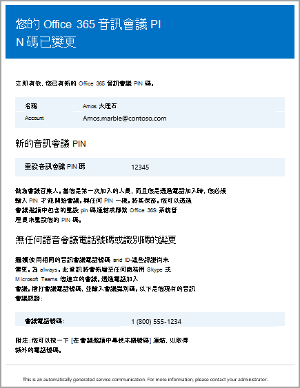

# <a name="emails-sent-to-users-when-their-settings-change-in-skype-for-business-online"></a><span data-ttu-id="a33a1-103">在商務用 Skype Online 的設定變更時傳送給使用者的電子郵件</span><span class="sxs-lookup"><span data-stu-id="a33a1-103">Emails sent to users when their settings change in Skype for Business Online</span></span>

> [!Note]
> <span data-ttu-id="a33a1-104">如果您正在尋找 Microsoft 團隊中的自動電子郵件資訊，請參閱在[Microsoft 團隊中的設定變更時傳送給使用者的電子郵件](/MicrosoftTeams/emails-sent-to-users-when-their-settings-change-in-teams)。</span><span class="sxs-lookup"><span data-stu-id="a33a1-104">If you're looking for automatic email information in Microsoft Teams, see [Emails sent to users when their settings change in Microsoft Teams](/MicrosoftTeams/emails-sent-to-users-when-their-settings-change-in-teams).</span></span>

<span data-ttu-id="a33a1-105">電子郵件會自動傳送給已使用 Microsoft 做為音訊會議提供者[的音訊會議的](set-up-audio-conferencing.md)使用者。</span><span class="sxs-lookup"><span data-stu-id="a33a1-105">Emails will be automatically sent to users who are [enabled for Audio Conferencing](set-up-audio-conferencing.md) using Microsoft as the audio conferencing provider.</span></span>
  
<span data-ttu-id="a33a1-106">根據預設，會傳送四種類型的電子郵件給已啟用音訊會議的使用者。</span><span class="sxs-lookup"><span data-stu-id="a33a1-106">By default, there are four types of email that will be sent to your users who are enabled for Audio Conferencing.</span></span> <span data-ttu-id="a33a1-107">不過，如果您想要限制傳送給使用者的電子郵件數目，您可以將它關閉。</span><span class="sxs-lookup"><span data-stu-id="a33a1-107">However, if you want to limit the number of emails sent to users, you can turn it off.</span></span> <span data-ttu-id="a33a1-108">Office 365 中的音訊會議會在下列情況傳送電子郵件給使用者的電子郵件：</span><span class="sxs-lookup"><span data-stu-id="a33a1-108">Audio Conferencing in Office 365 will send email to your users' email when:</span></span>
  
- <span data-ttu-id="a33a1-109">**系統會將音訊會議授權指派給他們，或者當您將音訊會議提供者變更為 Microsoft 時。**</span><span class="sxs-lookup"><span data-stu-id="a33a1-109">**An Audio Conferencing license is assigned to them or when you are changing the audio conferencing provider to Microsoft.**</span></span>
    
     <span data-ttu-id="a33a1-110">此電子郵件包含會議 ID、會議的預設會議電話號碼、使用者的音訊會議 PIN，以及使用用來更新現有會議的 [商務用 Skype Online 會議更新] 工具的指示與連結。使用者名.</span><span class="sxs-lookup"><span data-stu-id="a33a1-110">This email includes the conference ID, the default conference phone number for the meetings, the audio conferencing PIN for the user, and the instructions and link to use the Skype for Business Online Meeting Update Tool that is used to update existing meetings for the user.</span></span> <span data-ttu-id="a33a1-111">請參閱[指派商務用 Skype 授權](../skype-for-business-and-microsoft-teams-add-on-licensing/assign-skype-for-business-and-microsoft-teams-licenses.md)，或[將 Microsoft 指派為音訊會議提供者](assign-microsoft-as-the-audio-conferencing-provider.md)。</span><span class="sxs-lookup"><span data-stu-id="a33a1-111">See [Assign Skype for Business licenses](../skype-for-business-and-microsoft-teams-add-on-licensing/assign-skype-for-business-and-microsoft-teams-licenses.md) or [Assign Microsoft as the audio conferencing provider](assign-microsoft-as-the-audio-conferencing-provider.md).</span></span>
    
    > [!NOTE]
    > <span data-ttu-id="a33a1-112">如果您的組織已啟用動態會議 Id，他們排程的所有使用者會議都會有唯一的會議 Id。</span><span class="sxs-lookup"><span data-stu-id="a33a1-112">If your organization has been enabled for dynamic conference IDs, all of a user's meetings that they schedule will have unique conference IDs.</span></span> <span data-ttu-id="a33a1-113">您可以[在組織中設定音訊會議動態 id](using-audio-conferencing-dynamic-ids-in-your-organization.md)。</span><span class="sxs-lookup"><span data-stu-id="a33a1-113">You can set up [Audio Conferencing dynamic IDs in your organization](using-audio-conferencing-dynamic-ids-in-your-organization.md).</span></span> 
  
    <span data-ttu-id="a33a1-114">以下是這封電子郵件的範例：</span><span class="sxs-lookup"><span data-stu-id="a33a1-114">Here is an example of this email:</span></span>
    
     
  
    <span data-ttu-id="a33a1-116">您可以查看[商務用 skype 附加元件授權](../skype-for-business-and-microsoft-teams-add-on-licensing/skype-for-business-and-microsoft-teams-add-on-licensing.md)，進一步瞭解商務用 skype 的授權。</span><span class="sxs-lookup"><span data-stu-id="a33a1-116">You can find out more about Skype for Business licensing by seeing [Skype for Business add-on licensing](../skype-for-business-and-microsoft-teams-add-on-licensing/skype-for-business-and-microsoft-teams-add-on-licensing.md).</span></span>
    
- <span data-ttu-id="a33a1-117">**使用者的會議 ID 或預設會議電話號碼會變更。**</span><span class="sxs-lookup"><span data-stu-id="a33a1-117">**The conference ID or default conference phone number of a user changes.**</span></span>
    
    <span data-ttu-id="a33a1-118">此電子郵件包含會議 ID、預設會議電話號碼，以及使用商務用 Skype Online 會議更新工具來更新使用者現有會議的指示與連結。</span><span class="sxs-lookup"><span data-stu-id="a33a1-118">This email contains the conference ID, default conference phone number, and the instructions and link to use the Skype for Business Online Meeting Update Tool that is used to update existing meetings for the user.</span></span> <span data-ttu-id="a33a1-119">但此電子郵件不會包含使用者的音訊會議 PIN。</span><span class="sxs-lookup"><span data-stu-id="a33a1-119">But this email doesn't include the user's audio conferencing PIN.</span></span> <span data-ttu-id="a33a1-120">請參閱[重設使用者的會議 ID](reset-a-conference-id-for-a-user.md)。</span><span class="sxs-lookup"><span data-stu-id="a33a1-120">See [Reset a conference ID for a user](reset-a-conference-id-for-a-user.md).</span></span>
    
    > [!NOTE]
    > <span data-ttu-id="a33a1-121">如果您的組織已啟用動態會議 Id，他們排程的所有使用者會議都會有唯一的會議 Id。</span><span class="sxs-lookup"><span data-stu-id="a33a1-121">If your organization has been enabled for dynamic conference IDs, all of a user's meetings that they schedule will have unique conference IDs.</span></span> <span data-ttu-id="a33a1-122">您可以[在組織中設定音訊會議動態 id](using-audio-conferencing-dynamic-ids-in-your-organization.md)。</span><span class="sxs-lookup"><span data-stu-id="a33a1-122">You can set up [Audio Conferencing dynamic IDs in your organization](using-audio-conferencing-dynamic-ids-in-your-organization.md).</span></span> 
  
    <span data-ttu-id="a33a1-123">以下是這封電子郵件的範例：</span><span class="sxs-lookup"><span data-stu-id="a33a1-123">Here is an example of this email:</span></span>
    
     
  
- <span data-ttu-id="a33a1-125">**使用者的音訊會議 PIN 將會重設。**</span><span class="sxs-lookup"><span data-stu-id="a33a1-125">**The audio conferencing PIN of a user is reset.**</span></span>
    
    <span data-ttu-id="a33a1-126">此電子郵件包含召集人的音訊會議 PIN、現有的會議 ID，以及使用者的預設會議電話號碼。</span><span class="sxs-lookup"><span data-stu-id="a33a1-126">This email contains the organizer's audio conferencing PIN, the existing conference ID, and default conference phone number for the user.</span></span> <span data-ttu-id="a33a1-127">請參閱[重設音訊會議 PIN 碼](reset-the-audio-conferencing-pin.md)。</span><span class="sxs-lookup"><span data-stu-id="a33a1-127">See [Reset the Audio Conferencing PIN](reset-the-audio-conferencing-pin.md).</span></span>
    
    > [!NOTE]
    > <span data-ttu-id="a33a1-128">如果您的組織已啟用動態會議 Id，他們排程的所有使用者會議都會有唯一的會議 Id。</span><span class="sxs-lookup"><span data-stu-id="a33a1-128">If your organization has been enabled for dynamic conference IDs, all of a user's meetings that they schedule will have unique conference IDs.</span></span> <span data-ttu-id="a33a1-129">您可以[在組織中設定音訊會議動態 id](using-audio-conferencing-dynamic-ids-in-your-organization.md)。</span><span class="sxs-lookup"><span data-stu-id="a33a1-129">You can set up [Audio Conferencing dynamic IDs in your organization](using-audio-conferencing-dynamic-ids-in-your-organization.md).</span></span> 
  
    <span data-ttu-id="a33a1-130">以下是這封電子郵件的範例：</span><span class="sxs-lookup"><span data-stu-id="a33a1-130">Here is an example of this email:</span></span>
    
     
  
- <span data-ttu-id="a33a1-132">**使用者的授權已移除，或音訊會議提供者從 Microsoft 變更為其他提供者或 [無]。**</span><span class="sxs-lookup"><span data-stu-id="a33a1-132">**A user's license is removed or when audio conferencing provider changes from Microsoft to other provider or None.**</span></span>
    
    <span data-ttu-id="a33a1-133">當您在使用者中移除**音訊會議**授權，或是將使用者的音訊會議提供者從 Microsoft 改為協力廠商音訊會議提供者或將提供者設定為 [**無**] 時，就會發生這種情況。</span><span class="sxs-lookup"><span data-stu-id="a33a1-133">This happens when the **Audio Conferencing** license is removed from a user or when changing the audio conferencing provider of a user from Microsoft to a third-party audio conferencing provider or when setting the provider to **None**.</span></span> <span data-ttu-id="a33a1-134">此電子郵件包含使用者使用商務用 Skype Online 會議更新工具來移除語音會議特定資訊（例如預設會議電話號碼或會議 ID）的指示與資訊。</span><span class="sxs-lookup"><span data-stu-id="a33a1-134">This email contains the instructions and information for the user to use the Skype for Business Online Meeting Update Tool to remove audio conferencing specific information, such as the default conference phone number or conference ID.</span></span>
    
    <span data-ttu-id="a33a1-135">請參閱[指派或移除商務用 Office 365 的授權](https://support.office.com/en-us/article/997596b5-4173-4627-b915-36abac6786dc)。</span><span class="sxs-lookup"><span data-stu-id="a33a1-135">See [Assign or remove licenses for Office 365 for business](https://support.office.com/en-us/article/997596b5-4173-4627-b915-36abac6786dc).</span></span>
    
    <span data-ttu-id="a33a1-136">以下是這封電子郵件的範例：</span><span class="sxs-lookup"><span data-stu-id="a33a1-136">Here is an example of this email:</span></span>
    
     
  
> [!NOTE]
> [!INCLUDE [updating-admin-interfaces](../includes/updating-admin-interfaces.md)]

## <a name="make-changes-to-the-email-messages-that-are-sent-to-them"></a><span data-ttu-id="a33a1-138">對傳送給他們的電子郵件訊息進行變更</span><span class="sxs-lookup"><span data-stu-id="a33a1-138">Make changes to the email messages that are sent to them</span></span>

<span data-ttu-id="a33a1-139">您可以對自動傳送給使用者的電子郵件進行變更，包括 [寄件者] 和 [*發件*人] 資訊中所包含的電子郵件地址和顯示名稱。</span><span class="sxs-lookup"><span data-stu-id="a33a1-139">You can make changes to the email that is automatically sent to users including the email address and the display name that is included in the *From* contact information.</span></span> <span data-ttu-id="a33a1-140">根據預設，電子郵件的寄件者會來自 Office 365，但您可以使用 Windows PowerShell 和[CsOnlineDialInConferencingTenantSettings](https://go.microsoft.com/fwlink/?LinkId=627285) Cmdlet 來變更電子郵件地址和顯示名稱。</span><span class="sxs-lookup"><span data-stu-id="a33a1-140">By default, the sender of the emails will be from Office 365, but you can change the email address and display name using Windows PowerShell and the [Set-CsOnlineDialInConferencingTenantSettings](https://go.microsoft.com/fwlink/?LinkId=627285) cmdlet.</span></span> <span data-ttu-id="a33a1-141">若要對傳送電子郵件給使用者的電子郵件地址進行變更，您必須：</span><span class="sxs-lookup"><span data-stu-id="a33a1-141">To make changes to the email address that is sending the email to the users, you must:</span></span>
  
- <span data-ttu-id="a33a1-142">在_SendEmailFromAddress_參數中輸入電子郵件地址。</span><span class="sxs-lookup"><span data-stu-id="a33a1-142">Enter the email address in the  _SendEmailFromAddress_ parameter.</span></span>
    
- <span data-ttu-id="a33a1-143">在_SendEmailFromDisplayName_參數中輸入電子郵件的顯示名稱。</span><span class="sxs-lookup"><span data-stu-id="a33a1-143">Enter the email display name in the  _SendEmailFromDisplayName_ parameter.</span></span>
    
- <span data-ttu-id="a33a1-144">將_SendEmailOverride_參數設定為_True_。</span><span class="sxs-lookup"><span data-stu-id="a33a1-144">Set the  _SendEmailOverride_ parameter to  _True_.</span></span>
    
<span data-ttu-id="a33a1-145">您可以執行下列動作，對傳送給使用者的電子郵件進行變更，例如電子郵件的寄件者電子郵件地址，以及電子郵件的顯示名稱。</span><span class="sxs-lookup"><span data-stu-id="a33a1-145">You can make changes to the email sent to users, such as the email address that the email is sent from and the display name for the email, by running:</span></span>
  
```PowerShell
Set-CsOnlineDialInConferencingTenantSetting -SendEmailOverride $true -SendEmailFromAddress amos.marble -SendEmailFromDisplayName "Amos Marble"
```

> [!NOTE]
>  <span data-ttu-id="a33a1-146">如果您想要變更電子郵件地址資訊，您必須確認您的環境的輸入電子郵件原則允許來自自訂指定寄件者位址的電子郵件。</span><span class="sxs-lookup"><span data-stu-id="a33a1-146">If you want to change the email address information, you need to make sure that the inbound email policies of your environment allow emails that come from the custom specified from address.</span></span> <span data-ttu-id="a33a1-147">如果您決定要覆蓋 [*寄件者*] 連絡人資訊，您應該確認電子郵件是否已正確傳送給使用者。</span><span class="sxs-lookup"><span data-stu-id="a33a1-147">If you decide to override the *From* contact information, you should verify that the emails are correctly sent to users.</span></span> <span data-ttu-id="a33a1-148">您可以在組織中的一位使用者進行測試，以執行此動作。</span><span class="sxs-lookup"><span data-stu-id="a33a1-148">You can do this by testing this with one user in your organization.</span></span>
  
<span data-ttu-id="a33a1-149">您可以使用[CsOnlineDialInConferencingTenantSettings](https://go.microsoft.com/fwlink/?LinkId=627285) Cmdlet 來管理貴組織的其他設定，包括電子郵件。</span><span class="sxs-lookup"><span data-stu-id="a33a1-149">You can use the [Set-CsOnlineDialInConferencingTenantSettings](https://go.microsoft.com/fwlink/?LinkId=627285) cmdlet to manage other settings for your organization, including email.</span></span>
  
## <a name="what-if-you-dont-want-email-to-be-sent-to-them"></a><span data-ttu-id="a33a1-150">如果您不想傳送電子郵件給他們，該怎麼辦？</span><span class="sxs-lookup"><span data-stu-id="a33a1-150">What if you don't want email to be sent to them?</span></span>

<span data-ttu-id="a33a1-151">當您停用傳送電子郵件給使用者時，即使使用者獲指派授權，也不會傳送電子郵件。</span><span class="sxs-lookup"><span data-stu-id="a33a1-151">When you disable sending emails to users, email won't be sent even when a user gets assigned a license.</span></span> <span data-ttu-id="a33a1-152">在此情況下，會議 ID、預設會議電話號碼和其他重要的是，其音訊會議 PIN 不會傳送給使用者。</span><span class="sxs-lookup"><span data-stu-id="a33a1-152">In this case, the conference ID, default conferencing phone number, and, more importantly, their audio conferencing PIN won't be sent to the user.</span></span> <span data-ttu-id="a33a1-153">發生這種情況時，您必須透過傳送一封電子郵件或呼叫他們來通知使用者。</span><span class="sxs-lookup"><span data-stu-id="a33a1-153">When this happens, you must tell the user by sending them a separate email or by calling them.</span></span>
  
<span data-ttu-id="a33a1-154">根據預設，電子郵件會傳送給您的使用者，但如果您想要防止他們接收電子郵件以進行音訊會議，您可以使用商務用 Skype 系統管理中心或 Windows PowerShell。</span><span class="sxs-lookup"><span data-stu-id="a33a1-154">By default, emails will be sent to your users, but if you want to prevent them from receiving email for audio conferencing, you can use the Skype for Business admin center or Windows PowerShell.</span></span> 
 
<span data-ttu-id="a33a1-155">**使用商務用 skype 系統管理中心**顯示商務用 skype 標誌的圖示  </span><span class="sxs-lookup"><span data-stu-id="a33a1-155">  **Using the Skype for Business admin center**</span></span>
    
1. <span data-ttu-id="a33a1-156">在**商務用 Skype 系統管理中心**的左導覽中，移至 [**音訊會議** > **Microsoft 橋接器設定**]。</span><span class="sxs-lookup"><span data-stu-id="a33a1-156">In the **Skype for Business admin center**, in the left navigation, go to **Audio conferencing** > **Microsoft bridge settings**.</span></span>
    
2. <span data-ttu-id="a33a1-157">在 [ **Microsoft 橋接器設定**] 頁面上，選取或清除 [**自動傳送電子郵件給使用者] （如果他們的音訊會議設定已變更**）。</span><span class="sxs-lookup"><span data-stu-id="a33a1-157">On the **Microsoft bridge settings** page, select or clear **Automatically send emails to users if their audio conferencing settings change**.</span></span> 
    
3. <span data-ttu-id="a33a1-158">按一下 [**儲存**]。</span><span class="sxs-lookup"><span data-stu-id="a33a1-158">Click **Save**.</span></span> 

> [!Note]
> [!INCLUDE [updating-admin-interfaces](../includes/updating-admin-interfaces.md)]
  
<span data-ttu-id="a33a1-159">**使用 Windows PowerShell**</span><span class="sxs-lookup"><span data-stu-id="a33a1-159">**Using Windows PowerShell**</span></span>
  
1. <span data-ttu-id="a33a1-160">執行下列動作以停用傳送所有使用者電子郵件：</span><span class="sxs-lookup"><span data-stu-id="a33a1-160">Run the following to disable sending all of your users email:</span></span>
    
   ```PowerShell
   Set-CsOnlineDialInConferencingTenantSettings -AutomaticallySendEmailsToUsers $false
   ```

<span data-ttu-id="a33a1-161">您可以使用[CsOnlineDialInConferencingTenantSettings](https://go.microsoft.com/fwlink/?LinkId=627285) Cmdlet 來管理貴組織的其他設定，包括電子郵件。</span><span class="sxs-lookup"><span data-stu-id="a33a1-161">You can use the [Set-CsOnlineDialInConferencingTenantSettings](https://go.microsoft.com/fwlink/?LinkId=627285) cmdlet to manage other settings for your organization, including email.</span></span>
  
## <a name="what-else-should-you-know-about-this-email"></a><span data-ttu-id="a33a1-162">關於此電子郵件，您還需要知道什麼？</span><span class="sxs-lookup"><span data-stu-id="a33a1-162">What else should you know about this email?</span></span>

- <span data-ttu-id="a33a1-163">如需啟用和停用自動傳送電子郵件給使用者的詳細資訊，請參閱[啟用或停用語音會議設定變更時](enable-or-disable-sending-emails-when-their-settings-change.md)傳送電子郵件。</span><span class="sxs-lookup"><span data-stu-id="a33a1-163">For more on enabling and disabling automatically sending email to your users, see [Enable or disable sending emails when Audio Conferencing settings change](enable-or-disable-sending-emails-when-their-settings-change.md).</span></span>
    
- <span data-ttu-id="a33a1-164">有時候，使用者會遺失其音訊資訊，您必須能夠將他們的所有音訊資訊傳送給他們。</span><span class="sxs-lookup"><span data-stu-id="a33a1-164">Sometimes users lose their audio information and you need to be able to send them all of their audio information to them.</span></span> <span data-ttu-id="a33a1-165">您可以使用商務用 Skype 系統管理中心，然後按一下使用者音訊會議屬性底下的 [以**電子郵件傳送會議資訊**] 來執行此動作。</span><span class="sxs-lookup"><span data-stu-id="a33a1-165">You can do this by using the Skype for Business admin center and clicking **Send conference info via email** under the audio conferencing properties for a user.</span></span> <span data-ttu-id="a33a1-166">請參閱[使用音訊會議資訊傳送電子郵件給使用者](send-an-email-to-a-user-with-their-dial-in-information.md)。</span><span class="sxs-lookup"><span data-stu-id="a33a1-166">See [Send an email to a user with their Audio Conferencing information](send-an-email-to-a-user-with-their-dial-in-information.md).</span></span> <span data-ttu-id="a33a1-167">不過，此資訊並不包含音訊會議 PIN。</span><span class="sxs-lookup"><span data-stu-id="a33a1-167">However, this information doesn't include the audio conferencing PIN.</span></span>
    
    <span data-ttu-id="a33a1-168">以下是將會傳送給他們的電子郵件範例：</span><span class="sxs-lookup"><span data-stu-id="a33a1-168">Here is an example of this email that will be sent to them:</span></span>
    
     
  
## <a name="want-to-know-how-to-manage-with-windows-powershell"></a><span data-ttu-id="a33a1-170">想知道如何使用 Windows PowerShell 進行管理嗎？</span><span class="sxs-lookup"><span data-stu-id="a33a1-170">Want to know how to manage with Windows PowerShell?</span></span>

- <span data-ttu-id="a33a1-171">根據預設，電子郵件的寄件者會來自 Office 365，但您可以使用 Windows PowerShell 和[CsOnlineDialInConferencingTenantSettings](https://go.microsoft.com/fwlink/?LinkId=627285) Cmdlet 來變更電子郵件地址和顯示名稱。</span><span class="sxs-lookup"><span data-stu-id="a33a1-171">By default, the sender of the emails will be from Office 365, but you can change the email address and display name using Windows PowerShell and the [Set-CsOnlineDialInConferencingTenantSettings](https://go.microsoft.com/fwlink/?LinkId=627285) cmdlet.</span></span>
    
- <span data-ttu-id="a33a1-172">Windows PowerShell 全部說明如何管理使用者，以及允許或不允許的使用者執行。</span><span class="sxs-lookup"><span data-stu-id="a33a1-172">Windows PowerShell is all about managing users and what users are allowed or not allowed to do.</span></span> <span data-ttu-id="a33a1-173">在 Windows PowerShell 中，您可以使用單一管理點來管理 Office 365，以便在有多項工作需要執行時簡化日常作業。</span><span class="sxs-lookup"><span data-stu-id="a33a1-173">With Windows PowerShell, you can manage Office 365 using a single point of administration that can simplify your daily work when you have multiple tasks to do.</span></span> <span data-ttu-id="a33a1-174">若要開始使用 Windows PowerShell，請參閱以下主題：</span><span class="sxs-lookup"><span data-stu-id="a33a1-174">To get started with Windows PowerShell, see these topics:</span></span>
    
  - [<span data-ttu-id="a33a1-175">為什麼需要使用 Office 365 PowerShell</span><span class="sxs-lookup"><span data-stu-id="a33a1-175">Why you need to use Office 365 PowerShell</span></span>](https://go.microsoft.com/fwlink/?LinkId=525041)
    
  - [<span data-ttu-id="a33a1-176">使用 Windows PowerShell 管理 Office 365 的最佳方式</span><span class="sxs-lookup"><span data-stu-id="a33a1-176">Best ways to manage Office 365 with Windows PowerShell</span></span>](https://go.microsoft.com/fwlink/?LinkId=525142)
    
- <span data-ttu-id="a33a1-177">Windows PowerShell 的速度、簡潔性和生產率都有許多優點，只是使用 Microsoft 365 系統管理中心，例如當您在一次為多位使用者進行設定變更時。</span><span class="sxs-lookup"><span data-stu-id="a33a1-177">Windows PowerShell has many advantages in speed, simplicity, and productivity over only using the Microsoft 365 admin center, such as when you are making setting changes for many users at one time.</span></span> <span data-ttu-id="a33a1-178">請參閱下列主題，瞭解這些優點：</span><span class="sxs-lookup"><span data-stu-id="a33a1-178">Learn about these advantages in the following topics:</span></span> 
    
  - [<span data-ttu-id="a33a1-179">Windows PowerShell 與 Lync Online 的簡介</span><span class="sxs-lookup"><span data-stu-id="a33a1-179">An introduction to Windows PowerShell and Skype for Business Online</span></span>](https://go.microsoft.com/fwlink/?LinkId=525039)
    
  - [<span data-ttu-id="a33a1-180">使用 Windows PowerShell 管理商務用 Skype Online</span><span class="sxs-lookup"><span data-stu-id="a33a1-180">Using Windows PowerShell to manage Skype for Business Online</span></span>](https://go.microsoft.com/fwlink/?LinkId=525453)
    
  - [<span data-ttu-id="a33a1-181">使用 Windows PowerShell 來執行常見的商務用 Skype Online 管理工作</span><span class="sxs-lookup"><span data-stu-id="a33a1-181">Using Windows PowerShell to do common Skype for Business Online management tasks</span></span>](https://go.microsoft.com/fwlink/?LinkId=525038)
    
    > [!NOTE]
    > <span data-ttu-id="a33a1-182">商務用 Skype Online 的 Windows PowerShell 模組可讓您建立連接到商務用 Skype Online 的遠端 Windows PowerShell 會話。</span><span class="sxs-lookup"><span data-stu-id="a33a1-182">The Windows PowerShell module for Skype for Business Online enables you to create a remote Windows PowerShell session that connects to Skype for Business Online.</span></span> <span data-ttu-id="a33a1-183">此模組只受64位電腦支援，可從[適用于商務用 Skype Online 的 Windows PowerShell 模組](https://go.microsoft.com/fwlink/?LinkId=294688)上的 Microsoft 下載中心下載。</span><span class="sxs-lookup"><span data-stu-id="a33a1-183">This module, which is supported only on 64-bit computers, can be downloaded from the Microsoft Download Center at [Windows PowerShell Module for Skype for Business Online.](https://go.microsoft.com/fwlink/?LinkId=294688)</span></span>
  
## <a name="related-topics"></a><span data-ttu-id="a33a1-184">相關主題</span><span class="sxs-lookup"><span data-stu-id="a33a1-184">Related topics</span></span>

[<span data-ttu-id="a33a1-185">啟用或停用音訊會議設定變更時傳送電子郵件的設定</span><span class="sxs-lookup"><span data-stu-id="a33a1-185">Enable or disable sending emails when Audio Conferencing settings change</span></span>](enable-or-disable-sending-emails-when-their-settings-change.md)
  
[<span data-ttu-id="a33a1-186">傳送內含音訊會議資訊的電子郵件給使用者</span><span class="sxs-lookup"><span data-stu-id="a33a1-186">Send an email to a user with their Audio Conferencing information</span></span>](send-an-email-to-a-user-with-their-dial-in-information.md)
