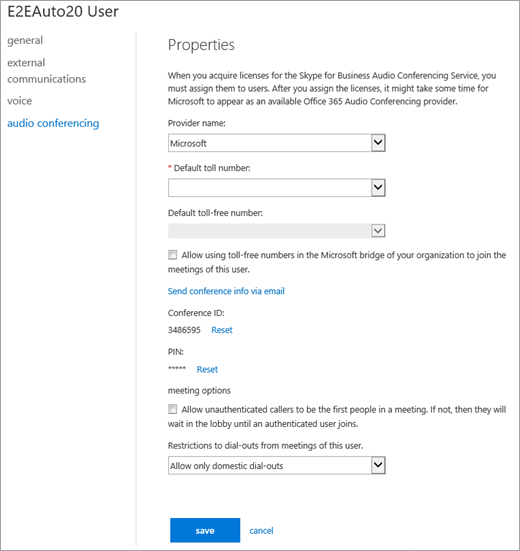

# 在線上管理使用者的音訊會議商務用 Skype設定

[!INCLUDE [sfbo-retirement](../../Hub/includes/sfbo-retirement.md)]

> [!Note]
> 如果您想要在 Microsoft Teams 中管理使用者設定，請參閱在 Microsoft Teams 中管理[使用者的音訊會議Microsoft Teams。](/MicrosoftTeams/manage-the-audio-conferencing-settings-for-a-user-in-teams)

作為Microsoft 365或Office 365，您可以為貴組織中個別使用者編輯音訊會議設定 ，例如提供者、預設付費或免付費號碼、會議 ID 或 PIN。 如果您想要編輯貴組織的設定，請參閱管理組織的音訊 [會議設定](manage-the-audio-conferencing-settings-for-my-organization.md)。

 
1. 使用公司或學校帳戶來登錄。
    
2. 選擇 **系統管理中心**  >  **商務用 Skype。**
    
3. 在系統管理商務用 Skype，**選擇使用者**。
    
4. 選取您想要管理設定的使用者，然後在 [動作窗格> 中，按一下 **[編輯**  。
    
5. 選擇 **左側流覽** 中的音訊會議，然後在使用者的屬性頁面上修改下列任何一項：
    
|**設定**|**描述**|
|:-----|:-----|
|**提供者名稱**   |從清單中選擇您的提供者。     **注意：** 只有在您選取 Microsoft 做為音訊會議提供者時，此表格中其餘的設定才適用。           |
|**需要的預設 (** 號碼)    |對於協力廠商提供者，這些電話號碼就是您從音訊會議提供者收到的號碼。 如果使用者使用 Microsoft 做為音訊會議提供者，這些號碼會設定在音訊會議橋接器上。 將數位格式化為您想要顯示在會議商務用 Skype Microsoft Teams中。    |
|**預設免付費號碼**   |對於協力廠商提供者，這些電話號碼就是您從音訊會議提供者收到的號碼。 如果使用者使用 Microsoft 做為音訊會議提供者，這些號碼會設定在音訊會議橋接器上。 將數位格式化為您想要顯示在會議商務用 Skype Microsoft Teams中。    |
|**在貴組織的 Microsoft 橋接器中允許使用免付費號碼加入此使用者的會議**   |如果您想要允許免付費號碼的使用者加入會議，請選取此選項。    |
|**透過電子郵件傳送會議資訊**   |只有在您想要立即傳送包含其會議 ID 和電話號碼的電子郵件給使用者時，才能按一下此連結。  (此電子郵件不包含 PIN。) 請參閱使用音訊會議資訊傳送 [電子郵件給使用者](send-an-email-to-a-user-with-their-dial-in-information.md)。    |
|**會議 ID**   |如果您需要 **重** 設使用者的會議 ID，請選取重設。 詳細資訊，請參閱重[設使用者的會議 ID。](reset-a-conference-id-for-a-user.md)    |
|**針**   |如果您需要 **重** 設使用者的 PIN，請選取重設。 詳細資訊，請參閱重設[音訊會議 PIN。](reset-the-audio-conferencing-pin.md)    |
|**允許未經驗證的來電者成為會議的第一位人員**   |選取此選項，讓未經驗證的來電者成為第一個加入會議的人。    |
|**此使用者會議撥出的限制**   |如果您想要將撥出功能限制為國內電話撥入，或您想要防止會議出現所有撥出，請在此清單中選取一個選項。    |
  

> [!Note]
> [!INCLUDE [updating-admin-interfaces](../includes/updating-admin-interfaces.md)]

## 相關主題

[管理組織的音訊會議設定](manage-the-audio-conferencing-settings-for-my-organization.md)

[音訊會議的常見問題](/MicrosoftTeams/audio-conferencing-common-questions)
