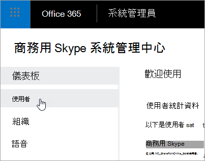

# <a name="set-the-phone-numbers-included-on-invites-in-skype-for-business-online"></a><span data-ttu-id="1688f-103">在線上中設定邀請商務用 Skype電話號碼</span><span class="sxs-lookup"><span data-stu-id="1688f-103">Set the phone numbers included on invites in Skype for Business Online</span></span>

[!INCLUDE [sfbo-retirement](../../Hub/includes/sfbo-retirement.md)]

> [!Note]
> <span data-ttu-id="1688f-104">有關會議邀請電話號碼Microsoft Teams，請參閱在 Microsoft Teams 中設定邀請[Microsoft Teams。](/MicrosoftTeams/set-the-phone-numbers-included-on-invites-in-teams)</span><span class="sxs-lookup"><span data-stu-id="1688f-104">For information about meeting invite phone numbers in Microsoft Teams, see [Set the phone numbers included on invites in Microsoft Teams](/MicrosoftTeams/set-the-phone-numbers-included-on-invites-in-teams).</span></span>

<span data-ttu-id="1688f-105">Microsoft 365或 Office 365中的音訊會議可讓貴組織的使用者商務用 Skype會議，然後允許使用者使用電話撥入這些會議。</span><span class="sxs-lookup"><span data-stu-id="1688f-105">Audio Conferencing in Microsoft 365 or Office 365 enables users in your organization to create Skype for Business meetings, and then allow users to dial in to those meetings using a phone.</span></span> <span data-ttu-id="1688f-106">在 Microsoft 365 和 Office 365 中，您可以選擇使用 Microsoft 音訊會議橋接器或由核准音訊會議提供者 (ACP) 託管的協力廠商音訊會議橋接器。</span><span class="sxs-lookup"><span data-stu-id="1688f-106">In Microsoft 365 and Office 365, you have the option of using a Microsoft audio conferencing bridge or a third-party audio conferencing bridge that is hosted by an approved audio conferencing provider (ACP).</span></span>
  
> [!NOTE]
> <span data-ttu-id="1688f-107">沒有任何資源會包含音訊會議的所有撥入號碼清單。</span><span class="sxs-lookup"><span data-stu-id="1688f-107">There isn't a resource that contains a listing of all of the dial-in numbers for Audio Conferencing.</span></span> <span data-ttu-id="1688f-108">如果您想要查看您的地區或國家/地區是否有可用的撥入電話號碼，請使用 商務用 Skype 系統管理中心的 **Voice** 電話 號碼，然後按一下 [新增服務  >    >  \*\*\*\*\*\*號碼\*\*> 。 </span><span class="sxs-lookup"><span data-stu-id="1688f-108">If you are looking to see if there are dial-in phone numbers available in your area or country/region, use the **Skype for Business admin center** > **Voice** > **Phone Numbers**, click **Add** then **New Service Numbers**.</span></span> <span data-ttu-id="1688f-109">使用國家/地區、省 **/** 市 **/** 區及縣/市的清單來篩選您的搜尋。>此外，如果您要尋找免付費服務號碼，請從州 **/** 地區清單中選取免付費。</span><span class="sxs-lookup"><span data-stu-id="1688f-109">Use the lists for **Country/Region**, **State/Region** and **City** to filter your search.> Also, if you are looking for toll free service numbers, select **Toll-Free** from the **State/Region** list.</span></span>
  
<span data-ttu-id="1688f-110">會議橋接器會提供您組織的一組撥入電話號碼。</span><span class="sxs-lookup"><span data-stu-id="1688f-110">A conferencing bridge gives you a set of dial-in phone numbers for your organization.</span></span> <span data-ttu-id="1688f-111">所有會議都可以用來加入會議召集人所建立的會議，但您可以選取哪些會議邀請會包含在會議邀請中。</span><span class="sxs-lookup"><span data-stu-id="1688f-111">All of them can be used to join the meetings that a meeting organizer has created, but you can select which ones will be included on their meeting invites.</span></span>
  
> [!NOTE]
> <span data-ttu-id="1688f-112">會議邀請的會議召集人最多可以有一個付費電話和一個免付費電話號碼，但每個會議邀請底部也有一個連結，可開啟可用來加入會議之所有撥入電話號碼的完整清單。</span><span class="sxs-lookup"><span data-stu-id="1688f-112">There can be a maximum of one toll and one toll-free phone number on the meeting invite for a meeting organizer, but there is also a link located at the bottom of each meeting invite that opens the full list of all dial-in phone numbers that can be used to join a meeting.</span></span> 

> [!NOTE]
> [!INCLUDE [updating-admin-interfaces](../includes/updating-admin-interfaces.md)]
  
## <a name="set-the-default-dial-in-phone-number-for-a-meeting-organizer"></a><span data-ttu-id="1688f-113">設定會議召集人的預設撥入電話號碼</span><span class="sxs-lookup"><span data-stu-id="1688f-113">Set the default dial-in phone number for a meeting organizer</span></span>

1. <span data-ttu-id="1688f-114">使用公司或學校帳戶來登錄。</span><span class="sxs-lookup"><span data-stu-id="1688f-114">Sign in with your work or school account.</span></span>
    
2. <span data-ttu-id="1688f-115">選擇 **系統管理中心**  >  **商務用 Skype。**</span><span class="sxs-lookup"><span data-stu-id="1688f-115">Choose **Admin centers** > **Skype for Business**.</span></span>
    
3. <span data-ttu-id="1688f-116">選擇 **使用者**。</span><span class="sxs-lookup"><span data-stu-id="1688f-116">Choose **Users**.</span></span>
    
    
  
4. <span data-ttu-id="1688f-118">選擇您想要編輯的使用者：</span><span class="sxs-lookup"><span data-stu-id="1688f-118">Choose the users you want to edit:</span></span>
    
   - <span data-ttu-id="1688f-119">若要選取單一使用者，請選取使用者的名稱。</span><span class="sxs-lookup"><span data-stu-id="1688f-119">To select a single user, select the user's name.</span></span>
    
   - <span data-ttu-id="1688f-120">若要選取頁面上的所有使用者，請選取清單頂端的顯示名稱旁的方塊。</span><span class="sxs-lookup"><span data-stu-id="1688f-120">To select all users on the page, select the box next to **Display name** at the top of the list.</span></span>
    
   - <span data-ttu-id="1688f-121">若要選取多個使用者，請選取每個使用者名稱旁的方塊。</span><span class="sxs-lookup"><span data-stu-id="1688f-121">To select multiple users, select the box next to each user's name.</span></span>
    
5. <span data-ttu-id="1688f-122">在右面板中 **，選擇編輯**。</span><span class="sxs-lookup"><span data-stu-id="1688f-122">In the right panel, choose **Edit**.</span></span>
    
    
  
6. <span data-ttu-id="1688f-124">選擇 **音訊會議**。</span><span class="sxs-lookup"><span data-stu-id="1688f-124">Choose **Audio conferencing**.</span></span>
    
7. <span data-ttu-id="1688f-125">在屬性 **頁面上** 的提供者 **名稱** 清單中，選擇使用者的提供者。</span><span class="sxs-lookup"><span data-stu-id="1688f-125">On the **Properties** page, in the **Provider name** list, choose the provider for the user.</span></span> <span data-ttu-id="1688f-126">根據提供者，完成下列框。</span><span class="sxs-lookup"><span data-stu-id="1688f-126">Depending on the provider, complete the following boxes.</span></span>
    
   - <span data-ttu-id="1688f-127">**Microsoft 是提供者**：使用 **預設** 付費號碼和預設免付費 **號碼** 清單來選取使用者的預設號碼。</span><span class="sxs-lookup"><span data-stu-id="1688f-127">**Microsoft is the provider**: Use the **Default toll number** and **Default toll-free number** lists to select the default numbers for the user.</span></span>
    
     > [!NOTE]
     > <span data-ttu-id="1688f-128">至少必須指派一個免付費號碼給會議橋接器，才能將其設定為使用者的預設免付費號碼。</span><span class="sxs-lookup"><span data-stu-id="1688f-128">At least one toll-free number must be assigned to your conferencing bridge before it can be set as the default toll-free number of a user.</span></span> <span data-ttu-id="1688f-129">若要取得免付費號碼，請參閱取得適用于 商務用 Skype 的服務[商務用 Skype。](/microsoftteams/getting-service-phone-numbers)</span><span class="sxs-lookup"><span data-stu-id="1688f-129">To get a toll-free number, see [Getting service phone numbers for Skype for Business](/microsoftteams/getting-service-phone-numbers).</span></span> 
  
   - <span data-ttu-id="1688f-130">**協力廠商是** 提供者：使用付費號碼和免付費 **號碼欄位** 來輸入使用者的數位。</span><span class="sxs-lookup"><span data-stu-id="1688f-130">**A third-party is the provider**: Use the **Toll number** and **Toll-free number** fields to enter the numbers for the user.</span></span>


## <a name="reset-audio-conferencing-phone-numbers"></a><span data-ttu-id="1688f-131">重設音訊會議電話號碼</span><span class="sxs-lookup"><span data-stu-id="1688f-131">Reset audio conferencing phone numbers</span></span>

1. <span data-ttu-id="1688f-132">在系統 **管理商務用 Skype，** 選擇 **音訊會議**。</span><span class="sxs-lookup"><span data-stu-id="1688f-132">In the **Skype for Business admin center**, choose **Audio conferencing**.</span></span>
    
2. <span data-ttu-id="1688f-133">在頁面頂端， **選擇使用者**。</span><span class="sxs-lookup"><span data-stu-id="1688f-133">At the top of the page, choose **Users**.</span></span>
    
3. <span data-ttu-id="1688f-134">選擇您想要重設的使用者，然後在 [動作窗格> 中，按一下 [ **清除**。</span><span class="sxs-lookup"><span data-stu-id="1688f-134">Choose the users you want to reset, and then in the Action pane, click **Clear**.</span></span>
    
<span data-ttu-id="1688f-135">根據預設，當您變更使用者的會議設定時，電子郵件會發送給使用者。</span><span class="sxs-lookup"><span data-stu-id="1688f-135">By default, when you change a user's conferencing settings, an email is sent to the user.</span></span> <span data-ttu-id="1688f-136">若要變更此設定，請參閱在音訊會議設定變更時啟用或 [停用傳送電子郵件](enable-or-disable-sending-emails-when-their-settings-change.md)。</span><span class="sxs-lookup"><span data-stu-id="1688f-136">To change this, see [Enable or disable sending emails when Audio Conferencing settings change](enable-or-disable-sending-emails-when-their-settings-change.md).</span></span>
  
> [!IMPORTANT]
> <span data-ttu-id="1688f-137">當您變更使用者的音訊會議設定時，週期性商務用 Skype會議必須更新併發送給出席者。</span><span class="sxs-lookup"><span data-stu-id="1688f-137">When you change a user's audio conferencing settings, recurring and future Skype for Business meetings must be updated and sent to attendees.</span></span> 
  
## <a name="want-to-know-how-to-manage-with-windows-powershell"></a><span data-ttu-id="1688f-138">想要瞭解如何使用 Windows PowerShell？</span><span class="sxs-lookup"><span data-stu-id="1688f-138">Want to know how to manage with Windows PowerShell?</span></span>

- <span data-ttu-id="1688f-139">若要節省時間或自動化這項功能，您可以使用 [Set-CsOnlineDialInConferencingUser](/powershell/module/skype/Set-CsOnlineDialInConferencingUser) Cmdlet。</span><span class="sxs-lookup"><span data-stu-id="1688f-139">To save time or automate this, you can use the [Set-CsOnlineDialInConferencingUser](/powershell/module/skype/Set-CsOnlineDialInConferencingUser) cmdlet.</span></span>
    
- <span data-ttu-id="1688f-140">使用 [Set-CsOnlineDialInConferencingUser](/powershell/module/skype/Set-CsOnlineDialInConferencingUser) Cmdlet 變更特定使用者的預設付費或免付費號碼。</span><span class="sxs-lookup"><span data-stu-id="1688f-140">Use the [Set-CsOnlineDialInConferencingUser](/powershell/module/skype/Set-CsOnlineDialInConferencingUser) cmdlet to change the default toll or toll-free number for specific users.</span></span>
    
    <span data-ttu-id="1688f-141">若要變更使用者的預設免付費號碼，請執行：</span><span class="sxs-lookup"><span data-stu-id="1688f-141">To change the default toll-free number for a user, run:</span></span>
    
  ```PowerShell
  Set-CsOnlineDialinConferencingUser -Identity amos.marble@Contoso.com -TollFreeServiceNumber   +180045551234
  ```

- <span data-ttu-id="1688f-142">使用 **Set-CsOnlineDialInConferencingUserDefaultNumber** Cmdlet，根據使用者的原始預設號碼或位置來變更預設的付費或免付費使用者數目。</span><span class="sxs-lookup"><span data-stu-id="1688f-142">Use the **Set-CsOnlineDialInConferencingUserDefaultNumber** cmdlet to change the default toll or toll-free number of users based on their original default number or their location.</span></span>
    
    > [!NOTE]
    > <span data-ttu-id="1688f-143">若要尋找 BridgeID，請使用 **Get-CsOnlineDialInConferencingBridge** Cmdlet。</span><span class="sxs-lookup"><span data-stu-id="1688f-143">To find the BridgeID, use the **Get-CsOnlineDialInConferencingBridge** cmdlet.</span></span>
  
  ```PowerShell
  Set-CsOnlineDialInConferencingUserDefaultNumber -FromNumber +18005551234 -ToNumber +18005551239 NumberType TollFree -BridgeId <Bridge Id> -RescheduleMeetings 
  ```

  - <span data-ttu-id="1688f-144">若要將所有使用者的預設免付費號碼設為 +18005551234，請執行：</span><span class="sxs-lookup"><span data-stu-id="1688f-144">To set the default toll-free number for all users without one to +18005551234, run:</span></span>
    
  ```PowerShell
  Set-CsOnlineDialInConferencingUserDefaultNumber -FromNumber $null -ToNumber +18005551234 -NumberType TollFree -BridgeId <Bridge Id>  
  ```

  - <span data-ttu-id="1688f-145">若要將具有 +18005551234 作為預設免付費號碼的所有使用者的預設免付費號碼變更為 +18005551239，請執行：</span><span class="sxs-lookup"><span data-stu-id="1688f-145">To change the default toll-free number of all users that have +18005551234 as their default toll-free number to +18005551239, run:</span></span>
    
  ```PowerShell
  Set-CsOnlineDialInConferencingUserDefaultNumber -FromNumber +18005551234 -ToNumber +18005551239 NumberType TollFree -BridgeId <Bridge Id>
  ```

  - <span data-ttu-id="1688f-146">若要將位於美國的所有使用者的預設免付費號碼設為 +18005551234，請執行：</span><span class="sxs-lookup"><span data-stu-id="1688f-146">To set the default toll-free number of all users located in the U.S. to +18005551234, run:</span></span>
    
  ```PowerShell
  Set-CsOnlineDialInConferencingUserDefaultNumber -Country US -ToNumber +18005551234 -NumberType TollFree -BridgeId <Bridge Id>
  ```
  ## <a name="want-to-learn-more-about-windows-powershell"></a><span data-ttu-id="1688f-147">想要深入瞭解Windows PowerShell？</span><span class="sxs-lookup"><span data-stu-id="1688f-147">Want to learn more about Windows PowerShell?</span></span>
- <span data-ttu-id="1688f-148">當要Windows PowerShell管理使用者，以及允許或不允許使用者執行哪些操作。</span><span class="sxs-lookup"><span data-stu-id="1688f-148">When it comes to Windows PowerShell is all about managing users and what users are allowed or not allowed to do.</span></span> <span data-ttu-id="1688f-149">有了Windows PowerShell，您可以使用單一Office 365管理商務用 Skype管理線上，當您有多個工作需要執行時，可以簡化您的日常工作。</span><span class="sxs-lookup"><span data-stu-id="1688f-149">With Windows PowerShell, you can manage Office 365 and Skype for Business Online using a single point of administration that can simplify your daily work, when you have multiple tasks to do.</span></span> <span data-ttu-id="1688f-150">若要開始使用Windows PowerShell，請參閱以下主題：</span><span class="sxs-lookup"><span data-stu-id="1688f-150">To get started with Windows PowerShell, see these topics:</span></span>
    
  - [<span data-ttu-id="1688f-151">Windows PowerShell 與 Lync Online 的簡介</span><span class="sxs-lookup"><span data-stu-id="1688f-151">An introduction to Windows PowerShell and Skype for Business Online</span></span>](../set-up-your-computer-for-windows-powershell/set-up-your-computer-for-windows-powershell.md)
    
  - [<span data-ttu-id="1688f-152">為什麼您需要使用 powerShell Microsoft 365 Office 365 PowerShell</span><span class="sxs-lookup"><span data-stu-id="1688f-152">Why you need to use Microsoft 365 or Office 365 PowerShell</span></span>](/microsoft-365/enterprise/why-you-need-to-use-microsoft-365-powershell)
    
- <span data-ttu-id="1688f-153">Windows PowerShell使用系統管理中心時，Microsoft 365在速度、簡易性及生產力方面有許多優點，例如當您一次對許多使用者進行設定變更時。</span><span class="sxs-lookup"><span data-stu-id="1688f-153">Windows PowerShell has many advantages in speed, simplicity, and productivity over only using the Microsoft 365 admin center such as when you are making setting changes for many users at one time.</span></span> <span data-ttu-id="1688f-154">請從下列主題瞭解這些優點：</span><span class="sxs-lookup"><span data-stu-id="1688f-154">Learn about these advantages in the following topics:</span></span>
    
  - <span data-ttu-id="1688f-155">[使用 Microsoft 365 管理Office 365或Windows PowerShell](/previous-versions//dn568025(v=technet.10))</span><span class="sxs-lookup"><span data-stu-id="1688f-155">[Best ways to manage Microsoft 365 or Office 365 with Windows PowerShell](/previous-versions//dn568025(v=technet.10))</span></span>
    
  - [<span data-ttu-id="1688f-156">使用 Windows PowerShell 管理 商務用 Skype Online</span><span class="sxs-lookup"><span data-stu-id="1688f-156">Using Windows PowerShell to manage Skype for Business Online</span></span>](../set-up-your-computer-for-windows-powershell/set-up-your-computer-for-windows-powershell.md)
    
  - [<span data-ttu-id="1688f-157">使用 Windows PowerShell 執行常見的線上商務用 Skype管理工作</span><span class="sxs-lookup"><span data-stu-id="1688f-157">Using Windows PowerShell to do common Skype for Business Online management tasks</span></span>](../set-up-your-computer-for-windows-powershell/set-up-your-computer-for-windows-powershell.md)
    
## <a name="related-topics"></a><span data-ttu-id="1688f-158">相關主題</span><span class="sxs-lookup"><span data-stu-id="1688f-158">Related topics</span></span>

[<span data-ttu-id="1688f-159">嘗試或購買音訊會議Microsoft 365或Office 365</span><span class="sxs-lookup"><span data-stu-id="1688f-159">Try or purchase Audio Conferencing in Microsoft 365 or Office 365</span></span>](../audio-conferencing-in-office-365/try-or-purchase-audio-conferencing-in-office-365.md)
