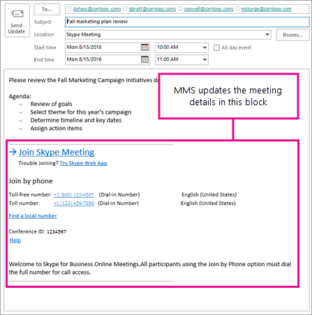

# <a name="using-the-meeting-migration-service-mms"></a><span data-ttu-id="bd206-104">使用會議遷移服務（MMS）</span><span class="sxs-lookup"><span data-stu-id="bd206-104">Using the Meeting Migration Service (MMS)</span></span>

<span data-ttu-id="bd206-105">會議遷移服務（MMS）是在下列案例中更新使用者現有會議的服務：</span><span class="sxs-lookup"><span data-stu-id="bd206-105">The Meeting Migration Service (MMS) is service that updates a user’s existing meetings in the following scenarios:</span></span>

- <span data-ttu-id="bd206-106">當使用者從內部部署到雲端時（無論是商務用 Skype Online 或 TeamsOnly）。</span><span class="sxs-lookup"><span data-stu-id="bd206-106">When a user is migrated from on-premises to the cloud (whether to Skype for Business Online or to TeamsOnly).</span></span>
- <span data-ttu-id="bd206-107">當系統管理員變更使用者的 [音訊會議] 設定時</span><span class="sxs-lookup"><span data-stu-id="bd206-107">When an admin makes a change to the user’s audio conferencing settings</span></span> 
- <span data-ttu-id="bd206-108">線上使用者只升級至小組，或 TeamsUpgradePolicy 中的使用者模式設定為 SfBwithTeamsCollabAndMeetings</span><span class="sxs-lookup"><span data-stu-id="bd206-108">When an online user is upgraded to Teams only, or when a user's mode in TeamsUpgradePolicy is set to SfBwithTeamsCollabAndMeetings</span></span>
- <span data-ttu-id="bd206-109">當您使用 PowerShell 時</span><span class="sxs-lookup"><span data-stu-id="bd206-109">When you use PowerShell</span></span> 


<span data-ttu-id="bd206-110">根據預設，雖然系統管理員可以在租使用者層級停用 MMS，但會在每個情況下自動觸發 MMS。</span><span class="sxs-lookup"><span data-stu-id="bd206-110">By default, MMS is automatically triggered in each of these cases, although admins can disable it at the tenant level.</span></span> <span data-ttu-id="bd206-111">此外，管理員可以使用 PowerShell Cmdlet 來針對特定使用者手動觸發會議遷移。</span><span class="sxs-lookup"><span data-stu-id="bd206-111">In addition, admins can use a PowerShell cmdlet to manually trigger meeting migration for a given user.</span></span>


<span data-ttu-id="bd206-112">**限制**：如果下列任何一項適用，則無法使用會議遷移服務：</span><span class="sxs-lookup"><span data-stu-id="bd206-112">**Limitations**: The meeting migration service can't be used if any of the following apply:</span></span>

- <span data-ttu-id="bd206-113">使用者的信箱託管于 Exchange 內部部署中。</span><span class="sxs-lookup"><span data-stu-id="bd206-113">The user’s mailbox is hosted in Exchange on-premises.</span></span>
- <span data-ttu-id="bd206-114">使用者正從雲端遷移到商務用 Skype Server 內部部署。</span><span class="sxs-lookup"><span data-stu-id="bd206-114">The user is being migrated from the cloud to Skype for Business Server on-premises.</span></span>

<span data-ttu-id="bd206-115">在這些情況下，最終使用者可以使用[會議遷移工具](https://www.microsoft.com/download/details.aspx?id=51659)來遷移自己的會議。</span><span class="sxs-lookup"><span data-stu-id="bd206-115">In these situations, end users can use the [Meeting Migration Tool](https://www.microsoft.com/download/details.aspx?id=51659) to migrate their own meetings instead.</span></span>

## <a name="how-mms-works"></a><span data-ttu-id="bd206-116">彩信的運作方式</span><span class="sxs-lookup"><span data-stu-id="bd206-116">How MMS works</span></span>

<span data-ttu-id="bd206-117">針對特定使用者觸發 MMS 時，該使用者的遷移要求會放在佇列中。</span><span class="sxs-lookup"><span data-stu-id="bd206-117">When MMS is triggered for a given user, a migration request for that user is placed in a queue.</span></span> <span data-ttu-id="bd206-118">若要避免任何爭用情況，必須在至少90分鐘之後，才會有意處理排隊的要求。</span><span class="sxs-lookup"><span data-stu-id="bd206-118">To avoid any race conditions, the queued request is deliberately not processed until at least 90 minutes have gone by.</span></span> <span data-ttu-id="bd206-119">當 MMS 處理要求之後，它會執行下列任務：</span><span class="sxs-lookup"><span data-stu-id="bd206-119">Once MMS processes the request, it performs the following tasks:</span></span>

1. <span data-ttu-id="bd206-120">它會在該使用者的信箱中搜尋該使用者所組織的所有現有會議，並在將來進行排程。</span><span class="sxs-lookup"><span data-stu-id="bd206-120">It searches that user’s mailbox for all existing meetings organized by that user and scheduled in the future.</span></span>
2. <span data-ttu-id="bd206-121">根據使用者信箱中的資訊，在小組或商務用 Skype Online 中，您可以根據確切的案例，更新或排程新的會議。</span><span class="sxs-lookup"><span data-stu-id="bd206-121">Based on the information found in the user’s mailbox, it either updates or schedules new meetings in either Teams or Skype for Business Online for that user, depending on the exact scenario.</span></span>
3. <span data-ttu-id="bd206-122">在電子郵件訊息中，它會取代會議詳細資料中的 [線上會議] 封鎖。</span><span class="sxs-lookup"><span data-stu-id="bd206-122">In the email message, it replaces the online meeting block in the meeting details.</span></span>
4. <span data-ttu-id="bd206-123">它會代表會議召集人傳送該會議的更新版本給所有會議收件者。</span><span class="sxs-lookup"><span data-stu-id="bd206-123">It sends the updated version of that meeting to all meeting recipients on behalf of the meeting organizer.</span></span> <span data-ttu-id="bd206-124">會議受邀者會收到會議更新，且其電子郵件中有更新的會議座標。</span><span class="sxs-lookup"><span data-stu-id="bd206-124">Meeting invitees will receive a meeting update with updated meeting coordinates in their email.</span></span> 

    

<span data-ttu-id="bd206-126">從 MMS 觸發時，通常會花大約2小時的時間，直到使用者的會議被遷移為止。</span><span class="sxs-lookup"><span data-stu-id="bd206-126">From the time MMS is triggered, it typically takes about 2 hours until the user’s meetings are migrated.</span></span> <span data-ttu-id="bd206-127">不過，如果使用者有許多會議，可能需要較長的時間。</span><span class="sxs-lookup"><span data-stu-id="bd206-127">However, if the user has a large number of meetings, it might take longer.</span></span> <span data-ttu-id="bd206-128">如果 MMS 在針對使用者遷移一或多個會議時遇到錯誤，系統會在24小時內定期重試最多9次。</span><span class="sxs-lookup"><span data-stu-id="bd206-128">If MMS encounters an error migrating one or more meetings for the user, it will periodically retry up to 9 times over the span of 24 hours.</span></span>

<span data-ttu-id="bd206-129">**附注**：</span><span class="sxs-lookup"><span data-stu-id="bd206-129">**Notes**:</span></span>

- <span data-ttu-id="bd206-130">當您遷移會議時，MMS 會取代線上會議資訊區塊中的所有專案。</span><span class="sxs-lookup"><span data-stu-id="bd206-130">MMS replaces everything in the online meeting information block when a meeting is migrated.</span></span> <span data-ttu-id="bd206-131">因此，如果使用者已編輯該區塊，就會覆寫他們的變更。</span><span class="sxs-lookup"><span data-stu-id="bd206-131">Therefore, if a user has edited that block, their changes will be overwritten.</span></span> <span data-ttu-id="bd206-132">他們在線上會議資訊區塊以外的會議詳細資料中所擁有的任何內容不會受到影響。</span><span class="sxs-lookup"><span data-stu-id="bd206-132">Any content they have in the meeting details outside of the online meeting information block won't be affected.</span></span>
- <span data-ttu-id="bd206-133">只要按一下 Outlook 網頁版中的 [**新增 skype 會議**] 按鈕，或使用 Outlook 的 skype 會議增益集，就能遷移已排程的商務用 Skype 或 Microsoft 團隊會議。</span><span class="sxs-lookup"><span data-stu-id="bd206-133">Only the Skype for Business or Microsoft Teams meetings that were scheduled by clicking the **Add Skype meeting** button in Outlook on the Web or by using the Skype Meeting add-in for Outlook are migrated.</span></span> <span data-ttu-id="bd206-134">如果使用者將 Skype online 會議資訊從一個會議複製並貼到新的會議中，新的會議將無法更新，因為原始服務中沒有會議。</span><span class="sxs-lookup"><span data-stu-id="bd206-134">If a user copies and pastes the Skype online meeting information from one meeting to a new meeting, that new meeting won't be updated since there is no meeting in the original service.</span></span>
- <span data-ttu-id="bd206-135">已建立或附加至會議的會議內容（白板、投票等）不會在 MMS 執行後保留。</span><span class="sxs-lookup"><span data-stu-id="bd206-135">Meeting content that was created or attached to the meeting (whiteboards, polls, and so on) won't be retained after MMS runs.</span></span> <span data-ttu-id="bd206-136">如果您的會議召集人已提前將內容附加到會議，則在 MMS 執行之後，就必須重新建立內容。</span><span class="sxs-lookup"><span data-stu-id="bd206-136">If your meeting organizers have attached content to the meetings in advance, the content will need to be recreated after MMS runs.</span></span>
- <span data-ttu-id="bd206-137">[行事曆] 專案中的共用會議筆記連結以及來自 Skype 會議的連結也會覆寫。</span><span class="sxs-lookup"><span data-stu-id="bd206-137">The link to the shared meeting notes in the calendar item and also from within the Skype meeting also will be overwritten.</span></span> <span data-ttu-id="bd206-138">請注意，儲存在 OneNote 中的實際會議筆記仍會保留在其中;只會覆蓋共用筆記的連結。</span><span class="sxs-lookup"><span data-stu-id="bd206-138">Note that the actual meeting notes stored in OneNote will still be there; it is only the link to the shared notes that is overwritten.</span></span>
- <span data-ttu-id="bd206-139">超過250個出席者（包括召集人）的會議將不會被遷移。</span><span class="sxs-lookup"><span data-stu-id="bd206-139">Meetings with more than 250 attendees (including the organizer) won't be migrated.</span></span>
- <span data-ttu-id="bd206-140">邀請內文中的部分 UNICODE 字元可能會不正確地更新為下列其中一個特殊字元：ï、¿、1/2。</span><span class="sxs-lookup"><span data-stu-id="bd206-140">Some UNICODE characters in the body of the invite might be incorrectly updated to one of the following special characters: ï, ¿, ½, �.</span></span>

## <a name="triggering-mms-for-a-user"></a><span data-ttu-id="bd206-141">觸發彩信給使用者</span><span class="sxs-lookup"><span data-stu-id="bd206-141">Triggering MMS for a user</span></span>

<span data-ttu-id="bd206-142">本節說明當您在下列每個情況下會觸發 MMS 時，會發生什麼情況：</span><span class="sxs-lookup"><span data-stu-id="bd206-142">This section describes what happens when MMS is triggered in each of the following cases:</span></span>

- <span data-ttu-id="bd206-143">當使用者從內部部署遷移到雲端時</span><span class="sxs-lookup"><span data-stu-id="bd206-143">When a user is migrated from on-premises to the cloud</span></span>
- <span data-ttu-id="bd206-144">當系統管理員變更使用者的 [音訊會議] 設定時</span><span class="sxs-lookup"><span data-stu-id="bd206-144">When an admin makes a change to the user’s audio conferencing settings</span></span> 
- <span data-ttu-id="bd206-145">當 TeamsUpgradePolicy 中的使用者模式設定為 TeamsOnly 或 SfBWithTeamsCollabAndMeetings 時（使用 Powershell 或團隊管理入口網站）</span><span class="sxs-lookup"><span data-stu-id="bd206-145">When the user's mode in TeamsUpgradePolicy is set to either TeamsOnly or SfBWithTeamsCollabAndMeetings (using either Powershell or the Teams Admin Portal)</span></span>
- <span data-ttu-id="bd206-146">當您使用 PowerShell Cmdlet 時，啟動-CsExMeetingMigration</span><span class="sxs-lookup"><span data-stu-id="bd206-146">When you use the PowerShell cmdlet, Start-CsExMeetingMigration</span></span>

### <a name="updating-meetings-when-you-move-an-on-premises-user-to-the-cloud"></a><span data-ttu-id="bd206-147">當您將內部部署使用者移至雲端時更新會議</span><span class="sxs-lookup"><span data-stu-id="bd206-147">Updating meetings when you move an on-premises user to the cloud</span></span>

<span data-ttu-id="bd206-148">這是最常見的情況，在這種情況下，MMS 可協助為您的使用者建立更順暢的轉場</span><span class="sxs-lookup"><span data-stu-id="bd206-148">This is the most common scenario where MMS helps create a smoother transition for your users.</span></span> <span data-ttu-id="bd206-149">若沒有會議遷移，當使用者在線上移動時，在商務用 Skype Server 內部網路中由使用者組織的現有會議將無法再運作。</span><span class="sxs-lookup"><span data-stu-id="bd206-149">Without meeting migration, existing meetings organized by a user in Skype for Business Server on-premises would no longer work once the user is moved online.</span></span> <span data-ttu-id="bd206-150">因此，當您使用內部部署系統管理工具（ `Move-CsUser`或 [系統管理] 控制台）將使用者移至雲端時，現有的會議會自動移至雲端，如下所示：</span><span class="sxs-lookup"><span data-stu-id="bd206-150">Therefore, when you use the on-premises admin tools (either `Move-CsUser` or the Admin Control Panel) to move a user to the cloud, existing meetings are automatically moved to the cloud as follows:</span></span>

- <span data-ttu-id="bd206-151">如果指定`MoveToTeams`了 [ `Move-CsUser`切換]，會議會直接遷移至 [小組]，而使用者將處於 TeamsOnly 模式。</span><span class="sxs-lookup"><span data-stu-id="bd206-151">If the `MoveToTeams` switch in `Move-CsUser` is specified, meetings are migrated directly to Teams and the user will be in TeamsOnly mode.</span></span> <span data-ttu-id="bd206-152">使用此開關需要使用商務用 Skype Server 2015 搭配 CU8 或更新版本。</span><span class="sxs-lookup"><span data-stu-id="bd206-152">Use of this switch requires Skype for Business Server 2015 with CU8 or later.</span></span> <span data-ttu-id="bd206-153">這些使用者仍然可以使用商務用 Skype 用戶端或 Skype 會議應用程式，加入他們可能受邀的任何商務用 Skype 會議。</span><span class="sxs-lookup"><span data-stu-id="bd206-153">These users can still join any Skype for Business meeting they may be invited to, using either the Skype for Business client or the Skype Meeting App.</span></span>
- <span data-ttu-id="bd206-154">否則，會議會遷移到商務用 Skype Online。</span><span class="sxs-lookup"><span data-stu-id="bd206-154">Otherwise meetings are migrated to Skype for Business Online.</span></span>

<span data-ttu-id="bd206-155">在任何一種情況下，如果使用者已獲指派音訊會議授權，然後才移至雲端，則會使用撥入座標建立會議。</span><span class="sxs-lookup"><span data-stu-id="bd206-155">In either case, if the user has been assigned an Audio Conferencing license before being moved to the cloud, the meetings will be created with dial-in coordinates.</span></span> <span data-ttu-id="bd206-156">如果您將使用者從內部部署移至雲端，而您想要讓該使用者使用音訊會議，建議您先指派音訊會議，然後才會觸發1個會議遷移。</span><span class="sxs-lookup"><span data-stu-id="bd206-156">If you move a user from on-premises to the cloud and you intend for that user to use Audio Conferencing, we recommend that you first assign the audio conference before you move the user so that only 1 meeting migration is triggered.</span></span>


### <a name="updating-meetings-when-a-users-audio-conferencing-settings-change"></a><span data-ttu-id="bd206-157">在使用者的音訊會議設定變更時更新會議</span><span class="sxs-lookup"><span data-stu-id="bd206-157">Updating meetings when a user's audio conferencing settings change</span></span>

<span data-ttu-id="bd206-158">在下列情況下，MMS 會更新現有的商務用 Skype 和 Microsoft 團隊會議，以新增、移除或修改撥入座標：</span><span class="sxs-lookup"><span data-stu-id="bd206-158">In the following cases, MMS will update existing Skype for Business and Microsoft Teams meetings to add, remove, or modify dial-in coordinates:</span></span>

- <span data-ttu-id="bd206-159">當您指派或移除 Microsoft 音訊會議服務授權給使用者時，該使用者並未啟用協力廠商音訊會議提供者。</span><span class="sxs-lookup"><span data-stu-id="bd206-159">When you assign or remove a Microsoft Audio Conferencing service license to a user, and that user is not enabled for a third-party audio conferencing provider.</span></span>
- <span data-ttu-id="bd206-160">當您將使用者的音訊會議提供者從任何其他提供者變更為 Microsoft 時，前提是該使用者已獲指派 Microsoft 音訊會議授權。</span><span class="sxs-lookup"><span data-stu-id="bd206-160">When you change the audio conferencing provider of a user from any other provider to Microsoft, provided the user is assigned a Microsoft Audio Conferencing license.</span></span> <span data-ttu-id="bd206-161">如需詳細資訊，請參閱[將 Microsoft 指派為音訊會議提供者](https://docs.microsoft.com/skypeforbusiness/audio-conferencing-in-office-365/assign-microsoft-as-the-audio-conferencing-provider)。</span><span class="sxs-lookup"><span data-stu-id="bd206-161">For more information, see [Assign Microsoft as the audio conferencing provider](https://docs.microsoft.com/skypeforbusiness/audio-conferencing-in-office-365/assign-microsoft-as-the-audio-conferencing-provider).</span></span> <span data-ttu-id="bd206-162">另請注意，對於協力廠商音訊會議提供者 [ACP] 的支援，在2019年4月1日（如前所述）[推出](https://docs.microsoft.com/skypeforbusiness/legal-and-regulatory/end-of-integration-with-3rd-party-providers)。</span><span class="sxs-lookup"><span data-stu-id="bd206-162">Also note that support for third party audio conferencing providers [ACP] is scheduled for end of life on April 1, 2019, as [previously announced](https://docs.microsoft.com/skypeforbusiness/legal-and-regulatory/end-of-integration-with-3rd-party-providers).</span></span>
- <span data-ttu-id="bd206-163">當您啟用或停用使用者的音訊會議時。</span><span class="sxs-lookup"><span data-stu-id="bd206-163">When you enable or disable audio conferencing for a user.</span></span>
- <span data-ttu-id="bd206-164">變更或重設已設定為使用公用會議之使用者的會議 ID。</span><span class="sxs-lookup"><span data-stu-id="bd206-164">When you change or reset the conference ID for a user configured to use public meetings.</span></span>
- <span data-ttu-id="bd206-165">當您將使用者移至新的音訊會議橋接器時。</span><span class="sxs-lookup"><span data-stu-id="bd206-165">When you move the user to a new audio conferencing bridge.</span></span>
- <span data-ttu-id="bd206-166">從音訊會議橋中取消指派電話號碼時。</span><span class="sxs-lookup"><span data-stu-id="bd206-166">When a phone number from a audio conferencing bridge is unassigned.</span></span> <span data-ttu-id="bd206-167">這是一個需要額外步驟的複雜情況。</span><span class="sxs-lookup"><span data-stu-id="bd206-167">This is a complex scenario that requires additional steps.</span></span> <span data-ttu-id="bd206-168">如需詳細資訊，請參閱[在音訊會議橋中變更電話號碼](https://docs.microsoft.com/MicrosoftTeams/change-the-phone-numbers-on-your-audio-conferencing-bridge)。</span><span class="sxs-lookup"><span data-stu-id="bd206-168">For more information, see [Change the phone numbers on your audio conferencing bridge](https://docs.microsoft.com/MicrosoftTeams/change-the-phone-numbers-on-your-audio-conferencing-bridge).</span></span>

<span data-ttu-id="bd206-169">並非對使用者的音訊會議設定所做的所有變更都會觸發 MMS。</span><span class="sxs-lookup"><span data-stu-id="bd206-169">Not all changes to a user's audio conferencing settings trigger MMS.</span></span> <span data-ttu-id="bd206-170">具體說來，下列兩項變更不會導致 MMS 更新會議：</span><span class="sxs-lookup"><span data-stu-id="bd206-170">Specifically, the following two changes won't result in MMS updating meetings:</span></span>

- <span data-ttu-id="bd206-171">當您變更會議召集人的 SIP 位址時（即其 SIP 使用者名稱或 SIP 網域）</span><span class="sxs-lookup"><span data-stu-id="bd206-171">When you change the SIP address for the meeting organizer (either their SIP user name or their SIP domain)</span></span>
- <span data-ttu-id="bd206-172">當您使用`Update-CsTenantMeetingUrl`命令變更組織的會議 URL 時。</span><span class="sxs-lookup"><span data-stu-id="bd206-172">When you change your organization's meeting URL using the `Update-CsTenantMeetingUrl` command.</span></span>


### <a name="updating-meetings-when-assigning-teamsupgradepolicy"></a><span data-ttu-id="bd206-173">指派 TeamsUpgradePolicy 時更新會議</span><span class="sxs-lookup"><span data-stu-id="bd206-173">Updating meetings when assigning TeamsUpgradePolicy</span></span>

<span data-ttu-id="bd206-174">根據預設，當使用者被授`TeamsUpgradePolicy`與`mode=TeamsOnly`或`mode= SfBWithTeamsCollabAndMeetings`的情況下，系統會自動觸發會議遷移。</span><span class="sxs-lookup"><span data-stu-id="bd206-174">By default, meeting migration is automatically triggered when a user is granted an instance of `TeamsUpgradePolicy` with `mode=TeamsOnly` or `mode= SfBWithTeamsCollabAndMeetings`.</span></span> <span data-ttu-id="bd206-175">如果您不想要在授與授與會議中的任何一種模式`MigrateMeetingsToTeams $false`時`Grant-CsTeamsUpgradePolicy`遷移會議，請指定 In （如果使用 PowerShell）或取消核取在設定使用者的共存模式時（如果使用 [團隊管理員入口網站]）來遷移會議的方塊。</span><span class="sxs-lookup"><span data-stu-id="bd206-175">If you do not want to migrate meetings when granting either of these modes, then specify `MigrateMeetingsToTeams $false` in `Grant-CsTeamsUpgradePolicy` (if using PowerShell) or uncheck the box to migrate meetings when setting a user's coexistence mode (if using the Teams admin portal).</span></span>

<span data-ttu-id="bd206-176">另請注意下列事項：</span><span class="sxs-lookup"><span data-stu-id="bd206-176">Also note the following:</span></span>

- <span data-ttu-id="bd206-177">只有在您授`TeamsUpgradePolicy`與特定使用者時，才會呼叫會議轉移。</span><span class="sxs-lookup"><span data-stu-id="bd206-177">Meeting migration is only invoked when you grant `TeamsUpgradePolicy` for a specific user.</span></span> <span data-ttu-id="bd206-178">如果您是`TeamsUpgradePolicy`在`mode=TeamsOnly` `mode=SfBWithTeamsCollabAndMeetings` *整個租*使用者處授與，則不會呼叫會議遷移。</span><span class="sxs-lookup"><span data-stu-id="bd206-178">If you grant `TeamsUpgradePolicy` with `mode=TeamsOnly` or `mode=SfBWithTeamsCollabAndMeetings` on a *tenant-wide* basis, meeting migration is not invoked.</span></span>
- <span data-ttu-id="bd206-179">如果使用者是在線上，則只能將 TeamsOnly 模式授與使用者。</span><span class="sxs-lookup"><span data-stu-id="bd206-179">A user can only be granted TeamsOnly mode if the user is homed online.</span></span> <span data-ttu-id="bd206-180">您必須使用`Move-CsUser`前面所述的方式來移動駐留內部部署的使用者。</span><span class="sxs-lookup"><span data-stu-id="bd206-180">Users that are homed on-premises must be moved using `Move-CsUser` as previously described.</span></span>
- <span data-ttu-id="bd206-181">授與 TeamsOnly 或 SfBWithTeamsCollabAndMeetings 以外的模式，不會將現有的團隊會議轉換成商務用 Skype 會議。</span><span class="sxs-lookup"><span data-stu-id="bd206-181">Granting a mode other than TeamsOnly or SfBWithTeamsCollabAndMeetings does not convert existing Teams meetings to Skype for Business meetings.</span></span>

### <a name="trigger-meeting-migration-manually-via-powershell-cmdlet"></a><span data-ttu-id="bd206-182">透過 PowerShell Cmdlet 手動觸發會議遷移</span><span class="sxs-lookup"><span data-stu-id="bd206-182">Trigger Meeting Migration manually via PowerShell cmdlet</span></span>

<span data-ttu-id="bd206-183">除了自動會議遷移之外，系統管理員還可以執行 Cmdlet `Start-CsExMeetingMigration`，手動觸發使用者的會議遷移。</span><span class="sxs-lookup"><span data-stu-id="bd206-183">In addition to automatic meeting migrations, admins can manually trigger meeting migration for a user by running the cmdlet `Start-CsExMeetingMigration`.</span></span> <span data-ttu-id="bd206-184">這個 Cmdlet 會將指定使用者的遷移要求排隊。</span><span class="sxs-lookup"><span data-stu-id="bd206-184">This cmdlet queues a migration request for the specified user.</span></span>  <span data-ttu-id="bd206-185">除了所需`Identity`的參數之外，它還會採用兩個`SourceMeetingType`選擇性`TargetMeetingType`參數，讓您指定如何遷移會議：</span><span class="sxs-lookup"><span data-stu-id="bd206-185">In addition to the required `Identity` parameter, it takes two optional parameters, `SourceMeetingType` and `TargetMeetingType`, which allow you to specify how to migrate meetings:</span></span>

<span data-ttu-id="bd206-186">**TargetMeetingType:**</span><span class="sxs-lookup"><span data-stu-id="bd206-186">**TargetMeetingType:**</span></span>

- <span data-ttu-id="bd206-187">使用`TargetMeetingType Current` [指定商務用 skype 會議] 會維持商務用 skype 會議，而團隊會議仍保持團隊會議。</span><span class="sxs-lookup"><span data-stu-id="bd206-187">Using `TargetMeetingType Current` specifies that Skype for Business meetings remain Skype for Business meetings and Teams meetings remain Teams meetings.</span></span> <span data-ttu-id="bd206-188">不過音訊會議座標可能會變更，且任何內部部署商務用 Skype 會議都會遷移到商務用 Skype Online。</span><span class="sxs-lookup"><span data-stu-id="bd206-188">However audio conferencing coordinates might be changed, and any on-premises Skype for Business meetings would be migrated to Skype for Business Online.</span></span> <span data-ttu-id="bd206-189">這是 TargetMeetingType 的預設值。</span><span class="sxs-lookup"><span data-stu-id="bd206-189">This is the default value for TargetMeetingType.</span></span>
- <span data-ttu-id="bd206-190">使用`TargetMeetingType Teams` [指定無論是否要在商務用 Skype online 或內部部署] 中託管會議，無論是否需要進行任何音訊會議更新，都必須將任何現有的會議遷移至團隊。</span><span class="sxs-lookup"><span data-stu-id="bd206-190">Using `TargetMeetingType Teams` specifies that any existing meeting must be migrated to Teams, regardless of whether the meeting is hosted in Skype for Business online or on-premises, and regardless of whether any audio conferencing updates are required.</span></span> 

<span data-ttu-id="bd206-191">**SourceMeetingType:**</span><span class="sxs-lookup"><span data-stu-id="bd206-191">**SourceMeetingType:**</span></span>
- <span data-ttu-id="bd206-192">[ `SourceMeetingType SfB`使用] 表示只需要更新商務用 Skype 會議（無論是內部部署或線上）。</span><span class="sxs-lookup"><span data-stu-id="bd206-192">Using `SourceMeetingType SfB` indicates that only Skype for Business meetings (whether on-premises or online) should be updated.</span></span>
- <span data-ttu-id="bd206-193">[ `SourceMeetingType Teams`使用] 表示只應更新團隊會議。</span><span class="sxs-lookup"><span data-stu-id="bd206-193">Using `SourceMeetingType Teams` indicates that only Teams meetings should be updated.</span></span>
- <span data-ttu-id="bd206-194">使用`SourceMeetingType All`指示必須更新商務用 Skype 會議和團隊會議。</span><span class="sxs-lookup"><span data-stu-id="bd206-194">Using `SourceMeetingType All` indicates that both Skype for Business meetings and Teams meetings should be updated.</span></span> <span data-ttu-id="bd206-195">這是 SourceMeetingType 的預設值。</span><span class="sxs-lookup"><span data-stu-id="bd206-195">This is the default value for SourceMeetingType.</span></span>
    

<span data-ttu-id="bd206-196">下列範例示範如何為使用者 ashaw@contoso.com 啟動會議遷移，以便將所有會議都遷移至團隊：</span><span class="sxs-lookup"><span data-stu-id="bd206-196">The example below shows how to initiate meeting migration for user ashaw@contoso.com so that all meetings are migrated to Teams:</span></span>

```PowerShell
Start-CsExMeetingMigration -Identity ashaw@contoso.com -TargetMeetingType Teams
```


## <a name="managing-mms"></a><span data-ttu-id="bd206-197">管理 MMS</span><span class="sxs-lookup"><span data-stu-id="bd206-197">Managing MMS</span></span>

<span data-ttu-id="bd206-198">使用 Windows PowerShell，您可以檢查正在進行的遷移狀態、手動觸發會議遷移，以及完全停用遷移。</span><span class="sxs-lookup"><span data-stu-id="bd206-198">Using Windows PowerShell, you can check the status of ongoing migrations, manually trigger meeting migration, and disable migration altogether.</span></span> 

### <a name="check-the-status-of-meeting-migrations"></a><span data-ttu-id="bd206-199">檢查會議遷移的狀態</span><span class="sxs-lookup"><span data-stu-id="bd206-199">Check the status of meeting migrations</span></span>

<span data-ttu-id="bd206-200">您可以使用`Get-CsMeetingMigrationStatus` Cmdlet 來檢查會議遷移的狀態。</span><span class="sxs-lookup"><span data-stu-id="bd206-200">You use the `Get-CsMeetingMigrationStatus` cmdlet to check the status of meeting migrations.</span></span> <span data-ttu-id="bd206-201">以下是一些範例。</span><span class="sxs-lookup"><span data-stu-id="bd206-201">Below are some examples.</span></span>

- <span data-ttu-id="bd206-202">若要取得所有 MMS 遷移的摘要狀態，請執行下列命令，以提供所有遷移狀態的表格式視圖：</span><span class="sxs-lookup"><span data-stu-id="bd206-202">To get a summary status of all MMS migrations, run the following command which provides a tabular view of all migration states:</span></span>

    ```PowerShell
    Get-CsMeetingMigrationStatus -SummaryOnly

    State      UserCount
    ------     ---------
    Pending      21
    InProgress    6
    Failed            2 
    Succeeded   131
    ```
- <span data-ttu-id="bd206-203">若要取得特定時段內所有遷移的完整詳細資料，請使用`StartTime` and `EndTime`參數。</span><span class="sxs-lookup"><span data-stu-id="bd206-203">To get full details of all migrations within a specific time period, use the `StartTime` and `EndTime` parameters.</span></span> <span data-ttu-id="bd206-204">例如，下列命令會傳回從2018年10月1日到2018年10月8日的所有遷移所產生的完整詳細資料。</span><span class="sxs-lookup"><span data-stu-id="bd206-204">For example, the following command will return full details on all migrations that occurred from October 1, 2018 to October 8, 2018.</span></span>

    ```PowerShell
    Get-CsMeetingMigrationStatus -StartTime "10/1/2018" -EndTime "10/8/2018"
    ```
- <span data-ttu-id="bd206-205">若要查看特定使用者的遷移狀態，請使用`Identity`參數。</span><span class="sxs-lookup"><span data-stu-id="bd206-205">To check the status of migration for a specific user, use the `Identity` parameter.</span></span> <span data-ttu-id="bd206-206">例如，下列命令會傳回使用者 ashaw@contoso.com 的狀態：</span><span class="sxs-lookup"><span data-stu-id="bd206-206">For example, the following command will return the status for the user ashaw@contoso.com:</span></span>

    ```PowerShell
    Get-CsMeetingMigrationStatus -Identity ashaw@contoso.com
    ```
<span data-ttu-id="bd206-207">如果您看到任何失敗的遷移，請採取動作來儘快解決這些問題，因為使用者不能撥入由這些使用者組織的會議，直到您解決它們為止。</span><span class="sxs-lookup"><span data-stu-id="bd206-207">If you see any migrations that have failed, take action to resolve these issues as soon as possible, since people won't be able to dial-in to the meetings organized by those users until you resolve them.</span></span> <span data-ttu-id="bd206-208">如果`Get-CsMeetingMigrationStatus`顯示在失敗狀態中的任何遷移，請執行下列步驟：</span><span class="sxs-lookup"><span data-stu-id="bd206-208">If `Get-CsMeetingMigrationStatus` shows any migrations in a failed state, perform these steps:</span></span>
 
1. <span data-ttu-id="bd206-209">判斷哪些使用者受到影響。</span><span class="sxs-lookup"><span data-stu-id="bd206-209">Determine which users are affected.</span></span> <span data-ttu-id="bd206-210">執行下列命令以取得受影響的使用者清單，以及所報告的特定錯誤：</span><span class="sxs-lookup"><span data-stu-id="bd206-210">Run the following command to get the list of affected users, and the specific error that was reported:</span></span>

    ```PowerShell
    Get-CsMeetingMigrationStatus| Where {$_.State -eq "Failed"}| Format-Table UserPrincipalName, LastMessage
    ```
2. <span data-ttu-id="bd206-211">針對每個受影響的使用者，請執行會議遷移工具以手動遷移其會議。</span><span class="sxs-lookup"><span data-stu-id="bd206-211">For each affected user, run the Meeting Migration Tool to manually migrate their meetings.</span></span>

3. <span data-ttu-id="bd206-212">如果遷移仍無法與會議遷移工具搭配使用，您有兩個選項：</span><span class="sxs-lookup"><span data-stu-id="bd206-212">If migration still doesn't work with the Meeting Migration Tool, you have two options:</span></span>

    - <span data-ttu-id="bd206-213">讓使用者建立新的 Skype 會議。</span><span class="sxs-lookup"><span data-stu-id="bd206-213">Have the users create new Skype meetings.</span></span>
    - <span data-ttu-id="bd206-214">[聯絡支援人員](https://go.microsoft.com/fwlink/p/?LinkID=518322)。</span><span class="sxs-lookup"><span data-stu-id="bd206-214">[Contact support](https://go.microsoft.com/fwlink/p/?LinkID=518322).</span></span>


### <a name="enabling-and-disabling-mms"></a><span data-ttu-id="bd206-215">啟用及停用彩信</span><span class="sxs-lookup"><span data-stu-id="bd206-215">Enabling and disabling MMS</span></span>

<span data-ttu-id="bd206-216">預設會為所有組織啟用 MMS，但您可以將它停用，如下所示：</span><span class="sxs-lookup"><span data-stu-id="bd206-216">MMS is enabled by default for all organizations, but it can be disabled as follows:</span></span>

- <span data-ttu-id="bd206-217">完全停用租使用者。</span><span class="sxs-lookup"><span data-stu-id="bd206-217">Disable entirely for the tenant.</span></span> 
- <span data-ttu-id="bd206-218">僅針對與音訊會議相關的變更停用。</span><span class="sxs-lookup"><span data-stu-id="bd206-218">Disable only for changes related to audio conferencing.</span></span> <span data-ttu-id="bd206-219">在這種情況下，當使用者從內部部署到雲端時，或是當您在中`TeamsUpgradePolicy`授與 TeamsOnly 模式或 SfBWithTeamsCollabAndMeetings 模式時，MMS 仍會執行。</span><span class="sxs-lookup"><span data-stu-id="bd206-219">In this case, MMS will still run when a user is migrated from on-premises to the cloud or when you grant TeamsOnly mode or SfBWithTeamsCollabAndMeetings mode in `TeamsUpgradePolicy`.</span></span>

<span data-ttu-id="bd206-220">例如，您可能會想要手動遷移所有會議，或暫時停用 MMS，同時對您組織的音訊會議設定進行大量的變更。</span><span class="sxs-lookup"><span data-stu-id="bd206-220">For example, you may want to manually migrate all meetings or temporarily disable MMS while making substantial changes to the audio conferencing settings for your organization</span></span>

<span data-ttu-id="bd206-221">若要查看您的組織是否已啟用 MMS，請執行下列命令。</span><span class="sxs-lookup"><span data-stu-id="bd206-221">To see if MMS is enabled for your organization, run the following command.</span></span> <span data-ttu-id="bd206-222">如果`MeetingMigrationEnabled`參數是`$true`，則會啟用 MMS。</span><span class="sxs-lookup"><span data-stu-id="bd206-222">MMS is enabled if the `MeetingMigrationEnabled` parameter is `$true`.</span></span>
```PowerShell
Get-CsTenantMigrationConfiguration
```
<span data-ttu-id="bd206-223">若要完全啟用或停用 MMS， `Set-CsTenantMigrationConfiguration`請使用命令。</span><span class="sxs-lookup"><span data-stu-id="bd206-223">To enable or disable MMS entirely, use the `Set-CsTenantMigrationConfiguration` command.</span></span> <span data-ttu-id="bd206-224">例如，若要停用 MMS，請執行下列命令：</span><span class="sxs-lookup"><span data-stu-id="bd206-224">For example, to disable MMS, run the following command:</span></span>

```PowerShell
Set-CsTenantMigrationConfiguration -MeetingMigrationEnabled $false
```
<span data-ttu-id="bd206-225">如果在組織中啟用 MMS，且您想要檢查是否已啟用音訊會議更新，請核取 [輸出] 中`AutomaticallyMigrateUserMeetings`的參數值`Get-CsOnlineDialInConferencingTenantSettings`。</span><span class="sxs-lookup"><span data-stu-id="bd206-225">If MMS is enabled in the organization and you want to check if it is enabled for audio conferencing updates, check the value of the `AutomaticallyMigrateUserMeetings` parameter in the output from `Get-CsOnlineDialInConferencingTenantSettings`.</span></span> <span data-ttu-id="bd206-226">若要啟用或停用 MMS 以進行音訊`Set-CsOnlineDialInConferencingTenantSettings`會議，請使用。</span><span class="sxs-lookup"><span data-stu-id="bd206-226">To enable or disable MMS for audio conferencing, use `Set-CsOnlineDialInConferencingTenantSettings`.</span></span> <span data-ttu-id="bd206-227">例如，若要停用 MMS 以進行音訊會議，請執行下列命令：</span><span class="sxs-lookup"><span data-stu-id="bd206-227">For example, to disable MMS for audio conferencing, run the following command:</span></span>

```PowerShell
Set-CsOnlineDialInConferencingTenantSettings  -AutomaticallyMigrateUserMeetings $false
```

## <a name="related-topics"></a><span data-ttu-id="bd206-228">相關主題</span><span class="sxs-lookup"><span data-stu-id="bd206-228">Related topics</span></span>

[<span data-ttu-id="bd206-229">在 Microsoft 365 或 Office 365 中試用或購買音訊會議</span><span class="sxs-lookup"><span data-stu-id="bd206-229">Try or purchase Audio Conferencing in Microsoft 365 or Office 365</span></span>](../audio-conferencing-in-office-365/try-or-purchase-audio-conferencing-in-office-365.md)

[<span data-ttu-id="bd206-230">在內部部署和雲端之間移動使用者</span><span class="sxs-lookup"><span data-stu-id="bd206-230">Move users between on-premises and cloud</span></span>](https://docs.microsoft.com/SkypeForBusiness/hybrid/move-users-between-on-premises-and-cloud)
