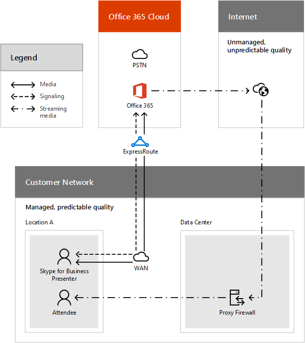

# 使用 ExpressRoute 的通話流程Call flow using ExpressRoute

本文協助說明商務用 Skype Online 和 ExpressRoute 的核心通話流程原則，並為您提供通話流程的一些詳細範例，讓您正確瞭解及規劃通話流程。This article helps to explain the core call flow principles for Skype for Business Online and ExpressRoute, and gives you some detailed examples of call flows so you can understand and plan correctly.

如果您是將商務用 Skype Online 部署為 Microsoft 365 或 Office 365、商務用 Skype Server 混合式或商務用 Skype 雲端連接器版的一部分，您必須瞭解商務用 Skype 用戶端與伺服器與通話流程之間的通訊，以便有效規劃、部署、操作及疑難排解商務用 Skype Online 服務。If you are deploying Skype for Business Online as part of Microsoft 365 or Office 365, Skype for Business Server Hybrid, or Skype for Business Cloud Connector Edition, you will need to understand the communication between the Skype for Business client and servers and the call flow so you can effectively plan, deploy, operate, and troubleshoot your Skype for Business Online services.

## 通話流程概觀Call flow overview

本檔說明可傳輸這些通話流量資料的網路區段，並説明您瞭解與透過網際網路或 ExpressRoute 傳輸的流量相比，哪些流量會維持在您的網路上。This document describes the network segments that can carry data for these call flows and helps you to understand which traffic will remain local to your network compared to the traffic that will travel over the Internet or through ExpressRoute. 瞭解哪些流量使用 ExpressRoute，可協助評估貴公司使用 ExpressRoute 所獲得的好處，並説明您瞭解 ExpressRoute 部署指南，在您決定使用 ExpressRoute 後驗證和疑難排解您的部署。Knowing which traffic uses ExpressRoute will help you to assess the benefits that your company will receive by using ExpressRoute, as well as help you understand the ExpressRoute deployment guidance to validate and troubleshoot your deployment once you've decided to use ExpressRoute.

此處所述的通話流程可能會受到您控制的各種因素影響，包括防火牆規則、NAT 組配置、代理和路由器組。The call flows described here can be impacted by a variety of factors that are under your control, including firewall rules, NAT configuration, proxies, and router configuration. 本檔假設已採用建議設定。This document assumes that the recommended settings have been applied. 以下建議設定如下所述：These recommended settings are described in:

- [設定商務用 Skype OnlineSet up Skype for Business Online](../set-up-skype-for-business-online/set-up-skype-for-business-online.md)

- [Office 365 URL 與 IP 位址範圍Office 365 URLs and IP address ranges](https://support.office.com/article/8548a211-3fe7-47cb-abb1-355ea5aa88a2)

- [ExpressRoute 概觀ExpressRoute Overview](/azure/expressroute/expressroute-introduction)

- [Azure ExpressRouteAzure ExpressRoute](https://azure.microsoft.com/services/expressroute/)

未遵循上述檔所找到的設定步驟的設定和設定，其通話流程可能會與本文所述不同。Setup and configurations that haven't followed the setup steps found in the documentation above can have different call flows than those we have documented here. 此外，您可能會發現自己有一些組組問題，例如非對稱和非優化的網路路由，或是非最佳傳輸通訊協定。Additionally, you may find yourself with configuration issues such as asymmetrical and non-optimal network routes, or non-optimal transport protocols. 每當涉及 ExpressRoute 時，非對稱路由都是一項重要的考慮，因為 ExpressRoute 會引入 Office 365 的第二個路徑，這為在一個方向使用網際網路的路由和在另一個方向使用 ExpressRoute 的另一個路由建立可能性。Asymmetrical routing is an important consideration whenever ExpressRoute is involved, because ExpressRoute introduces a second path to Office 365, which creates the possibility for a route that uses the Internet in one direction and another route that uses ExpressRoute in the other direction. 這可能會導致流量在經過狀態防火牆時，以返回方向遭到封鎖。This can result in traffic being blocked in the return direction if it traverses a stateful firewall.

## 網路區段和流量類型Network segments and traffic types

### 網路區段Network Segments

在說明通話流程之前，我們需要定義一些條款，説明您瞭解商務用 Skype Online 中使用的網路區段和媒體類型。Before we can explain the call flow, we need to define some terms that will help you understand the network segments and types of media that are used in Skype for Business Online.

下列通話流程圖會顯示四個不同的網路區段，每個區段是由不同組織管理 (您的內部網路、您的網路服務提供者及其網際網路對等合作夥伴，以及具有不同績效特性的 Microsoft) 。The call flow diagrams below show you four different network segments, each of which are managed by different organizations (your internal network, your network service provider, and their Internet peering partners, and Microsoft) that have different performance characteristics. 若要瞭解網路績效目標指導方針，請參閱商務用 Skype Online 中的 [媒體質量和網路連線能力](media-quality-and-network-connectivity-performance.md)。For guidelines on network performance targets, refer to [Media Quality and Network Connectivity Performance in Skype for Business Online](media-quality-and-network-connectivity-performance.md).

您可以在下方看到我們將要討論的每個網路區段。Below you can see each network segment that we will be talking about.

 **您的網路** 這是您控制和管理之整體網路的一部分網路區段。**Your network** This is the network segment that is part of your overall network that you control and manage. 這包括辦公室內的所有連接，無論是有線或無線，辦公室大樓之間，到內部部署資料中心，以及您與網際網路提供者或 ExpressRoute 合作夥伴的連線。This includes all of your connections within your offices, whether wired or wireless, between office buildings, to on-premises datacenters, and your connections to Internet providers or ExpressRoute partners.

一般來說，您的網路邊緣有一或多個具有防火牆和/或 Proxy 伺服器的 DMZ，這些防火牆和/或 Proxy 伺服器會強制執行貴組織的安全性原則，而且只允許您設定和設定的某些網路流量。Typically, the edge of your network has one or more DMZ with firewalls and/or proxy servers, which enforce your organization's security policies and that only allow certain network traffic that you have set up and configured. 由於您管理此網路，因此您可以直接控制網路績效，強烈建議您完成網路評定，以驗證網路網站內部以及從網路到商務用 Skype Online 之間的績效。Because you manage this network, you have direct control over the performance of your network, and it is highly recommended that you complete network assessments to validate performance both within sites in your network and from your network to Skype for Business Online. 若要瞭解績效需求，請參閱商務用 Skype Online 中的 [媒體質量和網路連線能力](media-quality-and-network-connectivity-performance.md)。To see the performance requirements, see [Media Quality and Network Connectivity Performance in Skype for Business Online](media-quality-and-network-connectivity-performance.md).

 **網際網路** 這是網路區段，屬於您整體網路的一部分，供從網路外部連線至商務用 Skype Online 的使用者使用，且用於未配置 ExpressRoute 時的所有連線。**Internet** This is the network segment that is part of your overall network that will be used by users who are connecting to Skype for Business Online from outside of your network, and is used for all connections when ExpressRoute isn't configured. 網際網路及其所有連線並非由您或 Microsoft 管理，因此無法判斷效果和路由路徑，這對整體通話流程和品質的影響最大。The Internet and all of its connections aren't managed by you or Microsoft, so performance and routing paths can't be determined, and this will have the greatest impact on overall call flow and quality.

 **ExpressRoute** 這是您整體網路的一部分網路區段，可為您提供 Microsoft 網路的專用私人連接。**ExpressRoute** This is the network segment that is part of your overall network that will give you a dedicated, private connection to the Microsoft network. 這是將您的網路連線到 Microsoft 網路 (Microsoft 365 或 Office 365 資料中心) 的建議選項，適用于所有與網路速度和績效相關的工作負載，例如商務用 Skype Online 即時通訊。This is the recommended option for connecting your network to the Microsoft network (Microsoft 365 or Office 365 datacenters) for all of the workloads that are dependent on network speed and performance, such as Skype for Business Online real-time communication. ExpressRoute 在您的網路之間建立，而 Microsoft 網路則使用 [ExpressRoute](/azure/expressroute/expressroute-locations) 連接提供者來提供私人和受管理的網路，其執行時間為 99.9%，且支援服務品質 (QoS) ，可改善網路擠塞期間即時媒體的績效。ExpressRoute connections are made between your network and the Microsoft network use [ExpressRoute connectivity providers](/azure/expressroute/expressroute-locations) to provide a private and managed network, with 99.9% uptime and support for Quality of Service (QoS) that can improve performance for real-time media during periods of network congestion.

 **Microsoft 網路** 這是支援 Microsoft 365 和 Office 365 服務之整體網路的一部分網路區段。**Microsoft network** This is the network segment that is part of your overall network that supports Microsoft 365 and Office 365 services. 這包括 Microsoft 365 或 Office 365 Online 伺服器之間的所有通訊。This includes all of the communication between Online servers for Microsoft 365 or Office 365. 這可能包括經過 Microsoft 網路骨幹網的流量，以及是在地理區域之間傳送的流量。This may include traffic that traverses the Microsoft network backbone and is transmitted between geographical regions.

### 流量類型Types of traffic

商務用 Skype Online 的網路流量分為兩大類別，在通話流程中顯示為個別路徑：The network traffic for Skype for Business Online falls into two broad categories, shown as separate paths in the call flow:

 **即時媒體** 是封裝在 RTP (即時傳輸通訊協定) 資料，支援音訊、視視、應用程式共用和檔案傳輸工作負載。**Real-time media** is data encapsulated within RTP (Real-time Transport Protocol) and supports audio, video, application sharing, and file transfer workloads. 一般而言，媒體流量對延遲高度敏感，因此您希望此流量採用最直接的路徑，並使用 UDP 做為傳輸層通訊協定，因為使用 TCP 會引入較高的延遲。In general, media traffic is highly latency sensitive, so you would want this traffic to take the most direct path possible, and to use UDP as the transport layer protocol because using TCP introduces higher latency.

 **訊號** 是用戶端與伺服器之間的通訊連結，或是用來控制活動的其他用戶端 (例如，在呼叫啟動或傳送) 時。**Signaling** is the communication link between the client and server, or other clients that are used to control activities (for example, when a call is initiated), and deliver IMs. 雖然部分用戶端使用 HTTP 型 REST 介面，但大多數訊號流量會使用 SIP 通訊協定。Most signaling traffic uses the SIP protocol, though some clients use HTTP-based REST interfaces. 為了簡單明瞭，我們考慮使用各種訊號，在這類流量中可能會經過 HTTP 和 HTTPS 或 TLS 連接。To make it simple, we are considering a variety signaling that may travel over HTTP and HTTPS or TLS connections in this type of traffic. 請注意，此流量對於延遲的敏感性要低得多，但如果端點之間的延遲超過數秒，可能會導致服務中斷或通話超時。It's important to understand that this traffic is much less sensitive to latency, but may cause service outages or call timeouts if latency between the endpoints exceed several seconds.

此流量的目的地位於所有 Microsoft [365](https://support.office.com/article/8548a211-3fe7-47cb-abb1-355ea5aa88a2) 或 Office 365 服務的 Office 365 URL 和 IP 位址範圍中。The destinations for this traffic are found in [Office 365 URLs and IP address ranges](https://support.office.com/article/8548a211-3fe7-47cb-abb1-355ea5aa88a2) for all Microsoft 365 or Office 365 services. 針對每個 URL，它會指出該部分流量是否可能穿過 Microsoft 365 的 ExpressRoute 或 Office 365。For each URL, it indicates whether that portion of traffic may traverse the ExpressRoute for Microsoft 365 or Office 365. 若圖表顯示啟用 ExpressRoute 時，網際網路仍然用於某些流量，請參閱 [Azure ExpressRoute for Office 365](https://support.office.com/article/6d2534a2-c19c-4a99-be5e-33a0cee5d3bd)。For diagrams that show that the Internet is still used for some traffic when ExpressRoute is enabled, please see [Azure ExpressRoute for Office 365](https://support.office.com/article/6d2534a2-c19c-4a99-be5e-33a0cee5d3bd). 必須瞭解，即使列在 ExpressRoute 上可路由的 URL 也可以從網際網路路由。It is important to understand that even URLs that are listed as being routable over ExpressRoute are also routable over the Internet. 這表示在某些情況下，決定是否要使用網際網路或 ExpressRoute 取決於用戶端的位置，以及 Proxy 伺服器和防火牆的組配置。This means that in some scenarios, the determination about whether the Internet or ExpressRoute will be used depends on location of client and configuration of proxy servers and firewalls. 此外，還必須瞭解，由於並非所有與 Microsoft 365 或 Office 365 相關聯的 URL 都能使用 ExpressRoute，即使您向 ExpressRoute 合作夥伴購買 ExpressRoute，也還是需要網際網路連接。It is also important to understand that since not all URLs associated with Microsoft 365 or Office 365 are able to use ExpressRoute, an Internet connection is required even if you purchase ExpressRoute from an ExpressRoute partner.

只能從網際網路送出的流量包括常見的網際網路相依性，例如憑證吊銷清單 (CRLs) 、DNS 查詢和名稱解析、共用 Microsoft 365 或 Office 365 服務的 URL ，例如 Microsoft 365 系統管理中心，以及商務用 Skype Online 的一些非即時通訊功能，例如遙測和與 Skype 消費者互通性的聯盟，以及串流用於 Skype 會議廣播的媒體。Traffic that can only be sent over the Internet includes common Internet dependencies, such as Certificate Revocation Lists (CRLs), DNS lookups and name resolution, URLs for shared Microsoft 365 or Office 365 services, such as for the Microsoft 365 admin center, and some non-real-time communication features of Skype for Business Online, such as telemetry and federation for interoperability with Skype consumer, as well media that is streamed for Skype Meeting Broadcast. 若要協助您做出決策，請參閱使用 [ExpressRoute for Office 365](https://support.office.com/article/e1da26c6-2d39-4379-af6f-4da213218408) 進行路由，以在規劃網路路由時提供更多考慮。To help you make decisions, see [Routing with ExpressRoute for Office 365](https://support.office.com/article/e1da26c6-2d39-4379-af6f-4da213218408) for more considerations when you are planning your network routing.

## 商務用 Skype 通話流程的原則Principles for call flows with Skype for Business

在我們瞭解特定通話流程案例詳細資料之前，有六項一般原則可協助您瞭解商務用 Skype 的通話流程。Before we get into the details of specific call flow scenarios, there are six general principles that help you understand call flows for Skype for Business.

1. 商務用 Skype 會議會託管在會議召集人位於同一地區。A Skype for Business conference is hosted in the same region where the conference organizer is homed. 如果召集人是 Online 使用者，則此為雲端;如果會議召集人是內部部署使用者，則位於內部部署資料中心。This is in the cloud if the organizer is an Online user, or in an on-premises datacenter if the meeting organizer is an on-premises user.

2. 從用戶端到託管會議的媒體流量一直會送到會議託管的伺服器。Media traffic sent from a client to a hosted conference always goes to the server where the conference is hosted. 這可能是您管理之資料中心內的內部部署伺服器，或雲端中的 Online 伺服器。This may be an on-premises server within a datacenter that you manage or an Online server within the cloud. 不過，Edge 伺服器一直用於線上會議的媒體流程。However, an Edge server is always used for media flow for Online conferences.

3. 對等通話的媒體流量會採取可用的最直接路由。Media traffic for peer-to-peer calls take the most direct route that is available. 偏好的路由會直接傳送至遠端對等 (用戶端) ，但如果因為防火牆封鎖流量或類似情況而無法使用該路由，則一或多個 Edge 伺服器會轉傳流量。The preferred route is direct to the remote peer (client), but if that route isn't available due to firewall blocking the traffic or something like that, then one or more Edge servers will relay traffic.

4. 訊號流量一直會傳輸至使用者所住的伺服器，無論是線上或內部部署。Signaling traffic always goes to the server where the user is homed, either Online or on-premises. 如果前端伺服器無法直接連接，將會使用 Edge 伺服器。An Edge server will be used if the Front End server can't be connected to directly.

5. 由於用戶端防火牆組 (，加入由 Online 主持的會議的使用者一 (一或兩個 Edge 伺服器) 。Users joining a conference hosted Online will always use an Edge server (or two if required due to client firewall configurations).

6. 如果從包含內部部署之同一個網路進行連接，加入內部部署會議的使用者通常不會使用 Edge 伺服器，而且從網路外部連接時，會使用一或兩個 Edge 伺服器。Users joining a conference hosted on-premises will typically not use an Edge server if connecting from within the same network that contains the on-premises deployment, and will use either one or two Edge servers when connecting from outside of your network.

若要深入瞭解所選媒體路徑的詳細資訊，請參閱 [ICE - Edge Media Connectivity](https://aka.ms/AVEdge)。To learn more about the details on the media path that is chosen, please see [ICE - Edge Media Connectivity](https://aka.ms/AVEdge). 雖然這段影片是 Lync Server 2013，但原則和通訊協定仍然適用于商務用 Skype。Although this video is about Lync Server 2013, the principles and protocols still apply to Skype for Business.

## 商務用 Skype 通話流程與 ExpressRouteSkype for Business call flows with ExpressRoute

現在，您瞭解四個不同的網路區段，以及商務用 Skype 通話流程的一些一般原則，您可以使用這項資訊來説明您瞭解哪些商務用 Skype 流量會穿過 ExpressRoute 網路區段。Now that you have an understanding of the four different network segments and some general guiding principles for Skype for Business call flows, you can use that information to help you understand which Skype for Business traffic will traverse an ExpressRoute network segment.

一般而言，如果一個端點位於您的網路，另一個端點位於 Microsoft 365 或 Office 365 資料中心，網路流量會穿過 ExpressRoute 連接。In general, network traffic will traverse the ExpressRoute connection if one endpoint is in your network and the other endpoint is in the Microsoft 365 or Office 365 datacenter. 這包括用戶端與伺服器之間的訊號流量、電話會議期間使用的媒體流量，或使用 Online Edge 伺服器的對等通話。This will include signaling traffic between client and server, media traffic used during conference calls, or peer-to-peer calls that use an Online Edge server.

如果兩個端點都能直接在網際網路上通訊，或位於您的網路內，流量不會穿過 ExpressRoute 連接。Traffic won't traverse the ExpressRoute connection if both of the endpoints are able to communicate directly across the internet or are located within your network. 這包括對等通話的媒體、從網際網路到內部部署的流量，或網際網路與 Microsoft 365 或 Office 365 Edge Servers 之間的任何流量。This will include media for peer-to-peer calls, traffic from the Internet destined to an on-premises deployment, or any traffic between the Internet and Microsoft 365 or Office 365 Edge Servers. 例如，使用者從旅館加入 Online 會議。An example of this would be a user joining an Online conference from a hotel.

## 基本商務用 Skype 通話流程Basic Skype for Business call flow

為了協助您適用上述商務用 Skype 通話流程的一般主體，本文的下一節包含數個圖表供參考。To help you apply the general principals about the Skype for Business call flows that are described above, the next section of this article contains several diagrams for reference. 這不是所有可能的通話流程完整清單，但可協助您適用上述詳細原則。This isn't an exhaustive list of all possible call flows, but is intended to help you apply the principles detailed above. 此外，已選取圖表中的情境來涵蓋常見的部署類型，包括線上、混合式、雲端連接器，以及一種特殊案例 Skype 會議廣播。Additionally, the scenarios in the diagrams have been selected to cover common deployment types including Online, Hybrid, Cloud Connector, and in one special case, Skype Meeting Broadcast.

> [!NOTE]
> 商務用 Skype 所使用的流量子集無法通過 ExpressRoute 路由，而且一定會採用網際網路路徑。A subset of traffic used by Skype for Business isn't routable over ExpressRoute, and will always take an Internet path. 請參閱 [Office 365 URL](https://support.office.com/article/8548a211-3fe7-47cb-abb1-355ea5aa88a2) 和 IP 位址範圍，以判斷受影響的 URL。Refer to the [Office 365 URLs and IP address ranges](https://support.office.com/article/8548a211-3fe7-47cb-abb1-355ea5aa88a2) to determine the URLs that can be affected.

### 從客戶網路內撥打 Microsoft 365 或 Office 365 使用者的對等通話Peer-to-peer call for Microsoft 365 or Office 365 user from within customer network

針對對等通話，媒體流量會一直採用最直接的路由至目的地。For peer-to-peer calls, media traffic always takes the most direct route to its destination. 不過，訊號流量會進入 Microsoft 365 或 Office 365 資料中心，而線上使用者則位於該資料中心。However, the signaling traffic goes to a Microsoft 365 or Office 365 datacenter where the Online user is homed. 由於這兩個使用者位於同一個 WAN 上，而且沒有任何內容會阻止用戶端直接通訊，因此媒體會直接在它們之間流動。Since both users are on the same WAN and nothing prevents the clients from communicating directly, the media flows directly between them. 針對這兩個使用者發出流量的訊號，會經過每個組織資料中心的 ExpressRoute 連接。Signaling traffic, for both users traverses the ExpressRoute connection that is destined for each organization's datacenter. 若要在此案例顯示通話流程，請參閱此說明。To show you the call flow in this scenario, see this.

 **對等通話流程****Peer-to-peer call flow**

### 您網路上加入由 Online 主持的會議的線上使用者Online user on your network joining a conference that is hosted Online

在對等範例中，媒體流量會一直採用最直接的路由至目的地。In the peer-to-peer example, media traffic always takes the most direct route to its destination. 不過，對於線上會議，目的地會位於雲端。However, for an Online conference, the destination is in the cloud. 這表示從您的網路加入會議的所有使用者的媒體流量會穿過 ExpressRoute 連接，而訊號流量會傳輸至雲端。This means that media traffic for all users joining the conference from within your network will traverse the ExpressRoute connection and the signaling traffic travels to the cloud. 下圖顯示媒體和訊號都會針對您網路內的使用者，執行 ExpressRoute 連接，並針對從網路外部連接到網際網路的使用者 ，例如從咖啡店或旅館直接穿過網際網路。The graphic below shows you that both media and signaling will traverse the ExpressRoute connection for a user within your network, and will directly traverse the Internet for users that are connected to the Internet from outside your network, such as from a coffee shop or hotel.

請記住，會議的位置是由會議召集人所定義，而不是由參與者定義。Remember that the location of a conference is defined by the meeting organizer and not by the participants. 這表示如果會議是由內部部署客戶排程，媒體流量不會在 ExpressRoute 上流向雲端，而是會將網際網路路由至會議召集人的內部部署資料中心。This means that if the meeting were scheduled by an on-premises customer, the media traffic won't flow to the cloud over ExpressRoute, but would instead traverse the Internet to the on-premises datacenter of the meeting organizer.

Online 會議的媒體目的地為 Microsoft 365 或 Office 365 雲端內的資料中心，但資料中心可能位於與加入會議的使用者不同的地理區域。The destination for media for Online conferences will be a datacenter within the Microsoft 365 or Office 365 cloud, but the datacenter may be in a different geographical region than the users that are joining the conference. 這有兩種方式之一：This can happen in one of two ways:

- 如果會議召集人來自與出席者或參與者不同的公司，且召集人的組織位於不同的地理位置或國家/地區。If the meeting organizer is from a different company than the attendees or participants, and the organization for the organizer is hosted in a different geographic location or country/region.

- 如果使用者從與公司組織所在的國家/地區不同的國家/地區加入，可能是因為公司是跨國公司，或是使用者出差。If a user is joining from a different country/region than where the company's organization is located, either due to the company being multinational, or the user is traveling.

在此案例使用 ExpressRoute 的好消息是，使用 ExpressRoute 進位附加元件後，無論會議組織資料中心的召集人的地理區域如何，ExpressRoute 路徑後的資料都會自動通過 Microsoft 的骨幹。The good news about using ExpressRoute in this scenario is that with ExpressRoute premium add-on, data that follows the ExpressRoute path will pass automatically across Microsoft's backbone regardless of geographical region of the organizer of the meeting organization's datacenter.

 **線上使用者與線上會議通話流程****Online user with Online meeting call flow**

### 在混合式部署中加入由內部部署使用者主持的會議Joining a conference hosted by on-premises user in Hybrid deployment

請記住，支援主持會議的會議服務器是由會議召集人的住家位置所決定。Remember that the conferencing servers that support hosted conferences are determined by where the meeting organizer is homed. 在此情境中，在混合式部署中加入內部部署使用者排程會議的所有使用者的媒體會流向內部部署資料中心。In this scenario, media for all users joining a conference scheduled by an on-premises user in a Hybrid deployment will flow to an on-premises datacenter. 線上家用使用者訊號會透過他們的組織在雲端建立，而媒體會嘗試直接連線。Signaling for Online homed users will be established through their organization in the cloud, while media will attempt a direct connection. 在此情境中，由於這兩個使用者都是從您的網路內連線，因此可以直接進行媒體連線，因此 ExpressRoute 只會用於向線上家用使用者發出流量的訊號。In this scenario, since both users are connecting from within your network, a direct media connection is possible, so ExpressRoute is used only for signaling traffic for the Online homed user. 如果線上家用使用者從網際網路連線，媒體可能會穿過 ExpressRoute ，如果 Online Edge 伺服器是用來連線。If an Online homed user connects from the Internet, the media could traverse ExpressRoute if an Online Edge server is used to connect.

 **由混合式使用者通話流程主持的會議****Conference hosted by a Hybrid user call flow**

### 具有 Microsoft 365 或 Office 365 託管會議的內部部署 Edge 伺服器On-premises Edge server with Microsoft 365 or Office 365 hosted conferences

當混合式使用者加入 Online 主持的會議時，我們知道訊號和媒體會目的地為 Microsoft 365 或 Office 365 雲端，而且由於使用者從網際網路加入，因此通常會採用直接網際網路路徑。When a Hybrid user joins an Online hosted conference, we know that signaling and media will be destined for the Microsoft 365 or Office 365 cloud, and since the user is joining from the Internet, normally a direct internet path would be taken. 不過，在某些情況下 ，例如由於防火牆限制，無法直接使用網際網路路徑。However, in some cases, such as due to firewall restrictions, a direct Internet path isn't available. 在這種情況下，內部部署 Edge 伺服器可以轉傳媒體流量，這會導致媒體流量回到您的內部部署網路，然後再將 ExpressRoute 回路路由至雲端。In this case, an on-premises Edge server can relay the media traffic, which causes the media traffic to return to your on-premises network before traversing the ExpressRoute circuit to the cloud.

 **使用內部部署 Edge 伺服器加入線上電話會議的內部部署使用者****On-premises user joining an online conference call using an on-premises Edge server**

### 使用商務用 Skype 雲端連接器版進行 PSTN 通話PSTN call using Skype for Business Cloud Connector Edition

使用 [商務用 Skype Online 雲端連接器版本](https://aka.ms/CloudConnectorInstaller) 使用內部部署資源 ，例如 SIP 主幹或 PSTN 閘道，或使用最小的硬體裝置與商務用 Skype 整合，提供 PSTN 連線。Using the [Skype for Business Online Cloud Connector Edition](https://aka.ms/CloudConnectorInstaller) provides PSTN connectivity using on-premises resources such as a SIP trunk, or a PSTN gateway, or using a minimal hardware device to integrate with Skype for Business. 使用雲端連接器版本，使用者會以線上為首頁，並當使用者與通話方案沒有關系時，做為一般線上使用者。With Cloud Connector Edition, users are homed Online and act as normal Online users when they don't involve Calling Plans. PSTN 案例的訊號會穿過 ExpressRoute 連接在用戶端與雲端之間移動 ，而媒體流量會保留在 WAN 內。Signaling for PSTN scenarios will travel between the client and the cloud across an ExpressRoute connection if available, and the media traffic stays within your WAN. 在此案例中，訊號會以 Microsoft 365 或 Office 365 雲端轉場，並終止于雲端連接器。In this case, signaling turns around at the Microsoft 365 or Office 365 cloud, and terminates at the Cloud Connector.

 **透過 Microsoft 365 或 Office 365 和雲端連接器的電話系統撥打 PSTN 電話****PSTN call via the Phone System in Microsoft 365 or Office 365 and Cloud Connector**

### 從客戶網路加入使用者的 Skype 會議廣播Skype Meeting Broadcast with users joining from customer network

Skype 會議廣播是一種特殊使用案例，由兩部分會議組成，每個部分都有不同的網路傳輸設定檔。Skype Meeting Broadcast is a special use case, which consists of a two-part meeting with each part having different network transport profiles. 第一部分，以及從網路績效的觀點而言最重要的是內部會議。The first part, and the one that is most important from a network performance point of view, is the inner meeting. 這是會議即時部分，包含一或多個用戶端端點，可連接到雲端中的會議服務器。This is the real-time portion of the meeting that includes one or more client endpoints connecting to the conferencing server in the cloud. 使用會議此部分傳送的資料與上述範例完全一樣，使用者會加入 Online 會議。Data transmitted using this portion of the meeting is exactly like the example above, with a user joining an Online conference.

Skype 會議廣播的獨特之處，是使用廣播串流服務將會議發佈給大量會議出席者。What makes Skype Meeting Broadcast unique is that the meeting is distributed to a large number of conference attendees using a broadcast streaming service. 此廣播串流服務無法通過 ExpressRoute 路由，而是使用網際網路，提供內容傳遞網路與 CDN (選擇性) 支援。This broadcast streaming service isn't routable over ExpressRoute, but instead uses the Internet with the optional support of Content Delivery Network (CDN) services. 瞭解廣播串流是單向媒體流程很有説明，因為出席者會聆聽但不要說話，而且支援緩衝，因此對於延遲、封包遺失和抖動等網路性能問題的敏感性要低得多。It is helpful to recognize that the broadcast streaming is a unidirectional media flow because the attendees listen but don't talk and supports buffering, so it is much less sensitive to network performance issues such as latency, packet loss, and jitter. 系統針對這些問題優化廣播流量，而是針對頻寬使用進行優化，因為可能有許多出席者收到串流媒體。Instead of optimizing broadcast traffic for these issues, it is optimized for bandwidth utilization because there is potentially a very large number of attendees receiving the streamed media.

 **與來自客戶網路的使用者進行 Skype 會議廣播****Skype Meeting Broadcast with users from customer network**

## 按部署類型顯示通話流程模式Call flow patterns by deployment type

使用上述常見通話流程範例，以及瞭解控制流量模式的一般原則，下表提供大量部署和使用案例組合的流量模式摘要。With the common call flow examples above, and an understanding of the general principles that control traffic patterns, the tables below provide a summary of the traffic patterns for a large combination of deployment and usage scenarios. 這些表格不會收集所有可能的通話流程組合，但應可協助您進一步瞭解通話流程的一般原則。These tables do not capture all possible combinations of call flows, but should help you to further understand the general principles of call flow.

資料會傳送，並列為組織的本地資料;不會離開客戶網路、網際網路或 ExpressRoute。Data is transmitted and is listed as being local to the organization; it doesn't leave the customer network, Internet, or ExpressRoute. 下列模式是根據最常見的網路設定 ，例如防火牆、聯盟和網際網路，並假設參與多方或聯盟流程的所有組織都有 ExpressRoute。The patterns listed below are based on the most common network settings, such as firewalls, federation, and Internet, and assume that all organizations involved in multi-party or federated flows have ExpressRoute. 實際上，使用不同的設定可能會導致流量模式與下列不同。In practice, having different settings could result in different traffic patterns than those that are listed below.

### 商務用 Skype Online 的通話流程Call flows for Skype for Business Online

商務用 Skype Online 使用案例會涉及家用 Online 的使用者，而且可能會從內部網路或網際網路進行通話。Skype for Business Online usage scenarios involve users who are homed Online, and may be calling from either your internal network or the Internet. 內部部署伺服器不是這些案例的一部分，因此所有會議或 PSTN 相關媒體都會流向雲端，而 Online 使用者 Edge 伺服器也會位於雲端。On-premises servers aren't part of these scenarios, so all conferencing or PSTN related media will flow to the cloud, and the Online users Edge server will also be in the cloud.

 **商務用 Skype Online 的通話流程摘要****Call flow summary for Skype for Business Online**

|||||||
|:-----|:-----|:-----|:-----|:-----|:-----|
|**使用狀況****Usage scenario**   |**端點****Endpoints**   |**訊號路徑****Signaling path**   |**媒體路徑****Media path**   |**範例流程****Example flow**   |**注釋****Notes**   |
|對等通話Peer-to-peer call    |兩個用戶端，這兩個用戶端都位於您的網路上。Two clients, both on your network.    |ExpressRouteExpressRoute    |當地local    |[從客戶網路內撥打 Microsoft 365 或 Office 365 使用者的對等通話Peer-to-peer call for Microsoft 365 or Office 365 user from within customer network](call-flow-using-expressroute.md#bk_Figure2)   ||
|對等通話Peer-to-peer call    |兩個用戶端，一個位於 (內部) ，另一個位於網際網路上的用戶端 (外部) 。Two clients, one on your network (internal) and the other client on the Internet (external).    |內部使用者：ExpressRouteInternal user: ExpressRoute    外部使用者：網際網路External user: Internet    |內部使用者：ExpressRouteInternal user: ExpressRoute    外部使用者：Microsoft 365 或 Office 365 Edge 伺服器的網際網路。External user: Internet to Microsoft 365 or Office 365 Edge server.    |[來自客戶網路內的 Microsoft 365 或 Office 365 使用者的對等通話Peer-to-peer call for Microsoft 365 or Office 365 users from within customer network](call-flow-using-expressroute.md#bk_Figure2)   |假設防火牆會阻止需要 Online Edge 伺服器的用戶端之間的直接連線。Assumes that firewall blocks direct connections between clients, that requires an Online Edge server. 從內部使用者到 Online Edge 伺服器的流量會遵循與電話會議會議服務器類似的路徑。Traffic from internal user to Online Edge server follows similar path as that to conferencing server for conference call.    |
|對聯盟組織中使用者的對等通話Peer-to-peer call to a user in a federated organization    |您網路上有兩個用戶端 (內部) ，而位於聯盟組織網路上的線上使用者 () 。Two clients, on your network (internal) and at Online user on federated organization's network (federated).    |ExpressRouteExpressRoute    |ExpressRouteExpressRoute    |[您網路上加入由 Online 主持的會議的線上使用者Online user on your network joining a conference that is hosted Online](call-flow-using-expressroute.md#bk_Figure3)   |假設防火牆會阻止用戶端之間的直接連線，需要 Online Edge 伺服器。Assumes a firewall blocks direct connections between clients, requiring Online Edge server. 從內部使用者到 Online Edge 伺服器的流量會遵循與電話會議會議服務器類似的路徑。Traffic from the internal user to Online Edge server follows a similar path as that of a conferencing server for conference call.    |
|在客戶網路中按使用者加入電話會議Join conference call by user in customer network    |雲端網路和會議服務器的用戶端。Client on your network and conferencing server in the cloud.    |ExpressRouteExpressRoute    |ExpressRouteExpressRoute    |[您網路上加入由 Online 主持的會議的線上使用者Online user on your network joining a conference that is hosted Online](call-flow-using-expressroute.md#bk_Figure3)   ||
|在網際網路中按使用者加入電話會議Join conference call by user in Internet    |用戶端位於雲端的網際網路和會議服務器上。Client is on the Internet and conferencing server in the cloud.    |互聯網Internet    |互聯網Internet    |[您網路上加入由 Online 主持的會議的線上使用者Online user on your network joining a conference that is hosted Online](call-flow-using-expressroute.md#bk_Figure3)   ||
|加入由另一家公司的 on-prem Server 主持的會議Join conference hosted by another company's on-prem Server    |協力廠商資料中心網路和會議服務器的用戶端。Client on your network and conferencing server in third-party datacenter.    |互聯網Internet    |互聯網Internet    |不適用Not applicable    |由於主持會議的會議服務器位於其他客戶的內部部署網路上，因此沒有任何資料會透過 Microsoft 雲端傳遞。Since the conferencing server that hosts the conference is on an on-premises network of a different customer, no data would pass through the Microsoft cloud.    |
|PSTN 通話PSTN call    |客戶網路和雲端電話系統伺服器的用戶端Client in customer network and Phone System servers in the cloud    |ExpressRouteExpressRoute    |ExpressRouteExpressRoute    |[您網路上加入由 Online 主持的會議的線上使用者Online user on your network joining a conference that is hosted Online](call-flow-using-expressroute.md#bk_Figure3)   ||
|PSTN 通話PSTN call    |雲端網際網路和電話系統伺服器的用戶端Client on the Internet and Phone System servers in the cloud    |互聯網Internet    |互聯網Internet    |不適用Not applicable    |媒體和訊號會流向 Microsoft 365 或 Office 365 資料中心。The media and signaling will flow to the Microsoft 365 or Office 365 datacenter. 由於用戶端端點位於網際網路上，因此所有資料都會在整個網際網路上流向 Microsoft 資料中心 (即使需要 Online Edge 伺服器才能連線) 。Since the client endpoint is on the Internet, all data will flow to the Microsoft datacenter across the Internet (even if an Online Edge server is needed for connectivity).    |

> [!NOTE]
> ExpressRoute 會用於從位於公司網路的使用者到線上 Edge Server 的媒體路徑上，但如果使用另一個客戶內部部署的邊緣伺服器，則不會使用 ExpressRoute。ExpressRoute will be used on the media path from a user located on the corporate network to an online Edge Server, but won't be used if the Edge server for another customer's on-premises deployment is used.

### 商務用 Skype 混合式通話流程Call flows for Skype for Business Hybrid

混合式通話流程適用于您擁有至少包含內部部署部分使用者的商務用 Skype 部署。Hybrid call flows apply when you have a Skype for Business deployment that includes at least some users that are homed on-premises. 本節中的通話流程包括內部部署會議，以及至少有一個內部部署家用使用者的對等或 PSTN 通話。The call flows in this section include both on-premises conferences and peer-to-peer or PSTN calls with at least one on-premises homed user.

|||||||
|:-----|:-----|:-----|:-----|:-----|:-----|
|**使用狀況****Usage scenario**   |**端點****Endpoints**   |**訊號路徑****Signaling path**   |**媒體路徑****Media path**   |**範例流程****Example flow**   |**注釋****Notes**   |
|對等通話Peer-to-peer call    |客戶網路和內部部署兩個用戶端Two clients, both on customer network and homed on-premises    |當地Local    |當地local    |[從客戶網路內撥打 Microsoft 365 或 Office 365 使用者的對等通話Peer-to-peer call for Microsoft 365 or Office 365 user from within customer network](call-flow-using-expressroute.md#bk_Figure2)   |由於使用者是內部部署，因此訊號會從內部部署資料中心而非雲端，在內部部署中流動。Since users are homed on-premises, signaling flows locally to the on-premises datacenter instead of the cloud.    |
|對等通話Peer-to-peer call    |兩個用戶端，都從客戶網路進行連接。Two clients, both connecting from customer network. 其中一個位於線上，另一個則位於內部部署。One is homed online, the other is homed on-premises.    |線上使用者：ExpressRouteOnline user: ExpressRoute    內部部署使用者：localOn-premises user: local    |當地local    |[來自客戶網路內的 Microsoft 365 或 Office 365 使用者的對等通話Peer-to-peer call for Microsoft 365 or Office 365 users from within customer network](call-flow-using-expressroute.md#bk_Figure2)   |只有 Online 家用使用者會傳送訊號流量至雲端。Only the Online homed user sends signaling traffic to the cloud.    |
|對聯盟組織中使用者的對等通話Peer-to-peer call to a user in a federated organization    |兩個用戶端是客戶網路中內部部署使用者 (內部) ，而線上使用者則位於 (聯盟) 。Two clients, on premise-user in customer network (internal) and online user at federated company's network (Federated).    |內部使用者：localInternal user: local    聯合使用者：ExpressRouteFederated user: ExpressRoute    |網際網路或 ExpressRoute (視使用線上或內部部署邊緣伺服器) Internet or ExpressRoute (depends whether online or on-premises edge server is used)    |您網路上[線上使用者](call-flow-using-expressroute.md#bk_Figure3)加入由 Online 主持的會議，以及 Microsoft [365 或 Office 365](call-flow-using-expressroute.md#bk_Figure5)託管會議的一部分內部部署 Edge 伺服器， (媒體流量) 。[Online user on your network joining a conference that is hosted Online](call-flow-using-expressroute.md#bk_Figure3) and part of [On-premises Edge server with Microsoft 365 or Office 365 hosted conferences](call-flow-using-expressroute.md#bk_Figure5) (for media traffic).   |假設防火牆會阻止用戶端之間的直接連線，需要 Online Edge 伺服器。Assumes a firewall blocks direct connections between clients, requiring Online Edge server. ICE 協商會提供線上 (連線) 內部部署使用者 (內部部署 Edge 伺服器所提供的線上) 連線。ICE negotiation will offer both Online (by the online user) and on-premises Edge servers (by the on-premises user) for connectivity.    |
|在由 Online 使用者或使用者安排 (中，以使用者加入電話會議) Join conference call by user in customer network (conference scheduled by Online user)    |雲端網路和會議服務器的內部部署使用者。On-premises user on your network and conferencing server in the cloud.    |ExpressRouteExpressRoute    |ExpressRouteExpressRoute    |[您網路上加入由 Online 主持的會議的線上使用者Online user on your network joining a conference that is hosted Online](call-flow-using-expressroute.md#bk_Figure3)   |電話會議的伺服器資源是由會議召集人定義。Server resources for conference call are defined by the meeting organizer. 在這種情況下，它是由 Online 使用者排程，因此資源會位在雲端。In this case, it was scheduled by an Online user, so resources are in the cloud.    |
|PSTN 通話PSTN call    |您網路和內部部署商務用 Skype 資料中心的內部部署使用者。On-premises user on your network and on-premises Skype for Business datacenter.    |當地Local    |當地Local    |[使用商務用 Skype 雲端連接器版進行 PSTN 通話PSTN call using Skype for Business Cloud Connector Edition](call-flow-using-expressroute.md#bk_Figure6)   |與使用雲端連接器版本的情況類似，但該使用者是內部部署，因此訊號會保留在您的網路內。Similar scenario to use of Cloud Connector Edition, except that user is homed on-premises, so the signaling stays within your network.    |

### 使用雲端連接器的商務用 Skype 通話流程Call flows for Skype for Business with Cloud Connector

連線至雲端連接器版本的使用者全部是線上家用版。Users that will connect to Cloud Connector Edition are all homed Online. 這表示會議會線上，而訊號會遵循與 Online 使用者相同的模式。This means that conferences will be online, and signaling follows the same patterns as for Online users. 針對 PSTN 通話外的其他案例，商務用 Skype Online 的通話流程會與上述完全相同。For scenarios other than PSTN calls, the call flow will be exactly as described above for Skype for Business Online.

|||||||
|:-----|:-----|:-----|:-----|:-----|:-----|
|**使用狀況****Usage scenario**   |**端點****Endpoints**   |**訊號路徑****Signaling path**   |**媒體路徑****Media path**   |**範例流程****Example flow**   |**注釋****Notes**   |
|PSTN 通話PSTN call    |使用雲端連接器版本在您的網路上的線上使用者。Online user on your network using Cloud Connector Edition.    |當地local    |當地local    |[使用商務用 Skype 雲端連接器版進行 PSTN 通話PSTN call using Skype for Business Cloud Connector Edition](call-flow-using-expressroute.md#bk_Figure6)   ||
|PSTN 通話PSTN call    |使用雲端連接器版網際網路的線上使用者。Online user using the internet using Cloud Connector Edition.    |互聯網Internet    |互聯網Internet    |使用 [商務用 Skype 雲端連接器版與 Microsoft 365 或 Office 365](call-flow-using-expressroute.md#bk_Figure5) 託管會議與 PSTN 通話的內部部署 [Edge 伺服器組合](call-flow-using-expressroute.md#bk_Figure6)。Combination of [On-premises Edge server with Microsoft 365 or Office 365 hosted conferences](call-flow-using-expressroute.md#bk_Figure5) and [PSTN call using Skype for Business Cloud Connector Edition](call-flow-using-expressroute.md#bk_Figure6).    |網際網路使用者將透過雲端連接器中包含的 Edge 伺服器進行連接，而雲端連接器會連接到 PSTN 網路。Internet users will connect via the Edge server that is included in Cloud Connector, and Cloud Connector will connect to the PSTN network.    |

## 相關主題Related topics

[ExpressRoute 檔ExpressRoute documentation](/azure/expressroute/)