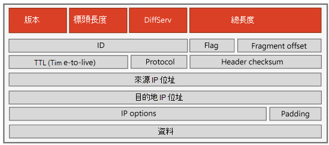

# 商務用 Skype Online 中的 ExpressRoute 與 QoS

[!INCLUDE [sfbo-retirement](../../Hub/includes/sfbo-retirement.md)]

連線使用 azure ExpressRou Microsoft 365 te Microsoft 365或 Office 365 Online 或 Office 365 私人網路絡連線Office 365或商務用 Skype連線。 您的應用程式專用商務用 Skype，將能為您提供可靠且可預測的績效，以及遠離公用網際網路的隱私權。 現在，您可以購買更好的網路連線至 Microsoft 365 或 Office 365，商務用 Skype可增加可預測性、商務級可靠性，並隨附執行時間 SLA。
  
> [!NOTE]
> 提供頻寬計算機的新版本[：商務用 Skype頻寬計算機](https://go.microsoft.com/fwlink/?LinkId=715766)。 不過，本檔中的指示會使用 Lync 2010 和 2013 頻寬計算機。 
  
## 商務用 Skype線上和 ExpressRoute

您可以與 Microsoft 的 ExpressRoute 合作夥伴合作，以專用連線Microsoft 365連線雲端Office 365包括 商務用 Skype Online 在內的各種應用程式。 不過，商務用 Skype即時語音和視訊通訊功能需要專為支援這些即時工作負載Microsoft 365或Office 365網路服務。 這包括頻寬足以承載所需流量的網路，且能夠支援服務品質 (QoS) ，為使用者供應商務課程體驗。
  
本檔是專為協助您、系統管理員和網路設計人員瞭解支援即時通訊所需的特殊挑戰，Microsoft 提供的工具可協助您設計支援這些要求的網路，以及使用案例研究來協助您完成設計程式。 
  
本檔的第一部分會引導您完成案例研究，以使用[Lync 2010 和 2013](https://go.microsoft.com/fwlink/?LinkId=690282)頻寬計算機來協助您進行網路設計，以估算大型、多網站 商務用 Skype ExpressRoute 部署的網路需求。 本檔第二部分提供服務品質 (QoS) 的基本概念、支援 商務用 Skype 即時通訊的特定技術詳細資料，以及所需的特定網路服務類型。
  
這裡提供的所有資訊都會提供 QoS 和 ExpressRoute 的技術詳細資料及瞭解，讓您瞭解您將要面對的特定挑戰，並為您提供可在整個 商務用 Skype 網路中成功部署 ExpressRoute 的工具與技巧的可操作知識。 
  
## 快速入門

當您準備好使用 商務用 Skype 的 ExpressRoute 時，建議查看不同的 ExpressRoute 連接模型，以及合作夥伴和位置的各種選擇，並閱讀如何在企業內購買及布備 ExpressRoute。 以下是一些可開始使用的資源： 
  
- [Azure ExpressRoute]( https://go.microsoft.com/fwlink/?LinkId=690283)
    
- [ExpressRoute 定價](https://go.microsoft.com/fwlink/?LinkId=690284)
    
- [ExpressRoute 檔](/azure/expressroute/)
    
## 第 1 部分：案例研究 - Dewey Law 的 ExpressRoute，LLC。

此適用于 Dewey Law，LLC 的案例研究。 將展示如何設定網路、訂購網路存取服務，以及決定支援 ExpressRoute 商務用 Skype Online 的頻寬需求。
  
 **背景** Dewy Law LLC。 是一家大型的國家律師事務所，擁有 790 名律師，員工總數達 5，580 人，分佈于 78 個位置。 公司總部位於紐約，芝加哥、聖迭斯和達拉斯有三個地區辦公室，以及散佈于美國各地的 24 個大型和 50 個小分公司。 公司會處理大型且複雜的案例，工作量通常會分散在兩或多個辦公室之間。 擁有這個網路設計後，辦公室之間的網路流量相當可觀。
  
Dewy Law LLC。 是一家相當年青的公司，而律師和其他教職員成員對技術非常熟悉，並且非常依賴技術進行日常工作。 
  
 **根據位置和位置來分配使用者**
  
||**紐約 (總部)**|**地區辦公室 (3)**|**大型分公司 (24)**|**小型分支辦公室 (50)**|
|:-----|:-----|:-----|:-----|:-----|
|行政    |20    |10    |1    |1    |
|合作 夥伴    |150    |50    |10    |5    |
|同事    |300    |100    |20    |10    |
|助理    |400    |125    |30    |15    |
|主管系統管理員    |100    |35    |6    |3    |
|IT 和一般系統管理    |100    |25    |3    |2    |
|每個網站總計    |1,070    |345    |70    |36    |
|每個網站班級的總數    |1,070    |1,035    |1,680    |1,800    |
   
### 設定網路

若要為 Dewey Law LLC 提供一致且高品質的即時服務，必須符合幾個基本需求：
  
- 他們想要在停電期間提供語音服務，因此其網路分配交換器與路由器必須提供乙太網路 (PoE) IEEE 802.3af 或 802.3at 的電源。
    
- 網路交換器與路由器也必須使用不間斷的電源 (UPS) ，才能在電源故障期間繼續運作。
    
    他們與 LAN 辦公室Wi-Fi，因此強烈建議他們使用來自 商務用 Skype Wi-Fi 的認證基礎結構商務用 Skype[合作夥伴](https://go.microsoft.com/fwlink/?LinkId=690281)。
    
    > [!TIP]
    >  建議使用 802.11n 和 802.11ac 無線存取點。
  
- 最重要的是，所有辦公室的所有 LAN 網路都必須設定為 QoS (服務品質) 。 這包括電腦、膝上型電腦，以及任何網路硬體 ，例如交換器和路由器。
    
現在，您已涵蓋基本功能，為 Dewey Law LLC 供應商務級語音服務，我們建議您使用網路服務合作夥伴的多重通訊協定標籤交換 (MPLS) IP 服務，以連接到 Azure ExpressRoute 服務。 MPLS 提供 IP 服務，可保證延遲、抖動和封包遺失。 不過，如果沒有 MPLS，也可以使用乙太網路連接到我們的其中一個 ExpressRoute 資料交換合作夥伴。
  
MPLS 提供者提供數種服務等級，但每個服務等級會使用不同的字詞來識別它們。 您必須與提供者密切合作，確保他們瞭解您輸入[Lync 2010 和 2013](https://go.microsoft.com/fwlink/?LinkID=690282)頻寬計算機的資料，以及適用于不同 Microsoft 365 和 Office 365 即時工作負載應用程式的可用選項。
  
有兩個選項可用於如何將應用程式商務用 Skype對應到適當的 MPLS 服務類別：
  
- 使用 DiffServ 控制點標記流量的端點 (DSCP) 
    
- 網路存取控制清單 (ACL) 為基礎的
    
若要實現端點標記，您必須設定 Dewey Law LLC Windows所有已加入的網域。 以適當的 DiffServ 控制點 (DSCP) 標記來標記每個封包，然後在所有辦公室網站的所有網路交換器與路由器上執行 QoS，以確保 QoS 標記維持且不會移除。 網路封包上的 DSCP 標記會告訴服務提供者網路封包的優先順序。 **第 2 部分中的 QoS 區段有 DSCP 詳細資訊。**
  
針對網路 ACL 型指派，DSCP 優先順序標記會以上行路由器進行，且是以 UDP 來源埠為基礎。 每個應用程式的建議埠範圍會列在 Lync Server 的網路規劃、監控和疑難排解章節 2.6.1.1 [中](https://go.microsoft.com/fwlink/?LinkId=690286)。 您必須與 Dewey Law LLC 的整體 QoS 實現和設計進行協調，並留意不同的 QoS 原則，以及封包標記不一致的可能。
  
每個 ExpressRoute 網路服務提供者將擁有適合即時語音和視訊 (QoS) 服務類別。 此 COS 在適用于語音的 EF (中稱為) 快速轉) ，而視音訊的 AF (則稱為) 轉。 您必須非常謹慎地調整您購買語音 EF 流量的頻寬量。 原因是，如果傳送的語音流量超過服務類別所配置的流量，語音服務類別會非常無法處理。
  
> [!TIP]
>  在語音服務類別上所送出超過服務提供者承諾的任何流量會立即捨棄，這將會直接影響語音品質。
  
查看 Dewey Law LLC 的整體設計時。 您必須精確地判斷支援整個網路的語音流量所需的網路頻寬量，並標記每個語音封包 (，並且僅使用語音 (DSCP 設定) 語音封包 (即 DSCP EF 46) 。
  
若要在整個商業網路中執行 QoS，端點或路由器必須使用適當的第 3 層優先順序指示器 (即 DSCP) 。 在整個網路路徑上，每個交換器和路由器都必須開啟 QoS 選項。 即使只有一個網路交換器或路由器未開啟 QoS，則透過該交換器或路由器的語音或視音訊封包上的 QoS 標記可能會被去除。 這可有效停用所有下游交換器與路由器中的 QoS，降低 ExpressRoute 的值。
  
這也需要在每個點定義第 3 層和第 2 層 QoS 優先順序的關聯。 第 2 層優先順序機制在有線網路的 IEEE 802.1p 和適用于有線網路的 802.11e/WMM 中Wi-Fi定義。 更重要的是，面對網路服務提供者 MPLS 網路的網路路由器必須維護所有外送封包上的 DSCP 設定，以便維護適當的 MPLS 服務類別。 
  
> [!TIP]
>  有關 QoS 設定的特定詳細資料，請參閱第 2.6 節 Lync Server 的網路規劃、監控及 [疑難排解]( https://go.microsoft.com/fwlink/?LinkId=760669)。 您也可以參閱規劃[2015 商務用 Skype](../../SfbServer/plan-your-deployment/network-requirements/network-requirements.md)網路需求以瞭解更多的網路規劃需求。
  
### 訂購網路Access Services

一旦擁有支援 ExpressRoute 的 QoS 網路先決條件和機制之後，下一個步驟就是訂購 ExpressRoute 網路存取服務。 向 Microsoft 網路服務提供者合作夥伴訂購 Dewey Law LLC 的 ExpressRoute 存取服務時，您必須提供兩項操作：
  
- 將每個網站連接到 ExpressRoute 和 Microsoft 365 或 Office 365。
    
- 支援 Dewey Law LLC 中所使用的商務用 Skype服務類別所需的總頻寬。 服務頻寬需求類別是由您預期從語音、視商務用 Skype IM、目前狀態和螢幕共用等各種應用程式所預期流量所推動。
    
### 決定應用程式商務用 Skype頻寬需求

針對 Dewey Law LLC.，一旦決定所需的總頻寬後，您現在必須知道如何將總頻寬量劃分到各種服務類別。 例如，每個應用程式的頻寬商務用 Skype多少。
  
若要在每個 Dewey Law LLC 中判斷這些要求。 網站，您將使用 [Lync 2010 和 2013 頻寬計算機](https://go.microsoft.com/fwlink/?LinkID=690282)。 此計算機是Excel型工具，可讓您指定各種應用程式的預期商務用 Skype包括語音、視視、會議和螢幕共用。 計算機會自動產生其網路上每個網站的頻寬和 CoS 需求的估計值。 當您下載 Lync 2010 和 2013 頻寬計算機時，也會下載使用者指南，提供您使用它的詳細資訊。 
  
為了協助您處理試算表，試算表中的各種儲存格會以色彩編碼：
  
- **綠色** 這些是一般資料輸入區域。
    
- **黃色** 這些是進位資料輸入區域。 您可以變更這些，但請小心變更。
    
- **紅色** 這些是唯讀區域，且為鎖定的輸入值，無法變更。
    
- **灰色** 這些是僅顯示區域。 它們是來自一般輸入區域的結果或資料。
    
Dewey Law LLC 的設計程式。 首先，將使用者描述為不同的"角色」。 針對您定義的每個角色，您可以指定其預期的各種 商務用 Skype 應用程式 ('無'、'低'、'中」、'高」，或三個已定義的 '自訂' 設定之一) 。 這些選取專案會位於 "Persona" 工作表中。 系統提供每個選項 (低、中」或) 選項的特定使用方式，但每個選項的預設值都可以變更。 計算機可找出每個網站中每個人員的使用者數目，以計算每個位置所需的總頻寬。
  
您也可以指定所使用的音訊和視視編解碼器，無論使用前導錯誤校正，以及會影響頻寬需求的其他系統參數。 您可以使用 Lync 2010 和 2013 頻寬計算機中的預設設定，或選取不同的編解碼器和其他系統參數。 對於 Dewey Law LLC 的網站設計，可以使用預設設定。 不過，若要從任何預設設定變更，有一個包含所有可用選項的下拉式功能表。 每個選項所使用的頻寬會包含在 '編解碼器' 工作表中。 當您變更任何設定時，每個網站的 CoS (服務) 的變更會更新。 擁有這項功能可讓您測試不同的潛在配置，並查看變更對頻寬需求的影響。
  
我們已定義 Dewey Law LLC、'executive/Partner'、'Associate/Paralegal' 和 'IT 系統管理員'三個角色。 下表顯示我們如何針對每個人員設定商務用 Skype應用程式的使用設定檔。
  
 **角色和使用方式設定檔 (角色工作表 - 欄 A 到 P)**
  
|**角色**|**IM/目前狀態**|**P2P 音訊**|**P2P 影片**|**會議音訊**|**會議影片**|**桌面共用**|**音訊會議**|**Lync 2010 RTV_Type**|**遠端使用者**|**Lync 2013 身歷聲音訊**|**Lync 2013 影片品質**|**適用于 P2P 視窗的 Lync 2013 使用者行為**|**Lync 2013 多視圖使用方式**|
|:-----|:-----|:-----|:-----|:-----|:-----|:-----|:-----|:-----|:-----|:-----|:-----|:-----|:-----|
|主管/合作夥伴    |高    |中型    |低    |中型    |中型    |無    |中型    |Cif    |0%    |0%    |最好    |典型    |典型    |
|助理/助理    |高    |中型    |低    |中型    |高    |高    |中型    |Cif    |0%    |0%    |中型    |典型    |典型    |
|IT 系統管理員    |高    |中型    |無    |低    |無    |無    |中型    |Cif    |0%    |0%    |中型    |典型    |典型    |
   
您必須在 Lync 2010 和 2013 頻寬計算機的 "網站" 工作表中，輸入上述位置和位置資料表中的使用者分佈資訊。  由於地區辦公室中的使用者數目相同，因此會針對一個"網站"定義使用者，並指定其中有三個實例。 在網站分別有 24 和 50 個使用者的大型和小型分支也一樣。
  
指定每個人員名稱的設定之後，您必須在 '網站' 工作表的每個網站中，輸入每個人員名稱的使用者數目。 所有網站的使用者總數都會自動更新。 由於位於或Microsoft 365 Office 365沒有使用者，因此應該全部輸入工作表的 '分支' 列。 Lync 2010 和 2013 頻寬計算機接著會在 "WAN BW 每個 QoS 流量類別" 資料表中填入 "最佳投入課程」、"資料流量類別"和"即時流量類別"欄。 下表的資料會顯示此資料。
  
> [!TIP]
>  完整的試算表也包含每個應用程式同時會話數上限，但我們刪除了這些欄以節省空間。
  
 **網站角色 - (網站的工作表- 欄 A、D、I 和 AI 到 AX)**
  
|**網站名稱**|**網站中的使用者總數**|**像這樣的網站總數**|**使用者設定檔 1**|**使用者設定檔 1 的使用者**|**使用者設定檔 2**|**使用者設定檔 2 的使用者**|**使用者設定檔 3**|**使用者設定檔 3 的使用者**|
|:-----|:-----|:-----|:-----|:-----|:-----|:-----|:-----|:-----|
|總部    |1070    |1    |主管/合作夥伴    |170    |Associate/Paralegal    |700    |IT 系統管理員    |200    |
|地區辦公室    |345    |3    |主管/合作夥伴    |60    |Associate/Paralegal    |225    |IT 系統管理員    |60    |
|大型分公司    |70    |24    |主管/合作夥伴    |11    |Associate/Paralegal    |50    |IT 系統管理員    |9    |
|小型分公司    |36    |50    |主管/合作夥伴    |6    |Associate/Paralegal    |25    |IT 系統管理員    |1    |
   
 **每個應用程式在 Kbps 中所需的頻寬 (網站工作表'- 欄 A 和 BQ 到 LF)**
  
|**網站**|**SIP /IM 頻寬的尖峰**|**網站間對等音訊頻寬的尖峰**|**網站間對等視音訊頻寬的尖峰**|**音訊會議頻寬的尖峰**|**視訊會議頻寬的尖峰**|**WAN 共用頻寬的尖峰**|**PSTN 通話的 WAN 頻寬最大使用量**|
|:-----|:-----|:-----|:-----|:-----|:-----|:-----|:-----|
|總部    |1070    |525.30    |560.00    |739.50    |2640.00    |4224.00    |2688.30    |
|地區辦公室    |345    |185.40    |560.00    |255.00    |1320.00    |1536.00    |896.10    |
|大型分支    |70    |92.70    |560.00    |102.00    |600.00    |384.00    |216.30    |
|小型分支    |36    |119.40    |560.00    |76.50    |600.00    |384.00    |123.60    |
   
試算表中最重要的欄可能是按 QoS 類別描述 WAN 頻寬的資料行。 下表顯示此內容。 此資料摘要說明您需要向網路服務提供者提供的資訊，以訂購每個網站的存取連接。 計算總頻寬時，請記得將每種類型的分支網站的頻寬乘以相同類型的網站數目。 若要與 ExpressRoute 網路服務合作夥伴聯繫，請參閱 [Azure ExpressRoute]( https://go.microsoft.com/fwlink/?LinkId=690283)。
  
在 EF 和服務類別上，請勿超過語音或 '快速 (轉) 非常重要。 會捨棄一組隨機的封包，因此所有進行中的通話都會受到影響，而不是降低單一通話或一組通話的品質。 此外，只有語音在 EF (亦即 DSCP = 46) 中標示為 DSCP，否則新增非語音流量時，語音佇列可能會溢出。
  
> [!TIP]
>  同樣，雖然 EF 服務類別提供最佳的績效保證，但如果您超過定義的頻寬，任何額外的封包都會立即捨棄。
  
 **根據 QoS 流量類別來匯總每個網站的頻寬 - (網站的工作表 - 欄 A 和ML MR)**
  
|**網站名稱**|**DSCP 0 (最佳)**|**資料流量類別 (DSCP 自訂)**|**DSCP 34、AF41 (即時流量)**|**DSCP 46、EF (46 的優先順序流量)**|
|:-----|:-----|:-----|:-----|:-----|
|總部    |0.00    |5764.80    |3200.00    |3953.10    |
|地區辦公室    |0.00    |2033.60    |1880.00    |1336.50    |
|大型分支    |0.00    |486.40    |1160.00    |411.00    |
|小型分支    |0.00    |438.40    |1160.00    |319.50    |
   
### 將計畫投入執行

使用上述每個應用程式每個網站資料表中的頻寬估計值，我們可以計算將橫穿 WAN 的總頻寬，以及將穿過 ExpressRoute的頻寬量。 穿過 ExpressRoute 的流量部分會排除網站間對等頻寬。

 
|**網站**|**SIP /IM 頻寬的尖峰**|**音訊會議頻寬的尖峰**|**視訊會議頻寬的尖峰**|**WAN 共用頻寬的尖峰**|**PSTN 通話的 WAN 頻寬最大使用量**|**每個網站班級的 ExpressRoute 流量 (即網站總時間     #   #)**|
|:-----|:-----|:-----|:-----|:-----|:-----|:-----|
|**總部**   |1,070    |739.50    |2640.00    |4224.00    |2688.30    |11361.80    |
|**地區辦公室**   |345    |255.00    |1320.00    |1536.00    |896.10    |8704.20    |
|**大型分支**   |70    |102.00    |600.00    |384.00    |216.30    |32935.20    |
|**小型分支**   |36    |76.50    |600.00    |384.00    |123.60    |61005.00    |
   
這表示商務用 Skype快速路由的 Online 流量約為 114Mbps，因此 Dewey 至少需要 ExpressRoute 的 200Mbps 訂閱。 可以在不同的 ExpressRoute 對等位置購買多個 ExpressRoute 回路。 如果 Dewey 的網站位於不同的地理區域，或者當與 ExpressRoute 回路的連接失敗時提供復原能力，建議您這樣做。 如果您在多個 Azure 地區購買 ExpressRoute 回路，則 ExpressRoute 進位附加元件必須經過 ExpressRoute 接收全域連接。
  
現在，您擁有所需的頻寬總數和服務類別 (CoS) 頻寬號碼，您可以向選取的網路服務提供者 (訂購) 。 別忘了納入其他應用程式和服務流量的估計值。 我們針對其他網路和Microsoft 365提供網路規劃Office 365，包括適用于 Exchange 和 OneDrive 的頻寬計算機。 網路服務提供者的頻寬訂閱會較高，因為需要重新加入網站內部流量。 Lync 2010 和 2013 頻寬計算機僅提供預期流量的估計值，因此建議確認網路能夠支援執行壓力測試的流量量。 
  
> [!TIP]
> 當您執行網路預先評定時，強烈建議您測試網路的壓力。 
  
壓力測試包括建立及配置基礎結構，然後以預期的模擬流量量執行，同時監控績效。 在某些區域，您的流量預估可能不正確，但至少您可以確定它可以支援 Lync 2010 和 2013 頻寬計算機預測的流量。 建議您至少執行幾天的壓力測試，但執行時間較長的測試可協助精簡數位。 不過，延長壓力測試期間必須和您支付的網路服務成本做為權衡，因為網路服務無法承載真正的使用者網路流量。 Microsoft 已認證許多廠商，做為 IT Pro工具計畫的一部分，以提供網路管理和作業工具，包括網路測試壓力工具。 商務用 Skype也提供系統 (SI) ，可採取通過認證的 IT Pro 工具，並可以執行網路評估。 You can see more at [Skype for Business Solutions: IT Pro Tools](https://go.microsoft.com/fwlink/?LinkID=690307).
  
壓力測試提供一些保證，確保網路可以支援所需的流量，但實際上 Lync 2010 和 2013 頻寬計算機資料可能會因為各種原因關閉。 您也應考慮在部署網站網路後，持續進行網路評估，以持續監控網站網路，以確保頻寬足以確保 QoS 機制正常運作。 隨著更多真正的使用者上線，繼續監控網路績效非常重要。
  
## 第 2 部分：ExpressRoute 商務用 Skype QoS

Microsoft 的 ExpressRoute 服務提供 Azure 雲端的專用連線，但 Office 365 即時工作負載的通訊服務需要具備足夠頻寬的網路服務，才能承載流量，並能夠支援服務品質 (QoS) ，以供應商務級使用者體驗。 必須針對雲端 (電腦、網路交換器及路由器進行端對端) 可進行 QoS 連接，因為路徑中無法支援 QoS 的任何部分可能會降低整個通話的品質。
  
本節旨在協助您瞭解支援 IP 網路即時流量，以及使用 Microsoft ExpressRoute Exchange 提供者或網路服務提供者合作夥伴成功部署 Microsoft 365 或 Office 365 即時工作負載時的挑戰。
  
QoS 僅接受您網路的 ExpressRoute 網路回路，並用於 Microsoft 網路商務用 Skype流量。 今天，部分來自 Microsoft 的外發連結缺少 DSCP 值商務用 Skype。 在外發流量完全標示為 DSCP 值之前，我們鼓勵您遵循使用網路存取控制清單 (ACL) 一節所述，在網路邊界將 **QoS** 標記新加到流量的準則。
  
### 即時問題

供應商務品質的語音和視音訊服務對 IP 網路有特別的需求。 即時流量使用即時傳輸通訊協定 (RTP) 使用使用者資料包通訊協定 (UDP) 。 與傳輸控制通訊協定 (TCP) 會編號和測試每封郵件的錯誤，並包含偵測及重新傳輸遺失或錯誤訊息的其他機制，UDP 不提供此類型的可靠性。 如果郵件因錯誤而損壞或因為緩衝區溢位而遺失，則郵件會遺失。 已選擇 UDP 與 RTP 一起使用，因為即時流量的性質是，即使重新發送遺失的郵件，也會太晚到達，對語音留言流程產生任何正面影響。
  
設計師瞭解遺失語音封包的影響，因此有兩種方法可改善語音和視訊在 IP 上的表現：
  
- 當封包遺失時，讓語音編碼/解碼更有彈性。 若要完成此工作，可以使用前轉錯誤校正 (FEC) 來修正遇到的錯誤百分比，這是 Microsoft 365 或 Office 365 即時傳輸中的功能，或是設計語音解碼系統，以嘗試遮罩遺失封包的影響 ，這是 Microsoft 編解碼器的特性。 
    
- 使用使用服務品質機制的傳輸服務，以確保網路在延遲、封包遺失和抖動，以及封包之間延遲變化方面的表現。
    
彈性語音編碼只能解決封包遺失的問題，因此用來傳輸即時語音和視音訊的網路具有最小化延遲和抖動的機制非常重要。 即使有彈性編碼，如果遺失的封包太多，接收站也沒有足夠的資訊來重建可識別的語音訊號版本。 遺失封包的百分比，可能會導致語音品質明顯降低，視所使用的語音編碼技術而異。 不過，在所有情況下，失去連續封包的字串都相當成問題。
  
將延遲最小化非常重要，因為過度延遲可能會影響交談流程，並給演講者造成困擾。 最佳做法告訴我們，語音 (的端對端延遲) 必須保持在 150 毫秒 (毫秒) 。 單向，而不是'往返'延遲。 當然，延遲會隨著較長的傳輸連結而增加，例如跨海傳輸的連結，因為傳播延遲或訊號在纜線上實際傳輸所花的時間。
  
當延遲超過 150 毫秒時。 單向，對喇叭有奇怪的效果。 從心理上來說，喇叭大腦中的時鐘會關閉，讓他們認為收件者沒有聽到他們的聲音，而且會重複他們最後一次說的話。 這和來自遠端延遲的回應相衝突。 如果您曾經在衛星頻道上說話，您將能識別此效果。 在衛星頻道上，單向延遲大約是 250 毫秒，遠超出允許的延遲。
  
 **商務等級語音的建議網路參數**
  
|**參數**|**建議的值**|
|:-----|:-----|
|到達之間的封包 (平均)     |≤ 5 毫秒    |
|到達之間的封包抖動 (最大)     |≤ 40 毫秒    |
|封包遺失率 (平均)     |接近 0%    |
|單向網路延遲    |≤ 100 毫秒 (應包含延遲與地理距離的檢查)     |
   
### ExpressRoute 是商務級語音網路的一部分

ExpressRoute 透過網路服務提供者 (NSP) 或 Exchange 提供者 (EXP) 提供專用連線，提供三種連接選項之一： 
  
- 雲端Exchange主機代管
    
- 點到點乙太網路連接
    
- 任何對任何 IPVPN (IPVPN) 連接
    
這提供高可用性 (99.9% 的執行時間 SLA) ，以及安全可靠的路由 (沒有網際網路傳輸) ，不受網際網路流量變化影響，並尊重服務品質標記，以優先處理流量 (QoS，說明如下) 。 ExpressRoute 和規劃周全的 WAN 可為您供應商務級語音網路。
  
您可以使用 ExpressRoute 從辦公室或資料中心傳輸資料 (如果混合式拓撲) 連接到回路。 適用于異地使用者的資料 (例如，來自家用辦公室或旅遊等) 不會利用 ExpressRoute 回路，除非使用者已連接 VPN，且不需要包含在調整 ExpressRoute 回路的頻寬估計中。 如果您是多國客戶，您可以購買每個地區的 ExpressRoute 回路，並使用 BGP 社群標籤來通知路由規則，讓流量導向至偏好的 ExpressRoute 回路 (通常是每個網站) 最接近的回路，而其他回路則提供在中斷時影響單一回路的多餘功能。 
  
### 如果 ExpressRoute 不是選項

因為成本、無法符合 ExpressRoute 先決條件或目前 NSP 的限制，將所有網站連結至 ExpressRoute 可能並不可行。 如果您無法使用 ExpressRoute，建議您遵循下列指引，在網路中標示 QoS，並規劃與 NSP 之間的合約，以確保有足夠的頻寬和支援，以 QoS 為基礎排定流量優先順序。
  
此外，如果您在多個地區設有辦公室，但並非所有地區的 ExpressRoute 回路，在針對衛星辦公室的流量路由進行配置時，都應該使用地區 BGP 社群標記，以避免不必要的長途運輸。 例如，假設一家公司擁有 商務用 Skype 美國託管的 商務用 Skype Online 組織，但在歐洲設有分公司，且該公司在矽谷只有單一 ExpressRoute 回路。 大部分 商務用 Skype Online 流量會路由至組織託管的資料中心 (例如，使用 ExpressRoute 回路與公司) 中的其他使用者進行電話會議可能是大多數流量的首選。 不過，如果歐洲使用者加入由組織位於歐洲的另一家公司所主持的電話會議，該通話中的媒體目的地為第二家公司所在的歐洲資料中心。 透過矽谷的 ExpressRoute 回路路由流量，其直接路由比透過網際網路所能夠的路線要少。 在這種情況下，您可能會想要設定網路內的路由器 (例如，在歐洲辦公室) 進行路由規則時檢查社群標記，以及透過網際網路而非矽谷 ExpressRoute 回路路由具有歐洲地區標記的流量。
  
### 服務品質概念 (QoS) /Service Class (CoS) 

在 IP 中，服務品質 (QoS) 描述用來為某些封包提供優先順序處理比其他封包的任何機制。 根據國際電信聯盟 (ITU) 定義，QoS 包含連接的所有品質層面，包括延遲、遺失、訊號對雜訊比、串音、回音、中斷、頻率回應、響度等級等。 我們指的是封包網路中 QoS 的服務類別 (CoS) ，著重于改善延遲、抖動和封包遺失的績效，但我們會繼續使用 QoS 這個術語，因為它較常使用。
  
在 IP 網路通話中提供兩個主要元件的 QoS：
  
- 針對即時流量，在每個連結上保留已定義的頻寬量;如果即時流量不需要頻寬，則它可用於其他流量。 一般指引是，任何連結的容量不應超過語音流量的 30%。
    
- 在標頭中標記具有優先順序標記的封包，告知路徑中的交換器和路由器應指派的封包優先順序。
    
當在交換器或路由器收到封包時，該封包會移至下一個資料段或躍點的輸出佇列。 不同的優先順序等級有不同的輸出佇列。 交換器或路由器使用演算法，比低優先順序佇列更頻繁地為高優先順序佇列提供服務。
  
挑戰在於，第 2 層 (即乙太網路或 Wi-Fi 層) 以及第 3 層 (，即 IP 層) 上，會採用不同的 QoS 技術。 這些不同的 QoS 實現可能必須配置於網路的每一個交換和路由器，以及您的網路與網路服務提供者網路之間的介面。
  
有兩個選項可以對應到適當的服務類別商務用 Skype應用程式的資料：
  
- 使用區別服務控制點和 DSCP (流量的)  
    
- 網路存取控制清單 (ACL) 型
    
### 終點流量標記- DSCP (區別服務控制) 

區別服務 (DiffServ) 稱為「粗細」機制，用於分類和管理網路流量，以及提供 IP 網路中的 QoS。 路由器和其他執行第 3 層函數的裝置使用 DiffServ 控制點 (DSCP) 定義封包的優先順序。 QoS 的實現方式為：在 [區別服務 (欄位中插入 6 位 DSCP 值) IP 標頭中的 「服務類型」欄位;6 位可支援 64 種不同的優先順序等級。 優先順序等級通常會定義如下所示。
  
 **建議的 DSCP 設定**
  
|**流量類別**|**DSCP 標記 (處理)**|**商務用 Skype工作量**|
|:-----|:-----|:-----|
|**語音**   |EF (46)     |商務用 Skype Lync 語音    |
|**互動**   |AF41 (34)     |影片    |
||AF21 (18)     |應用程式共用    |
|**預設**   |AF11 (10)     |檔案傳輸    |
||CS0 (0)     |別的東西    |
   
 **IP 版本 4 頁標題**
  

  
### 第 2 層 QoS：IEEE 802.1p/Wi-Fi 多媒體 (IEEE 802.11e) 

雖然 DSCP 是第 3 層上實現 QoS 的標準機制，但有線 (即乙太網路) 和無線 (Wi-Fi 網路) 有不同的第 2 層 QoS 機制。 有線網路的 QoS 機制以 IEEE 802.1p 標準定義;WIFI QoS 機制是在 IEEE 802.11e 中定義，Wi-Fi Alliance 會識別為「Wi-Fi 多媒體認證」， (WMM 認證) 。
  
IEEE 802.1p 使用 3 位優先順序碼點 (PCP) 識別郵件的優先順序;PCP 是乙太網路標頭中 32 位欄位的一部分，也包含 VLAN 識別碼。 以下包含 PCP 值的定義。
  
 **IEEE 802.1p PCP 值**
  
|**PCP 值**|**Priority (優先順序)**|**縮寫**|**流量類型**|
|:-----|:-----|:-----|:-----|
|7    |7    |數控    |網路控制    |
|6    |6    |Ic    |Internetwork Control    |
|5    |5    |VO    |語音    |
|4    |4    |Ⅵ    |影片    |
|3    |3    |約    |重要應用程式    |
|2    |2    |EE    |出色的投入    |
|0    |1    |BE    |盡力而為    |
|1    |0    |Bk    |背景    |
   
其中 IEEE 802.1p 的實現方式與 DSCP 相同，流量會針對每個優先順序等級排序成不同的優先順序佇列，但 WLANs 的共用媒體性質需要不同的方法。 雖然訪問點和用戶端會針對不同的優先順序等級維護個別的輸出佇列，但無線通道上框架的送出方式也有差異。
  
在 Wi-Fi 網路中，所有與存取點相關聯的用戶端會共用單一半雙面通道 (例如，一次只能傳送一個用戶端工作站或訪問點) 。 若要將無線電通道上發生衝突的可能性降到最低，在傳送框架之前，工作站會等候通道閒置一段稱為「框架間間距」的已定義時間，如果頻道在工作站傳送時忙碌，就會回到隨機時段。 一旦框架已送出，如果寄件者沒有收到收件者確認的郵件，則假設發生衝突或其他失敗，它會在嘗試存取無線電通道以重新送出之前，往回隨機間隔。 退位間隔是隨機的，以降低相同兩個工作站再次相撞的可能性。
  
若要優先存取無線電通道，IEEE 802.11e/WMM 會定義不同的傳輸前等候間隔，稱為「套用 Inter-Frame 間距」 (AFIS) ，以及不同流量類別的不同退位範圍;會定義四個稱為"Access 類別"的優先順序等級。
  
優先順序是指定較短的 AFIS 值給較高優先順序的框。 因此，如果一個工作站正在等待傳送語音框架，而另一個工作站正在等待傳送資料框，則語音框架一定會先傳送。 從技術上來說，語音和視音訊框架會指派相同的 AFIS 值，但視音訊框架的退約間隔範圍較高。 因此，雖然第一次嘗試時語音和視音訊框架可能會發生衝突，但語音框架一定會更快重新傳輸。 IEEE 802.1p 與 IEEE 802.11e 之間的相互關聯如下所示：
  
 **IEEE 802.11e/Wi-Fi 多媒體 (WMM) 到 802.1P 的映射**
  
|**WMM 存取類別**|**WMM 描述**|**802.1P PCP 值**|**802.1P 指定**|
|:-----|:-----|:-----|:-----|
|1 (AC_VO)     |語音    |7 (111)     |數控    |
|6 (110)     |VO    |
|2 (AC_VI)     |影片    |5 (101)     |Ⅵ    |
|4 (100)     |Cl    |
|3 (AC_BE)     |最佳投入資料    |011 (3)     |EE    |
|0 (000)     |BE    |
|4 (AC_BK)     |背景資料    |1 (001)     |Bk    |
|2 (010)     |---    |
   
第 3 層至第 2 層優先順序的建議關聯如下所示：
  
 **建議第 3 層至第 2 層優先順序關聯**
  
||**第 3 層標記**|**第 2 層 (PCP 值)**|**Wi-Fi (Access 類別)**|
|:-----|:-----|:-----|:-----|
|網路控制    |每個躍點行為 (PHB) - 課程選取器 (CS) 6    |6    |1 (AC_VO)     |
|DSCP 值 -48    |
|語音    |每個躍點行為 (PHB) -快速轉 (EF)     |5    |1 (AC_VO)     |
|DSCP 值 - 46    |
|視訊會議    |每個躍點行為 (PHB) - 保證轉 (AF) 41    |4    |2 (AC_VI)     |
|DSCP 值 - 34    |
|通話訊號    |每個躍點行為 (PHB) - 課程選取器 (CS) 3    |3    |2 (AC_VI)     |
|DSCP 值 - 24    |
|低延遲資料    |每個躍點行為 (PHB) 保證轉 (AF) 21    |2    |3 (AC_BE)     |
|DSCP 值 -18    |
|高輸送量資料    |每個躍點行為 (PHB) - 保證轉 (AF) 11    |1    |3 (AC_BE)     |
|DSCP 值 - 10    |
|盡力而為    |每個躍點行為 (PHB) - 0    |0    |4 (AC_BK)     |
|DSCP 值 - 0    |
   
請注意，IEEE 802.1p 和 WMM 的優先順序編碼不一致。 802.1p 的語音 PCP 值為 5，不過，在標準等距與 WMM 的對等比對中，PCP 5 會轉換成 Access 類別 2，即視音訊的 WMM 存取類別 (AC_VI) 。 如果可能，您應該重寫該映射，讓 PCP 5 轉換成 Access 類別 1，或直接避免在同一個 Wi-Fi 網路上使用語音Wi-Fi，直到 Wi-Fi 同盟解決此問題。 有關 Wi-Fi 的其他資訊，請參閱 [Wi-Fi 目錄專案]( https://go.microsoft.com/fwlink/?LinkId=690322)。
  
### 使用網路存取控制清單和 ACL (QoS) 

在 ExpressRoute 組配置中實現 QoS 的替代方法是使用網路存取控制清單 (ACL) 。 在這種方式中，而不是讓終點在每個封包的頁首插入適當的 DSCP 標記，而是由上行路由器根據 UDP 來源埠進行標記。 所有開關和路由器仍必須設定為支援 QoS，以確保 DSCP 設定維持。 更重要的是，連接到服務提供者網路的路由器必須維護每個封包標頭中的 DSCP，因為 DSCP 設定基本上就是您向網路服務提供者指示如何處理該封包。
  
每個應用程式的建議埠商務用 Skype列于 Lync Server 網路規劃、監控及疑難排解指南的第 2.6.1.1[節。](https://go.microsoft.com/fwlink/?LinkId=690286) 這必須配合組織的整體 QoS 方法，而且您應該注意不同的 QoS 策略和可能的封包備註不一致。
  
雖然使用 QoS 和 MPLS 網路服務的主要原因是為了確保即時語音和視音訊有良好的使用者體驗，但相同的功能也可以用於資料應用程式。 MPLS 網路可以允許組織優先處理某些資料應用程式，而不是一併處理所有應用程式。 使用 MPLS，即時應用程式 ，例如信用卡交易或螢幕畫面共用，可優先處理時間較少的流量，例如電子郵件。
  
### 瞭解 IP 網路服務的類型- 基本 IP 和 MPLS

原始 IP 封包轉送以「盡力」的原則運作。 這表示轉送這些 IP 封包的路由器會盡力將 IP 封包傳送至目的地，但絕對無法保證何時或何時到達目的地。 這就是基本網際網路服務 ，包括您的家用網際網路連接，今天如何工作。 其構想是，如果特定應用程式需要可靠性，它會在通訊協定堆疊的較高層級提供。 可靠的傳遞機制是 TCP (傳輸) 。 用於即時語音和視 (的使用者資料包通訊協定) UDP 協定是不可靠 (，即「盡力」) 傳遞機制。 
  
多通訊協定標籤切換 (MPLS) 是網路服務提供者提供 IP 服務，同時保證延遲、抖動和封包遺失的一個方法。 為了提供這些性能保證，MPLS 會採用傳統 IP 的一些不可預測性。 首先，MPLS 不會讓每個封包以路由器到路由器的方式到達其目的地 (其結果可能是每個封包從來源使用不同的路由到目的地) ，而是使用稱為標籤交換路徑 (LSP) 的固定路由，路由 「虛擬回路」連接上的所有封包。 如果路徑中的其中一個連結失敗，使用該連結的所有 LSP 會快速重新路由。
  
當封包被送入 MPLS 網路時，網路服務提供者的邊緣路由器會附加額外的標頭至封包，其中包含用於轉寄至適當 LSP 的標籤。 MPLS 網路另一端的邊緣路由器會從標籤上除掉。
  
除了簡化轉轉程式，MPLS 提供的另一個優點是，網路管理系統會知道網路上每個連結上執行哪些連接。 透過控制流量透過網路路由的方式，運算子可以保證每個路徑都會提供 QoS。 因此，與傳統或基本 IP 的最佳效果不同，MPLS 運算子可以提供具有可預測的 IP 服務。 與傳統的網際網路服務相比，LSP 也讓 MPLS 本身更安全。 因此，有了基本 IP 服務，我們可以希望網路能夠執行得足夠好，以提供高品質的語音，並使用 FEC 和更有彈性的語音編碼等技術來改善機率，但使用 MPLS，我們可以確定。
  
MPLS 提供者提供數種服務階層，但很抱歉，它們使用不同的字詞來識別它們。 您必須與提供者密切合作，確保他們瞭解[Lync 2010 和 2013](https://go.microsoft.com/fwlink/?LinkID=690282)頻寬計算機的輸出，以及適用于不同 Microsoft 365 或 Office 365 即時工作負載應用程式的建議選項。
  
## 總結

商務用 Skype加強商務通訊的進行方式。 商務用 Skype 可以將所有這些功能統一在單一使用者介面中，而不是讓電話連接到 PBX、獨立的視訊會議系統、個別的電子郵件平臺、音訊會議外部服務，以及一些 IM 和目前狀態車輛。
  
持續供應商務級即時語音和視像服務，需要能夠提供 QoS 的端對端網路基礎結構。 這將會同時包含 LAN 和 WAN 服務。 Microsoft 提供 [Lync 2010 和 2013](https://go.microsoft.com/fwlink/?LinkID=690282) 頻寬計算機等工具，以估算各種服務所需的網路容量。 此外，IT Pro 工具計畫[商務用 Skype 解決方案：IT](https://go.microsoft.com/fwlink/?LinkID=690307) Pro 工具中也有合作夥伴，可提供預先評估網路基礎結構和支援監控、報告和疑難排解的工具。 沒有正確大小且已設定的網路基礎結構，您就會冒商務用 ExpressRoute Skype部署不符合使用者對於品質和一致性的預期的風險。
  
有效的商務工具必須可靠、一致地執行，並提供可鼓勵使用者採用的使用者體驗。 從網路的觀點來說，這表示擁有網路基礎結構 ，包括本地和廣角、固定及行動網路基礎結構，都允許這種情況發生。 規劃、設計、實施及維護基礎結構並非一件容易的事。 目前可以使用硬體、工具和網路服務，但 IT Pro 有責任確保使用者獲得一組通訊和共同作業服務，讓使用者有效率且有效率地工作，以及組織能夠充分受益于這項技術所提供的功能，是 IT Pro 的責任。 
  
## 相關主題

[ExpressRoute 檔](/azure/expressroute/)

  
