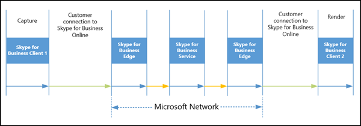
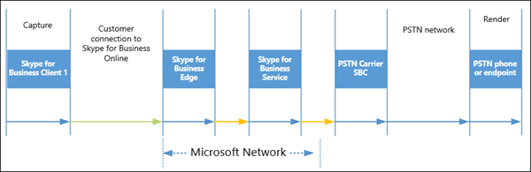
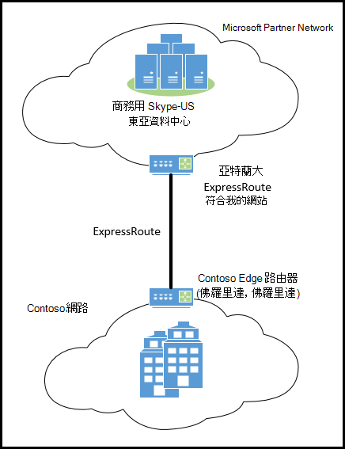
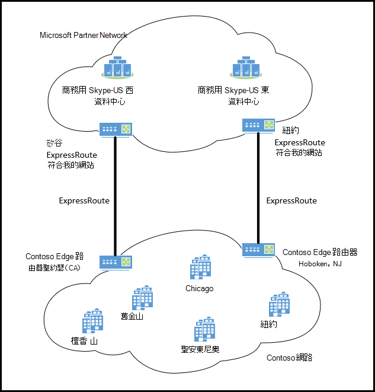
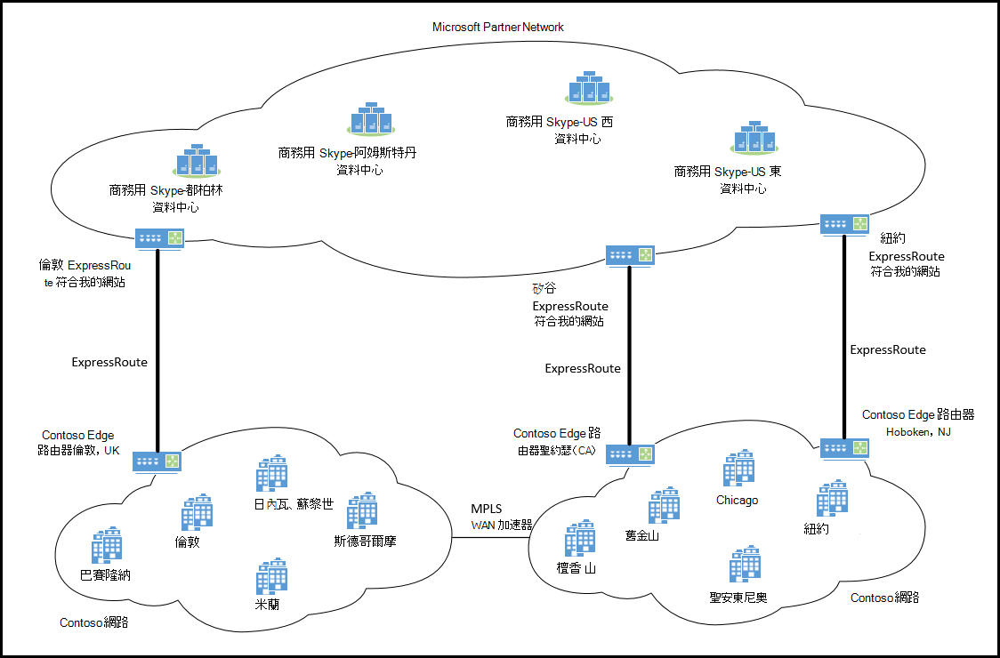
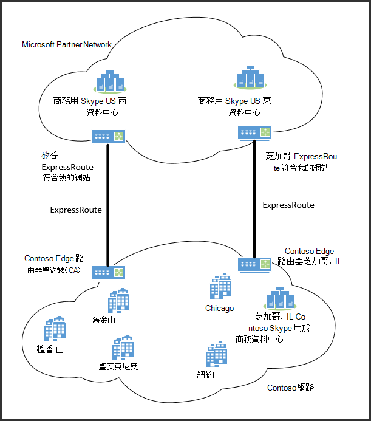
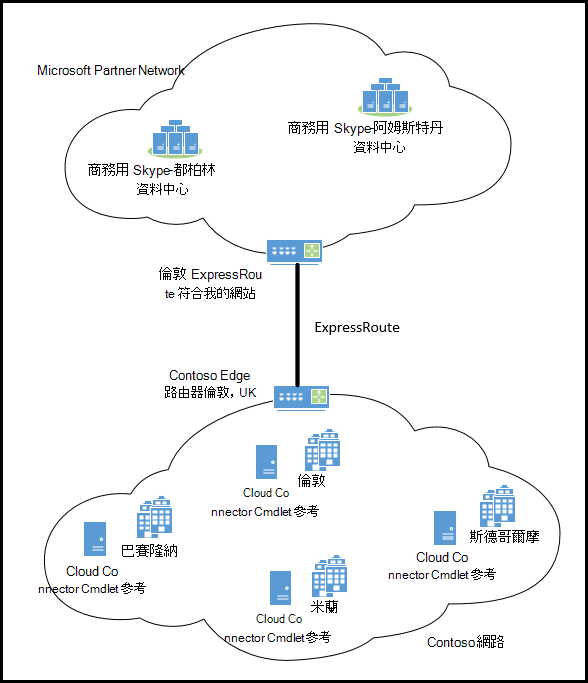
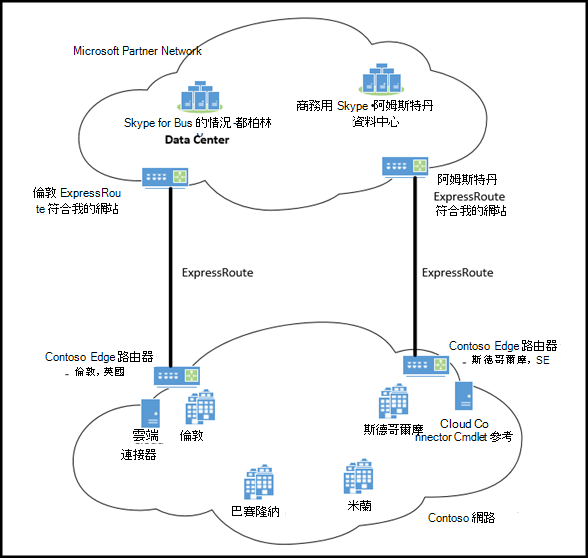

# 商務用 Skype Online 中的媒體質量和網路連線效能

本主題定義商務用 Skype Online 服務的一組網路效能需求，以及您可以如何選擇使用網際網路或 ExpressRoute，在網路和商務用 Skype Online （根據您的網路連線評估）中進行連線。 如果您已決定要將 Azure ExpressRoute 部署到 Microsoft 365 或 Office 365 的專用連線，本檔也提供如何在不同的商務用 Skype Online 部署案例中規劃 ExpressRoute 連線的指導方針。
  
透過 IP 的即時媒體質量（音訊、影片和應用程式共用）會大大影響端對端網路連線的品質。 若要獲得最佳的商務用 Skype Online 媒體質量，請務必確保貴公司的網路與商務用 Skype Online 之間有高品質的連線。 完成這項作業的最佳方式，就是根據網路容量來設定您的內部網路和雲端連線，以適應所有連線中的商務用 Skype Online 的峰值流量。
  
Azure ExpressRoute 不是 Microsoft 365 和 Office 365 服務（包括商務用 Skype Online）的必要條件。 不過，Azure ExpressRoute 是提供的其中一個部署選項，可協助確保 Microsoft 365 或 Office 365 的連線符合商務用 Skype 網路的效能需求，並確保最佳的商務用 Skype Online 媒體質量的體驗。
  
> [!TIP]
> 雖然本主題提供整體網路效能指導方針，但網路評等完整指南不在本檔的範圍內。 若要尋找商務用 Skype Online 合作夥伴的清單，這些合作夥伴可以協助您使用網路效能測量，做為全面且完整的網路評量，請造訪[商務用 Skype 合作夥伴解決方案](http://partnersolutions.skypeforbusiness.com/)。 
  
## 商務用 Skype Online 的網路連線需求

### 影響商務用 Skype Online 媒體質量的因素

在商務用 Skype Online 即時媒體（音訊、影片及應用程式共用）品質上，有許多不同的因素，包括所使用的裝置、環境和網路連線能力。 
  
#### 裝置

在即時媒體會話中，所有參與者（例如耳機和網路 cams）所使用的媒體捕獲和轉譯裝置，都會對整體音訊與視頻品質產生很大的影響。 較低品質的裝置或裝置具有不正確的裝置驅動程式將會產生較低的音訊品質，並降低影像的圖像品質。 另一方面，經過認證的裝置或良好品質的裝置，可協助您進行回聲取消、雜色篩選、影片解析度和減少延遲。
  
雖然不需要經過認證的音訊和視頻媒體裝置，但在商務用 Skype 中是強烈建議的裝置，以獲得最佳的媒體體驗。 如需所有商務用 Skype 認證裝置的清單，請參閱[商務用 skype 的電話和裝置](https://technet.microsoft.com/office/dn947482)。 您可以使用商務用 skype [Online 通話品質儀表板](/microsoftteams/turning-on-and-using-call-quality-dashboard)（在商務用**skype 系統管理中心**中找到）來驗證使用中的裝置是否正常運作，以及監控音訊與視頻媒體質量。
  
> [!TIP]
> **已認證的裝置是取得最佳商務用 Skype 媒體質量體驗所需的裝置**。
  
請務必記住，任何媒體裝置、商務用 Skype 用戶端及商務用 Skype 伺服器（即時媒體流程）都會帶來一些延隔時間。 裝置和軟體處理延遲，以及網路延遲，會對端對端的整體延遲及最終使用者體驗產生很大的影響與貢獻。
  
#### 環境

使用者在會議和使用音訊和視頻裝置的環境和周圍區域，都是音訊與視頻品質的另一個重要因素。 從嘈雜環境撥打電話的使用者會有回顯、muffled 和不清楚的音訊。 較暗或較低環境中的使用者將無法針對影片產生明亮、清晰的影像品質。 在會議室設定中，麥克風與視頻裝置的位置會直接影響參與者將收到的音效和影像品質。
  
若要更清楚地瞭解使用者的音訊和影片體驗，請使用商務用 Skype app**工具** > **選項** > **音訊裝置**或**視頻裝置**，以變更裝置的使用方式，並自訂其設定。

#### 網路

透過 IP 網路的即時媒體質量會受到網路連線品質的極大影響，但特別是下列數量：
  
- **延遲**這是取得 IP 資料包從點 A 到網路上的點 B 所需的時間。 此網路傳播延遲實質上會與兩個點之間的實際距離和光線速度之間的距離產生關聯，包括不同的路由器所佔用的額外負荷。 延遲是以單向或往返時間（RTT）來度量。
    
- **資料包遺失**這通常是定義為在指定的時間視窗中遺失的資料包百分比。 資料包遺失會直接影響音訊品質-從較小、個別遺失且幾乎沒有影響的資料包，到可導致完整音訊切出的後置突發損失。
    
- **資料包間的抖動或簡單地**抖動這是連續資料包之間延遲的平均變更。 大多數現代 VoIP 軟體（包括商務用 Skype）都可以透過緩衝來適應某些層級的抖動。 只有抖動超過了參與者會注意到抖動效果的緩衝，才會出現這種情況。
    
> [!NOTE]
>  抖動的緩衝會增加端對端的延遲。
  
有許多並行的商務用 Skype Online 即時媒體會話，以及其他 Microsoft 365 或 Office 365 服務及其他商務應用程式產生的其他網路流量，請確定整個網路路徑上是否有足夠的頻寬，以便將您的網路連線到商務用 Skype Online 服務，這對於避免網路擁塞並確保正常的媒體即時媒體（音訊）是至關重要的。、影片和應用程式共用）品質。 
  
#### 在擁塞的網路上執行服務品質（QoS）

此外，網路上的流量堵塞會大大影響媒體質量。 若要讓音訊和影片資料包在擁塞的網路中更快速地傳播網路，以及優先于其他網路流量，您可以使用服務品質（QoS）來協助提供最佳的音訊和視頻通訊體驗。
  
QoS 可讓您將較高優先順序指派給攜帶音訊或視頻資料的網路資料包。 透過將較高的優先順序指派給這些資料包，音訊與視頻通訊可能會更快地透過網路進行傳播，且中斷較少，因為涉及檔案傳輸、網頁流覽或資料庫備份等操作的網路會話。 那是由於預設會將用於檔案傳輸或資料庫備份的網路資料包指派為「最大努力」做為優先順序，而網路擁塞則不會產生大的影響。 如果您沒有將較高的優先順序指派給媒體（音訊、影片和應用程式共用），並將其指派為「最大努力」，則也會與所有其他網路流量同時進行處理。 視網路擁塞數量而定，這可能會針對您的使用者提供較低的整體音訊和影片品質體驗。
  
強烈建議您在網路上實施 QoS，以確保網路中的網路擁塞不會受到影響。 不過，為了達到最大的影響，所有的網路端點都必須支援 QoS，這表示所有端點都必須服從 QoS 標記與資料包優先順序。 商務用 Skype Online 服務可在 Microsoft 網路中為 QoS 標示與優先順序。 不過，透過公用連線（例如從公司網路傳送到 Microsoft 網路的網際網路）路由的流量，不會保留 QoS 標記和資料包優先順序。 使用[Azure ExpressRoute](https://azure.microsoft.com/services/expressroute/) ，從您的網路到 Microsoft 365 或 Office 365 的私人連線提供部署方案，可保留 QoS 標記和資料包優先順序，進而針對您的最終使用者增加整體音訊與視頻品質。
  
## 連線至商務用 Skype Online 的網路效能需求

商務用 Skype 即時媒體會透過許多不同的裝置、用戶端應用程式、伺服器軟體，以及跨不同網路進行傳播。 即時媒體的端對端延隔時間是在所有元件和網路區段中引入的延遲總量。 端對端網路連線的品質是由具有最差品質的網路區段所決定。 此區段充當此網路流量的瓶頸。
  
下圖說明從一個商務用 Skype 參與者到另一個商務用 Skype 的會議中的單向音訊流程。
  

  
在此會議案例中，媒體路徑會包含在下列網路區段中：
  
1. **從使用者1到 Microsoft 網路邊緣**的連線這通常包括一個網路連線（例如 WiFi 或乙太網上）、從使用者1到網際網路出口點（您的網路邊緣裝置），以及從網路邊緣到 Microsoft 網路邊緣的網際網路連線。
    
2. **Microsoft 網路中**的連線這是在 Microsoft Edge 到商務用 Skype Online 資料中心之間，使用 A/V 會議伺服器的位置。
    
3. **Microsoft 網路中**的連線這是商務用 Skype Online 資料中心與 Microsoft 網路邊緣之間的差異。
    
4. **從 Microsoft 網路 edge 到使用者2的**連線這包括從您的網路邊緣到 Microsoft 網路 Edge 的網際網路連線，從使用者2到網際網路出口點（您的網路邊緣），以及網路連線（例如 WiFi 或乙太網）。
    
下圖顯示商務用 Skype Online PSTN 通話的元件和網段細目：
  

  
在 PSTN 呼叫案例中，媒體路徑會與下列網路區段交叉：
  
1. **從商務用 Skype 用戶端來電者到 Microsoft 網路邊緣**的連線這通常包括一個網路連線（例如 WiFi 或乙太網路）、從商務用 Skype 用戶端來電至網際網路出口點（您的網路邊緣裝置），以及從您的網路邊緣到 Microsoft 網路邊緣的網際網路連線。
    
2. **Microsoft 網路中**的連線這是在 Microsoft Edge 到商務用 Skype Online 資料中心（其中使用的是中繼伺服器）之間。
    
3. **Microsoft 網路中**的連線這是商務用 Skype Online 資料中心與 Microsoft 網路邊緣之間的差異。
    
4. **Microsoft 網路與 PSTN 服務提供者合作夥伴之間的**連線這個連線是指從 Microsoft 網路外部的商務用 Skype 用戶端撥打 PSTN 通話。
    
### 從商務用 Skype 用戶端到 Microsoft 網路 Edge 的網路效能需求

若要獲得最佳的商務用 Skype 媒體質量，從貴公司的網路連線到 Microsoft 網路 Edge，必須具備下列網路效能測量目標或閾值。 此網路區段包含您的內部網路，包括所有 WiFi 和乙太網路連線，以及透過 WAN 連線的任何公司網站到網站流量，例如，多協定標籤切換（MPLS），以及網際網路或 ExpressRoute 合作夥伴連線至 Microsoft 網路邊緣。
  
> [!CAUTION]
> **貴公司網路上的商務用 Skype 用戶端與 Microsoft 365 或 Office 365 服務之間的連線性，必須符合下列網路效能需求與閾值。**
  
|||
|:-----|:-----|
|**衡量**   |**目標**   |
|延遲（一種方式）    |< 50ms    |
|延遲（RTT 或往返時間）    |< 100ms    |
|突發資料包遺失    |在任何200ms 間隔期間，<10%    |
|資料包遺失    |在任何15s 間隔期間，<1%    |
|資料包內部到達抖動    |在任何15s 間隔期間 <30ms    |
|資料包重新排序    |<0.05% 的順序外資料包    |
   
 **其他效能目標需求：**
  
- Microsoft 網路在全球有超過160的邊緣位置。 我們會透過這些邊緣網站與全球各地的網際網路服務提供者（Isp）搭配使用。 [延隔時間度量] 目標假設您的公司網站或網站，Microsoft 邊緣位於同一個洲上。
    
- 您的公司網站或到 Microsoft network Edge 連線的網站包含第一個躍點網路存取，這可以是 WiFi 或其他無線技術。 
    
- 網路效能目標會採用適當的頻寬和/或服務品質規劃。 換句話說，這會在網路連線達到峰值負載時，直接適用于商務用 Skype 的即時媒體流量。
    
### 從您的網路邊緣到 Microsoft 網路邊緣的網路效能需求

以下是網路邊緣與 Microsoft 網路邊緣之間連線所需的網路效能目標或閾值。 此網路區段不會排除客戶的內部網路或 WAN，且是在測試透過網際網路傳送的網路流量，或是透過 ExpressRoute 合作夥伴網路，也可以在與您的 ExpressRoute 提供者協商效能服務等級協定（SLA）時使用。
  
> [!CAUTION]
> **貴公司網路邊緣與 Microsoft 網路 edge 之間的連線性，必須符合下列網路效能需求與閾值。**
  
|||
|:-----|:-----|
|**衡量**   |**目標**   |
|延遲（一種方式）    |< 30ms    |
|延遲（RTT）    |< 60ms    |
|突發資料包遺失    |在任何 200 ms 間隔期間，<1%    |
|資料包遺失    |在任何15s 間隔期間，<0.1%    |
|資料包內部到達抖動    |在任何15s 間隔期間 <15ms    |
|資料包重新排序    |<0.01% 的順序外資料包    |
   
 **其他效能目標需求：**
  
- 效能目標需要在任何公司的網路邊緣以及其最近的 Microsoft 網路邊緣之間進行連線，才能在同一洲上使用。
    
- 網路效能目標會採用適當的頻寬和/或服務品質規劃。 當網路連線達到峰值負載時，這也適用于商務用 Skype 的即時媒體流量。 如需正確的頻寬與 QoS 規劃，請參閱[商務用 Skype Online 中的 ExpressRoute 與 QoS](https://support.office.com/article/ExpressRoute-and-QoS-in-Skype-for-Business-Online-20c654da-30ee-4e4f-a764-8b7d8844431d)。
    
## 測量網路效能

若要測量實際的網路效能（尤其是對於延遲與資料包遺失），請從任何公司網路網站到網路邊緣，您可以使用 ping 等工具，針對從 Microsoft Edge 和資料中心網站執行的一組商務用 Skype 媒體轉送服務進行測試。 

>[!NOTE]
> 透過 ping （ICMP）測量網路效能無法有效。 基於這個原因，下列的任意播 IP 會停止回應從2020年1月開始的 ICMP 要求。 為了有效測量網路的效果，Microsoft 建議[網路 Assesment 工具](https://www.microsoft.com/download/details.aspx?id=53885)。
  
若要測試 Microsoft 網路的網際網路連線，建議您針對商務用 Skype 媒體轉送器的下列 VIPs 進行測試。 [*任意廣播] VIP*將解析為 Microsoft 網路 Edge 網站中最接近測試位置的媒體轉送 IP 位址。
  
||||
|:-----|:-----|:-----|
|**IP 位址**   |**類型**   |**位置**   |
|13.107.8.2    |VIP    |全球通用的任意點傳送 IP    |
   
 **以下是一些針對評估網路效能需遵循的高層次建議：**
  
- 您應該評估內部網路，以及與 Microsoft 365 或 Office 365 的連線。
    
- 您應該在一段較長的時間內評估並收集所有網路的資料。 我們建議您最少一周的時間來測試網路效能，如此一來，您就可以查看所有商務日期和時間的使用模式。 這會顯示您的高峰時間。
    
- 您應該採取多個網路效能測量範例。 我們建議您在收集資料的整個時段內，在公司網站中每10分鐘進行一次測量。 若要比較商務用 Skype Online 的效能需求，請從這個樣本資料集中取得90% 的度量值。 
    
- 您應該持續評估網路的效能。 由於使用模式變更、新的企業級應用程式使用大量頻寬，以及貴組織或物理公司的位置變更，因此網路使用量會隨著時間而變化。 您必須針對這些網路效能需求與目標/門限來持續監控網路效能，並進行及時調整，以確保最佳的即時媒體質量。 
    
## 使用 Azure Vm 測量網路效能

您不需要針對 Microsoft 網路 Edge 網站進行測試，而是從商務用 Skype 客戶和合作夥伴，在 Microsoft Azure 雲端運用服務測試設定的網路評定方案。 在這些解決方案中，網路評量工具會針對自訂端點（在 Azure 雲端中設定為服務）來測試延遲、資料包遺失和抖動。 因此，測試網路流量會透過一個額外的網路區段進行，這是在網路邊緣與託管網路評等服務的 Azure 資料中心之間的連接。
  
針對以 Azure 託管測試服務為基礎的那些網路評估方案。 我們建議您在國家和/或地區內執行網路評量。 例如，對於美國地區的客戶網站，評估應該針對 Azure 的 [東美國] 資料中心區域中託管的測試服務實例執行。 
  
以下是 Azure 服務基礎網路評量設定的延遲（RTT）目標。 單向延隔時間目標將會是相對應的 RTT 目標的一半。 [資料包遺失] 與 [抖動目標] 與針對以 Skype 媒體轉送為基礎的測試所定義的不同。
  
|||||
|:-----|:-----|:-----|:-----|
|**用戶端區域**   |**Azure 區域**   |**您的網路邊緣-Azure 往返時間（RTT）**   |**您的網站-Azure 往返時間（RTT）**   |
|美國中部    |美國中部    |99    |139    |
|東美國    |東美國    |86    |126    |
|美國中北部    |美國中北部    |97    |137    |
|美國中南部    |美國中南部    |94    |134    |
|美國西部    |美國西部    |94    |134    |
|夏威夷我們    |美國西部    |116    |156    |
|加拿大中央    |加拿大中央    |138    |178    |
|加拿大東部    |加拿大東部    |131    |171    |
|北歐    |北歐    |99    |139    |
|西歐    |西歐    |95    |135    |
|東亞    |東亞    |118    |158    |
|東南亞    |東南亞    |97    |137    |
|日本東    |日本東    |111    |151    |
|日本西部    |日本西部    |118    |158    |
|巴西南部    |巴西南部    |70    |110    |
|澳大利亞東    |澳大利亞東    |124    |164    |
|澳大利亞東南部    |澳大利亞東南部    |124    |164    |
|印度中部    |印度中部    |103    |143    |
|南部印度    |南部印度    |103    |143    |
|印度西部    |印度西部    |103    |143    |
|中國東    |中國東    |120    |160    |
|中國北部    |中國北部    |120    |160    |
   
## 媒體質量與 ExpressRoute

Microsoft 365 或 Office 365 的 Azure ExpressRoute 是連線至 Microsoft 365 或 Office 365 的私人網路絡連線。 它可讓客戶控制其網路流量採取的路徑。 他們不再需要關心在網際網路上發生的無法預知的路由，以及由不明運營商、供應商和 Isp 傳送資料的情況。 透過 ExpressRoute 傳送的網路流量會直接在 ExpressRoute 合作夥伴的網路上傳送到 Microsoft 的網路。 這可讓客戶對待 Microsoft 365 或 Office 365，就像它位於自己的非現場資料中心，且有專用的連線。
  
Azure ExpressRoute 適用于所有 Microsoft 365 和 Office 365 授權產品。 不過，Microsoft 365 和 Office 365 必須具備 Azure ExpressRoute Premium 附加元件，才能啟用全域路由。 在執行 ExpressRoute 最少的500座位的客戶，可以取得必要的*ExpressRoute Premium 附加*元件，而不需要額外費用。
  
### 是否需要 ExpressRoute 才能取得良好的媒體質量？

Azure ExpressRoute 不是取得最佳商務用 Skype Online 媒體質量的需求。 不過，您可以在其中一個部署選項中，協助您確定雲端連線能力符合商務用 Skype 網路效能目標或閾值。
  
Microsoft 365 和 Office 365 是高效能和使用網際網路的安全服務。 我們繼續投資新的安全性功能和地區邊緣節點，以持續改善安全性和效能。 Azure ExpressRoute 不是 Microsoft 365 或 Office 365 服務（包括商務用 Skype Online）的必要條件。 Azure ExpressRoute 是提供的其中一個部署選項，可協助確保 Microsoft 365 或 Office 365 的連線符合商務用 Skype 網路的效能需求，並確保最適合商務用 skype Online 媒體質量的最佳體驗。
  
針對商務用 Skype Online 媒體質量，您的公司網站與 microsoft 網路邊緣之間的連線，必須符合[從商務用 skype 用戶端到 microsoft 網路 edge 的網路效能需求](media-quality-and-network-connectivity-performance.md#bkSfBClienttoEdge)中的效能目標，而且您的網路邊緣與 microsoft 網路邊緣之間的連線速度，符合網路邊緣與[Microsoft 網路 edge 網路效能需求](media-quality-and-network-connectivity-performance.md#bkYourNetworkEdge)的效能目標。  
  
您公司的物理網路連線也很重要，包括您的內部網路和雲端連接能力，以適應媒體流量的峰值。 Azure ExpressRoute 是多種方法，可協助客戶確保其商務用 Skype Online 雲端連線能力符合這些效能需求。
  
### 語音品質 SLA 是否需要 ExpressRoute？

否，商務用 Skype Online 語音品質 SLA 不需要 ExpressRoute。 [商務用 Skype Online 語音品質 SLA](http://www.microsoftvolumelicensing.com/DocumentSearch.aspx?Mode=3&amp;DocumentTypeId=37)適用于在正確的授權及訂閱中，任何由任何商務用 skype online 語音服務使用者所放置的任何合格電話，都能讓該使用者進行任何類型的 VOIP 或 PSTN 通話。 語音品質 SLA 應包括以下所有條件：
  
- 從 Microsoft 認證的 IP 電話撥打電話。
    
- 有線乙太網連線。
    
- Microsoft 網路問題造成的語音品質問題。
    
> [!NOTE]
> 語音品質 SLA 會排除低通話品質是由非 Microsoft 網路（包括 ExpressRoute 合作夥伴及其他網路）中的問題所造成的通話。 
  
### 網際網路或 Azure ExpressRoute？

在針對商務用 Skype Online 作出網路連線選項的決定之前，客戶必須根據網路效能需求中所述的網路效能需求來評估其網路和目前[的網際網路連線，以連接至商務用 Skype online](media-quality-and-network-connectivity-performance.md#bkNetworkPerf)。
  
如果目前網際網路連線的網路效能在高峰期間設定為足夠的容量，且符合從網站到 Microsoft 網路邊緣以及從網路邊緣到 Microsoft 網路邊緣的網路效能需求，您就可以繼續使用現有的網際網路連線，連線到商務用 Skype Online。
  
對於無法符合網路效能需求的公司網站，我們強烈建議您先與現有的網路服務提供者合作，以提升整體網路效能。 不過，如果他們仍不符合您的需求，使用 Azure ExpressRoute 可協助確保您的商務用 Skype Online 雲端連線能力能協助您符合網路效能需求。
  
Azure ExpressRoute 提供下列額外優點：
  
- 在您的網路與 Microsoft 網路之間連線的服務層級合約（SLA）。 ExpressRoute 已保證可用性 SLA 為99.9%。
    
- Microsoft 365 和 Office 365 服務所需的已規劃且有保證的頻寬。 您可以只使用 ExpressRoute 傳送 Microsoft 365、Office 365 或商務用 Skype 流量，然後讓所有其他網際網路流量都透過您網路的其他網際網路出口/進入點來達到此目的。
    
- ExpressRoute 的設計目的是要在您的網路與 Microsoft 網路之間保留 DSCP QoS 標記。
    
如需 ExpressRoute QoS 及容量規劃的詳細資訊，請參閱[商務用 Skype Online 中的 ExpressRoute 與 QoS](https://support.office.com/article/ExpressRoute-and-QoS-in-Skype-for-Business-Online-20c654da-30ee-4e4f-a764-8b7d8844431d)。
  
### 我可以只在商務用 Skype Online 中設定 Azure ExpressRoute 嗎？

是的，您可以設定 Azure ExpressRoute，以確保貴公司網路的最佳網路連線，只適用于商務用 Skype Online。 這可為您的使用者提供最適合的即時媒體質量，但您可以繼續透過網際網路連線至其他 Microsoft 365 或 Office 365 服務。
  
Border 閘道通訊協定（BGP）是網際網路上的路由通訊協定，用來路由網際網路間的網路流量。 它的設計目的是要在透過網際網路找到的自治系統（AS）之間交換路由資訊。 BGP 社區值是可套用至內送或外寄路由的屬性標記。 BGP 社區通常是用來通知接收，您可以根據地理位置、服務類型或其他準則，使用哪一個輸出連結來到達特定目的地。
  
有了 BGP 社區支援，Microsoft 就會根據所歸屬的服務，以適當的 BGP 群組值來標記首碼和路由。 Microsoft 將會透過公用對等與 Microsoft 對等專案，以適當的 BGP 群組值來標記首碼，以指出該首碼的託管區域。 您可以依據社區值來進行適當的路由決定，以提供最佳路由。 您可以使用商務用 Skype Online BGP 社區值，僅針對商務用 Skype Online 設定 ExpressRoute 連線。 您可以在[ExpressRoute 路由需求](https://azure.microsoft.com/documentation/articles/expressroute-routing/)中找出更多的資訊。
  
## 商務用 Skype Online 的 ExpressRoute 連接案例

如果您已決定依據上述建議所提供的 ExpressRoute，以下是您應該取得多少種 ExpressRoute 連接的建議。
  
### 僅限線上部署-單一網站

如果您的所有使用者都使用商務用 Skype Online 服務，而且您的辦事處是以單一物理位置為中心，而您決定要部署 Azure ExpressRoute，您應該在公司網站之間設定單一 ExpressRoute 連線到最接近的[expressroute 對等位置](https://azure.microsoft.com/documentation/articles/expressroute-locations/)。
  
下圖顯示此類型部署的範例。 在這個範例中，Contoso 是位於佛羅里達州奧蘭多的大學。 Contoso 擁有10000教職員和學生。 從其位置到 Microsoft edge 網站的網際網路測試，在高峰課程時間顯示的資料包遺失率超過5%。 他們已決定使用 ExpressRoute 與預配的頻寬來取得 Microsoft 365 或 Office 365 的專用連線，讓他們可以避免 Microsoft 365 或 Office 365 的網路擁塞，特別是適用于商務用 Skype Online 的即時流量。 在亞特蘭大、GA MeetMe 網站上，他們會透過 ExpressRoute 連線至 Microsoft 雲端。
  

  
### 僅限線上部署-相同洲上的多個網站

如果您的公司使用的是同一個區域或洲中多個辦公室的商務用 Skype Online 服務，而您選擇要實現 Azure ExpressRoute，建議您透過 ExpressRoute 連線您的主要網站，然後選擇性地針對不符合建議網路效能目標的其他位置新增其他 ExpressRoute 對等功能。
  
在下列範例中，Contoso 是總部在紐約的美國旅遊服務公司，但在美國還有其他辦事處。 其辦公室是透過使用 MPLS 來連線至 Microsoft 365 或 Office 365 的 WAN 進行站間連接。 它們最初是從其網際網路路由器設定 ExpressRoute 連線，在 Hoboken 中，新的澤西至紐約 MeetMe 網站。 
  
透過這項設定，來自大多數網站的網路流量都可以從商務用 skype 用戶端連線至 microsoft 網路 Edge，以符合商務用 skype 客戶[端的網路效能需求](media-quality-and-network-connectivity-performance.md#bkSfBClienttoEdge)。 不過，Contoso 的 west 海岸辦公室之間的延遲到紐約，都是單向的50ms。 此外，Honolulu 是 Contoso 的第二大 office，從 Honolulu 到紐約的延遲超過80ms 的單向。 為了確保這些辦公室中的使用者具備良好的媒體質量，Contoso 決定在其聖約瑟網站和矽低谷 ExpressRoute MeetMe 網站之間新增 west coast ExpressRoute 連線。
  

  
### 僅限線上部署-不同洲的多個網站

如果您的所有使用者都是使用商務用 Skype Online 服務，而且您的辦事處位於多個洲的多個物理位置，則如果您決定要部署 Azure ExpressRoute，您應該針對其最接近的[expressroute 對等位置](https://azure.microsoft.com/documentation/articles/expressroute-locations/)，為每個洲主要網站的每個洲至少設定一個 ExpressRoute 連線。 根據成本與收益，您可以選擇從不符合網路效能目標的網站部署其他 ExpressRoute 連線。
  
在下列範例中，Contoso 是一個大型企業法律公司，其中主要城市遍佈北美和歐洲的辦事處。 根據網際網路連線和其內部網路效能評估，Contoso 決定在北美使用兩個 ExpressRoute 連線，並針對其所有歐洲辦事處部署單一 ExpressRoute 電路。
  

  
### 混合式部署

如果您擁有內部部署的 Lync 或商務用 Skype 部署，然後選擇要實施混合式商務用 Skype Online 整合，建議您在部署 Azure ExpressRoute 時，針對每個內部部署的 Lync 或商務用 Skype Edge 網站，以及每個有辦事處的洲，都至少有一個 ExpressRoute 連接。 根據成本與收益，您可以選擇從不符合網路效能目標的辦公室部署其他 ExpressRoute 連線。
  
如果您有內部部署商務用 Skype 部署，您必須遵循[Edge 伺服器規劃與部署指南](https://technet.microsoft.com/library/mt346417.aspx)。 具體說來，邊緣伺服器必須可從您的網路外部進行訪問。 這通常是將可路由的公用 IP 位址指派給 Edge 伺服器，或使用網路位址轉譯（NAT）來實現。
  
在下列範例中，Contoso 已有內部部署商務用 Skype Enterprise Voice 部署。 他們想要將內部部署使用者遷移至 Microsoft 365 或 Office 365 線上服務。 它們也決定使用混合式部署，讓他們可以繼續針對所有內部部署和線上使用者使用其現有的 PSTN 基礎結構。 Contoso 的內部部署資料中心與商務用 Skype Edge 伺服器位於芝加哥。 針對其部署，Contoso 決定在其芝加哥資料中心與芝加哥 ExpressRoute 之間設定一個 ExpressRoute 連線。 它們也新增了 [west coast ExpressRoute] 連線，以更好地提供其 Honolulu office。
  

  
### 使用雲端連接器版本進行線上部署

商務用 Skype Online 雲端連接器版是混合式方案，包含一組可執行內部部署 PSTN 連線的封裝虛擬電腦（Vm）。 透過在虛擬化的環境中部署最小的商務用 Skype 伺服器拓撲，您就可以透過現有的內部部署 PSTN 語音結構，在市話和行動電話上傳送和接收通話。
  
如果您決定要部署 Azure ExpressRoute 和雲端連接器版本，我們建議您為每個洲的主要網站設定至少一個 Express 路由連線至最接近的[ExpressRoute 對等位置](https://azure.microsoft.com/documentation/articles/expressroute-locations/)。 根據成本與收益，您可以選擇從無法符合網路效能目標的網站部署其他 ExpressRoute 連線。
  
如果您有內部部署商務用 Skype 部署，您必須遵循[商務用 Skype 雲端連接器版本的規劃指南](https://technet.microsoft.com/library/mt605227.aspx)。 具體來說，應該將存取邊緣與 A/V 邊緣服務指派給公用 IP 位址，以及可存取的 Microsoft 365 或 Office 365 資料中心。
  
在下列範例中，Contoso 是一個歐洲會計公司，其中有幾個主要的歐洲國家/地區和市集中的目前狀態。 當他們註冊商務用 Skype Online 以瞭解他們的所有共同作業需求時，他們會決定要為每個國家/地區加入一個雲端連接器，以繼續使用其 PSTN 基礎結構和已存在的載波合約。 根據其在所有網站和 Microsoft 網路邊緣的測試，他們決定倫敦的單一 ExpressRoute 連線將可協助符合商務用 skype 用戶端連線網路的效能目標，具體說明請參閱[商務用 skype 用戶端到 Microsoft 網路 Edge 的網路效能需求](media-quality-and-network-connectivity-performance.md#bkSfBClienttoEdge)。
  

  
以下是 Contoso 的另一個部署選項。 在這種情況下，它們決定要在部署雲端連接器的每個網站上設定 ExpressRoute 連線。 
  

  
## 相關主題

[商務用 Skype Online 中的 ExpressRoute 與 QoS](expressroute-and-qos-in-skype-for-business-online.md)

  
 
