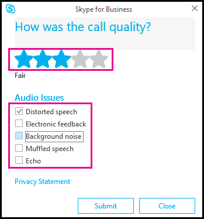

# 針對商務用 Skype Online 優化您的網路Optimizing your network for Skype for Business Online

下列需求對於您針對您的組織所設定的所有商務用 Skype Online 功能而言，都是非常重要的。The following requirements are really important to ensure the long-term health and success for all Skype for Business Online features you are setting up for your organization. 我們知道你們中的部分都非常技術性-這份檔適用于您，但您不在其中。We know some of you are very technical - this document is for you, but there are some of you that aren't. 如果您需要協助設定商務用 Skype Online，您應該閱讀這份檔，熟悉您需要考慮的事項。If you need help setting up Skype for Business Online, you should read this document to become familiar with the things you need to consider. 您也可以在使用[Microsoft FastTrack Center](https://fasttrack.microsoft.com/office)、microsoft 服務與帳戶小組，或使用[microsoft 合作夥伴](https://partnercenter.microsoft.com/pcv/search)來瞭解如何符合這些需求，為您提供相關討論。It will also give you things to talk about when you are working with the [Microsoft FastTrack Center](https://fasttrack.microsoft.com/office), your Microsoft Services and account teams, or with [Microsoft partners](https://partnercenter.microsoft.com/pcv/search) to figure out how you can meet these requirements.

## 快速概覽A quick overview

商務用 Skype 可讓您與公司或世界各地的同事或企業合作夥伴連線。Skype for Business lets you connect with co-workers or business partners in your company or around the world.

在商務用 Skype 中，您可以：With Skype for Business, you can:

- 開始與 IM、語音或視頻通話交談。Start conversations with IM, voice, or video calls.

- 查看您的連絡人是在線上、在會議中或在簡報中提供。See when your contacts are available online, in a meeting, or presenting.

- 設定會議的工業強度安全性。Set industrial-strength security for meetings.

- 線上廣播至大型物件。Broadcast online to a large audience.

- 在會議期間顯示您的螢幕，或授與他人控制權。Present your screen during meetings or give control to others.

- 在其他 Office 程式中使用商務用 Skype 來聊天、通話或使用按一下來加入會議。Use Skype for Business in other Office programs to chat, call, or join a meeting with a click.

## 為什麼這麼重要？Why is this all so important?

透過 IP 的即時媒體質量（音訊、影片和應用程式共用）會大大影響端對端網路連線的品質。The quality of real-time media (audio, video, and application sharing) over IP is greatly impacted by the quality of end-to-end network connectivity. 若要獲得最佳的商務用 Skype Online 媒體質量，請務必確保貴公司的網路與商務用 Skype Online 之間有高品質的連線。For optimal Skype for Business Online media quality, it is important for you to make sure there is a high-quality connection between your company network and Skype for Business Online. 完成這項作業的最佳方式，就是根據網路容量來設定您的內部網路和雲端連線，以適應所有連線中的商務用 Skype Online 的峰值流量。The best way to accomplish this is to set up your internal network and cloud connectivity based on the capacity of your network to accommodate for peak traffic volume for Skype for Business Online across all connections.

使用[Microsoft 合作夥伴](https://partnercenter.microsoft.com/pcv/search)，您可以將各種 Microsoft 365 或 Office 365 應用程式連線到您的網路，包括雲端的商務用 skype Online，以及商務用 skype 的即時語音及視頻通訊功能，必須具備專門設定的網路服務，以支援這些 Microsoft 365 與 Office 365 即時工作負載。Working with a [Microsoft partner](https://partnercenter.microsoft.com/pcv/search), you can connect a variety of Microsoft 365 or Office 365 applications including Skype for Business Online in the cloud to your network and real-time voice and video communications capabilities for Skype for Business require network services must be specifically configured to support these Microsoft 365 and Office 365 real-time workloads. 這包括具備足夠頻寬的網路，以傳送所需的流量，並且能夠支援服務品質（QoS）來為您的使用者供應商務類別體驗。This includes a network that has sufficient bandwidth to carry the required volume of traffic and be capable of supporting Quality of Service (QoS) to deliver a business class experience for your users.

在這裡，還有其他資源可協助您成功規劃及部署商務用 Skype Online 服務和功能，並確保您的網路服務符合這些需求：Along with the information here, there are other resources that can help you successfully plan and deploy Skype for Business Online services and features and to ensure that your network services meet those requirements:

- [使用 ExpressRoute 的通話流程Call flow using ExpressRoute](call-flow-using-expressroute.md)

- [商務用 Skype Online 中的 ExpressRoute 與 QoSExpressRoute and QoS in Skype for Business Online](expressroute-and-qos-in-skype-for-business-online.md)

- [商務用 Skype Online 中的媒體質量和網路連線效能Media Quality and Network Connectivity Performance in Skype for Business Online](media-quality-and-network-connectivity-performance.md)

## 針對商務用 Skype 實施服務品質（QoS）Implement Quality of Service (QoS) for Skype for Business

移至商務用 Skype Online 前，您應該先瞭解網路的容量，才能處理音訊、影片和共用會話流量。Before moving to Skype for Business Online, you should take a look at your network's capacity to handle audio, video and sharing session traffic. 與其他 Microsoft 365 和 Office 365 服務一樣，Microsoft 還提供下載商務用[Skype 頻寬計算機](https://www.microsoft.com/download/details.aspx?id=19011)，用來判斷每個公司網站所需的網路流量。As with other Microsoft 365 and Office 365 services, Microsoft has available for download the [Skype for Business Bandwidth Calculator](https://www.microsoft.com/download/details.aspx?id=19011) that's used to determine the required network traffic for each of your company sites. 您應該執行使用方式建模，包括建模即時通訊流量媒體流程，以及每個公司位置的商務用 Skype 流量、計算流量量，以及分析該流量對您的整個網路產生的影響。You should perform usage modeling, including modeling real-time communication traffic media flows and the amount of Skype for Business traffic per company location, calculating traffic volume, and analyzing how that traffic impacts your overall network. 完成之後，請對此資料進行分析，以提供您的網路需要改良的建議，以及建議佇列大小，以提供絕佳的使用者體驗。After you've done that, analysis of this data should provide recommendations of where your network needs to be improved and recommend queue sizes in order to provide an excellent end user experience.

商務用 Skype 即時流量對資料包遺失、延遲和抖動是敏感的，在擁擠的網路中通常會發生這種情況。Skype for Business real-time traffic is sensitive to packet loss, delay and jitter, which occur frequently in congested networks. 服務品質（QoS）-有時稱為服務類別-也必須部署在 managed 外部 Wan、managed 內部局域網及企業級的 WiFi 網路上。Quality of Service (QoS) - sometimes called Class of Service - must also be deployed on managed external WANs, managed internal LANs, and enterprise-based WiFi networks. 這將協助您以正確的方式，將商務用 Skype 的即時流量（例如音訊與視頻）與本機網路和 WAN 上的其他非實際時間流量進行排序，為使用者帶來更佳的體驗。This will help to properly prioritize Skype for Business real-time traffic such as audio and video over other non-real time traffic on local networks and over WAN, creating a better experience for end users.

商務用 skype 音訊必須部署在 EF （加急轉寄-DSCP 46）佇列中，而商務用 Skype 影片必須部署在 AF41 （有保證的轉寄 DSCP 34）佇列中。Skype for Business audio must be deployed in the EF (Expedited Forwarding - DSCP 46) queue and Skype for Business video must be deployed in the AF41 (Assured Forwarding - DSCP 34) queue. 即便是對等與會議流量，也是如此，不論 Microsoft 365 或 Office 365 中的電話系統或是否已部署其他電話服務功能。This is true even for peer-to-peer and conferencing traffic, regardless of whether Phone System in Microsoft 365 or Office 365 or other telephony features are being deployed.

雖然現有的 QoS 原則可能是在 LAN 和 WAN 上的其他 IP 電話產品中，但商務用 Skype 可讓使用者在使用服務時，行動電話並從地點移至地點。While existing QoS policies might be in place already on the LAN and WAN for other IP telephony products, Skype for Business allows users to be mobile and to move from location to location while using the service. 因此，QoS 原則必須在 LAN、WAN 和無線網路上標示，才能確定所有的商務用 Skype 流量都已在受管理的網路上劃分優先順序。Because of this, QoS policies must be marked on the LAN, WAN and wireless networks in order to be sure that all Skype for Business traffic is being prioritized across managed networks.

若要協助您調整您的網路大小，請下載[商務用 Skype 頻寬計算機](https://www.microsoft.com/download/details.aspx?id=19011)。To help you will sizing your network, download the [Skype for Business Bandwidth Calculator](https://www.microsoft.com/download/details.aspx?id=19011).

如需更多關於媒體質量與 QoS 的資訊，請參閱[商務用 Skype Online 中的媒體質量和網路連線效能](media-quality-and-network-connectivity-performance.md)。For more about media quality and QoS, see [Media Quality and Network Connectivity Performance in Skype for Business Online](media-quality-and-network-connectivity-performance.md).

如需有關設定和管理 QoS 的詳細資訊，請參閱[管理服務品質](https://technet.microsoft.com/library/gg425841.aspx)。For more about setting up and managing QoS, see [Managing Quality of Service](https://technet.microsoft.com/library/gg425841.aspx).

## 旁路 proxy 與 WAN 優化裝置Bypass proxies and WAN optimization devices

所有 Microsoft 365 或 Office 365 （包括商務用 Skype Online）都經過加密，且通常無法由 proxy 裝置檢查。All Microsoft 365 or Office 365 including Skype for Business Online is encrypted and is typically not able to be inspected by proxy devices. 出於這些原因，我們建議您針對所有 Microsoft 365 和 Office 365 網路流量（定義為您的使用者對[Office 365 url 和 IP 位址範圍](https://support.office.com/article/8548a211-3fe7-47cb-abb1-355ea5aa88a2)所做的連線），繞過 proxy 裝置。For these reasons we recommend bypassing proxy devices for all Microsoft 365 and Office 365 network traffic as defined as connections your users make to [Office 365 URLs and IP address ranges](https://support.office.com/article/8548a211-3fe7-47cb-abb1-355ea5aa88a2). 由於 proxy 裝置可能會在即時商務用 Skype Online 媒體資料流程中引入延遲，我們強烈建議您至少跳過該流量的 proxy 裝置。Since proxy devices will likely introduce delay in real-time Skype for Business Online media streams we strongly recommend bypassing proxy devices at a minimum for that traffic.

Microsoft 建議使用 PAC 檔案排除 Microsoft 365 和 Office 365 Url，以將 Microsoft 365 和 Office 365 流量傳送到防火牆。Microsoft recommends excluding Microsoft 365 and Office 365 URLs using PAC files to send Microsoft 365 and Office 365 traffic to a firewall.

以下是一些可協助您解決問題的資源：Here are some available resources that can help too:

- [使用比較基準與效能歷程記錄的 Microsoft 365 或 Office 365 效能調整Microsoft 365 or Office 365 performance tuning using baselines and performance history](https://support.office.com/article/1492cb94-bd62-43e6-b8d0-2a61ed88ebae)

- [Microsoft 365 或 Office 365 的網路與遷移規劃Network and migration planning for Microsoft 365 or Office 365](https://support.office.com/article/f5ee6c33-bcd7-4b0b-b0f8-dc1d9fb8d132)

- [Office 365 Proxy Pac 發生器Office 365 Proxy Pac generator](https://gallery.technet.microsoft.com/Office-365-Proxy-Pac-60fb28f7)

- [使用 WAN 優化控制器或使用 Microsoft 365 或 Office 365 的流量/檢查裝置Using WAN Optimization Controller or Traffic/Inspection devices with Microsoft 365 or Office 365](https://aka.ms/kb2690045)

- [使用 ExpressRoute 針對 Microsoft 365 或 Office 365 進行路由Routing with ExpressRoute for Microsoft 365 or Office 365](https://support.office.com/article/e1da26c6-2d39-4379-af6f-4da213218408)

## 略過雙加密Bypass double encryption

若要為使用者提供最佳的音訊和視頻體驗，您必須執行一個解決方案，讓商務用 Skype 媒體（音訊和影片）無法透過虛擬私人網路（VPN）隧道來遍歷。To provide users the best possible audio and video experience, you must implement a solution that prevents Skype for Business media (audio and video) from traversing a Virtual Private Network (VPN) tunnel. 所有商務用 Skype 通訊都是以傳輸層安全性（TLS）加密，且媒體工作負載是以安全即時通訊協定（SRTP）加密。All Skype for Business traffic is encrypted with Transport Layer Security (TLS) and the media workloads are encrypted with Secure Real Time Protocol (SRTP). 信號是以 TLS 加密，媒體工作負載是使用 SRTP 進行加密。Signaling is encrypted with TLS and the media workloads are encrypted with SRTP. 透過 VPN 隧道傳送這項流量會增加額外的加密層級，以及用戶端與 Microsoft 365 或 Office 365 之間的其他網路躍點，這兩者都可能造成降級、資料包遺失及延遲。Sending this traffic over the VPN tunnel adds an extra layer of encryption, and additional network hops between the client and Microsoft 365 or Office 365, both of which can result in a degraded session because it increases jitter, packet loss and latency.

其中一個選項可讓商務用 Skype 流量無法透過 VPN 隧道來分割隧道。One option to prevent Skype for Business traffic from traversing the VPN tunnel is Split Tunneling. 若要實現分割隧道，客戶必須向其 VPN 供應商諮詢如何在軟體中執行此操作的詳細資訊。To implement split-tunneling, customers should consult with their VPN vendor on the specifics of how to do this in their software.

> [!NOTE]
> 這僅適用于商務用 Skype 媒體工作負載，不適用於其他 Microsoft 365 或 Office 365 服務。This is only required for the Skype for Business media workloads and isn't applicable to other Microsoft 365 or Office 365 services.

其他資源：Additional resources:

- [啟用 Lync 媒體旁路 VPN 隧道Enabling Lync Media to Bypass a VPN Tunnel](https://blogs.technet.microsoft.com/nexthop/2011/11/14/enabling-lync-media-to-bypass-a-vpn-tunnel/)

- [深入瞭解直接存取、分割隧道及強制隧道More on Direct Access, Split Tunneling and Force Tunneling](https://blogs.technet.com/b/tomshinder/archive/2010/03/30/more-on-directaccess-split-tunneling-and-force-tunneling.aspx)

- [啟用直接存取Enable Direct Access](https://technet.microsoft.com/library/jj574163.aspx)

## 確定正確的埠和通訊協定已開啟Ensure the right ports and protocols are open

客戶必須確保適用于 Microsoft 365 或 Office 365 服務所需的 Url 和 IP 位址。Customers must ensure reachability of the URLs and IP addresses that are required for the Microsoft 365 or Office 365 service. 如需所有 IP 位址的完整清單及商務用 Skype Online 的 Url，請參閱[Office 365 url 與 IP 位址範圍](https://support.office.com/article/8548a211-3fe7-47cb-abb1-355ea5aa88a2)。For a complete listing of all IP addresses and URLs for Skype for Business Online, see [Office 365 URLs and IP address ranges](https://support.office.com/article/8548a211-3fe7-47cb-abb1-355ea5aa88a2).

商務用 Skype 用戶端使用各種不同的埠和通訊協定。Skype for Business clients use a variety of ports and protocols. 商務用 Skype 會話的網路流量方向與流程會根據互動（對等對等與多方）類型的不同而有所不同，這取決於內容共用和語音/影片的使用。The direction and flow of network traffic for a Skype for Business session will vary depending on the type of interactions (peer-to-peer vs multiparty) and depending on the use of content sharing and voice/video. 您必須審查並開啟埠和通訊協定清單，特別注意來源和目的地埠。You must review and open the list of ports and protocols, paying special attention to the source and destination ports. 例如，音訊流量在用戶端只使用20個埠（50000-50019 TCP/UDP），但是目的地埠可能位於服務端的10K 埠範圍（50000-59999 TCP/UDP）中的任何位置。For example, audio traffic uses just 20 ports (50000-50019 TCP/UDP) at the client side, but the destination port could be anywhere in a 10K port range (50000-59999 TCP/UDP) at the service side. 這也包括在防火牆上開啟 TCP 443 和 UDP 3478。This also includes opening TCP 443 and UDP 3478 on the firewall.

可能還需要其他網路設定，才能支援商務用 Skype Online。Additional network configuration might also be required to support Skype for Business Online.

## 使用針對商務用 Skype 優化的電話和裝置Use Phones and Devices Optimized for Skype for Business

在即時媒體會話中，所有參與者（例如耳機和網路 cams）所使用的媒體裝置都會對整體音訊與視頻品質產生很大的影響。In a real-time media session, media devices that are used by all participants such as headsets and web cams have a great impact on the overall audio and video quality. 較低品質的裝置或裝置具有不正確的裝置驅動程式，將會產生較低的音訊品質，以及較低的影像品質。Lower-quality devices or devices with incorrect device drivers will produce lower overall sound quality for audio and lower image quality for video. 另一方面，經過認證的裝置或良好品質的裝置，可協助您進行回聲取消、雜色篩選、影片解析度和減少延遲。Certified devices or good quality devices, on the other hand, help with echo cancellation, noise filtering, video resolution and reduce latency.

手機和裝置為使用者的音訊和視頻品質產生了巨大的差異。Phones and devices make a huge difference in the quality of audio and video for end users. 商務用 Skype 認證程式是「Lync 相容性」計畫的演變，並驗證裝置符合 Microsoft 音訊與視頻的標準。The Skype for Business certification program is an evolution of the "Lync Compatible" program and validates that the device meets Microsoft standards for audio and video. 有許多 IP 手機、USB 音訊與視頻裝置、電腦和會議室裝置經過 Microsoft 測試和認證。There are a number of IP Phones, USB audio and video devices, PCs and meeting room devices that have been tested and qualified by Microsoft. 您應該查看針對商務用 Skype 優化的裝置清單，並為您提供不同的裝置，以符合貴組織使用者的各種需求和個人喜好設定。You should review the list of devices that are optimized for Skype for Business, and work to provide different devices in order to meet the various needs and personal preferences of your end users in your organization.

如需支援與認證的裝置的詳細資訊，請參閱下列內容：See the following for more information on supported and certified devices:  

- [取得商務用 Skype Online 的電話Getting phones for Skype for Business Online](../what-is-phone-system-in-office-365/getting-phones-for-skype-for-business-online/getting-phones-for-skype-for-business-online.md)

- [商務用 Skype 的電話和裝置Phones and Devices for Skype for Business](https://technet.microsoft.com/office/dn947482.aspx)

- [個人週邊設備的解決方案目錄Solutions Catalog for Personal Peripherals](http://partnersolutions.skypeforbusiness.com/solutionscatalog/personal-peripherals-pcs)

- [Microsoft Lync 適用的電話和裝置Phones and devices qualified for Microsoft Lync](https://technet.microsoft.com/office/dn788944.aspx)

使用者在會議和使用音訊和視頻裝置的環境和周圍區域，都是音訊與視頻品質的另一個重要因素。The environment and surrounding area where users are meeting and using audio and video devices is another big factor for audio and video quality. 從嘈雜環境撥打電話的使用者會有回顯、muffled 和不清楚的音訊。Users calling from a noisy environment will have echoed, muffled and unclear audio. 較暗或較低環境中的使用者將無法針對影片產生明亮、清晰的影像品質。Users in a dark or low light environment won't be able to produce bright, clear image quality for video. 在會議室設定中，麥克風與視頻裝置的位置會直接影響參與者將收到的音效和影像品質。In a conference room setting, the location of the microphone and video device have a direct impact on the sound and image quality that participants will receive.

若要更清楚地瞭解使用者的音訊和影片體驗，請使用商務用 Skype 應用程式**工具** > **選項** > **音訊裝置**或**視頻裝置**，以變更裝置的使用方式，並自訂其設定。To get a clearer picture of a user's audio and video experience use the Skype for Business app **Tools** > **Options** > **Audio Device** or **Video Device** to make changes to the device in use and customize it's settings. 您也可以按一下 [**檢查通話品質**] 來檢查通話的音訊品質。You can also check the audio quality of a call by clicking **Check Call Quality**. 如果他們按一下 [**檢查通話品質**]，就可以在測試通話中報告品質與問題。If they click **Check Call Quality**, they can then report the quality and issues found with the test call.

## 相關主題Related topics

[商務用 Skype Online 中的 ExpressRoute 與 QoSExpressRoute and QoS in Skype for Business Online](expressroute-and-qos-in-skype-for-business-online.md)
