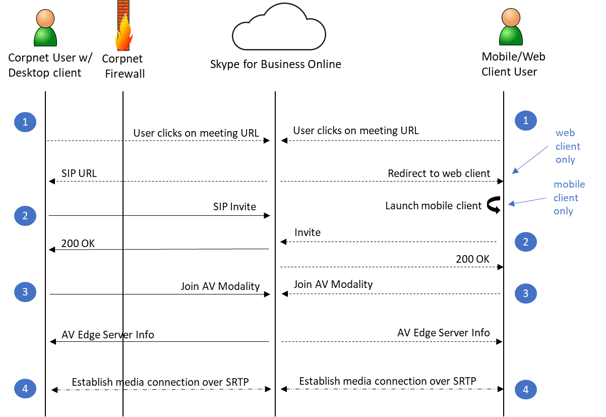

# 安全性與商務用 Skype Online

商務用 Skype Online (SfBO) （例如 Microsoft 365 和 Office 365 服務），請遵循所有安全性最佳做法及程式，例如，透過縱深防禦、客戶控制項在服務、安全性強化及操作最佳做法中的服務層級安全性。 如需完整詳細資料，請參閱 Microsoft 信任中心 (https://microsoft.com/trustcenter) 。

## 從設計上值得信賴
商務用 Skype Online 的設計與開發是遵循 Microsoft 高可信計算安全性開發週期 (的 SDL) ，如所述 https://www.microsoft.com/sdl/default.aspx 。 建立更安全整合通訊系統的第一步是設計威脅模型，並在設計每一項功能時同步測試。 程式碼撰寫和慣例已內建許多安全性相關的改進。 在程式碼移轉至最終產品之前，建置階段工具會偵測緩衝區溢位和其他潛在的安全性威脅。 當然，設計時不可能預防到所有未知的安全性威脅。 沒有任何系統可以保證絕對的安全性。 不過，由於產品開發採用了從開始的安全設計原則，因此商務用 Skype Online 將業界標準安全技術納入其架構的基本部分。 

## 透過預設而值得信賴
預設會加密商務用 Skype Online 中的網路通訊。 透過要求所有伺服器使用憑證，以及使用 OAUTH、TLS、安全 Real-Time 傳輸通訊協定 (SRTP) 及其他業界標準的加密技術，包括256位進階加密標準 (AES) 加密，所有商務用 Skype Online 資料都會在網路上受到保護。

## SfBO 處理常見安全威脅的方式
本節可識別 SfBO 服務安全性的常見威脅，以及 Microsoft 如何緩解每個威脅。

### 盜取金鑰攻擊
金鑰是用來加密、解密或驗證機密資訊的秘密代碼或數位。 在公開金鑰基礎結構中使用的兩個機密金鑰是必須考慮的 (PKI) ：每個證書持有者擁有的私密金鑰，以及通訊合作夥伴成功識別與會話金鑰交換之後所使用的工作階段金鑰。 當攻擊者決定私密金鑰或工作階段金鑰時，就會發生受害金鑰攻擊。 當攻擊者成功判斷金鑰之後，攻擊者就可以使用金鑰來解密加密的資料，而不需要寄件者的知識。

商務用 Skype Online 使用 Windows Server 作業系統中的 PKI 功能，來保護用來加密傳輸層安全性 (TLS) 連線的金鑰資料。 用於媒體加密的金鑰會透過 TLS 連線來交換。 

### 網路拒絕服務攻擊
當攻擊者妨礙有效使用者正常使用網路並使網路失去功能時，就表示發生了拒絕服務攻擊。 藉由使用拒絕服務攻擊，攻擊者可以：
- 對受攻擊網路上所執行的應用程式和服務傳送無效資料，以干擾其正常功能。
- 傳送大量流量，讓系統超載直到其停止回應或只能緩慢回應合法要求。
- 隱藏攻擊證據。
- 妨礙使用者存取網路資源。

SfBO 可透過執行 Azure DDOS 網路保護，並將用戶端要求與同一個端點、子網及同盟實體加以限制，來減輕這些攻擊。

### 竊聽
當攻擊者獲得網路中資料路徑的存取權，並有能力監視及讀取流量時，就可能發生竊聽。 這種攻擊也稱為探查或窺探。 如果流量是純文字，攻擊者就能在獲得路徑的存取權時讀取流量。 藉由控制資料路徑上的路由器來執行攻擊便是其中一例。 

SfBO 使用相互 TLS (MTLS) 在 Microsoft 365 或 Office 365 中的伺服器通訊，以及從用戶端到 TLS 的 TLS 中，轉譯此攻擊在指定交談可能受到攻擊的時段內很難完成。 TLS 會對各方實施驗證，並加密所有流量。 這雖然不會妨礙竊聽，但除非加密遭到破解，否則攻擊者將無法讀取流量。

TURN 通訊協定可用於即時媒體用途。 TURN 通訊協定不會要求流量必須加密，而是會透過郵件完整性來保護所傳送的資訊。 此通訊協定雖對竊聽不設防，但其所傳送的資訊 (也就是 IP 位址和連接埠) 只要藉由查看封包的來源和目的地位址，就能直接擷取到。 SfBO 服務會透過檢查郵件的郵件完整性來確保資料有效，方法是使用從少數專案衍生的金鑰（包括密碼），而不是以明文傳送。 SRTP 則可用於媒體流量，而且也會進行加密。

### 身分識別詐騙 (IP 位址詐騙)
當攻擊者確定網路、電腦或網路元件的 IP 位址並未經授權就使用時，就表示發生詐騙。 如果攻擊成功，攻擊者就能假裝自己是經過該 IP 位址正常識別的實體。 在 Microsoft Lync Server 2010 的內容中，只有當系統管理員已完成下列兩項作業時，才會播放此情況：
- 已設定僅支援傳輸控制通訊協定 (TCP)  (的連線，因為 TCP 通訊是未加密的) 。
- 已將這些連線的 IP 位址標示為受信任的主機。 

這不會 (TLS) 連線的傳輸層安全性問題，因為 TLS 會驗證所有參與方，並加密所有通信。 使用 TLS 可防止攻擊者對特定連線 (例如相互 TLS 連線) 執行 IP 位址詐騙。 但攻擊者仍可欺騙 SfBO 使用的 DNS 伺服器位址。 不過，因為 SfBO 中的驗證是使用證書來執行，所以攻擊者沒有假冒通訊中的其中一個參與方所需的有效證書。

### 中間人攻擊
當攻擊者透過攻擊者的電腦傳送兩個使用者之間的通訊時，就會發生中間人攻擊，而不需要兩個通訊使用者的知識。 攻擊者可在流量傳送給預期的收件者之前，監視並讀取流量。 通訊中的每個使用者都會在不知情的情況下傳送流量給攻擊者，以及接收來自攻擊者的流量，卻又認為他們在與預期的使用者通訊。 如果攻擊者能修改 Active Directory Domain Services 而將其伺服器新增為信任的伺服器，或修改網域名稱系統 (DNS) 而讓用戶端透過攻擊者連線到伺服器，就會發生這種情況。 

您也可以在兩個用戶端之間的媒體流量（除了 SfBO 點對點音訊、影片和應用程式共用資料流程）中，使用與 SRTP 進行協商的密碼加密金鑰，而不是透過 TLS 在對等的情況下使用 (SIP) 。 

### RTP 重播攻擊
當兩方之間的有效媒體傳輸遭到惡意攔截並重新傳輸時，就會發生重播攻擊。 SfBO 會將 SRTP 與安全的信號協定搭配使用，以保護傳輸不受重放攻擊的方式，方法是讓接收器維持已收到的 RTP 資料包的索引，並將每個新的資料包與已列在索引中的資料包進行比較。

### Spim
Spim 是未經請求的商業立即訊息或目前狀態訂閱要求。 Spim 本身雖然不會危害網路，但卻很煩人，且會降低資源可用性和生產力，並可能導致網路遭到危害。 例如，使用者傳送要求來對彼此進行 Spim 攻擊。 使用者雖可彼此封鎖以避免這種攻擊，但如果在同盟時發生了協調一致的 Spim 攻擊，則除非您停用合作夥伴的同盟，否則將難以解決這個問題。

### 病毒與蠕蟲
病毒是一個程式碼單位，其目的是重現其他類似的程式碼單位。 若要發生作用，病毒需要有宿主，例如檔案、電子郵件或程式。 和病毒一樣，蠕蟲也是一種程式碼單位，其編碼目的是要產生其他類似的程式碼單位，但不像病毒一樣需要宿主。 病毒和蠕蟲主要會在用戶端之間的檔案傳輸過程中，或在其他使用者傳送 URL 時現身。 舉例來說，如果電腦上有病毒，病毒就可以使用您的身分識別，並以您的名義傳送立即訊息。 標準用戶端安全性最佳做法 (例如定期掃描病毒) 可緩解此問題。 

## 個人辨識資訊
SfBO 有可能在可連結至個人的公用網路上洩漏資訊。 資訊類型可以分為兩個特定類別：
- **增強的目前狀態資料** &nbsp; &nbsp; &nbsp;[增強的目前狀態資料] 是使用者可以選擇共用或不共用至同盟夥伴或組織內部連絡人之連結的資訊。 此資料不會與公用 IM 網路上的使用者共用。 用戶端原則和其他用戶端設定可能會讓系統管理員進行一些控制。 在 SfBO 服務中，您可以針對個別使用者設定增強的目前狀態隱私權模式，避免使用者的連絡人清單中的 SfBO 使用者查看使用者的目前狀態資訊。 
- **強制** &nbsp; &nbsp; 資料 &nbsp;[強制資料] 是伺服器或用戶端正常運作所需的資料。 這是伺服器或網路層級所需的資訊，用於路由、狀態維護和傳送信號。
下表列出 SfBO 操作所需的資料。

***資料表 1-增強的目前狀態資料***

<!--start table here -->

|                      |                                                                                            |   |
|:---------------------|:-------------------------------------------------------------------------------------------|:--|
| **資料**             | **可能**的 **設定**                                                                  |   |
| 個人資料        | 名稱、標題、公司、電子郵件地址、時區                                             |   |
| 電話號碼    | 公司、行動裝置、家用版                                                                         |   |
| 行事曆資訊 | 空閒/忙碌、不在城鎮通知、會議詳細資料 (可存取您行事曆的人員)  |   |
| 目前狀態      | 離開、可用、忙碌、[請勿打擾]、[離線]                                             |   |
|                      |                                                                                            |   |

<!-- end of table -->

***表格 2-強制資料***

<!--start table here -->

|              |                                                                 |   |
|:-------------|:----------------------------------------------------------------|:--|
| **類別** | **可能的設定**                                           |   |
| IP 位址   | 電腦或 NATed 位址的實際位址                     |   |
| SIP URI      | <u>david.campbell@contoso.com</u>                               |   |
| 名稱         | 在 Active Directory 網域服務中定義的 David Campbell ()  |   |
|              |                                                                 |   |

<!-- end of table -->

## SfBO 的安全性架構
本節概要說明構成 Microsoft SfBO 安全性架構的基本元素。 這些元素如下所示：
- Azure Active Directory (AAD) 為使用者帳戶提供單一受信任的後端儲備庫。 
- 公開金鑰基礎結構 (PKI) 使用受信任的憑證授權單位所頒發的憑證 (Ca) 驗證服務器並確保資料完整性。
- 傳輸層安全性 (TLS) 、SSL 上的 HTTPS (HTTPS) ，以及相互 TLS (MTLS) 啟用端點驗證和 IM 加密。 系統會使用安全即時傳輸通訊協定 (SRTP) 加密點對點音訊、視訊和應用程式共用串流，並進行完整性檢查。
- 使用者驗證的工業標準通訊協定（如果可能）。

本節中的主題描述這些基本元素的運作方式，以增強 SfBO 服務的安全性。
 
### Azure Active Directory
Azure Active Directory 會作為 Microsoft 365 和 Office 365 的目錄服務。 其儲存了所有使用者目錄資訊和原則指派。 

### SfBO 的公開金鑰基礎結構
SfBO 服務依賴伺服器驗證的憑證，並在用戶端與伺服器之間以及不同的伺服器角色之間建立信任鏈。 Windows Server 公開金鑰基礎結構 (PKI) 提供建立和驗證此信任鏈的基礎結構。
[憑證] 是數位識別碼。 它們會依名稱來識別伺服器，並指定其屬性。 為了確保憑證上的資訊有效，證書必須由用戶端或其他連線至伺服器的伺服器所信任的 CA) 所頒發 (CA。 如果伺服器只與私人網路絡上的其他用戶端和伺服器連線，則 CA 可以是企業 CA。 如果伺服器與私人網路絡外的實體互動，可能需要公用 CA。

即使憑證上的資訊有效，也必須以某種方式來確認出示證書的伺服器確實是憑證所代表的那一種。 這是 Windows PKI 隨附的位置。
每個憑證都連結到一個公開金鑰。 憑證上命名的伺服器會擁有只有它知道的對應私密金鑰。 連線用戶端或伺服器會使用公開金鑰來加密一段隨機資訊，並將它傳送給伺服器。 如果伺服器將資訊解密並以純文字格式傳回，則連接實體可以確保伺服器將私密金鑰儲存在憑證上，因此是在憑證上命名的伺服器。

#### CRL 發佈點
SfBO 要求所有伺服器憑證都包含一或多個憑證吊銷清單 (CRL) 發佈點。 您可以從 CRL 發佈點 (CDP) 來下載 CRL，以便驗證憑證自發行以來尚未遭到撤銷，且憑證仍在有效期限內。 CRL 發佈點是安全的 HTTP，會以 URL 的形式註明在憑證的屬性中。 SfBO 服務會檢查 CRL 與每個憑證驗證。

#### 增強金鑰使用方法
SfBO 服務的所有元件都需要所有伺服器憑證，才能支援增強型金鑰用法 (EKU) ，目的是進行伺服器驗證。 為伺服器驗證設定 EKU 欄位表示該憑證可供用來驗證服務器。 此 EKU 對 MTLS 非常重要。 

### SfBO 的 TLS 和 MTLS
TLS 和 MTLS 通訊協定可在網際網路上提供加密通訊和端點驗證。 SfBO 會使用這兩個通訊協定來建立信任伺服器的網路，並確保整個網路上的所有通訊都已加密。 伺服器之間的所有 SIP 通訊都是在 MTLS 上進行。 從用戶端到伺服器的 SIP 通訊是透過 TLS 進行。

TLS 可讓使用者透過其用戶端軟體來驗證與其連接的 SfBO 伺服器。 在 TLS 連線中，用戶端會要求伺服器提供有效憑證。 若要有效，證書必須由用戶端也信任的 CA 所頒發，且伺服器的 DNS 名稱必須與憑證上的 DNS 名稱相符。 如果憑證有效，用戶端就會使用憑證中的公開金鑰來加密要用於通訊的對稱加密金鑰，而只讓憑證的原始擁有者可以使用其私密金鑰來解密通訊內容。 這時所產生的連線會受到信任，且自此之後就不會遭到其他受信任伺服器或用戶端查問。 在這種情況下，安全通訊端層 (SSL) 與 Web 服務搭配使用，以 TLS 為基礎。

伺服器對伺服器的連線會仰賴相互 TLS (MTLS) 來進行相互驗證。 在 MTLS 連線中，產生訊息的伺服器和接收訊息的伺服器會交換雙方都信任的 CA 所核發的憑證。 憑證可讓伺服器雙方證明彼此的身分識別。 在 SfBO 服務中，遵循此程式。

TLS 和 MTLS 可同時防範竊聽和中間人攻擊。 在中間人攻擊中，攻擊者會透過攻擊者的電腦來重置兩個網路實體之間的通訊，而不需要任何一方的知識。 TLS 與 SfBO 對受信任伺服器的規格，可使用兩個端點之間的公開金鑰密碼來進行端對端加密，從而減輕在應用程式層上受到中間人攻擊的風險。而且，攻擊者必須擁有具有對應私密金鑰的有效可信證書，並頒發給客戶通訊的服務名稱，以解密通訊。 

### SfBO 加密
SfBO 使用 TLS 和 MTLS 來加密立即訊息。 伺服器對伺服器的流量無論是局限於內部網路還是跨越內部網路周邊，都需要使用 MTLS。

下表摘要列出 SfBO 所使用的通訊協定。

***表格 3-交通防護***

<!--start table here with header -->

|||
|:-----|:-----|
|**流量類型**|**受**|
|伺服器對伺服器|MTLS|
|用戶端到伺服器|TLS|
|立即訊息和目前狀態|TLS (（如果已針對 TLS 進行設定）) |
|媒體的音訊和影片與桌面共用|SRTP|
|桌面共用 (通知) |TLS|
|網路會議|TLS|
|會議內容下載、通訊錄下載、通訊群組延伸|IP-HTTPS|
|||

<!-- end of table -->

#### 媒體加密
媒體流量會使用安全 RTP (SRTP) 來加密，SRTP 是即時傳輸通訊協定 (RTP) 的設定檔，可為 RTP 流量提供機密性、驗證和重播攻擊防護。 SRTP 會使用透過安全亂數產生器所產生，並透過訊號 TLS 通道來進行交換的工作階段金鑰。 此外，在中繼伺服器與其內部下一個躍點之間的兩個方向上，媒體也會使用 SRTP 來加密。 

SfBO 會產生使用者/密碼，以安全存取媒體轉送。 媒體轉送器以 TLS 安全的 SIP 通道交換使用者名稱/密碼。

#### FIPS
SfBO 使用 FIPS (聯邦資訊處理標準) 相容性演算法來進行加密金鑰交換。 

### 使用者和用戶端驗證 
受信任的使用者是認證已在 Microsoft 365 或 Office 365 中由 AAD 進行驗證的人。 

驗證是將使用者認證佈建到受信任伺服器或服務的程序。 SfBO 會根據使用者的狀態和位置，使用下列驗證通訊協定。
- **新式驗證** 是適用于用戶端與伺服器通訊的 OAUTH 2.0 Microsoft 實現。 它能啟用安全功能，例如憑證式驗證、多重要素驗證及條件式存取。 若要使用 MA，就必須為線上租用戶和用戶端啟用 MA。 SfBO 在2017年5月之前建立的租使用者預設啟用 MA。 針對此期間建立的租使用者，請遵循這裡的指示將它開啟。 下列用戶端全都支援 MA：商務用 Skype 2015 或2016用戶端、Mac 版商務用 Skype、Lync 2013 用戶端、3PIP IP 手機、iOS 和 Android。 
- **組織識別碼** 是在未啟用新式驗證時使用 (或無法使用) 。
- 稱為匿名使用者的**摘要通訊協定**。 匿名使用者是指沒有辨識 Active Directory 認證但受邀者加入內部部署會議，且擁有有效會議金鑰的使用者。 [摘要式驗證] 不用於其他用戶端互動。

SfBO 驗證封裝含兩個階段：
1. 在用戶端與伺服器之間建立安全關聯。
2. 用戶端和伺服器使用現有的安全性關聯來簽署其傳送的訊息，並驗證收到的訊息。 在伺服器上啟用驗證時，不會接受來自用戶端的未驗證訊息。

使用者信任已附加至源于使用者的每一封郵件，而不是使用者身分識別本身。 伺服器會檢查每一封郵件是否有有效的使用者認證。 如果使用者認證有效，則除了由第一個伺服器接收，但在 SfBO 中的所有其他伺服器上，都不會 unchallenged 該郵件。

具有聯盟夥伴所頒發之有效認證的使用者是受信任的，但其他限制式可讓您享受完整的許可權 accorded 給內部使用者。

針對媒體驗證，ICE 和 TURN 通訊協定也會使用如 IETF TURN RFC 所述的摘要查問。 如需詳細資訊，請參閱 [媒體遍歷](#external-user-av-traffic-traversal)。

用戶端憑證為使用者提供 SfBO 驗證的替代方法。 使用者不會提供使用者名稱和密碼，而是會有一個憑證和私密金鑰對應至解決密碼質詢所需的憑證。 

### Windows PowerShell 與 SfBO 管理工具
在 SfBO 中，IT 管理員可透過 O365 管理入口網站或使用租使用者遠端 PowerShell (TRPS) 來管理其服務。 租用戶系統管理員會使用新式驗證來向 TRPS 驗證。

### 設定網際網路邊界對 SfBO 的存取權
若要讓 SfBO 正常運作 (可以加入 ) 會議的使用者，請在 SfBO 雲端中，客戶必須設定網際網路存取，讓輸出 UDP 與 TCP 流量能傳送給雲端的服務。 如需詳細資訊，請參閱這裡： https://support.office.com/article/Office-365-URLs-and-IP-address-ranges-8548a211-3fe7-47cb-abb1-355ea5aa88a2#bkmk_lyo 

### UDP 3478-3481 和 TCP 443

用戶端會使用 UDP 3478-3481 和 TCP 443 埠來從 A/V 邊緣服務要求服務。 用戶端使用這兩個埠，分別為遠端方配置 UDP 和 TCP 埠以進行連接。 若要存取 A/V 邊緣服務，用戶端必須先建立與 SfBO 註冊機構的已驗證 SIP 信號會話，才能取得 A/V 邊緣服務驗證認證。 這些值是透過受 TLS 保護的信號通道傳送，且是由電腦產生的，以減輕字典攻擊的需要。 用戶端可以使用這些認證來進行摘要式驗證，以及使用 A/V 邊緣服務來指派要在媒體會話中使用的埠。 最初的配置要求是從用戶端傳送，並從 A/V 邊緣服務的 401 nonce/質詢訊息回應。 用戶端會傳送第二個包含使用者名稱和雜湊訊息驗證程式代碼的分配， (HMAC) 的使用者名稱和 nonce 雜湊。 

您也可以在適當的地方使用順序編號機制來防止重放攻擊。 伺服器會根據自己的使用者名稱和密碼來計算預期的 HMAC，如果 HMAC 值相符，就會執行該分派程式。否則，就會丟棄該資料包。 這個 HMAC 機制也會套用到這個呼叫會話中的後續訊息。 此使用者名稱/密碼值的存留期最多為八個小時，用戶端會針對後續呼叫 reacquires 新的使用者名稱/密碼。

### UDP/TCP 50000-59999
TCP 50000 輸出用於 SfBO，包括應用程式和桌面共用、檔案傳輸。 UDP/TCP 50000-59999 埠範圍是與 Microsoft Office 通訊伺服器2007合作夥伴（需要來自 A/V 邊緣服務的 NAT/防火牆遍歷服務）搭配的媒體會話使用。 因為 A/V 邊緣服務是使用這些埠的唯一進程，所以埠範圍的大小並不表示可能受到攻擊的可能性。 良好的安全性做法是不執行不需要的網路服務，就總是將偵聽埠的總數降至最低。 如果網路服務不在執行中，遠端攻擊者就不能利用它，而且主機電腦遭到攻擊的可能性會減少。 不過，在單一服務中，減少埠數不會提供相同的優點。 A/V Edge 服務軟體已開啟，但已開啟10000埠，因為它是使用10。 此範圍內的埠分配是隨機完成，目前未分配的埠不會偵聽資料包。

### 外部使用者 A/V 流量遍歷
若要讓外部使用者和內部使用者使用 exchange 媒體，必須具備存取邊緣服務，才能處理設定和拉低會話所需的 SIP 信號。 它也需要 A/V 邊緣服務來充當傳送媒體的中繼。 通話順序如下圖所示。

 

1. 使用者會收到一封電子郵件，其中包含加入 SfBO 會議的邀請。 電子郵件包含會議金鑰，以及連結至會議的 HTTP 式 URL。 索引鍵和 URL 對於特定會議而言都是唯一的。
使用者在電子郵件中按一下會議 URL，在使用者的電腦上啟動用戶端偵測處理常式，即可啟動加入程式。 如果偵測到用戶端，就會啟動此用戶端。 如果沒有檢測到，使用者會被重新導向到網頁用戶端。

2. SfBO 用戶端會傳送包含使用者認證的 SIP 邀請。 聯盟或遠端使用者使用其企業認證加入會議。 針對同盟使用者，SIP 邀請會先傳送給他或她的主伺服器，這會對使用者進行驗證，並將邀請轉寄至 SfBO。 需要匿名使用者才能傳送摘要式驗證。
SfBO 會驗證遠端或匿名使用者，並通知用戶端。 如步驟2所述，加入會議的聯盟使用者是透過其企業驗證。

3. 用戶端傳送資訊要求，以將使用者新增至 A/V 會議。

    A/V 會議會傳送包含權杖的新增使用者回應，並將其提供給 A/V 會議邊緣服務（在其他資訊中）。

    注 上述所有 SIP 流量都透過存取邊緣服務流動。

    用戶端會連線到 A/V 會議伺服器，以驗證權杖並將要求（包含另一個授權權杖）的代理伺服器連線至內部 A/V 會議伺服器。 A/V 會議伺服器會驗證它最初在 SIP 通道上發佈的授權權杖，以進一步確保有效的使用者加入會議。

4. 在用戶端與 A/V 會議伺服器之間，會協商媒體連線並在 SRTP 上進行設定。
5. 使用者會收到一封電子郵件，其中包含加入 SfBO 會議的邀請。 電子郵件包含會議金鑰，以及連結至會議的 HTTP 式 URL。 索引鍵和 URL 對於特定會議而言都是唯一的。

### SfBO 的同盟保護措施
同盟可讓您的組織與其他組織通訊，以共用 IM 和目前狀態。 在 SfBO 同盟中預設為開啟。 不過，租使用者管理員有能力透過 Microsoft 365 或 Office 365 管理入口網站控制此功能。 查看更多。

## 解決 SfBO 會議的威脅

SfBO 提供企業使用者建立及加入即時網路會議的功能。 企業使用者也可以邀請沒有 AAD、Microsoft 365 或 Office 365 帳戶的外部使用者參與這些會議。 聯盟夥伴使用安全且已驗證身分識別的使用者也可以加入會議，如果升級為這樣，就可以充當簡報者。 匿名使用者無法以簡報者的身分建立或加入會議，但可在加入會議後受到提升而成為簡報者。

若要讓外部使用者參與 SfBO 會議，會大大增加這項功能的價值，但也需要一些安全風險。 若要解決這些風險，SfBO 會提供下列額外的保護措施：
- 參與者角色決定會議控制許可權。
- 參與者類型，可讓您限制特定會議的存取權。
- 已定義的會議類型決定了參與者可以出席哪些類型。
- 會議排程限制為擁有 AAD 帳戶和 SfBO 授權的使用者。
- 匿名，也就是未獲驗證，想要加入電話撥入式會議的使用者撥打其中一個會議存取號碼，然後系統會提示他們輸入會議 ID。 未經驗證的匿名使用者也會收到記錄其名稱的提示。 所記錄的名稱會識別會議中未經驗證的使用者。 除非至少有一個領導或經過驗證的使用者已加入，且無法指派預先定義的角色，否則匿名使用者將無法獲准參與會議。

### 參與者角色
會議參與者分成三個群組，每個群組都有各自的權限和限制：
- **召集人** &nbsp; &nbsp;建立會議的使用者（無論是臨時或排程）。 召集人必須是經過驗證的企業使用者，且能控制會議的所有最終使用者方面。
- **簡報者** &nbsp; &nbsp;獲授權在會議中顯示資訊的使用者（使用支援的任何媒體）。 根據定義，會議召集人同時也是簡報者，可決定還有誰可以成為簡報者。 召集人可在排定會議時或於會議進行當下做出這項決定。
- **出席者** &nbsp; &nbsp;已受邀參加會議，但未獲授權的使用者成為簡報者。

簡報者也可以在會議進行期間將出席者提升為簡報者角色。

### 參與者類型

會議參與者也會依位置和認證來分類。 您可以使用這兩個特性來指定哪些使用者可以存取特定會議。 使用者大致可以分成下列類別：
1.  **屬於租** &nbsp; &nbsp; 使用者的使用者這些使用者在適用于租使用者的 Azure Active Directory 中有認證。 
    a. *在內部* 網路中-這些使用者是從公司網路內部加入。 b. *遠端使用者*：這些使用者是從公司網路外部加入會議的。 這些人包括在家、在外工作的員工和其他人 (例如受信任供應商的員工)，且必須已獲得可在服務期間使用的企業認證。 遠端使用者可以建立並加入會議，並充當簡報者。
2.  **不屬於租** &nbsp; &nbsp; 使用者的使用者在租使用者的 Azure Active Directory 中，這些使用者沒有認證。 a. 同盟*使用者*-同盟使用者擁有聯盟夥伴的有效認證，因此由 SfBO 視為經過驗證。 同盟使用者可以加入會議，並在他們加入會議之後升級為簡報者，但他們無法在其聯盟的企業中建立會議。 b. *匿名使用者*：匿名使用者沒有 Active Directory 身分識別，且未與租用戶同盟。 

客戶資料顯示許多會議都涉及外部使用者。 那些相同的客戶也想要 reassurance 外部使用者的身分識別，才能允許這些使用者加入會議。 如下一節所述，SfBO 限制會議對已明確允許的使用者類型的存取權，並要求所有使用者類型在進入會議時提供適當的認證。

### 參與者准入
在 SfBO 中，匿名使用者會傳輸到稱為大廳的等候區域。 然後，簡報者可以讓這些使用者承認或拒絕會議。 這些使用者會傳送到大廳，系統會通知領導者，然後使用者就會等到接受或拒絕他們或其連線時間為止。在會議廳中，使用者會聽到音樂。 

根據預設，從 PSTN 撥入的參與者會直接進入會議，但此選項可以變更為強制撥入參與者移至大廳。  
會議召集人可以控制參與者是否可加入會議而不必在大廳中等候。 每一場會議都可以透過下列任一方法來設定為啟用存取：
- **[僅自己]、[會議召集人]** &nbsp; &nbsp;除 [召集人] 以外的所有人都必須在大廳等候，直到准許為止。
- **我從公司** &nbsp; &nbsp; 邀請的人員您公司的任何人都可以直接進入會議，即使未受邀。
- 組織中的**任何人** &nbsp; &nbsp;Microsoft 365 或 Office 365 租使用者中的所有 SfBO 使用者都可以加入會議，而不需要在大廳等候，即使不在通訊群組清單中的人。 所有其他人（包括所有外部和匿名使用者）都必須在大廳等候，直到獲准為止。
- **任何人** &nbsp; &nbsp;任何人 (不會受到任何) 限制，只要有權存取會議連結，就會直接在會議中取得會議。
如果只有「召集人」以外的任何方法指定 ([鎖定的) ]，會議召集人也可以透過 [透過手機略過大廳] 來指定撥打的人員。 

### 簡報者的能力
會議召集人可控制參與者是否可以在會議期間進行簡報。 每一場會議都可以進行設定，而將簡報者限制在下列任何人：
- **僅限** &nbsp; &nbsp; 召集人只有會議召集人可以放映。
- **People from my company** &nbsp; 公司 &nbsp; 中的人員所有內部使用者都可以出示。
- **包括公司** &nbsp; &nbsp; 外部人員在內的所有人[所有人] (在加入會議的人員) 都不受限制。
- **我選擇** &nbsp; &nbsp; 的人員會議召集人會將使用者新增至簡報者清單，以指定哪些使用者可以發表簡報。

## 相關主題
[Microsoft 信任中心](https://microsoft.com/trustcenter)

