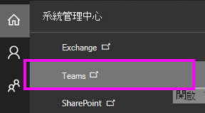

# 允許使用者連絡外部商務用 Skype 使用者Allow users to contact external Skype for Business users
  
在下列時間使用本文中的步驟：Use the steps in this article when:
  
- 您擁有公司中不同網域的使用者。You have users on different domains in your business. 例如，Rob@ContosoEast.com Ann@ContosoWest.com。For example, Rob@ContosoEast.com and Ann@ContosoWest.com.

- 您希望貴組織的人員使用商務用 Skype 與組織外部特定企業的人員聯繫。You want the people in your organization to use Skype for Business to contact people in specific businesses outside of your organization.

- 您希望世界上任何使用商務用 Skype 的人，都能使用您的電子郵件地址尋找並與您聯繫。You want anyone else in the world who uses Skype for Business to be able to find and contact you using your email address. 如果您和他們都使用預設的商務用 Skype 設定，這會自動執行。If you and they use the default Skype for Business settings, this will work automatically. 如果沒有，則他們必須確定其組塊未封鎖您的網域。If they don't, then they need to make sure their configuration isn't blocking your domain.

## 為使用者啟用企業對商務通訊Enable business-to-business communications for your users

您必須同時 [擁有](https://support.office.com/article/da585eea-f576-4f55-a1e0-87090b6aaa9d) Microsoft 365 或 Office 365 的系統管理員許可權，才能進行此通訊。You must have [admin permissions](https://support.office.com/article/da585eea-f576-4f55-a1e0-87090b6aaa9d) in Microsoft 365 or Office 365 in both organizations to do this communication.

 **使用 Teams 系統管理中心** **Using the Teams admin center**
  
1. 使用 Microsoft 365 或 Office 365 系統管理員帳戶來登錄。Sign in with your Microsoft 365 or Office 365 admin account.

2. 在系統管理中心，前往 **系統管理中心**  >  **Teams**。In the admin center, go to **Admin Centers** > **Teams**.

    
  
3. 在 **Teams 中心，** 選擇 **Skype** > **舊版入口網站** 
  In the **Teams center**, choose **Skype** > **Legacy Portal**

4. 在 [商務用 Skype 系統管理中心]，選擇 [組織]  >  [外部通訊]。In the **Skype for Business admin center**, choose **Organization** > **External communications**.
5. 若要設定與特定公司或其他網域中的使用者進行通訊，請在下拉式方塊中選擇 [僅對允許的網域開啟]。To set up communication with a specific business or with users in another domain, in the drop-down box, choose **On only for allowed domains**.

    或者，如果您想要啟用與已開啟商務用 Skype 政策之全球其他所有人的通訊，請選擇開啟 ，但封鎖的 **網域除外**。OR, if you want to enable communication with everyone else in the world who has open Skype for Business policies, choose **On except for blocked domains**. 這是預設設定。This is the default setting.

6. 在 **封鎖或允許的網域** 下，選擇並新增您想要 **+** 允許的功能變數名稱。Under **Blocked or allowed domains**, choose **+** and add the name of the domain you want to allow.

7. 請確定另一組織的系統管理員在商務用 Skype 系統管理中心 **執行這些步驟**。Make sure the admin in the other organization does these same steps in their **Skype for Business admin center**. 例如，在允許 **的網域** 清單中，他們的系統管理員必須輸入您企業所需的網域。For example, in their **allowed domains** list, their admin needs to enter the domain for your business.

8. 如果您使用的是 Windows 防火牆，商務用 Skype 會自動開啟所需的埠。If you're using Windows Firewall, Skype for Business opens the required ports automatically.

    如果貴組織使用不同的防火牆解決方案來限制網路上的電腦無法連接到網際網路，請確保您的用戶端電腦能夠存取下列 [Office 365 URL](/microsoftteams/office-365-urls-ip-address-ranges)和 IP 位址範圍。If your organization is using a different firewall solution to restrict computers on your network from connecting to the Internet, ensure your client computers are able to access the following [Office 365 URLs and IP address ranges](/microsoftteams/office-365-urls-ip-address-ranges). 這可能需要將 FQDNs 新增到防火牆或 Proxy 基礎結構組配置的外發允許清單 **\* ：.api.skype.com、.users.storage.live.com** \* *__\*\*\*和 graph.skype.com。*\*This may require adding the FQDNs to the outbound allow list in your firewall or proxy infrastructure configuration: **\*.api.skype.com**, \**_.users.storage.live.com_*, and **graph.skype.com**. 若要瞭解如何在防火牆中開啟這些埠的指示，請查看它所提供的檔。For instructions on how to open these ports in your firewall, check the documentation that came with it.

    有關您需要開啟的所有埠清單，請參閱 [Office 365 URL 和 IP 位址範圍](/microsoftteams/office-365-urls-ip-address-ranges)。For a list of all ports you need to open, see [Office 365 URLs and IP address ranges](/microsoftteams/office-365-urls-ip-address-ranges).

9. 請確定組織的系統管理員也遵循這些步驟。Make sure that the administrator in the organization has also followed these steps.

10. **等候最多 24 小時進行測試**。**WAIT UP TO 24 HOURS TO TEST**. 當您變更外部通訊設定時，變更最多可能需要 24 小時，才能填入所有資料中心。When you change the external communications settings, it can take up to 24 hours for the changes to populate across all the data centers.

 IM！ You can allow your users to search for and IM with everyone who uses Skype, the free consumer app! 若要深入瞭解，請參閱 [讓商務用 Skype 使用者新增 Skype 連絡人](let-skype-for-business-users-add-skype-contacts.md)。To learn more, see [Let Skype for Business users add Skype contacts](let-skype-for-business-users-add-skype-contacts.md).
  
## 測試和疑難排解Test and troubleshoot

 **在設定企業間通訊時，最常見的問題是正確取得 [Office 365 URL](/microsoftteams/office-365-urls-ip-address-ranges) 和 IP 位址範圍。****The most common issue people encounter when setting up business-to-business communication is getting their [Office 365 URLs and IP address ranges](/microsoftteams/office-365-urls-ip-address-ranges) right.**
  
若要測試您的設定，您需要不在公司防火牆後面的商務用 Skype 連絡人。To test your setup, you need a contact on Skype for Business who's not behind your company firewall.
  
1. 變更外部通訊設定之後，請等候 **最多 24 小時進行測試**。After you change your external communications settings, **WAIT UP TO 24 HOURS TO TEST**.

2. 在商務用 Skype 中，在商務用 Skype 中搜尋您的連絡人，然後傳送聊天要求。In Skype for Business, search for your contact in Skype for Business, and send a request to chat.

    如果您收到由於公司政策無法送出的郵件，您必須仔細檢查 [您的 Office 365 URL](/microsoftteams/office-365-urls-ip-address-ranges)和 IP 位址範圍。If you get a message that it couldn't be sent due to company policy, you need to double-check your [Office 365 URLs and IP address ranges](/microsoftteams/office-365-urls-ip-address-ranges).

3. 要求商務用 Skype 連絡人傳送聊天邀請。Ask your Skype for Business contact to send you a request to chat. 如果您沒有收到其要求，就表示您的防火牆設定有問題 (假設他們已確認其防火牆設定正確)。If you don't receive their request, the problem is your firewall settings (assuming they've already confirmed their firewall settings are correct).

4. 另一個測試問題是否出在防火牆上的方法，就是前往防火牆後面的 Wifi 位置，例如咖啡店。Another way to test whether the problem is your firewall is to go to a wifi location not behind your firewall, such as a coffee shop. 使用商務用 Skype 傳送要求給聯絡人聊天。Use Skype for Business to send a request to your contact to chat. 如果郵件經過該區，但在您工作時卻無法傳遞，那麼您就會知道問題出在防火牆上。If the message goes through there, but not when you're at work, then you know the problem is your firewall.

## 如何尋找其他人，以及如何在與另一個企業聯繫時找到他們How to find others, and be found, when connecting with another business

啟用與其他商務用 Skype 使用者的外部通訊後，您的使用者可以搜尋其登錄名稱來尋找聯合商務用 Skype 使用者。After you enable external communication with other Skype for Business users, your users can find federated Skype for Business users by searching for their sign-in names. 例如，Rob@contoso.com。An example is Rob@contoso.com. 接著，他們將需要將人員新增到連絡人清單中。Then they will need to add the person to their list of contacts.
  

  
## 設定與聯盟企業通訊的秘訣Tips on setting up communications with federated businesses

- 若要設定商務用 Skype 2015 與商務用 Skype Online 之間的聯合，請參閱這篇文章：設定商務用 [Skype Online 的](../../SfbHybrid/hybrid/configure-federation-with-skype-for-business-online.md?bc=%2fSkypeForBusiness%2fbreadcrumb%2ftoc.json&toc=%2fSkypeForBusiness%2ftoc.json)聯盟。To configure federation between Skype for Business 2015 and Skype for Business Online, see this  article: [Configure federation with Skype for Business Online](../../SfbHybrid/hybrid/configure-federation-with-skype-for-business-online.md?bc=%2fSkypeForBusiness%2fbreadcrumb%2ftoc.json&toc=%2fSkypeForBusiness%2ftoc.json).

- 若要設定 Lync 與商務用 Skype Online 之間的聯合，請參閱這篇文章：設定 Lync Online 客戶的 [聯盟支援](/previous-versions/office/lync-server-2013/lync-server-2013-configuring-federation-support-for-a-lync-online-customer)。To configure federation between Lync and Skype for Business Online, see this  article: [Configuring Federation Support for a Lync Online Customer](/previous-versions/office/lync-server-2013/lync-server-2013-configuring-federation-support-for-a-lync-online-customer).

- 當 Microsoft 365 或 Office 365 中的兩個商務用 Skype 使用者正在個別網域上彼此通訊時，他們只能使用商務用 Skype 功能 (例如，在兩個組織開啟的視像交談或桌面共用) 。When two Skype for Business users in Microsoft 365 or Office 365 are communicating with each other on separate domains, they can only use Skype for Business features (for example, video conversations or desktop sharing) that are turned on in both organizations.

- 如果貴組織的商務用 Skype 使用者被置於 In-Place 或訴訟保留，該使用者與其他商務用 Skype 或 Skype 使用者之間的任何 IM 交談都會儲存于其信箱中的可復原專案中。If a Skype for Business user in your organization is put on an In-Place or Litigation Hold, any IM conversations between that user and other Skype for Business or Skype users will be saved in **Recoverable Items** in their mailbox. 這些交談不會儲存于信箱中的交談記錄資料夾中。These conversations aren't saved in the **Conversations History** folder in their mailbox.

## 關閉特定人員的外部通訊Turn off external communication for specific individuals

啟用整個企業的外部通訊之後，您可以只針對特定人員關閉外部通訊。After you enable external communication for your entire business, you can turn it off for only specific individuals.
  
1. 使用 Microsoft 365 或 Office 365 系統管理員帳戶來登錄。Sign in with your Microsoft 365 or Office 365 admin account.

2. 在系統管理中心，前往使用者  >  **活動使用者**。In the admin center, go to **Users** > **Active users**.

3. 在使用者清單中，選擇使用者，然後在 [其他設定> **下，按一下** **[編輯商務用 Skype 屬性**。In the list of users, choose the user, and then, under **More Settings**, click **Edit Skype for Business properties**.

    
  
4. 在商務 **用 Skype 系統管理中心**，選擇 **外部通訊**。In the **Skype for Business admin center**, choose **External communications**.

    在選項 **頁面上** ，會選取所有選項。On the **Options** page, all of the choices will be selected. 清除您想要停用的通訊。Clear the communications you want to disable. 下圖顯示 Jakob 將能夠與其他信任企業的人員通訊，但無法與其他 Skype 使用者通訊。The following image shows that Jakob will be able to communicate with people in other trusted businesses, but not with other Skype users.

    
  
5. 選擇 **儲存**。Choose **Save**.

> [!NOTE]
> 您可能必須等候最多 24 小時，變更才能生效。You may have to wait for up to 24 hours for your changes to take effect.
  
[!INCLUDE [LinkedIn Learning Info](../../common/office/linkedin-learning-info.md)]

## 相關主題Related topics

[設定商務用 Skype OnlineSet up Skype for Business Online](set-up-skype-for-business-online.md)
  
[讓商務用 Skype 使用者新增 Skype 連絡人Let Skype for Business users add Skype contacts](let-skype-for-business-users-add-skype-contacts.md)
