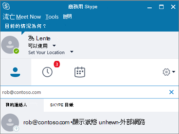

# 允許使用者連絡外部商務用 Skype 使用者Allow users to contact external Skype for Business users
  
在下列情況下，請使用本文中的步驟：Use the steps in this article when:
  
- 您的企業中有不同網域的使用者。You have users on different domains in your business. 例如，Rob@ContosoEast.com 和 Ann@ContosoWest.com。For example, Rob@ContosoEast.com and Ann@ContosoWest.com.

- 您希望貴組織中的人員可以使用商務用 Skype 與組織外部的特定企業中的人員聯繫。You want the people in your organization to use Skype for Business to contact people in specific businesses outside of your organization.

- 您希望世界各地的其他人都能使用商務用 Skype，透過您的電子郵件地址找出並與您聯繫。You want anyone else in the world who uses Skype for Business to be able to find and contact you using your email address. 如果您與他們使用預設的商務用 Skype 設定，這將會自動運作。If you and they use the default Skype for Business settings, this will work automatically. 如果不是，則必須確認他們的設定不會封鎖您的網域。If they don't, then they need to make sure their configuration isn't blocking your domain.

## 為使用者啟用企業對企業通訊Enable business-to-business communications for your users

您必須在兩家組織的 Microsoft 365 或 Office 365 中擁有系統 [管理員許可權](https://support.office.com/article/da585eea-f576-4f55-a1e0-87090b6aaa9d) ，才能進行這項通訊。You must have [admin permissions](https://support.office.com/article/da585eea-f576-4f55-a1e0-87090b6aaa9d) in Microsoft 365 or Office 365 in both organizations to do this communication.

**使用 [團隊管理中心**] 顯示 Microsoft 小組標誌的圖示 **Using the Teams admin center**
  
1. 使用您的 Microsoft 365 或 Office 365 系統管理員帳戶登入。Sign in with your Microsoft 365 or Office 365 admin account.

2. 在系統管理中心中，移至 [系統**管理中心**]  >  **小組**。In the admin center, go to **Admin Centers** > **Teams**.

    ![選擇 [團隊管理員]。](../images/MS-Teams-Admin.png)
  
3. 在 [**小組中心**] 中，選擇 [ **Skype** > **傳統版入口網站**] 
  ![ 選擇 [SfB 舊版入口網站]。](../images/SFBlegacy-size65.png)In the **Teams center**, choose **Skype** > **Legacy Portal**

4. 在 [商務用 Skype 系統管理中心]\*\*\*\*，選擇 [組織]\*\*\*\*  >  [外部通訊]\*\*\*\*。In the **Skype for Business admin center**, choose **Organization** > **External communications**.
5. 若要設定與特定公司或其他網域中的使用者進行通訊，請在下拉式方塊中選擇 [僅對允許的網域開啟]\*\*\*\*。To set up communication with a specific business or with users in another domain, in the drop-down box, choose **On only for allowed domains**.

    或者，如果您想要與世界各地擁有開啟商務用 Skype 原則的其他人通訊，請選擇 [ **除了封鎖的網域以外**]。OR, if you want to enable communication with everyone else in the world who has open Skype for Business policies, choose **On except for blocked domains**. 這是預設設定。This is the default setting.

6. 在 [ **封鎖或允許的網域**] 下，選擇 **+** 並新增您要允許的功能變數名稱。Under **Blocked or allowed domains**, choose **+** and add the name of the domain you want to allow.

7. 確定其他組織中的系統管理員在 **商務用 Skype 系統管理中心**執行這些相同的步驟。Make sure the admin in the other organization does these same steps in their **Skype for Business admin center**. 例如，在他們的 [ **允許的網域** ] 清單中，他們的管理員必須為您的企業輸入網域。For example, in their **allowed domains** list, their admin needs to enter the domain for your business.

8. 如果您使用的是 Windows 防火牆，商務用 Skype 會自動開啟所需的埠。If you're using Windows Firewall, Skype for Business opens the required ports automatically.

    如果您的組織使用不同的防火牆解決方案來限制您網路上的電腦連線至網際網路，請確定您的用戶端電腦能夠存取下列 [Office 365 url 和 IP 位址範圍](https://docs.microsoft.com/microsoftteams/office-365-urls-ip-address-ranges)。If your organization is using a different firewall solution to restrict computers on your network from connecting to the Internet, ensure your client computers are able to access the following [Office 365 URLs and IP address ranges](https://docs.microsoft.com/microsoftteams/office-365-urls-ip-address-ranges). 這可能需要在防火牆或 proxy 基礎結構設定： \*\* \* . api.skype.com**、 \* **users.storage.live.com**和**graph.skype.com\*\*中，將 fqdn 新增到輸出允許清單中。This may require adding the FQDNs to the outbound allow list in your firewall or proxy infrastructure configuration: **\*.api.skype.com**, \***.users.storage.live.com**, and **graph.skype.com**. 如需如何在防火牆中開啟這些埠的相關指示，請參閱它隨附的檔。For instructions on how to open these ports in your firewall, check the documentation that came with it.

    如需開啟所有埠的清單，請參閱 [Office 365 url 與 IP 位址範圍](https://docs.microsoft.com/microsoftteams/office-365-urls-ip-address-ranges)。For a list of all ports you need to open, see [Office 365 URLs and IP address ranges](https://docs.microsoft.com/microsoftteams/office-365-urls-ip-address-ranges).

9. 請確定組織中的系統管理員也已遵循這些步驟。Make sure that the administrator in the organization has also followed these steps.

10. 請**等候長達24小時進行測試**。**WAIT UP TO 24 HOURS TO TEST**. 當您變更 [外部通訊] 設定時，最多可能需要24小時的時間，才能在所有資料中心上填入這些變更。When you change the external communications settings, it can take up to 24 hours for the changes to populate across all the data centers.

 您可以讓使用者在使用 Skype 的所有人（免費消費者 app）中搜尋和傳送即時消息！ You can allow your users to search for and IM with everyone who uses Skype, the free consumer app! 若要深入瞭解，請參閱 [讓商務用 Skype 使用者新增 skype 連絡人](let-skype-for-business-users-add-skype-contacts.md)。To learn more, see [Let Skype for Business users add Skype contacts](let-skype-for-business-users-add-skype-contacts.md).
  
## 測試和疑難排解Test and troubleshoot

 **當您設定企業對企業通訊時，最常遇到的問題就是將其 [Office 365 url 與 IP 位址範圍](https://docs.microsoft.com/microsoftteams/office-365-urls-ip-address-ranges) 直接取得正確。****The most common issue people encounter when setting up business-to-business communication is getting their [Office 365 URLs and IP address ranges](https://docs.microsoft.com/microsoftteams/office-365-urls-ip-address-ranges) right.**
  
若要測試您的設定，您需要不在公司防火牆後的商務用 Skype 的連絡人。To test your setup, you need a contact on Skype for Business who's not behind your company firewall.
  
1. 在您變更 [外部通訊] 設定之後，請 **等候長達24小時以進行測試**。After you change your external communications settings, **WAIT UP TO 24 HOURS TO TEST**.

2. 在商務用 Skype 中，在商務用 Skype 中搜尋您的連絡人，然後傳送要求到聊天。In Skype for Business, search for your contact in Skype for Business, and send a request to chat.

    如果您收到因公司原則無法傳送的訊息，您必須仔細檢查您的 [Office 365 url 與 IP 位址範圍](https://docs.microsoft.com/microsoftteams/office-365-urls-ip-address-ranges)。If you get a message that it couldn't be sent due to company policy, you need to double-check your [Office 365 URLs and IP address ranges](https://docs.microsoft.com/microsoftteams/office-365-urls-ip-address-ranges).

3. 要求您的商務用 Skype 連絡人向您傳送聊天的要求。Ask your Skype for Business contact to send you a request to chat. 如果您沒有收到其要求，就表示您的防火牆設定有問題 (假設他們已確認其防火牆設定正確)。If you don't receive their request, the problem is your firewall settings (assuming they've already confirmed their firewall settings are correct).

4. 測試問題是否為您防火牆的另一種方法，就是移至不在防火牆背後的 wifi 位置（例如咖啡廳）。Another way to test whether the problem is your firewall is to go to a wifi location not behind your firewall, such as a coffee shop. 使用商務用 Skype 將要求傳送給您的連絡人以進行交談。Use Skype for Business to send a request to your contact to chat. 如果郵件在其中，但不在您的工作中，您知道問題是您的防火牆。If the message goes through there, but not when you're at work, then you know the problem is your firewall.

## 如何在與其他公司連線時找到其他人並找到其他人How to find others, and be found, when connecting with another business

在您啟用與其他商務用 Skype 使用者的外部通訊之後，您的使用者就可以搜尋其登入名稱，找到聯盟的商務用 Skype 使用者。After you enable external communication with other Skype for Business users, your users can find federated Skype for Business users by searching for their sign-in names. Rob@contoso.com 就是一個範例。An example is Rob@contoso.com. 接著他們將需要將人員新增至他們的連絡人清單。Then they will need to add the person to their list of contacts.
  

  
## 設定與同盟企業通訊的秘訣Tips on setting up communications with federated businesses

- 若要在商務用 Skype 2015 與商務用 Skype Online 之間設定同盟，請參閱這篇文章： [使用商務用 Skype Online 設定同盟](https://technet.microsoft.com/library/jj205126.aspx)。To configure federation between Skype for Business 2015 and Skype for Business Online, see this  article: [Configure federation with Skype for Business Online](https://technet.microsoft.com/library/jj205126.aspx).

- 若要在 Lync 與商務用 Skype Online 之間設定同盟，請參閱這篇文章：為 [Lync Online 客戶設定同盟支援](https://technet.microsoft.com/library/hh202193.aspx)。To configure federation between Lync and Skype for Business Online, see this  article: [Configuring Federation Support for a Lync Online Customer](https://technet.microsoft.com/library/hh202193.aspx).

- 當 Microsoft 365 或 Office 365 中的兩個商務用 Skype 使用者彼此通訊于不同的網域時，他們只能使用商務用 Skype 功能 (例如，在兩個組織中開啟的影片交談或桌面共用) 。When two Skype for Business users in Microsoft 365 or Office 365 are communicating with each other on separate domains, they can only use Skype for Business features (for example, video conversations or desktop sharing) that are turned on in both organizations.

- 如果貴組織中的商務用 Skype 使用者已加入 In-Place 或訴訟封存，該使用者與其他商務用 Skype 或 Skype 使用者之間的任何 IM 交談，都會儲存在其信箱中的 **可復原專案** 中。If a Skype for Business user in your organization is put on an In-Place or Litigation Hold, any IM conversations between that user and other Skype for Business or Skype users will be saved in **Recoverable Items** in their mailbox. 這些交談不會儲存在其信箱中的 [ **交談記錄** ] 資料夾中。These conversations aren't saved in the **Conversations History** folder in their mailbox.

## 關閉特定人員的外部通訊Turn off external communication for specific individuals

在您為整個企業啟用外部溝通之後，您就可以針對特定的人員關閉該功能。After you enable external communication for your entire business, you can turn it off for only specific individuals.
  
1. 使用您的 Microsoft 365 或 Office 365 系統管理員帳戶登入。Sign in with your Microsoft 365 or Office 365 admin account.

2. 在系統管理中心中，移至 [**使用者**作用中的  >  **使用者**]。In the admin center, go to **Users** > **Active users**.

3. 在使用者清單中，選擇使用者，然後在 [ **其他設定**] 底下，按一下 [ **編輯商務用 Skype 屬性**]。In the list of users, choose the user, and then, under **More Settings**, click **Edit Skype for Business properties**.

    
  
4. 在 **商務用 Skype 系統管理中心**中，選擇 [ **外部通訊**]。In the **Skype for Business admin center**, choose **External communications**.

    在 [ **選項** ] 頁面上，將會選取所有選項。On the **Options** page, all of the choices will be selected. 清除您想要停用的通訊。Clear the communications you want to disable. 下列影像顯示 Jakob 將能夠與其他信任的公司中的人員通訊，但無法與其他 Skype 使用者通訊。The following image shows that Jakob will be able to communicate with people in other trusted businesses, but not with other Skype users.

    
  
5. 選擇 [ **儲存**]。Choose **Save**.

> [!NOTE]
> 您可能需要等候長達24小時，變更才會生效。You may have to wait for up to 24 hours for your changes to take effect.
  
[!INCLUDE [LinkedIn Learning Info](../../common/office/linkedin-learning-info.md)]

## 相關主題Related topics

[設定商務用 Skype OnlineSet up Skype for Business Online](set-up-skype-for-business-online.md)
  
[讓商務用 Skype 使用者新增 Skype 連絡人Let Skype for Business users add Skype contacts](let-skype-for-business-users-add-skype-contacts.md)
  