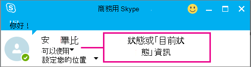

# 在商務用 Skype Online 中設定目前狀態Configure presence in Skype for Business Online

根據預設，任何可以使用商務用 Skype 與組織中的人員進行通訊的人，也可以查看該人員是否處於線上狀態。By default, anyone who can communicate with one of the people in your organization using Skype for Business can also see whether that person is online. [商務用 Skype] 會顯示人員是否可在線上、會議、離線或其他標記中取得。Skype for Business shows whether a person is available online, in a meeting, offline, or another indicator.

作為企業中每個人的系統**[管理員](https://support.office.com/article/eac4d046-1afd-4f1a-85fc-8219c79e1504)**，您可以選擇誰能在商務用 Skype 中看到他們的線上狀態。As the **[admin](https://support.office.com/article/eac4d046-1afd-4f1a-85fc-8219c79e1504)** for everyone in your business, you can choose who sees their online presence in Skype for Business.

 **使用商務用 skype 系統管理中心**顯示商務用 skype 標誌的圖示 **Using the Skype for Business admin center**

1. 移至系統管理中心 > 系統**管理中心** > **商務用 Skype**。Go to the admin center > **Admin centers** > **Skype for Business**.

2. 在**商務用 Skype 系統管理中心**中，選擇 [**組織**]。In the **Skype for Business admin center**, choose **organization**.

3. 在 [目前**狀態隱私權模式]** 底下，選取下列其中一個設定，然後選擇 [**儲存**]。Under **presence privacy mode**, select one of the following settings, and then choose **Save**.

|**正在****Setting**|**誰可以查看使用者的目前狀態****Who can view a user's presence**|
|:-----|:-----|
|**自動顯示目前狀態資訊****Automatically display presence information**   |貴公司中尚未新增至人員**外部**或**封鎖**清單的任何商務用 Skype 使用者，都能看到該人員的線上狀態。Any Skype for Business user in your business who has not been added to a person's **External** or **Blocked** list will be able to see that person's online presence.   |
|**只向使用者的連絡人顯示目前狀態資訊****Display presence information only to a user's contacts**   |人員連絡人清單中尚未新增至其 [**外部**] 或 [已**封鎖**] 清單的任何人。Anyone in a person's Contacts list who they have not added to their **External** or **Blocked** list.   個人可以在其商務用 Skype app 中覆寫您的預設設定： [**設定** > **工具** > ]**選項**。Individuals can override your default settings in their Skype for Business app: **Settings** > **Tools** > **Options**.   |

如需使用者可以在商務用 Skype 中變更哪些內容的相關資訊，請參閱下列文章：For information about what your users can change in Skype for Business, see these articles:

- [控制在商務用 Skype 中您目前狀態資訊的存取權Control access to your presence information in Skype for Business](https://support.office.com/en-us/article/fea86e34-60cf-4dd0-bfb2-169a42afd92c)

- [在商務用 Skype 中設定狀態選項Set Status options in Skype for Business](https://support.office.com/en-us/article/efd25395-c8ef-4510-b9cb-6f70e2fff8a0)

## 相關主題Related topics

[設定商務用 Skype OnlineSet up Skype for Business Online](set-up-skype-for-business-online.md)

[讓商務用 Skype 使用者新增 Skype 連絡人Let Skype for Business users add Skype contacts](let-skype-for-business-users-add-skype-contacts.md)

