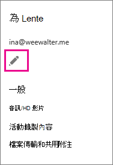

# 系統管理員：為個別使用者設定商務用 Skype 設定Admins: Configure Skype for Business settings for individual users

> [!IMPORTANT]
> Microsoft Teams 系統管理中心已取代商務用 Skype 系統管理中心 (舊版) 。The Microsoft Teams admin center has replaced the Skype for Business admin center (Legacy portal). 管理商務用 Skype 的所有設定現在都位於 Teams 系統管理中心。All settings for managing Skype for Business are now in the Teams admin center. 您必須被指派全域系統管理員或商務用 Skype 系統管理員的 Azure [AD](/azure/active-directory/roles/permissions-reference) 系統管理員角色，才能在 Teams 系統管理中心管理商務用 Skype 功能。You must be assigned the [Azure AD admin role](/azure/active-directory/roles/permissions-reference) of Global admin or Skype for Business admin to manage Skype for Business features in the Teams admin center. 若要深入了解，請參閱[在 Microsoft Teams 系統管理中心中管理商務用 Skype 設定](/MicrosoftTeams/skype-for-business-settings?bc=%2fskypeforbusiness%2fbreadcrumb%2ftoc.json&toc=%2fskypeforbusiness%2fsfbotoc%2ftoc.json)。To learn more, see [Manage Skype for Business settings in the Microsoft Teams admin center](/MicrosoftTeams/skype-for-business-settings?bc=%2fskypeforbusiness%2fbreadcrumb%2ftoc.json&toc=%2fskypeforbusiness%2fsfbotoc%2ftoc.json).

本文將說明系統管理員如何為少數使用者設定商務用 Skype。This article explains how admins configure Skype for Business for a small number of users. 若要大量執行這些步驟，我們已提供您可以使用的 Windows PowerShell Cmdlet 連結。To do these steps in bulk, we've included links to the Windows PowerShell cmdlets you can use.
  
若要允許 (或封鎖) 企業中的每個人與外部人員通訊，請參閱：To allow (or block) everyone in your business to communicate with external people, see:
  
- 允許使用者與外部商務用[Skype](allow-users-to-contact-external-skype-for-business-users.md)使用者聯繫：您可以讓貴組織使用進一步商務用 Skype 功能 (共用桌面、尋找誰在線上等 ) 來與特定信任的 (聯盟) 企業的人員通訊。[Allow users to contact external Skype for Business users](allow-users-to-contact-external-skype-for-business-users.md): You can let your organization use advanced Skype for Business features (share desktops, look for who's online, etc.) to communicate with people in a specific trusted (federated) business. 本文也會說明如何封鎖與特定網域的通訊。The article also explains how to block communication with specific domains.
    
- [讓商務用 Skype 使用者新增 Skype 連絡人](let-skype-for-business-users-add-skype-contacts.md)。[Let Skype for Business users add Skype contacts](let-skype-for-business-users-add-skype-contacts.md). 您可以讓貴組織使用商務用 Skype 搜尋並使用免費應用程式 Skype 的人員並 IM。You can let your organization use Skype for Business to search for and IM people who use Skype, the free app.
    
## 設定一位使用者的一般設定Configure general settings for one user

您必須擁有 [系統管理員許可權，才能](https://support.office.com/article/da585eea-f576-4f55-a1e0-87090b6aaa9d) 執行這些步驟。You must have [admin permissions](https://support.office.com/article/da585eea-f576-4f55-a1e0-87090b6aaa9d) to perform these steps.

 **使用商務用 Skype 系統管理中心** **Using the Skype for Business admin center**
  
1. 使用公司或學校帳戶來登錄。Sign in with your work or school account.
    
2. 選擇 **系統管理中心**  >  **商務用 Skype**。Choose **Admin centers** > **Skype for Business**.
    
3. 選擇 **使用者**。Choose **Users**.
    
    
  
4. 選擇您想要編輯的使用者。Choose which users you want to edit.
    
5. 在右面板中 **，選擇編輯**。In the right panel, choose **Edit**.
    
    
  
6. 在一 **般** 選項頁面上，選取或清除您想要變更的功能旁的核取方塊， **然後選擇儲存**。On the **General** options page, select or clear the check box next to the features you want to change, and then choose **Save**.
    
|**選項****Option**|**詳細資料****Details**|
|:-----|:-----|
|音訊和 HD 影片Audio and HD video    |允許此人錄製音訊會議、音訊和視訊會議，或不允許他們排程任何 (會議) 。Allow this person to record audio meetings, audio and video meetings, or don't allow them to schedule any meetings (none).    |
|錄製交談和會議Record conversations and meetings    |選擇允許此人錄製哪些專案。Choose what this person is allowed to record.    此選項不適用於商務用 Skype Basic。This option is not available with Skype for Business Basic.    |
|針對合規性，請關閉未存檔的功能For compliance, turn off non-archived features    | 如果您依法需要保留以電子方式儲存的資訊，請選擇這個選項。Choose this option if you're legally required to preserve electronically stored information.    選取此選項會關閉 Exchange 系統管理中心設定就地保留時未捕獲的功能。Selecting this option turns off features that aren't captured when you have an [In-Place Hold](/exchange/security-and-compliance/in-place-and-litigation-holds) set up in the Exchange admin center. 它會關閉下列功能：It turns off the following features:    使用立即訊息傳輸檔案File transfer using instant messaging    共用 OneNote 頁面Shared OneNote pages    PowerPoint 注釋PowerPoint annotations   |
   
若要大量設定這些設定，請使用 PowerShell。To configure these settings in bulk, use PowerShell. 請參閱 [為 Windows PowerShell 設定您的電腦](../set-up-your-computer-for-windows-powershell/set-up-your-computer-for-windows-powershell.md)。See [Set up your computer for Windows PowerShell](../set-up-your-computer-for-windows-powershell/set-up-your-computer-for-windows-powershell.md).
  
## 封鎖外部通訊Block external communications

當您讓 [商務用 Skype 使用者為公司](let-skype-for-business-users-add-skype-contacts.md) 中的每個人新增 Skype 連絡人之後，您可以使用這些步驟選擇性地封鎖特定人員的外部通訊。After you [Let Skype for Business users add Skype contacts](let-skype-for-business-users-add-skype-contacts.md) for everyone in your company, you can selectively block external communications for specific individuals using these steps.
  
1. 選擇 **使用者**，選取您想要停用其設定的使用者，然後選擇 **編輯編輯**  。Choose **Users**, select the users whose settings you want to disable, and then choose **Edit** .
    
2. 選擇 **外部通訊**，然後適當清除選項：Choose **External communications**, and then clear the options as appropriate:
    
   - **外部商務** 用 Skype 使用者：如果您不希望使用者與在聯盟網域的商務用 Skype 使用者通訊，請清除此方塊。**External Skype for Business users**: Clear this box if you don't want the user to be able to communicate with Skype for Business users in federated domains.
    
   - **外部 Skype 使用者**：如果您不希望使用者能夠與使用 freeSkype 應用程式的人員通訊，請清除此方塊。**External Skype users**: Clear this box if you don't want the user to be able to communicate with people who are using the freeSkype app.
    
3. 按一下 [儲存]。Click **Save**.
    
若要大量設定這些設定，請使用 PowerShell。To configure these settings in bulk, use PowerShell. 請參閱 [為 Windows PowerShell 設定您的電腦](../set-up-your-computer-for-windows-powershell/set-up-your-computer-for-windows-powershell.md)。See [Set up your computer for Windows PowerShell](../set-up-your-computer-for-windows-powershell/set-up-your-computer-for-windows-powershell.md).
  
## 編輯一個使用者的音訊會議設定Edit audio conferencing settings for one user

1. 選擇 **使用者**，選取要編輯其音訊會議設定的使用者， **然後選擇編輯**  。Choose **Users**, select the user whose audio conferencing settings you wan to edit, ,and then choose **Edit** .
    
2. 選擇 **[音訊會議」，** 選取您的音訊會議提供者，輸入或變更要求的資訊，然後按一下 [ **儲存**。Choose **Audio conferencing**, select your audio conferencing provider, type or change the requested information, and then click **Save**.
    
|**音訊會議設定****Audio conferencing setting**|**描述****Description**|
|:-----|:-----|
|**提供者名稱****Provider name**   |從清單中選擇您的提供者。Choose your provider from the list.    |
|**必須撥打 (** 電話號碼) **Toll number** (required)   |對於協力廠商 ACP，這些電話號碼就是您從音訊會議提供者收到的號碼。For a third-party ACP, these phone numbers are the ones you received from the audio conferencing provider. 如果使用者使用 Microsoft 做為音訊會議提供者，這些號碼會設定在音訊會議橋接器上。If the user is using Microsoft as the audio conferencing provider, these will be numbers that are set on the audio conferencing bridge. 在商務用 Skype 和 Microsoft Teams 會議要求中，將數位格式格式化為您想要的數位。Format the numbers as you want them to appear in Skype for Business and Microsoft Teams meeting requests.    |
|**免付費號碼****Toll-free number**   |對於協力廠商 ACP，這些電話號碼就是您從音訊會議提供者收到的號碼。For a third-party ACP, these phone numbers are the ones you received from the audio conferencing provider. 如果使用者使用 Microsoft 做為音訊會議提供者，這些號碼會設定在音訊會議橋接器上。If the user is using Microsoft as the audio conferencing provider, these will be numbers that are set on the audio conferencing bridge. 在商務用 Skype 和 Microsoft Teams 會議要求中，格式化數位。Format the numbers as you want them to appear in Skype for Business and Microsoft Teams meeting requests.    |
|**會議 ID 和 PIN** (必須) **Conference ID and PIN** (required)   |參與者 PIN 或會議代碼，用來加入此使用者排程的會議，且由協力廠商音訊會議提供者提供。The participant PIN, or conference code, used to join meetings that are scheduled by this user and are provided from a third-party audio conferencing provider. 如果使用者使用 Microsoft 做為音訊會議提供者，則不需要這樣做。If the user is using Microsoft as the audio conferencing provider, this won't be required.    |
   
若要大量設定這些設定，請使用 PowerShell。To configure these settings in bulk, use PowerShell. 請參閱[設定邀請中包含的電話號碼](../audio-conferencing-in-office-365/set-the-phone-numbers-included-on-invites.md)[設定電腦以使用 Windows PowerShell。](../set-up-your-computer-for-windows-powershell/set-up-your-computer-for-windows-powershell.md)See [Set the phone numbers included on invites](../audio-conferencing-in-office-365/set-the-phone-numbers-included-on-invites.md) [Set up your computer for Windows PowerShell](../set-up-your-computer-for-windows-powershell/set-up-your-computer-for-windows-powershell.md).

[!INCLUDE [LinkedIn Learning Info](../../common/office/linkedin-learning-info.md)]
  
   
## 相關主題Related topics 

[設定商務用 Skype OnlineSet up Skype for Business Online](set-up-skype-for-business-online.md)

[商務用 Skype 和 Microsoft Teams 附加元件授權Skype for Business and Microsoft Teams add-on licensing](../skype-for-business-and-microsoft-teams-add-on-licensing/skype-for-business-and-microsoft-teams-add-on-licensing.md)
  
  
