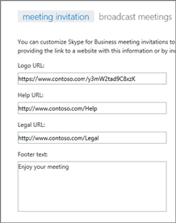
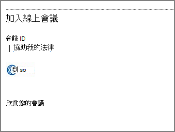

# 自訂會議邀請

如果您是系統管理員，您可以確保所有商務用 Skype 會議邀請都包含您的使用者可能需要的一些有用資訊，例如支援網站的連結和法律免責聲明、您的公司標誌，以及您想要包含的其他文字。 
  
## 建立會議邀請標誌的秘訣

1. 建立不超過188圖元寬（相當小）的影像。
    
2. 將影像儲存為 JPG 格式。
    
3. 將影像儲存在您企業中的每個人都可以存取的中央位置，例如網路共用、共用的商務用 OneDrive 資料夾、Dropbox 等。
    
    現在，您可以將它新增到會議邀請。 請參閱後續步驟。
    
## 自訂會議邀請

 **使用商務用 skype 系統管理中心**顯示商務用 skype 標誌的圖示

1. 使用您的公司或學校帳戶登入 Office 365。
    
2. 在系統管理中心，選擇 [系統管理中心] 的 [**管理員中心** > **]。**
    
3. 在商務用 Skype 系統管理中心中，選擇 [**線上會議**]。 
    
4. 完成下列方塊：
    
     

   **標誌 URL：** 輸入您的標誌儲存位置的 URL。 請記住，它必須是 JPG 格式！ 
 
   說明**URL：** 如果您的組織有問題，而您想讓其他人在有問題時移至該網站，請在這裡輸入 URL。 

   **合法 URL：** 如果您的組織有法律網站，而您想讓其他人在他們有法律擔心時，請在這裡輸入 URL。
    
   頁尾**文字：** 輸入適合您使用者的純文字註腳。  
  
   
5. 選擇 [**儲存**]。
    
6. 等候一小時或如此，即可在所有 Office 365 服務上填入變更。 接著，移至 Outlook 並排程 Skype 會議，以查看您的變更看起來。 
    
    
  
## 相關主題

[在 Office 365 中試用或購買音訊會議](../audio-conferencing-in-office-365/try-or-purchase-audio-conferencing-in-office-365.md)

  
 
