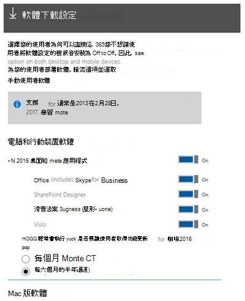
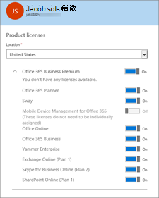

# 在 商務用 Skype 或 Microsoft 365 部署 Office 365Deploy the Skype for Business client in Microsoft 365 or Office 365

[!INCLUDE [sfbo-retirement](../../Hub/includes/sfbo-retirement.md)]

本文說明系統管理員如何將應用程式部署商務用 Skype組織人員 **** 的選項。This article explains options for how you, the **[admin](https://support.office.com/article/eac4d046-1afd-4f1a-85fc-8219c79e1504)**, can deploy the Skype for Business app to the people in your organization.
  
在將 商務用 Skype部署至使用者之前，請確定您已完成設定線上版一文中的步驟 1-3 商務用 Skype[步驟](set-up-skype-for-business-online.md)。Before you deploy Skype for Business to your users, make sure you've done steps 1-3 in the article [Set up Skype for Business Online](set-up-skype-for-business-online.md). 如此一來，商務用 Skype網域進行設定，每個人都會擁有他們的授權，而且您將為貴組織的 商務用 Skype Online 設定 IM[和設定](configure-presence-in-skype-for-business-online.md)目前狀態。This way, Skype for Business will be set up with your domain, everyone will have their licenses, and you will have configured IM and [Configure presence in Skype for Business Online](configure-presence-in-skype-for-business-online.md) for your organization.
  
> [!NOTE]
> 使用者若要安裝 商務用 Skype應用程式，他們必須是電腦或裝置上的本地系統管理員。For users to install the Skype for Business app, they need to be local admins on their PC or device. 或者，他們必須是可以在電腦或裝置上安裝 App 的當地群組的一部分。Or they will need to be part of a local group that can install apps on their PC or devices. 如果您的使用者不允許在裝置上安裝軟體，您必須為使用者商務用 Skype應用程式。If your users aren't allowed to install software on their devices, you'll need to install the Skype for Business app for them. 
  
## 適用于大多數中小型企業For most small and medium-sized businesses

 **逐步安裝指示：** 如果您有中小型企業，建議您直接要求使用者將 商務用 Skype應用程式安裝在他們的 PC 上。**Step-by-step installation instructions:** If you have a small or medium-sized business, we recommend that you simply ask your users to install the Skype for Business app on their PC. 指向這些[指示：安裝](https://support.office.com/article/8a0d4da8-9d58-44f9-9759-5c8f340cb3fb)商務用 Skype。Point them to these instructions: [Install Skype for Business](https://support.office.com/article/8a0d4da8-9d58-44f9-9759-5c8f340cb3fb). 如果他們使用的是 Mac，請指向設定[Lync for Mac 2011 Office 365。](https://support.office.com/article/ae3ebd0e-a1a7-48cf-9350-36b144dc5f88)If they are using Macs, point them to [Set up Lync for Mac 2011 for Office 365](https://support.office.com/article/ae3ebd0e-a1a7-48cf-9350-36b144dc5f88). 商務用 Skype應用程式會與應用程式的其他部分分開Office安裝。The Skype for Business app is installed separately from the rest of the Office apps.
  
 **Microsoft 365 Apps 企業版客戶：** 如果您的公司使用包含 Office 365 的 Microsoft 365 Apps 企業版 方案 ，例如 E3 方案，則 商務用 Skype 應用程式會同時安裝，同時您的使用者下載並安裝 Word、Excel、PowerPoint 等。這也表示他們無法卸載商務用 Skype，除非他們卸載Office。**Microsoft 365 Apps for enterprise customers:** If your business is using an Office 365 plan that includes Microsoft 365 Apps for enterprise, such as the E3 plan, the Skype for Business app is installed at the same time your users download and install Word, Excel, PowerPoint, etc. This also means they can't uninstall Skype for Business unless they uninstall all of Office.
  
### 選擇是否要商務用 Skype使用者使用Choose whether to make Skype for Business available to your users

做[為系統管理員](https://support.office.com/article/eac4d046-1afd-4f1a-85fc-8219c79e1504)，您可以選擇是否要讓使用者商務用 Skype應用程式。As the [admin](https://support.office.com/article/eac4d046-1afd-4f1a-85fc-8219c79e1504) you can choose whether to make the Skype for Business app available to your users.
  
- **若要控制公司中的** 每個人都是否獲得軟體：請Microsoft 365系統管理中心，前往安裝我的軟體，然後選取您想要供使用者使用的軟體。**To control whether everyone in your company gets the software**: Sign in to the Microsoft 365 admin center, go to **Install my software**, and then select the software you want to be available for users.
    
    
  
- 若要控制公司中的特定人員是否取得軟體：請登錄 Microsoft 365 系統管理中心、前往 [使用者使用中使用者>、選取要授予軟體存取權限的人，然後按一下 [產品授權旁邊的編輯>，然後開啟或  >  關閉授權。**To control whether specific people in your company get the software**: Sign in to the Microsoft 365 admin center, go to **Users** > **Active users**, select the person who you want to give access to the software, and then click **Edit** next to **Product licenses** and turn the license on or off.
    
    
  
> [!NOTE]
> 如果您需要查看指派給貴組織人員哪些方案，請Microsoft 365系統管理中心>\*\*\*\*  >  **使用者**。If you need to see what plans are assigned to people in your organization, sign in to the Microsoft 365 admin center > **Users** > **Active users**. 從清單中選取人員，然後查看產品 **授權下的**。Select the person from the list then look under **Product licenses**. 如果您使用的是傳統系統管理中心，請看下指派 **授權**。If you are using the classic admin center, look under **Assigned license**. 
  
### 手動將商務用 Skype部署至您的使用者Manually deploying Skype for Business to your users

如果您希望使用者從網路商務用 Skype而不是從網際網路安裝應用程式，您可以下載設定檔案。If you want your users to install the Skype for Business app from a location on your network instead of from the Internet, you can download the setup files. 若要這麼做，請前往系統管理中心的手動部署使用者Microsoft 365區段。To do this go to the **Manually deploy user software** section of the Microsoft 365 admin center. 接著， **您可以選取安裝** ，然後將.exe儲存到網路位置。You can then select **Install** and save the setup .exe file to a network location.
  
另一個選項是下載 商務用 Skype基本應用程式。Another option is to download the Skype for Business Basic app for your users. 您可以下載 Microsoft 商務用 Skype [32 (64 位基本) 。](https://www.microsoft.com/download/details.aspx?id=49440)You can download [Microsoft Skype for Business Basic (32 or 64 Bit)](https://www.microsoft.com/download/details.aspx?id=49440).
  
對於完整和基本 商務用 Skype 應用程式，下載設定檔案之後，您必須手動傳送 (，例如以電子郵件傳送) 網路路徑給使用者，以便他們執行安裝程式，將應用程式安裝在他們的電腦上。For both the full and basic Skype for Business apps, after you have downloaded the setup files, you will need to manually send (for example, in email) the network path to the users so they can run the setup program to install the app on their computer.
  
您也可以使用這些下載，使用現有的軟體部署工具和商務用 Skype，將應用程式部署到您的使用者。You can also use these downloads to deploy the Skype for Business app to your users by using your existing software deployment tools and processes.
  
## 適用于大型企業及企業組織For larger and enterprise organizations

> [!NOTE]
> 本節僅適用于透過商務用 Skype方案Office 365應用程式。This section only applies to the Skype for Business app available through Office 365 plans. 如果貴組織使用大量授權版本的 商務用 Skype 應用程式 ，Windows 安裝程式型 (MSI) ，請參閱在 商務用 Skype Server 中自訂 Windows[用戶端安裝](../../SfbServer/deploy/deploy-clients/customize-windows-client-installation.md)。If your organization is using a volume licensed version of the Skype for Business app, which is Windows Installer-based (MSI), see [Customize Windows client installation in Skype for Business Server](../../SfbServer/deploy/deploy-clients/customize-windows-client-installation.md).
  
在許多企業或大型組織中，使用者不得在電腦上安裝軟體。In many enterprises or large organizations, users aren't allowed to install software on their computers. IT 部門會改為將必要的軟體部署到使用者的電腦。Instead, the IT departments deploy the necessary software to the users' computers. IT 部門也可能想要控制其組織中所使用的網際網路或網路頻寬量，因此他們想要從網路上附近的位置安裝軟體，而不是從網際網路或整個公司網路安裝軟體。IT departments also might want to control the amount of Internet or network bandwidth used in their organization, so they want to install software from a nearby location on their network instead of from across the Internet or across the corporate network.
  
有了 Office 365，如果您想要控制應用程式安裝位置，商務用 Skype數種部署應用程式的選項。With Office 365, you have several options for deploying the Skype for Business app if you want to control where it's installed from. 其中一些選項包括下列專案：Some of those options include the following:
  
- 從系統商務用 Skype將應用程式下載到您的Microsoft 365網路，如手動將 商務用 Skype[部署](deploy-the-skype-for-business-client-in-office-365.md#bkmk_manual_1)給使用者中所述。Download the Skype for Business app to your local network from the Microsoft 365 admin center, as described in [Manually deploying Skype for Business to your users](deploy-the-skype-for-business-client-in-office-365.md#bkmk_manual_1).
    
- 使用 Office **[部署工具](https://go.microsoft.com/fwlink/p/?LinkID=626065)**，將 Microsoft 365 Apps 企業版或 商務用 Skype應用程式下載到您的本地網路。Use the **[Office Deployment Tool](https://go.microsoft.com/fwlink/p/?LinkID=626065)** to download either Microsoft 365 Apps for enterprise or the Skype for Business app to your local network. 然後，使用 Office部署工具將應用程式部署到您的使用者。Then, use the Office Deployment Tool to deploy the app to your users. Office部署工具讓您能夠控制部署的某些層面，例如語言和版本 (32 位或 64 位) 。The Office Deployment Tool gives you the ability to control certain aspects of the deployment, such as languages and version (32-bit or 64-bit).
    
- 使用現有的軟體部署工具和程式 ，例如 Microsoft Endpoint Configuration Manager，將 Microsoft 365 Apps 企業版或 商務用 Skype應用程式部署到您的使用者。Use your existing software deployment tools and processes, such as Microsoft Endpoint Configuration Manager, to deploy Microsoft 365 Apps for enterprise or the Skype for Business app to your users. 您可以使用現有的工具和程式Office[部署](https://go.microsoft.com/fwlink/p/?LinkID=626065)工具，或使用從系統管理中心下載Microsoft 365軟體。You can use your existing tools and processes with the [Office Deployment Tool](https://go.microsoft.com/fwlink/p/?LinkID=626065) or with the software that you've downloaded from the Microsoft 365 admin center.
    
### 使用部署工具Office詳細資訊More info on using the Office Deployment Tool

有關下載 Office 部署工具的詳細資訊，以及安裝 商務用 Skype 應用程式和其他 Office 365 用戶端應用程式的詳細資訊，請參閱在 Office 365[中管理軟體下載設定](https://support.office.com/article/c13051e6-f75c-4737-bc0d-7685dcedf360)。For details on downloading the Office Deployment Tool and more information on installing the Skype for Business app and other Office 365 client apps, see [Manage software download settings in Office 365](https://support.office.com/article/c13051e6-f75c-4737-bc0d-7685dcedf360).
  
以下是使用部署工具部署應用程式Office相關步驟概觀：Here's an overview of the steps involved in using the Office Deployment Tool to deploy an app:
  
1. **[從 Microsoft 下載Office下載](https://www.microsoft.com/download/details.aspx?id=49117)** 最新的部署工具。**[Download the newest Office Deployment Tool](https://www.microsoft.com/download/details.aspx?id=49117)** from the Microsoft Download Center.
    
2. 建立 configuration.xml 檔案，以用於具有您想要的用戶端應用程式設定之 Office 部署工具，例如設定版本 (32 位或 64 位) 、安裝語言等。Create the configuration.xml file to be used with the Office Deployment Tool that has the client app settings you want, such as setting the version (32-bit or 64-bit), the installation language, etc.
    
3. 使用 Office部署工具及configuration.xml檔案，將設定檔案從 Office 內容傳遞網路 (CDN) 下載至您的本地或Office 內容傳遞網路 (CDN) 。Use the Office Deployment Tool and the configuration.xml file to download the setup files to your local or internal network from the Office Content Delivery Network (CDN).
    
4. 使用 Office 部署工具及configuration.xml來安裝 Office 用戶端應用程式，包括 商務用 Skype 應用程式。Use Office Deployment Tool and the configuration.xml to install the Office client apps, including the Skype for Business app.
    
有關使用部署Office及configuration.xml的詳細資訊，請參閱下列文章：For details on using the Office Deployment Tool and configuration.xml file, see the following articles:
  
- [Office部署工具概觀Office Deployment Tool overview](/deployoffice/overview-office-deployment-tool)
    
- [Configuration.xml設定Configuration.xml settings](/deployoffice/office-deployment-tool-configuration-options)
    
### 有關使用Microsoft Endpoint Configuration ManagerMore info on using Microsoft Endpoint Configuration Manager

您可以使用現有的軟體部署工具和程式 ，例如 Microsoft Endpoint Configuration Manager，來部署 商務用 Skype應用程式。You can use your existing software deployment tools and processes, such as Microsoft Endpoint Configuration Manager, to deploy the Skype for Business app. 您可以使用這些工具和程式，使用從系統管理中心下載的軟體，Microsoft 365部署工具Office程式。You can use these tools and processes with either the software that you download from the Microsoft 365 admin center or with the Office Deployment Tool.
  
若要進一步使用 Configuration Manager 部署軟體，請參閱下列文章：For more information about using Configuration Manager to deploy software, see the following articles:
  
- [在 Configuration Manager 中建立應用程式Create applications in Configuration Manager](/configmgr/apps/deploy-use/create-applications)
    
- [使用 Configuration Manager 部署應用程式Deploy applications with Configuration Manager](/configmgr/apps/deploy-use/deploy-applications)
    
如果您是在部署應用程式時商務用 Skype應用程式，請參閱使用 configuration Manager Microsoft 365 Apps 企業版管理Microsoft 365 Apps 企業版[應用程式](/configmgr/sum/deploy-use/manage-office-365-proplus-updates)。If you're deploying the Skype for Business app as part of deploying Microsoft 365 Apps for enterprise, see [Manage Microsoft 365 Apps for enterprise with Configuration Manager](/configmgr/sum/deploy-use/manage-office-365-proplus-updates).
  
## 規劃應用程式更新商務用 Skype應用程式Planning for updates to the Skype for Business app

在部署應用程式商務用 Skype，您必須考慮安裝更新後商務用 Skype取得更新。As part of deploying the Skype for Business app, you need to consider how you want to get updates after Skype for Business is installed. 這些更新可以包含新功能、安全性更新或非安全性更新，例如提供穩定性或改良效果的更新。These updates can include new features, security updates, or non-security updates, such as updates that provide stability or performance improvements. 您需要考慮的兩個主要專案為：The two primary things you need to consider are :
  
- 您想要從何處取得更新Where do you want to get updates from
    
- 您想要取得功能更新的頻次How often do you want to get feature updates
    
雖然您可以控制從何處取得更新，以及取得功能更新的頻次，但無法選擇您取得的特定安全性更新或非安全性更新。While you can control where you get updates from and how often you get feature updates, you can't choose which specific security updates or non-security updates you get.
  
 **從何處取得更新****Where to get updates from**
  
根據預設，安裝 商務用 Skype應用程式之後，當 Microsoft 提供更新時，系統會自動從網際網路下載更新。By default, after the Skype for Business app is installed, updates will be automatically downloaded from the Internet when they are available from Microsoft. 如果您想要進一控制更新發生的時間或更新的安裝位置，您可以使用 Office部署工具或群組原則來設定。If you want more control over when updates occur or where the updates are installed from, you can use the Office Deployment Tool or Group Policy to configure that.
  
例如，許多組織想要先與一群使用者測試更新，然後再將更新部署到整個組織。For example, many organizations want to test updates with a group of users before deploying them throughout the organization. 您可以使用部署工具Office群組原則來設定 商務用 Skype 應用程式，以從您網路上特定位置取得更新，而不是從網際網路自動取得更新。You can do this by using the Office Deployment Tool or Group Policy to configure the Skype for Business app to get updates from a specific location on your network, instead of automatically from the Internet. 然後，您可以使用 Office部署工具，每個月將更新下載到您的本地網路。Then, you can use the Office Deployment Tool to download the updates every month to your local network.
  
有關更新如何適用于軟體Office 365，請參閱以下文章：For more information about how updates work for Office 365 software, see these articles:
  
- [更新程式概觀Microsoft 365 Apps 企業版Overview of the update process for Microsoft 365 Apps for enterprise](/deployoffice/overview-update-process-microsoft-365-apps)
    
- [選擇如何管理更新Microsoft 365 Apps 企業版Choose how to manage updates to Microsoft 365 Apps for enterprise](/deployoffice/choose-how-manage-updates-microsoft-365-apps)
    
- [設定更新Microsoft 365 Apps 企業版Configure update settings for Microsoft 365 Apps for enterprise](/deployoffice/configure-update-settings-microsoft-365-apps)
    
  **取得功能更新的頻次****How often to get feature updates**
  
除了從何處取得更新之外，您也可以控制取得用戶端新功能商務用 Skype多久。In addition to where you get updates from, you can also control how often you get new features for the Skype for Business client. 這兩個選項如下：The two choices are the following:
  
- 如果有新功能，每個月取得功能更新Get feature updates every month, if there are new features
    
- 每六個月取得功能更新一次Get features updates every six months
    
對於某些組織，他們想要測試新功能的時間，因此他們只想一年取得兩次功能更新，而不是每個月。For some organizations, they want time to test new features, so they want to get feature updates only twice a year instead of every month.
  
您可以使用部署工具或群組原則來控制取得功能更新Office設定更新通道。You can control how often you get feature updates by using the Office Deployment Tool or Group Policy to configure the update channel. 每月通道會提供每月功能更新 (大約) ，而 Semi-Annual通道則每六個月提供一次功能更新。The Monthly Channel gives you feature updates monthly (approximately), while the Semi-Annual Channel gives you feature updates every six months. 有關頻道的資訊，請參閱更新通道概觀[的 Microsoft 365 Apps 企業版。](https://support.office.com/article/9ccf0f13-28ff-4975-9bd2-7e4ea2fefef4)For more information about channels, see [Overview of update channels for Microsoft 365 Apps for enterprise](https://support.office.com/article/9ccf0f13-28ff-4975-9bd2-7e4ea2fefef4).
  
## 相關主題Related topics

[設定商務用 Skype OnlineSet up Skype for Business Online](set-up-skype-for-business-online.md)
  
[商務用 Skype Microsoft Teams附加元件授權Skype for Business and Microsoft Teams add-on licensing](../skype-for-business-and-microsoft-teams-add-on-licensing/skype-for-business-and-microsoft-teams-add-on-licensing.md)
  
  
