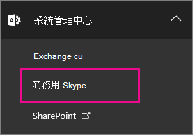
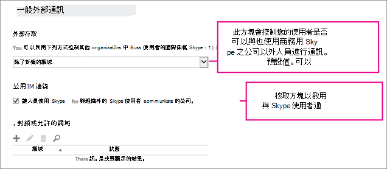
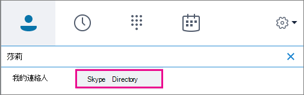

# 讓商務用 Skype 使用者新增 Skype 連絡人

[!INCLUDE [sfbo-retirement](../../Hub/includes/sfbo-retirement.md)]

有了商務用 Skype，您的使用者可以與使用免費應用程式Skype搜尋和 IM！ 本文將說明您需要執行哪些工作，以便他們新增Skype連絡人。 
  
您必須擁有[管理員許可權](https://support.office.com/article/da585eea-f576-4f55-a1e0-87090b6aaa9d?ui=en-US&rs=en-US&ad=US)Microsoft 365或Office 365才能執行此操作。

 **使用商務用 Skype 系統管理中心**
  
1. 使用您的帳戶Microsoft 365或Office 365系統管理員 [https://portal.office.com/adminportal/home](https://portal.office.com/adminportal/home#/homepage) 帳戶。
    
2. 在系統管理中心，前往系統 **管理中心**  >  **商務用 Skype。** 
    
    
  
3. 在 [商務用 Skype 系統管理中心]，選擇 [組織]  >  [外部通訊]。 
    
4. 根據預設，如果您的防火牆已商務用 Skype (允許此防火牆，您的使用者可以與全世界所有使用此) 。 
    
    
  
    如果您希望使用者與Skype聊天，但您不希望他們與使用 商務用 Skype 的人聊天，請選擇僅適用于允許的 **網域**。 當您啟用與使用者Skype時，skype.com 會自動新增為幕後允許的網域。 
    
    如果您想要允許全球所有其他企業使用 商務用 Skype，請選擇除了封鎖網域以外的 On，然後選擇新增 **+** 這些網域。 除了這些特定網域上的人員之外，每個人都可以與您聯繫。  (某些企業可能會選擇這個選項，例如，如果他們正在訴訟中，而且需要確保沒有與其他企業聯繫。) 
    
5. 選擇 **讓人員使用商務用 Skype與組織Skype使用者通訊**。 
    
6.  如果您使用的是防火牆Windows，商務用 Skype自動開啟所需的埠。
    
    如果貴組織使用另一個解決方案來限制網路上的電腦無法連接到網際網路，請確保用戶端電腦能夠存取 Skype 連接的所有[IP](https://support.office.com/article/8548a211-3fe7-47cb-abb1-355ea5aa88a2)位址和 URL，Skype目錄搜尋。 這可能需要將它們新增到防火牆或 Proxy 基礎結構組配置的外發允許清單。
    
7. **等候最多 24 小時進行測試**。 每次變更外部通訊設定時，變更最多可能需要 24 小時，才能填入所有資料中心。
    
8. 向使用者顯示如何尋找連絡人，Skype連絡人的連絡人清單商務用 Skype連絡人。 指向 在 商務用 Skype[中搜尋商務用 Skype。](https://support.office.com/article/b12500ef-e37f-4d22-aade-c11277e53f19)
    
## 測試和疑難排解

若要測試您的設定，您需要在公司防火牆Skype的連絡人。 他們可以使用 Gmail 帳戶Skype或Outlook.com 帳戶或其他電子郵件帳戶類型來登錄帳戶。
  
1. 變更外部通訊設定之後，請等候 **最多 24 小時進行測試**。
    
2. 登出商務用 Skype，然後再次登錄，這樣您便看到搜尋目錄Skype選項。 
    
    
  
3. 在 商務用 Skype中，在 Skype中搜尋您的連絡人，然後傳送聊天要求。 
    
    如果您收到由於公司政策無法送出的郵件，您必須仔細檢查防火牆 [設定](https://support.office.com/article/8548a211-3fe7-47cb-abb1-355ea5aa88a2)。 
    
4. 另一個測試問題是否出在防火牆上的方法，是前往防火牆後面的 wifi 位置，例如咖啡店，然後使用 商務用 Skype 傳送要求給您的Skype聯絡人聊天。 
    
   - **如果您傳送您的Skype聯絡要求，但他們** 從未收到要求，請要求他們傳送邀請與您聊天。 如果問題是在兩者之間建立Skype，商務用 Skype通常可以解決問題。
    
   - 現在，如果訊息在咖啡店傳遞，但您不在公司時，就會知道問題出在防火牆上。 
    
## 您可以和無法執行哪些工作

- **商務用 Skype Mac** 上的連絡人無法搜尋並Skype連絡人。
    
- 啟用目錄搜尋時，您可以搜尋及尋找Skype商務用 Skype使用者。 如果您因為某種原因無法搜尋目錄來尋找，您可以傳送連絡人要求給他們，然後讓他們Skype並接受，以便他們進行 IM。 
    
- 無法允許與其他 IM 提供者 ，例如 Google 或 Facebook 的 IM 連接。 您無法使用商務用 Skype手機文字訊息。

- 無法錄製連絡人與連絡人Skype音訊商務用 Skype通話。
    
## 新增連絡人時，可以使用Skype功能？

Skype以 Microsoft 帳戶 (前 Windows Live ID) 的連絡人，在與您的使用者交談時，可以取得一些功能，但並非全部商務用 Skype功能。
  
|**適用于Skype連絡人**|**無法與Skype一起使用**|
|:-----|:-----|
| 視音訊交談    人員對個人的立即訊息    目前狀態   | 多方 IM 交談    與三個或多個人員進行音訊和視音訊交談    桌面與程式共用   |
   
[!INCLUDE [LinkedIn Learning Info](../../common/office/linkedin-learning-info.md)]
   
## 相關主題

[允許使用者連絡外部商務用 Skype 使用者](allow-users-to-contact-external-skype-for-business-users.md)
  
[設定商務用 Skype Online](set-up-skype-for-business-online.md)

  
 
