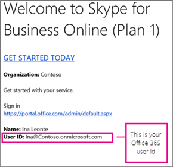

# 設定商務用 Skype OnlineSet up Skype for Business Online

您必須具備 Office 365 全域系統管理員許可權，才能設定商務用 Skype。You must have Office 365 global admin permissions to set up Skype for Business. 如果您的防火牆或 proxy 伺服器限制存取網路元件，請考慮聘用[Microsoft 合作夥伴](https://go.microsoft.com/fwlink/?linkid=391089)來為您設定商務用 Skype。If you have a firewall or proxy server that restricts access to parts of the web, consider hiring a [Microsoft partner](https://go.microsoft.com/fwlink/?linkid=391089) to set up Skype for Business for you.

## 設定 SkypeSetting up Skype

看起來您需要協助設定 Office 365 訂閱的 Skype。Looks like you need help setting up Skype with your Office 365 subscription. 您可以依照本文所述的步驟，讓您的設定完成。You can follow the steps in this article to get your setup completed.

## 1. 規劃商務用 Skype1. Plan for Skype for Business

如果您有**[Office 365 商務版 Premium](https://products.office.com/en-us/business/office-365-business-premium)** 或**商業基本**版，您可以使用商務用 Skype，在您的訂閱中的其他人對您的公司進行線上通話。If you have **[Office 365 Business Premium](https://products.office.com/en-us/business/office-365-business-premium)** or **Business Essentials**, you can use Skype for Business to make online calls to other people in your business who are on your subscription. 例如，如果您的公司有10人，您就可以[開始使用商務用 skype 進行 IM 和線上會議](https://support.office.com/article/cc05afa6-1894-4a82-9dd9-6222061f50fd)，以及在執行下列步驟2-6 後使用商務用 skype 進行商務用 Skype 的[會議](https://support.office.com/article/2eed8424-581a-4497-b505-c08c152e5851)。For example, if your business has 10 people, you'll be able to [Start using Skype for Business for IM and online meetings](https://support.office.com/article/cc05afa6-1894-4a82-9dd9-6222061f50fd) each other, and [Meetings with Skype for Business](https://support.office.com/article/2eed8424-581a-4497-b505-c08c152e5851) using Skype for Business after performing the steps 2-6 below. 您也可以[在 Outlook 中設定商務用 Skype 會議，在](https://support.office.com/article/b8305620-d16e-4667-989d-4a977aad6556#bkmk_OWA)線上開會！And you can [Set up a Skype for Business meeting in Outlook](https://support.office.com/article/b8305620-d16e-4667-989d-4a977aad6556#bkmk_OWA) to online meetings, too!

如果您想要使用商務用 Skype 撥打與接聽公司*外部*人員的**通話**：If you want to use Skype for Business to make and receive **calls** from people *external*  to your business:

- **選項1。使用免費的[Skype app](https://www.skype.com/)**。**Option 1. Use the free [Skype app](https://www.skype.com/)**. 如果您的公司非常小（例如，1-2 人），使用 Skype app 就是更好的做法。If you have a very small business (for example, 1-2 people), using the Skype app is the better way to go. 在國內和國際通話中使用的成本較低。It's less expensive to use for domestic and international calls. 您仍可召開會議通話、進行視頻通話，以及分享簡報的桌面。You can still hold conference calls, make video calls, and share your desktop for presentations. [查看工資率與付款選項](https://secure.skype.com/en/calling-rates?wt.mc_id=legacy&amp;expo365=bundled)。[Check out the rates and payment options](https://secure.skype.com/en/calling-rates?wt.mc_id=legacy&amp;expo365=bundled).

- **選項2。升級您的方案，並購買電話系統和 Office 365 通話方案**。**Option 2. Upgrade your plan, and buy the Phone System and a Calling Plan for Office 365**. 您最簡單的方法就是了解這項成本的多少，然後再進行這個切換，就能[與商務產品支援人員-系統管理協助](https://support.office.com/article/32a17ca7-6fa0-4870-8a8d-e25ba4ccfd4b)並讓他們為您執行所有工作。The easiest way to find out how much this costs, and then make the switch, is to [Contact support for business products - Admin Help](https://support.office.com/article/32a17ca7-6fa0-4870-8a8d-e25ba4ccfd4b) and have them do everything for you.

若要深入瞭解，請參閱[規劃商務用 Office 365 的設定](https://support.office.com/article/eb926624-018b-4486-bf11-5fba6ee4d645#bkmk_skype)。To learn more, see [Plan your setup of Office 365 for business](https://support.office.com/article/eb926624-018b-4486-bf11-5fba6ee4d645#bkmk_skype).

## 2. 登入 Office 3652. Sign in to Office 365

商務用 Skype Online 是 Office 365 套件服務套件的一部分。Skype for Business Online is part of the Office 365 suite of services. 若要設定商務用 Skype Online，您必須登入 Office 365。To set up Skype for Business Online, you need to sign in to Office 365. 具體做法如下：Here's how you do that:

1. 找出您的 Office 365 使用者識別碼（例如， <em>rob@fourthcoffee.com</em> ）。Locate your Office 365 user ID (for example,  <em>rob@fourthcoffee.com</em>  ). 您收到來自 Microsoft Online 服務小組的電子郵件，其中包含您購買商務用 Skype Online 時所建立的 Office 365 使用者識別碼。You received an email from the Microsoft Online Services Team that contains the Office 365 user ID that you created when you purchased Skype for Business Online. [郵件] 看起來像這樣：The mail looks something like this:

    

2. 登入系統管理中心，並輸入您的 Office 365 使用者識別碼和密碼。Sign in to the admin center and enter your Office 365 user ID and password. 登入之後，您會看到 Microsoft 365 系統管理中心：After you sign in, you'll see the Microsoft 365 admin center:

    

## 3. 設定您的網域和使用者3. Set up your domain and users

現在您已登入 Office 365，您可以在組織中設定您的網域和人員，以使用商務用 Skype Online。Now that you're signed in to Office 365, you can set up your domain and people in your organization to use Skype for Business Online.

1. [新增網域和使用者至 office 365](https://support.office.com/article/6383f56d-3d09-4dcb-9b41-b5f5a5efd611)：使用 office 365 設定向導，將您的自訂網域（例如*fourthcoffee.com*）設定為 office 365。[Add a domain and users to Office 365](https://support.office.com/article/6383f56d-3d09-4dcb-9b41-b5f5a5efd611): Use the Office 365 setup wizard to set up your custom domain (such as *fourthcoffee.com*) with Office 365. **根據預設，Office 365 安裝精靈包括設定商務用 Skype Online，以及建立您的商務用 Skype 使用者識別碼。****By default, the Office 365 setup wizard includes setting up Skype for Business Online and creating your Skype for Business user IDs.** 如果您已使用此嚮導來設定您的 Office 365 網域，就表示您已完成這個步驟。If you already used the wizard to set up your domain for Office 365, then you've completed this step.

2. [檢查您的網域和 dns](https://support.office.com/article/2b54e1b0-47a7-4018-a1e4-c2b924e7c5a0)連線：使用我們的工具-網域疑難排解程式-確認您的網域和 dns 設定正確無誤。[Check your domain and DNS connections](https://support.office.com/article/2b54e1b0-47a7-4018-a1e4-c2b924e7c5a0): Use our tool - the domains troubleshooter - to check that your domain and DNS settings are correct. 如此一來，我們將會在稍後協助您進一步找出任何設定問題，因為您可以將 DNS 設定排除為未來問題的來源。Doing this now will go a long way to helping figure out any setup issues later since you'll be able to eliminate DNS settings as the source of future issues.

3. [Office 365 url 與 IP 位址範圍](https://support.office.com/article/8548a211-3fe7-47cb-abb1-355ea5aa88a2#BKMK_LYO)：大多數小型企業不需要執行此步驟。[Office 365 URLs and IP address ranges](https://support.office.com/article/8548a211-3fe7-47cb-abb1-355ea5aa88a2#BKMK_LYO): Most small businesses don't need to do this step. **但如果您擁有的防火牆或 proxy 伺服器限制存取網路元件**，您必須建立規則，以允許存取商務用 Skype Online 端點。**But if you have a firewall or proxy server that restricts access to parts of the web**, you must create rules to allow access to the Skype for Business Online endpoints. 這個高級步驟最適合透過設定防火牆和 proxy 伺服器的人來執行。This is an advanced step best performed by someone experienced with configuring firewalls and proxy servers. 如果您之前還沒有這麼做，請考慮聘用[Microsoft 合作夥伴](https://go.microsoft.com/fwlink/?linkid=391089)來為您設定商務用 Skype。If you haven't done this before, consider hiring a [Microsoft partner](https://go.microsoft.com/fwlink/?linkid=391089) to set up Skype for Business for you.

## 4. 在您的組織中設定 IM 和目前狀態4. Set up IM and presence in your organization

立即訊息（IM）與目前狀態（[控制商務用 skype 中您目前狀態資訊的存取](https://support.office.com/article/fea86e34-60cf-4dd0-bfb2-169a42afd92c)）是商務用 skype 隨附的基本功能。Instant Messaging (IM) and presence ([Control access to your presence information in Skype for Business](https://support.office.com/article/fea86e34-60cf-4dd0-bfb2-169a42afd92c)) are basic features included with Skype for Business. 根據預設，貴公司中的人員可以彼此進行 Skype 和 IM。By default, the people in your business can Skype and IM with each other.

1. **選擇您的商務用 Skype 使用者可以與其他人通訊：****Choose who else your Skype for Business users can communicate with:**

   - [允許使用者與外部商務用 Skype 使用者聯繫](allow-users-to-contact-external-skype-for-business-users.md)您*和*其他企業都需要設定您的系統。[Allow users to contact external Skype for Business users](allow-users-to-contact-external-skype-for-business-users.md) Both you *and*  the other business will need to configure your systems.

     **重要**：如果您的企業中有兩個網域（例如 rob@contosowest.com 和 ina@contosoeast.com），您需要執行此步驟，讓所有使用者都能彼此通訊。**IMPORTANT**: If you have two domains in your business, such as rob@contosowest.com and ina@contosoeast.com, you need to do this step so all of your users can communicate with each other.

   - [讓商務用 Skype 使用者新增](let-skype-for-business-users-add-skype-contacts.md)您企業外部的 skype 連絡人[Let Skype for Business users add Skype contacts](let-skype-for-business-users-add-skype-contacts.md) outside your business

2. **選擇誰可以查看同事是否處於線上狀態：**[目前狀態] 功能會顯示誰在線上，以及其可用性，例如 [可用]、[忙碌]、[離開] 或 [簡報中]。**Choose who sees whether co-workers are online:** The presence feature shows who's online and what their availability is, such as available, busy, away, or presenting.

    

    您可以為企業中的每個人選擇預設設定：You can choose the default settings for everyone in your business:

   - 自動將人員的線上狀態顯示給組織中的所有人Automatically display a person's online presence to everyone in the organization

   - 僅將人員的線上狀態顯示給其連絡人Display a person's online presence only to their contacts

如需相關指示，請參閱[在商務用 Skype Online 中設定目前狀態](configure-presence-in-skype-for-business-online.md)。For instructions, see [Configure presence in Skype for Business Online](configure-presence-in-skype-for-business-online.md).

## 5. 下載並安裝商務用 Skype5. Download and install Skype for Business

若要在您的 PC、Mac 或行動裝置上使用商務用 Skype，您和企業中的其他人必須先在您的裝置上安裝商務用 Skype 下載。To use Skype for Business on your PC, Mac, or mobile device, you and other people in your business have to first install the Skype for Business download on your devices.

- [安裝商務用 Skype](https://support.office.com/article/8a0d4da8-9d58-44f9-9759-5c8f340cb3fb)：說明如何從 Office 365 入口網站下載應用程式，並將它安裝在您的 PC 或 Mac 上。[Install Skype for Business](https://support.office.com/article/8a0d4da8-9d58-44f9-9759-5c8f340cb3fb): Instructions for how to download the app from the Office 365 portal, and install it on your PC or Mac.

- [在 Office 365 中部署商務用 Skype 用戶端](deploy-the-skype-for-business-client-in-office-365.md)：在大型企業中部署應用程式的指示。[Deploy the Skype for Business client in Office 365](deploy-the-skype-for-business-client-in-office-365.md): Instructions for deploying the app in a large enterprise.

- [安裝商務用 skype](https://support.office.com/article/8a0d4da8-9d58-44f9-9759-5c8f340cb3fb)：在 Android 裝置、iOS 裝置和 Windows 手機上下載、安裝及登入商務用 skype。[Install Skype for Business](https://support.office.com/article/8a0d4da8-9d58-44f9-9759-5c8f340cb3fb): Download, install, and sign in to Skype for Business on Android devices, iOS devices, and Windows phones.

- [開啟或關閉行動電話通知](turn-on-or-off-mobile-phone-notifications.md)：當您在行動裝置上安裝商務用 Skype 時，您和企業中的其他人會收到有關傳入和未接的立即訊息的通知。[Turn on or off mobile phone notifications](turn-on-or-off-mobile-phone-notifications.md): When you have Skype for Business installed on a mobile device, you and others in your business can receive alerts about incoming and missed instant messages.

## 6. 測試以確定一切正常運作6. Test to make sure everything is working

首先，測試您與貴組織中的其他人是否可以進行[影片：登入和登出商務用 Skype](https://support.office.com/article/8abed4b3-ac48-493e-9d76-0e10140e9451)。First, test whether you and others in your business can [Video: Sign in and out of Skype for Business](https://support.office.com/article/8abed4b3-ac48-493e-9d76-0e10140e9451). 檢查您是否可以相互傳送即時消息、查看彼此的目前狀態，以及嘗試快速會議。Check that you can IM each other, see each other's presence, and try a quick meeting.

常見問題?Problems? 請執行下列步驟：Do the following:

- [需要登入商務用 Skype 的協助嗎？](https://support.office.com/article/448b8ea7-5b33-444a-afd4-175fc9930d05)常見的登入問題。[Need help signing in to Skype for Business?](https://support.office.com/article/448b8ea7-5b33-444a-afd4-175fc9930d05) of common sign-in problems.

- [客戶支援部門-系統管理協助](https://support.office.com/article/32a17ca7-6fa0-4870-8a8d-e25ba4ccfd4b)。[Contact support for business products - Admin Help](https://support.office.com/article/32a17ca7-6fa0-4870-8a8d-e25ba4ccfd4b). 我們在這裡協助您！We're here to help!

## 您想要設定其他可用的功能嗎？Do you want to set up other available features?

在設定更多功能前，請確定您有授權給他們。Before setting up more features, make sure you have licenses for them. [商務用 Skype 和 Microsoft 團隊附加元件授權Skype for Business and Microsoft Teams add-on licensing](../skype-for-business-and-microsoft-teams-add-on-licensing/skype-for-business-and-microsoft-teams-add-on-licensing.md)

### 設定音訊會議Set up Audio Conferencing

有時候貴組織中的人員必須使用電話撥入會議。Sometimes people in your organization will need to use a phone to call into a meeting. 商務用 Skype 包括音訊會議功能，只適用于這種情況！Skype for Business includes the Audio Conferencing feature for just this situation! 使用者可以使用電話撥入商務用 Skype 會議，而不是在行動裝置或電腦上使用商務用 Skype 應用程式。People can call into Skype for Business meetings using a phone, instead of using the Skype for Business app on a mobile device or PC.

### 在 Office 365 中設定電話系統和通話方案Set up Phone System and the Calling plans in Office 365

Office 365 中的 [電話系統] 功能可為您的企業提供電話系統。The Phone System feature in Office 365 gives you a phone system for your business. 您組織中其他商務用 Skype 人員的通話是免費的，而且您的員工可以接收來自對方和外部呼叫者的語音信箱。Calls to other Skype for Business people in your organization are free, and your employees can receive voicemail from each other and outside callers. 以下是您使用電話系統所取得的結果。Here's what you get with Phone System.

當您新增通話方案服務時，員工會在商務用 Skype 中取得主要電話號碼。When you add the Calling Plan service, your employees get a primary phone number in Skype for Business. 他們可以撥打和接聽公司外部的電話。They can make and receive phone calls outside of your business. 在 VoIP 手機、電腦和行動裝置上，他們可以撥打語音通話。They can make voice calls across VoIP phones, PCs, and mobile devices. 而且，在緊急情況下，他們可以呼叫911取得協助。And, in case of emergencies, they can call 911 for help.

如需逐步設定指示，請參閱設定通話方案。For step-by-step setup instructions, see Set up Calling Plans.

### 設定 Skype 會議廣播Set up Skype Meeting Broadcast

Skype 會議廣播是一項功能，可讓您使用最多10000的出席者來製作、主持及廣播會議。Skype Meeting Broadcast is a feature that lets you produce, host, and broadcast meetings with up to 10,000 attendees. **若要深入瞭解它的運作方式，請參閱[什麼是 Skype 會議廣播？](https://support.office.com/article/c472c76b-21f1-4e4b-ab58-329a6c33757d)****To learn more about how it works, see [What is a Skype Meeting Broadcast?](https://support.office.com/article/c472c76b-21f1-4e4b-ab58-329a6c33757d)**

以下是設定 Skype 會議廣播的步驟概覽：Here's an overview of the steps to set up Skype Meeting Broadcast:

1. [指派或移除商務用 Office 365 的授權](https://support.office.com/article/997596b5-4173-4627-b915-36abac6786dc)：指派**商務用 Skype Online**或**企業方案**授權給即將**主持**廣播會議的每一個人。[Assign or remove licenses for Office 365 for business](https://support.office.com/article/997596b5-4173-4627-b915-36abac6786dc): Assign **Skype for Business Online** or **Enterprise Plan** licenses to everyone who is going to **host** a Broadcast meeting.

2. [啟用 Skype 會議廣播](../set-up-your-network-for-skype-meeting-broadcast/enable-skype-meeting-broadcast.md)：預設不會啟用此功能。[Enable Skype Meeting Broadcast](../set-up-your-network-for-skype-meeting-broadcast/enable-skype-meeting-broadcast.md): By default, this feature isn't enabled. 開啟之後，您的使用者就能與貴組織中的其他人主持廣播會議。After you turn it on, your users will be able to host broadcast meetings with other people in your organization.

3. [為您的 Skype 會議廣播設定您的網路](../set-up-your-network-for-skype-meeting-broadcast/set-up-your-network-for-skype-meeting-broadcast.md)：如果您想要將網路研討會及其他廣播託管給組織外部的出席者，您必須設定您的網路。[Set up your network for Skype Meeting Broadcast](../set-up-your-network-for-skype-meeting-broadcast/set-up-your-network-for-skype-meeting-broadcast.md): If you want to host webinars and other broadcasts with attendees outside of your organization, you need to configure your network.

4. 排程[Skype 會議廣播](https://support.office.com/article/c3995bc9-4d32-4f75-a004-3bc5c477e553)，並[加入 skype 會議廣播](https://support.office.com/article/14689da0-821d-48d4-9035-ea762de80ebe)：請確認 [廣播會議] 是透過排程 skype 會議廣播*https://portal.broadcast.skype.com* ，然後讓某人嘗試加入會議來運作。[Schedule a Skype Meeting Broadcast](https://support.office.com/article/c3995bc9-4d32-4f75-a004-3bc5c477e553) and have a [Join a Skype Meeting Broadcast](https://support.office.com/article/14689da0-821d-48d4-9035-ea762de80ebe): Make sure broadcast meetings work by scheduling a Skype Meeting Broadcast at  *https://portal.broadcast.skype.com*  and then having someone try to join the meeting.

## 瞭解網路連線需求Learn about network connectivity requirements

在商務用 Skype 中，音訊、影片和應用程式共用品質會受到端對端網路連線品質的影響。The quality of audio, video, and application sharing in Skype for Business is greatly impacted by the quality of end-to-end network connectivity. 為了獲得最佳體驗，請務必確保您的公司網路與商務用 Skype Online 之間有高品質的連線。For an optimal experience, it is important to make sure there is a high-quality connection between your company network and Skype for Business Online. 如需網路和調諧資訊，請參閱[調整商務用 Skype Online 的效能](https://support.office.com/article/beec23c2-c5d6-4e84-a8af-e82aefca7802)。For network and tuning information, see [Tune Skype for Business Online performance](https://support.office.com/article/beec23c2-c5d6-4e84-a8af-e82aefca7802).

## 所有設定完成了嗎？All done setting up? 開始使用商務用 SkypeGetting started using Skype for Business

[商務用 Skype 訓練](https://support.office.com/article/8a3491a3-c095-4718-80cf-cbbe4afe4eba)：請參閱此訓練主題清單，協助您快速入門！[Skype for Business training](https://support.office.com/article/8a3491a3-c095-4718-80cf-cbbe4afe4eba): Check out this list of training topics to help you get started quickly!

[啟動商務用 Skype 會議通話Start a Skype for Business conference call](https://support.office.com/article/8dc8ac52-91ac-4db9-8672-11551fdaf997)

[在商務用 Skype 中設定視頻裝置選項Set Video Device options in Skype for Business](https://support.office.com/article/d09017c0-deba-4f6c-a122-9eca6604f50c)

[使用商務用 Skype 撥打和接聽視頻通話Make and receive a video call using Skype for Business](https://support.office.com/article/abf62493-670f-4b0d-b2cf-fe03b49caf42)

[!INCLUDE [LinkedIn Learning Info](../../common/office/linkedin-learning-info.md)]

## 相關主題Related topics

[規劃商務用 Skype Server 與商務用 Skype Online 之間的混合式連接Plan hybrid connectivity between Skype for Business Server and Skype for Business Online](https://go.microsoft.com/fwlink/p/?linkid=400791)

