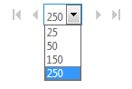

# 商務用 Skype Online 系統管理中心的使用者頁面限制Skype for Business Online admin center users page limitations

出於效能的考慮，**商務用 Skype 系統管理中心**會在使用者清單中顯示前1000個使用者。For performance reasons the **Skype for Business admin center**displays the first 1,000 users in your user list. 如果您的使用者超過1000個，請\*\*\*\*篩選器和](../images/5cc29d50-4eec-48a4-bdad-bbeae230f9ae.png) **搜尋** and **Search** to find the specific people you're looking for.
  
## 大量編輯Bulk editing

1. 核取清單頂端 [**顯示名稱**] 旁的方塊，選取第一個1000使用者，或由篩選或搜尋傳回的所有人。Select the first 1,000 users—or everyone returned by your filter or search—by checking the box next to **Display name** at the top of the list.
    
2. 按一下\*\*\*\*編輯]。Click **Edit**.
    
您可以使用清單底部的控制項，變更每個頁面上顯示的使用者數量：You can change the number of users shown on each page with the control at the bottom of the list:
  

  
## 相關主題Related topics
[設定商務用 Skype OnlineSet up Skype for Business Online](set-up-skype-for-business-online.md)

[讓商務用 Skype 使用者新增 Skype 連絡人Let Skype for Business users add Skype contacts](let-skype-for-business-users-add-skype-contacts.md)

  
 
