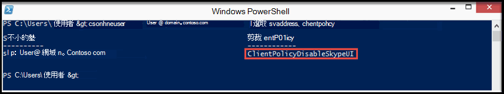

# <a name="switching-between-the-skype-for-business-and-the-lync-client-user-interfaces"></a>在商務用 Skype 和 Lync 用戶端使用者介面之間切換

[!INCLUDE [sfbo-retirement](../../Hub/includes/sfbo-retirement.md)]

對於 商務用 Skype Online 組織，您可以使用 Microsoft 365 或 Office 365 中的遠端 PowerShell，讓 商務用 Skype 使用者使用 商務用 Skype 用戶端或 商務用 Skype (Lync) 用戶端使用者介面。 預設設定是讓使用者使用用戶端商務用 Skype介面。 如果您想要使用 Lync 用戶端體驗，您可以遵循本主題稍後的步驟，管理第一次啟動用戶端行為以顯示 Lync 使用者介面。
  
> [!NOTE]
> Lync 2013 用戶端體驗不是適用于 2016 商務用 Skype的選項。 在嘗試將用戶端環境設定為使用 Lync 2013 用戶端之前，請先檢查用戶端版本，以確保該版本不是從數位 16 開始;例如：16.x.x.x.x。 
  
> [!TIP]
> 如果您想要輕鬆切換使用者介面，但不想執行手動步驟，請參閱 Microsoft 下載中心中的 [PowerShell](https://go.microsoft.com/fwlink/?LinkId=532431) 腳本，以簡化操作。
  
## <a name="switching-the-skype-for-business-user-interface-for-users"></a>切換商務用 Skype使用者介面

Windows PowerShell Online 商務用 Skype模組可讓您建立連線至 Windows PowerShell Online 的遠端商務用 Skype會話。 此模組僅支援在 64 位電腦上，可從 Microsoft 下載中心下載，Windows PowerShell Online 模組商務用 Skype[下載](https://go.microsoft.com/fwlink/?LinkId=294688)。 有關其他資訊，請參閱[為](../set-up-your-computer-for-windows-powershell/set-up-your-computer-for-windows-powershell.md)線上管理商務用 Skype電腦。
  
> [!IMPORTANT]
> 切換  _使用者_ 介面的全域原則設定不會適用于已採用自訂原則的使用者。 若要變更使用者介面，您必須針對已應用自訂原則的每個使用者執行下列操作：
  
```PowerShell
Grant-CsClientPolicy -PolicyName ClientPolicyEnableSkypeUI -Identity <username>
```

> [!CAUTION]
> _ClientPolicyEnableSkypeUI_ 策略會取代使用者現有的自訂策略設定。
  
若要讓貴組織中所有使用者使用用戶端商務用 Skype，請開啟遠端 PowerShell 並輸入下列專案：
  
```PowerShell
Grant-CsClientPolicy -PolicyName ClientPolicyEnableSkypeUI
```

如果您正確設定了該政策，就會看到：
  

  
若要讓貴組織中所有使用者使用 Lync 商務用 Skype (用戶端) ，請開啟遠端 PowerShell 並輸入下列專案： 
  
```PowerShell
Grant-CsClientPolicy -PolicyName ClientPolicyDisableSkypeUI
```

如果您正確設定了該政策，就會看到：
  

  
若要允許貴組織的單一使用者使用 商務用 Skype用戶端，請開啟遠端 PowerShell 並輸入下列專案：
  
```PowerShell
Grant-CsClientPolicy -PolicyName ClientPolicyEnableSkypeUI -Identity <username>
```

如果您正確設定了該政策，就會看到：
  

  
若要允許貴組織的單一使用者使用 Lync 商務用 Skype (用戶端) 遠端 PowerShell，然後輸入下列專案：
  
```PowerShell
Grant-CsClientPolicy -PolicyName ClientPolicyDisableSkypeUI -Identity <username>
```

如果您正確設定了該政策，就會看到：
  

  
若要允許貴組織中多個使用者使用用戶端商務用 Skype，請開啟遠端 PowerShell 並輸入下列專案：
  

```PowerShell
$users = @("sip:bob@contoso.com&quot;,&quot;sip:fred@contoso.com") 

$users | Grant-CsClientPolicy -PolicyName ClientPolicyEnableSkypeUI
```

若要允許貴組織中多個使用者使用 Lync 商務用 Skype (用戶端) ，請開啟遠端 PowerShell 並輸入下列專案：
  
```PowerShell
$users = @("sip:bob@contoso.com","sip:fred@contoso.com")

$users | Grant-CsClientPolicy -PolicyName ClientPolicyDisableSkypeUI
```

若要允許貴組織的一組使用者使用 商務用 Skype用戶端，請開啟遠端 PowerShell 並輸入下列專案：
  
```PowerShell
Get-CsOnlineUser -Filter {Department -eq "Sales"} | Grant-CsClientPolicy -PolicyName ClientPolicyEnableSkypeUI
```

若要允許貴組織中一組使用者使用 Lync 商務用 Skype (用戶端) 遠端 PowerShell，然後輸入下列專案：
  
```PowerShell
Get-CsOnlineUser -Filter {Department -eq "Sales"} | Grant-CsClientPolicy -PolicyName ClientPolicyDisableSkypeUI
```

> [!NOTE]
>  使用者的名稱是應該指派該策略的使用者帳戶名稱。 使用者的帳戶名稱可以下列其中一種格式輸入：> 使用者> 使用者主體名稱 (UPN) 使用者> Active Directory 顯示名稱的 \\> SIP 位址
  
[使用 Windows PowerShell管理 Lync Online](../set-up-your-computer-for-windows-powershell/set-up-your-computer-for-windows-powershell.md)
  
## <a name="skype-for-business-online-policy-settings"></a>商務用 Skype線上策略設定

下表顯示原則第一次適用于使用者的使用者體驗：
  
|**系統管理策略設定**|**顯示的使用者介面**|
|:-----|:-----|
|尚未設定該政策。 |使用者會繼續使用用戶端商務用 Skype介面。|
|`Grant-CsClientPolicy -PolicyName ClientPolicyEnableSkypeUI`<br/>|使用者會繼續使用用戶端商務用 Skype介面。|
|`Grant-CsClientPolicy -PolicyName ClientPolicyDisableSkypeUI`<br/>|系統將會要求使用者切換到 Lync 商務用 Skype (用戶端) 介面。 他們可以稍後切換。|
|`Grant-CsClientPolicy -PolicyName ClientPolicyEnableSkypeUI -Identity <username>`|使用者將使用用戶端商務用 Skype介面。 |
`Grant-CsClientPolicy-PolicyName ClientPolicyDisableSkypeUI -Identity <username>`|系統將會要求使用者切換到 Lync 商務用 Skype (用戶端) 介面。 系統管理員日後可以變更設定，將其切換至用戶端商務用 Skype介面。 |
   
下表顯示變更策略時的使用者體驗：
  
|**系統管理策略設定**|**商務用 Skype (Lync) 使用者介面**|**商務用 Skype使用者介面**|
|:-----|:-----|:-----|
|`Grant-CsClientPolicy -PolicyName ClientPolicyEnableSkypeUI`|系統將會要求使用者切換到用戶端商務用 Skype介面。  <br/> |使用者會繼續使用用戶端商務用 Skype介面。  <br/> |
|`Grant-CsClientPolicy -PolicyName ClientPolicyDisableSkypeUI`|使用者會繼續使用 Lync 商務用 Skype () 介面。  <br/> |系統將會要求使用者切換到 Lync 商務用 Skype (用戶端) 介面。  <br/> |
|尚未設定該政策。  <br/> |如果使用者未設定商務用 Skype (，) Lync 或用戶端使用者介面。 他們一定會使用商務用 Skype使用者介面。  <br/> |使用者會繼續使用用戶端商務用 Skype介面。  <br/> |
   
此表格顯示所有可用的線上自訂策略。 已建立新政策，可讓系統管理員在切換 EnableSkypeUI 標標時，保留舊的自訂策略。 請使用上方的 Cmdlet，將下列其中一項政策授予您的使用者。
  
|**策略名稱**|**EnableSkypeUI**|
|:-----|:-----|
`ClientPolicyDefaultPhoto`||
`ClientPolicyDefaultPhotoDisableSkypeUI` |假|
`ClientPolicyNoIMURL`||
`ClientPolicyNoIMURLDisableSkypeUI` |假|
`ClientPolicyNoIMURLPhoto`||
`ClientPolicyNoIMURLPhotoDisableSkypeUI` |假|
`ClientPolicyNoSaveIMNoArchivingI`||
`ClientPolicyNoSaveIMNoArchivingDisableSkypeUI` |假|
`ClientPolicyNoSaveIMNoArchivingNoIMURL`||
`ClientPolicyNoSaveIMNoArchivingNoIMURLDisableSkypeUI` |假|
`ClientPolicyNoSaveIMNoArchivingNoIMURLPhoto` ||
`ClientPolicyNoSaveIMNoArchivingNoIMURLPhotoDisableSkypeUI`|假|
`ClientPolicyNoSaveIMNoArchivingPhoto`||
`ClientPolicyNoSaveIMNoArchivingPhotoDisableSkypeUI` |假|

   
若要開始使用Windows PowerShell，請參閱以下主題：
  
- [為什麼您需要使用 powerShell Microsoft 365 Office 365 PowerShell](/microsoft-365/enterprise/why-you-need-to-use-microsoft-365-powershell)
    
- [使用 Microsoft 365 管理Office 365或Windows PowerShell](/previous-versions//dn568025(v=technet.10))
    
## <a name="first-launch-client-behaviors"></a>第一次啟動用戶端行為

根據預設，當使用者第一次啟動 商務用 Skype 時，他們一定會看到 商務用 Skype 使用者介面，即使您已選取 Lync 用戶端體驗，將用戶端策略設定為 Lync 用戶端體驗 () 如先前所述。 `Grant-CsClientPolicy -PolicyName ClientPolicyDisableSkypeUI` 幾分鐘之後，系統就會要求使用者切換到 Lync 模式。
  
如果您想要在使用者第一次啟動 商務用 Skype用戶端時顯示 Lync 使用者介面，請遵循下列步驟，在用戶端更新後第一次啟動用戶端之前：
  
1. 請遵循本主題之前的步驟，並確認用戶端策略已設定為停用商務用 Skype介面。
    
2. 更新使用者電腦上系統登錄。 您應該在使用者第一次啟動用戶端商務用 Skype之前執行此工作，而且應該只執行一次。 若要瞭解如何建立群組原則物件以更新網域已加入電腦的註冊表，請參閱本主題稍後的一節。
    
    在 **[HKEY_CURRENT_USER Microsoft \\ \\ Office \\ \\ Lync]** 金鑰中，建立新的 **二進位** 值。
    
    值 **名稱必須是** **EnableSkypeUI，** 且 **值** 資料必須設為 **00 00 00 00 。**
    
    該金鑰看起來應該如下所示：
    
    [HKEY_CURRENT_USER \\軟體 \\ Microsoft \\ Office \\ Lync]
    
    "CanSharePptInCollab"=dword：00000001
    
    "CanShareOneNoteInCollab"=dword：00000001
    
    "CanAppShareInCollab"=dword：00000001
    
    "EnableSkypeUI"=十六進位：00，00，00，00，00
    
當使用者第一次啟動用戶端時，商務用 Skype Lync 使用者介面。
  
### <a name="control-the-display-of-the-welcome-screen-tutorial"></a>控制歡迎畫面教學課程的顯示

當使用者開啟 商務用 Skype用戶端時，預設的行為是顯示歡迎畫面，其中包含大多數使用者要求的 *7* 個快速秘訣。 您可以關閉歡迎畫面的顯示，但仍允許使用者在用戶端電腦上新增下列登錄值來存取教學課程：
  
在 **[HKEY_CURRENT_USER Microsoft \\ \\ Office \\ \\ 15.0 \\ Lync]** 金鑰中，建立新的 DWORD (**32 位) 值**。 值 **名稱必須是** **IsBasicTutorialSeenByUser，** 且 **值** 資料必須設為 **1。**
  
該金鑰看起來應該如下所示：
  
`"IsBasicTutorialSeenByUser"=dword:00000001`

### <a name="turn-off-the-client-tutorial"></a>關閉用戶端教學課程

如果您不希望使用者能夠存取教學課程，您可以使用下列登錄值關閉用戶端教學課程：
  
在 **[HKEY_CURRENT_USER Microsoft \\ \\ Office \\ \\ 15.0 \\ Lync]** 金鑰中，建立新的 DWORD (**32 位) 值**。 值 **名稱必須是** **TutorialFeatureEnabled，** 且 **值資料** 必須設為 **0。**
  
```PowerShell
"TutorialFeatureEnabled"=dword:00000000
```

您可以將值資料設定為 **1，** 以重新 **開啟** 教學課程。
  
## <a name="create-a-group-policy-object-to-modify-the-registry-on-a-domain-joined-computer"></a>建立群組原則物件以修改已加入網域電腦的註冊表

使用者第一次啟動 Lync 用戶端體驗的登錄更新商務用 Skype用戶端應該只完成一次。 如果您使用群組原則物件 (GPO) 更新註冊表，您必須定義物件以建立新值，而不是更新值資料。 套用 GPO 時，如果新值不存在，GPO 會建立它，並設定值資料為 0。
  
下列程式說明如何修改登錄，讓使用者第一次啟動登錄時顯示 Lync 用戶端商務用 Skype。 您也可以使用這個程式來更新註冊表，以停用歡迎畫面教學課程，如先前所述。
  
 **建立 GPO**
  
1. 啟動 **群組原則管理主控台**。
    
    若要瞭解如何使用群組原則管理主控台，請參閱 [群組原則管理主控台](/previous-versions/windows/it-pro/windows-server-2012-R2-and-2012/dn265969(v=ws.11))。
    
2. 以滑鼠右鍵按一下 **群組原則物件****節點，然後** 選取功能表上的 [新增。
    
3. 在 [ **新增 GPO>** 對話方塊中，輸入 GPO 的名稱，例如 MakeLyncDefaultUI，然後按一下 **[確定**。
    
4. 以滑鼠右鍵按一下您剛剛建立的新 GPO，然後從 **功能表** 選取 [編輯。
    
5. 在組 **策略管理編輯器** 中，展開 **使用者設定**、展開喜好設定、展開 **Windows 設定，然後** 選取 **登錄節點**。
    
6. 以滑鼠右鍵按一下 **[註冊表>** 節點，然後選取 **[**  >  **新增登錄機碼目**> 。
    
7. 在 [ **新增註冊表屬性>** 對話方塊中，更新下列專案：
    
|**領域**|**要選取或輸入的值**|
|:-----|:-----|
|**動作** <br/> |**創建** <br/> |
|**蜂巢** <br/> | HKEY_CURRENT_USER <br/> |
|**金鑰路徑** <br/> |軟體 \\ Microsoft \\ Office \\ Lync  <br/> |
|**值名稱** <br/> |EnableSkypeUI  <br/> |
|**數值型別** <br/> |REG_BINARY  <br/> |
|**值資料** <br/> |00000000  <br/> |
   
按一下 **[確定** 以儲存您的變更，然後關閉 GPO。
    
接下來，您必須將您建立 GPO 連結至要指派策略的使用者群組，例如 OU。
  
 **若要使用 GPO 指派策略**
  
1. 在群組原則管理主控台中，以滑鼠右鍵按一下要指派該策略的 OU，然後選取 [連結 **至現有的 GPO。**
    
2. 在 [ **選取 GPO」** 對話方塊中，選取您建立 GPO，然後選取 [ **確定**。
    
3. 在目標使用者的電腦上，開啟命令提示，然後輸入下列命令：
    
    **gpupdate /target：user**
    
    訊息「正在更新策略...」。會以 GPO 的適用方式顯示。 完成後，系統會顯示「使用者策略更新已完成」訊息。
    
4. 在命令提示符中，輸入下列命令：
    
    **gpresult /r**
    
    您應該會看到下方顯示「已指派的群組原則物件」，並顯示您建立 GPO 的名稱。
    
您也可以檢查登錄，確認 GPO 已成功更新使用者電腦上登錄。 開啟 [登錄編輯程式]，然後流覽至 **[HKEY_CURRENT_USER \\ \\ Microsoft \\ Office \\ Lync]** 鍵。 如果 GPO 成功更新登錄，會看到名為 EnableSkypeUI 的值，值為 0。
  
## <a name="related-topics"></a>相關主題
[設定商務用 Skype Online](set-up-skype-for-business-online.md)

[讓商務用 Skype 使用者新增 Skype 連絡人](let-skype-for-business-users-add-skype-contacts.md)

  
