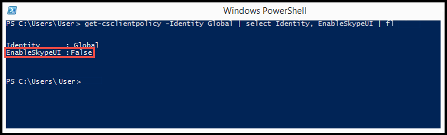

# <a name="switching-between-the-skype-for-business-and-the-lync-client-user-interfaces"></a><span data-ttu-id="24e26-103">在商務用 Skype 和 Lync 用戶端使用者介面之間切換</span><span class="sxs-lookup"><span data-stu-id="24e26-103">Switching between the Skype for Business and the Lync client user interfaces</span></span>

<span data-ttu-id="24e26-104">針對商務用 Skype Online 組織，您可以在 Microsoft 365 或 Office 365 中使用遠端 PowerShell，讓您的商務用 Skype 使用者使用商務用 Skype 用戶端或商務用 Skype （Lync）用戶端使用者介面。</span><span class="sxs-lookup"><span data-stu-id="24e26-104">For Skype for Business Online organizations, you can use the Remote PowerShell in Microsoft 365 or Office 365 to enable your Skype for Business users to use the Skype for Business client or the Skype for Business (Lync) client user interface.</span></span> <span data-ttu-id="24e26-105">預設設定是供使用者使用商務用 Skype 用戶端使用者介面。</span><span class="sxs-lookup"><span data-stu-id="24e26-105">The default setting is for users to use the Skype for Business client user interface.</span></span> <span data-ttu-id="24e26-106">如果您喜歡使用 Lync 用戶端體驗，您可以依照本主題稍後的步驟，管理第一次啟動用戶端行為，以顯示 Lync 使用者介面。</span><span class="sxs-lookup"><span data-stu-id="24e26-106">If you'd prefer to use the Lync client experience, you can manage the first launch client behavior to display the Lync user interface by following the steps later in this topic.</span></span>
  
> [!NOTE]
> <span data-ttu-id="24e26-107">Lync 2013 用戶端體驗不是商務用 Skype 2016 用戶端版本的選項。</span><span class="sxs-lookup"><span data-stu-id="24e26-107">The Lync 2013 client experience isn't an option for Skype for Business 2016 client versions.</span></span> <span data-ttu-id="24e26-108">在您嘗試將用戶端環境設定為使用 Lync 2013 用戶端之前，請先檢查用戶端版本，以確保它不是以數位16開頭;例如： x.x.x。</span><span class="sxs-lookup"><span data-stu-id="24e26-108">Before you attempt to configure your client environment to use the Lync 2013 client, please check the client version to ensure it does not start with the number 16; for example: 16.x.x.x.</span></span> 
  
> [!TIP]
> <span data-ttu-id="24e26-109">如果您想要輕鬆地切換使用者介面，且不想執行手動步驟，請參閱 PowerShell 腳本的[Microsoft 下載中心](https://go.microsoft.com/fwlink/?LinkId=532431)，讓它變得更容易。</span><span class="sxs-lookup"><span data-stu-id="24e26-109">If you want to easily switch the user interface and don't want to do the manual steps, see the [Microsoft Download Center](https://go.microsoft.com/fwlink/?LinkId=532431) for a PowerShell script to make it easier.</span></span>
  
## <a name="switching-the-skype-for-business-user-interface-for-users"></a><span data-ttu-id="24e26-110">為使用者切換商務用 Skype 使用者介面</span><span class="sxs-lookup"><span data-stu-id="24e26-110">Switching the Skype for Business user interface for users</span></span>

<span data-ttu-id="24e26-111">商務用 Skype Online 的 Windows PowerShell 模組可讓您建立連接到商務用 Skype Online 的遠端 Windows PowerShell 會話。</span><span class="sxs-lookup"><span data-stu-id="24e26-111">The Windows PowerShell module for Skype for Business Online enables you to create a remote Windows PowerShell session that connects to Skype for Business Online.</span></span> <span data-ttu-id="24e26-112">此模組只支援在64位電腦上從[適用于商務用 Skype Online 的 Windows PowerShell 模組](https://go.microsoft.com/fwlink/?LinkId=294688)上的 Microsoft 下載中心下載。</span><span class="sxs-lookup"><span data-stu-id="24e26-112">This module, which is supported only on 64-bit computers can be downloaded from the Microsoft Download Center at [Windows PowerShell Module for Skype for Business Online](https://go.microsoft.com/fwlink/?LinkId=294688).</span></span> <span data-ttu-id="24e26-113">如需其他資訊，請參閱針對[商務用 Skype Online 管理設定您的電腦](https://go.microsoft.com/fwlink/?LinkId=534539)。</span><span class="sxs-lookup"><span data-stu-id="24e26-113">For other information, see [Configuring your computer for Skype for Business Online management](https://go.microsoft.com/fwlink/?LinkId=534539).</span></span>
  
> [!IMPORTANT]
> <span data-ttu-id="24e26-114">切換使用者介面的_全域_原則設定將不會套用到已套用自訂原則的使用者。</span><span class="sxs-lookup"><span data-stu-id="24e26-114">The  _Global_ policy setting for switching the user interface won't be applied to a user that already has a custom policy applied.</span></span> <span data-ttu-id="24e26-115">若要能夠變更使用者介面，您必須針對已套用自訂原則的每個使用者執行下列動作：</span><span class="sxs-lookup"><span data-stu-id="24e26-115">To be able to change the user interface, you will need to run the following for each user that has a custom policy applied:</span></span>
  
```PowerShell
Grant-CsClientPolicy -PolicyName ClientPolicyEnableSkypeUI -Identity <username>
```

> [!CAUTION]
> <span data-ttu-id="24e26-116">_ClientPolicyEnableSkypeUI_原則會取代使用者現有的自訂策略設定。</span><span class="sxs-lookup"><span data-stu-id="24e26-116">The  _ClientPolicyEnableSkypeUI_ policy will replace the existing custom policy setting for the user.</span></span>
  
<span data-ttu-id="24e26-117">若要讓貴組織中的所有使用者都能使用商務用 Skype 用戶端，請開啟遠端 PowerShell，並輸入以下內容：</span><span class="sxs-lookup"><span data-stu-id="24e26-117">To enable all of the users in your organization to use the Skype for Business client, open the Remote PowerShell and type the following:</span></span>
  
```PowerShell
Grant-CsClientPolicy -PolicyName ClientPolicyEnableSkypeUI
```

<span data-ttu-id="24e26-118">如果您設定了原則，就會看到：</span><span class="sxs-lookup"><span data-stu-id="24e26-118">If you set the policy right, you will see:</span></span>
  

  
<span data-ttu-id="24e26-120">若要讓貴組織中的所有使用者都能使用商務用 Skype （Lync）用戶端，請開啟遠端 PowerShell，並輸入以下內容：</span><span class="sxs-lookup"><span data-stu-id="24e26-120">To enable all of the users in your organization to use the Skype for Business (Lync) client, open the Remote PowerShell and type the following:</span></span> 
  
```PowerShell
Grant-CsClientPolicy -PolicyName ClientPolicyDisableSkypeUI
```

<span data-ttu-id="24e26-121">如果您設定了原則，就會看到：</span><span class="sxs-lookup"><span data-stu-id="24e26-121">If you set the policy right, you will see:</span></span>
  

  
<span data-ttu-id="24e26-123">若要允許貴組織中的一位使用者使用商務用 Skype 用戶端，請開啟遠端 PowerShell，並輸入以下內容：</span><span class="sxs-lookup"><span data-stu-id="24e26-123">To allow a single user in your organization to use the Skype for Business client, open the Remote PowerShell and type the following:</span></span>
  
```PowerShell
Grant-CsClientPolicy -PolicyName ClientPolicyEnableSkypeUI -Identity <username>
```

<span data-ttu-id="24e26-124">如果您設定了原則，就會看到：</span><span class="sxs-lookup"><span data-stu-id="24e26-124">If you set the policy right, you will see:</span></span>
  

  
<span data-ttu-id="24e26-126">若要允許貴組織中的一位使用者使用商務用 Skype （Lync）用戶端，請開啟遠端 PowerShell，並輸入以下內容：</span><span class="sxs-lookup"><span data-stu-id="24e26-126">To allow a single user in your organization to use the Skype for Business (Lync) client, open the Remote PowerShell and type the following:</span></span>
  
```PowerShell
Grant-CsClientPolicy -PolicyName ClientPolicyDisableSkypeUI -Identity <username>
```

<span data-ttu-id="24e26-127">如果您設定了原則，就會看到：</span><span class="sxs-lookup"><span data-stu-id="24e26-127">If you set the policy right, you will see:</span></span>
  

  
<span data-ttu-id="24e26-129">若要允許貴組織中的多位使用者使用商務用 Skype 用戶端，請開啟遠端 PowerShell，並輸入以下內容：</span><span class="sxs-lookup"><span data-stu-id="24e26-129">To allow multiple users in your organization to use the Skype for Business client, open the Remote PowerShell and type the following:</span></span>
  

```PowerShell
$users = @("sip:bob@contoso.com","sip:fred@contoso.com") 

$users | Grant-CsClientPolicy -PolicyName ClientPolicyEnableSkypeUI
```

<span data-ttu-id="24e26-130">若要允許貴組織中的多位使用者使用商務用 Skype （Lync）用戶端，請開啟遠端 PowerShell，並輸入以下內容：</span><span class="sxs-lookup"><span data-stu-id="24e26-130">To allow multiple users in your organization to use the Skype for Business (Lync) client, open the Remote PowerShell and type the following:</span></span>
  
```PowerShell
$users = @("sip:bob@contoso.com","sip:fred@contoso.com")

$users | Grant-CsClientPolicy -PolicyName ClientPolicyDisableSkypeUI
```

<span data-ttu-id="24e26-131">若要允許貴組織中的一組使用者使用商務用 Skype 用戶端，請開啟遠端 PowerShell，並輸入以下內容：</span><span class="sxs-lookup"><span data-stu-id="24e26-131">To allow a group of users in your organization to use the Skype for Business client, open the Remote PowerShell and type the following:</span></span>
  
```PowerShell
Get-CsOnlineUser -Filter {Department -eq "Sales"} | Grant-CsClientPolicy -PolicyName ClientPolicyEnableSkypeUI
```

<span data-ttu-id="24e26-132">若要允許貴組織中的一組使用者使用商務用 Skype （Lync）用戶端，請開啟遠端 PowerShell，並輸入以下內容：</span><span class="sxs-lookup"><span data-stu-id="24e26-132">To allow a group of users in your organization to use the Skype for Business (Lync) client, open the Remote PowerShell and type the following:</span></span>
  
```PowerShell
Get-CsOnlineUser -Filter {Department -eq "Sales"} | Grant-CsClientPolicy -PolicyName ClientPolicyDisableSkypeUI
```

> [!NOTE]
>  <span data-ttu-id="24e26-133">使用者的名稱是應該指派原則的使用者帳戶名稱。</span><span class="sxs-lookup"><span data-stu-id="24e26-133">The user's name is the name of the user's account that the policy should be assigned to.</span></span> <span data-ttu-id="24e26-134">使用者的帳戶名稱可以採用下列其中一種格式：使用者的 > SIP 位址> 使用者的使用者主體名稱（UPN）>\\使用者> Active Directory 顯示名稱</span><span class="sxs-lookup"><span data-stu-id="24e26-134">The user's account name can be entered in one of the following formats:>  SIP address of the user>  User Principal name (UPN) of the user>  Domain\\username of the user>  Active Directory display name of the user</span></span>
  
[<span data-ttu-id="24e26-135">使用 Windows PowerShell 管理 Lync Online</span><span class="sxs-lookup"><span data-stu-id="24e26-135">Using Windows PowerShell to manage Lync Online</span></span>](https://go.microsoft.com/fwlink/?LinkID=525453)
  
## <a name="skype-for-business-online-policy-settings"></a><span data-ttu-id="24e26-136">商務用 Skype Online 原則設定</span><span class="sxs-lookup"><span data-stu-id="24e26-136">Skype for Business Online policy settings</span></span>

<span data-ttu-id="24e26-137">下表顯示原則第一次套用至使用者時的使用者體驗：</span><span class="sxs-lookup"><span data-stu-id="24e26-137">This table shows the user experience when the policy is first applied to users:</span></span>
  
|<span data-ttu-id="24e26-138">**管理員原則設定**</span><span class="sxs-lookup"><span data-stu-id="24e26-138">**Admin policy setting**</span></span>|<span data-ttu-id="24e26-139">**顯示使用者介面**</span><span class="sxs-lookup"><span data-stu-id="24e26-139">**User interface displayed**</span></span>|
|:-----|:-----|
|<span data-ttu-id="24e26-140">原則沒有設定。</span><span class="sxs-lookup"><span data-stu-id="24e26-140">The policy isn't set.</span></span> |<span data-ttu-id="24e26-141">使用者將繼續使用商務用 Skype 用戶端使用者介面。</span><span class="sxs-lookup"><span data-stu-id="24e26-141">The user will continue using the Skype for Business client user interface.</span></span>|
|`Grant-CsClientPolicy -PolicyName ClientPolicyEnableSkypeUI`<br/>|<span data-ttu-id="24e26-142">使用者將繼續使用商務用 Skype 用戶端使用者介面。</span><span class="sxs-lookup"><span data-stu-id="24e26-142">The user will continue using the Skype for Business client user interface.</span></span>|
|`Grant-CsClientPolicy -PolicyName ClientPolicyDisableSkypeUI`<br/>|<span data-ttu-id="24e26-143">使用者會被要求切換到商務用 Skype （Lync）用戶端使用者介面。</span><span class="sxs-lookup"><span data-stu-id="24e26-143">The user will be asked to switch to the Skype for Business (Lync) client user interface.</span></span> <span data-ttu-id="24e26-144">他們可以稍後切換。</span><span class="sxs-lookup"><span data-stu-id="24e26-144">They can switch later.</span></span>|
|`Grant-CsClientPolicy -PolicyName ClientPolicyEnableSkypeUI -Identity <username>`|<span data-ttu-id="24e26-145">使用者將使用商務用 Skype 用戶端使用者介面。</span><span class="sxs-lookup"><span data-stu-id="24e26-145">The user will be using the Skype for Business client user interface.</span></span> |
`Grant-CsClientPolicy-PolicyName ClientPolicyDisableSkypeUI -Identity <username>`|<span data-ttu-id="24e26-146">使用者會被要求切換到商務用 Skype （Lync）用戶端使用者介面。</span><span class="sxs-lookup"><span data-stu-id="24e26-146">The user will be asked to switch to the Skype for Business (Lync) client user interface.</span></span> <span data-ttu-id="24e26-147">系統管理員可以在將來變更設定，將其切換到商務用 Skype 用戶端使用者介面。</span><span class="sxs-lookup"><span data-stu-id="24e26-147">An admin can change the setting in the future that will switch them to the Skype for Business client user interface.</span></span> |
   
<span data-ttu-id="24e26-148">下表顯示原則變更時的使用者體驗：</span><span class="sxs-lookup"><span data-stu-id="24e26-148">This table shows the user experience when the policy is changed:</span></span>
  
|<span data-ttu-id="24e26-149">**管理員原則設定**</span><span class="sxs-lookup"><span data-stu-id="24e26-149">**Admin policy setting**</span></span>|<span data-ttu-id="24e26-150">**商務用 Skype （Lync）使用者介面**</span><span class="sxs-lookup"><span data-stu-id="24e26-150">**Skype for Business (Lync) user interface**</span></span>|<span data-ttu-id="24e26-151">**商務用 Skype 使用者介面**</span><span class="sxs-lookup"><span data-stu-id="24e26-151">**Skype for Business user interface**</span></span>|
|:-----|:-----|:-----|
|`Grant-CsClientPolicy -PolicyName ClientPolicyEnableSkypeUI`|<span data-ttu-id="24e26-152">使用者會被要求切換到商務用 Skype 用戶端使用者介面。</span><span class="sxs-lookup"><span data-stu-id="24e26-152">The user will be asked to switch to the Skype for Business client user interface.</span></span>  <br/> |<span data-ttu-id="24e26-153">使用者將繼續使用商務用 Skype 用戶端使用者介面。</span><span class="sxs-lookup"><span data-stu-id="24e26-153">The user will continue to use the Skype for Business client user interface.</span></span>  <br/> |
|`Grant-CsClientPolicy -PolicyName ClientPolicyDisableSkypeUI`|<span data-ttu-id="24e26-154">使用者將繼續使用商務用 Skype （Lync）介面。</span><span class="sxs-lookup"><span data-stu-id="24e26-154">The user will continue to use the Skype for Business (Lync) interface.</span></span>  <br/> |<span data-ttu-id="24e26-155">使用者會被要求切換到商務用 Skype （Lync）用戶端使用者介面。</span><span class="sxs-lookup"><span data-stu-id="24e26-155">The user will be asked to switch to the Skype for Business (Lync) client user interface.</span></span>  <br/> |
|<span data-ttu-id="24e26-156">原則沒有設定。</span><span class="sxs-lookup"><span data-stu-id="24e26-156">The policy isn't set.</span></span>  <br/> |<span data-ttu-id="24e26-157">如果沒有設定原則，使用者就不會看到商務用 Skype （Lync）用戶端使用者介面。</span><span class="sxs-lookup"><span data-stu-id="24e26-157">Users will never see the Skype for Business (Lync) client user interface if the policy is not set.</span></span> <span data-ttu-id="24e26-158">他們將永遠使用商務用 Skype 用戶端使用者介面。</span><span class="sxs-lookup"><span data-stu-id="24e26-158">They will always use the Skype for Business client user interface.</span></span>  <br/> |<span data-ttu-id="24e26-159">使用者將繼續使用商務用 Skype 用戶端使用者介面。</span><span class="sxs-lookup"><span data-stu-id="24e26-159">The user will continue to use the Skype for Business client user interface.</span></span>  <br/> |
   
<span data-ttu-id="24e26-160">下表顯示所有可用的線上自訂原則。</span><span class="sxs-lookup"><span data-stu-id="24e26-160">This table shows all the Online custom policies available.</span></span> <span data-ttu-id="24e26-161">在 EnableSkypeUI 旗標間切換時，系統會建立新的原則，以提供管理員靈活性來保留舊的自訂原則。</span><span class="sxs-lookup"><span data-stu-id="24e26-161">There are new policies created to give admins flexibility in retaining the old custom policy while switching between the EnableSkypeUI flags.</span></span> <span data-ttu-id="24e26-162">請使用上方的 Cmdlet 來向您的使用者授予下列其中一項原則。</span><span class="sxs-lookup"><span data-stu-id="24e26-162">Please use the cmdlets from above to grant one of the below policies to your users.</span></span>
  
|<span data-ttu-id="24e26-163">**原則名稱**</span><span class="sxs-lookup"><span data-stu-id="24e26-163">**Policy name**</span></span>|<span data-ttu-id="24e26-164">**EnableSkypeUI**</span><span class="sxs-lookup"><span data-stu-id="24e26-164">**EnableSkypeUI**</span></span>|
|:-----|:-----|
`ClientPolicyDefaultPhoto`||
`ClientPolicyDefaultPhotoDisableSkypeUI` |<span data-ttu-id="24e26-165">虛假</span><span class="sxs-lookup"><span data-stu-id="24e26-165">False</span></span>|
`ClientPolicyNoIMURL`||
`ClientPolicyNoIMURLDisableSkypeUI` |<span data-ttu-id="24e26-166">虛假</span><span class="sxs-lookup"><span data-stu-id="24e26-166">False</span></span>|
`ClientPolicyNoIMURLPhoto`||
`ClientPolicyNoIMURLPhotoDisableSkypeUI` |<span data-ttu-id="24e26-167">虛假</span><span class="sxs-lookup"><span data-stu-id="24e26-167">False</span></span>|
`ClientPolicyNoSaveIMNoArchivingI`||
`ClientPolicyNoSaveIMNoArchivingDisableSkypeUI` |<span data-ttu-id="24e26-168">虛假</span><span class="sxs-lookup"><span data-stu-id="24e26-168">False</span></span>|
`ClientPolicyNoSaveIMNoArchivingNoIMURL`||
`ClientPolicyNoSaveIMNoArchivingNoIMURLDisableSkypeUI` |<span data-ttu-id="24e26-169">虛假</span><span class="sxs-lookup"><span data-stu-id="24e26-169">False</span></span>|
`ClientPolicyNoSaveIMNoArchivingNoIMURLPhoto` ||
`ClientPolicyNoSaveIMNoArchivingNoIMURLPhotoDisableSkypeUI`|<span data-ttu-id="24e26-170">虛假</span><span class="sxs-lookup"><span data-stu-id="24e26-170">False</span></span>|
`ClientPolicyNoSaveIMNoArchivingPhoto`||
`ClientPolicyNoSaveIMNoArchivingPhotoDisableSkypeUI` |<span data-ttu-id="24e26-171">虛假</span><span class="sxs-lookup"><span data-stu-id="24e26-171">False</span></span>|

   
<span data-ttu-id="24e26-172">若要開始使用 Windows PowerShell，請參閱以下主題：</span><span class="sxs-lookup"><span data-stu-id="24e26-172">To get started with Windows PowerShell, see these topics:</span></span>
  
- [<span data-ttu-id="24e26-173">為什麼您需要使用 Microsoft 365 或 Office 365 PowerShell</span><span class="sxs-lookup"><span data-stu-id="24e26-173">Why you need to use Microsoft 365 or Office 365 PowerShell</span></span>](https://go.microsoft.com/fwlink/?LinkId=525041)
    
- [<span data-ttu-id="24e26-174">使用 Windows PowerShell 管理 Microsoft 365 或 Office 365 的最佳方式</span><span class="sxs-lookup"><span data-stu-id="24e26-174">Best ways to manage Microsoft 365 or Office 365 with Windows PowerShell</span></span>](https://go.microsoft.com/fwlink/?LinkId=525142)
    
## <a name="first-launch-client-behaviors"></a><span data-ttu-id="24e26-175">第一次啟動用戶端行為</span><span class="sxs-lookup"><span data-stu-id="24e26-175">First launch client behaviors</span></span>

<span data-ttu-id="24e26-176">根據預設，當使用者第一次啟動商務用 Skype 時，他們將永遠會看到商務用 Skype 的使用者介面，即使您已透過將用戶端原則設定為 Lync 用戶端體驗（），（`Grant-CsClientPolicy -PolicyName ClientPolicyDisableSkypeUI`如先前所述），您已選取 lync 用戶端的使用經驗。</span><span class="sxs-lookup"><span data-stu-id="24e26-176">By default, when users launch Skype for Business for the first time, they will always see the Skype for Business user interface--even if you have selected the Lync client experience by setting the client policy to the Lync client experience (`Grant-CsClientPolicy -PolicyName ClientPolicyDisableSkypeUI`) as described previously.</span></span> <span data-ttu-id="24e26-177">幾分鐘之後，系統會要求使用者切換到 Lync 模式。</span><span class="sxs-lookup"><span data-stu-id="24e26-177">After several minutes, users will then be asked to switch to Lync mode.</span></span>
  
<span data-ttu-id="24e26-178">如果您想要在使用者第一次啟動商務用 Skype 用戶端時顯示 Lync 使用者介面，請在用戶端第一次更新之後，按照下列步驟進行：</span><span class="sxs-lookup"><span data-stu-id="24e26-178">If you want to display the Lync user interface when users launch the Skype for Business client for the first time, follow these steps before the client is started for the first time after being updated:</span></span>
  
1. <span data-ttu-id="24e26-179">請依照本主題前面所述的步驟進行，並確認用戶端原則已設定為停用商務用 Skype 使用者介面。</span><span class="sxs-lookup"><span data-stu-id="24e26-179">Follow the steps earlier in this topic and confirm that the client policy is set to disable the Skype for Business user interface.</span></span>
    
2. <span data-ttu-id="24e26-180">更新使用者電腦上的系統登錄。</span><span class="sxs-lookup"><span data-stu-id="24e26-180">Update the system registry on the user's computer.</span></span> <span data-ttu-id="24e26-181">您應該在使用者第一次啟動商務用 Skype 用戶端之前執行此動作，而您只能執行此動作一次。</span><span class="sxs-lookup"><span data-stu-id="24e26-181">You should do this before the first time users launch the Skype for Business client, and you should do this only once.</span></span> <span data-ttu-id="24e26-182">如需如何建立群組原則物件以更新加入網域的電腦上的登錄的相關資訊，請參閱主題稍後的章節。</span><span class="sxs-lookup"><span data-stu-id="24e26-182">For information about how to create a Group Policy Object to update the registry on a domain joined computer, see the section later in the topic.</span></span>
    
    <span data-ttu-id="24e26-183">在 **[\\HKEY_CURRENT_USER\\軟體 Microsoft\\Office\\Lync]** 金鑰中，建立新的**二進位**值。</span><span class="sxs-lookup"><span data-stu-id="24e26-183">In the **[HKEY_CURRENT_USER\\Software\\Microsoft\\Office\\Lync]** key, create a new **Binary** value.</span></span>
    
    <span data-ttu-id="24e26-184">**值名稱**必須是**EnableSkypeUI**，而**值資料**必須設定為**00 00 00 00**。</span><span class="sxs-lookup"><span data-stu-id="24e26-184">The **Value name** must be **EnableSkypeUI**, and the **Value data** must be set to **00 00 00 00**.</span></span>
    
    <span data-ttu-id="24e26-185">此索引鍵看起來應該像以下這樣：</span><span class="sxs-lookup"><span data-stu-id="24e26-185">The key should look like the following:</span></span>
    
    <span data-ttu-id="24e26-186">[HKEY_CURRENT_USER\\軟體\\Microsoft\\Office\\Lync]</span><span class="sxs-lookup"><span data-stu-id="24e26-186">[HKEY_CURRENT_USER\\Software\\Microsoft\\Office\\Lync]</span></span>
    
    <span data-ttu-id="24e26-187">"CanSharePptInCollab" = dword：00000001</span><span class="sxs-lookup"><span data-stu-id="24e26-187">"CanSharePptInCollab"=dword:00000001</span></span>
    
    <span data-ttu-id="24e26-188">"CanShareOneNoteInCollab" = dword：00000001</span><span class="sxs-lookup"><span data-stu-id="24e26-188">"CanShareOneNoteInCollab"=dword:00000001</span></span>
    
    <span data-ttu-id="24e26-189">"CanAppShareInCollab" = dword：00000001</span><span class="sxs-lookup"><span data-stu-id="24e26-189">"CanAppShareInCollab"=dword:00000001</span></span>
    
    <span data-ttu-id="24e26-190">"EnableSkypeUI" = 十六進位：00、00、00、00</span><span class="sxs-lookup"><span data-stu-id="24e26-190">"EnableSkypeUI"=hex:00,00,00,00</span></span>
    
<span data-ttu-id="24e26-191">Lync 使用者介面現在會在使用者第一次啟動商務用 Skype 用戶端時顯示。</span><span class="sxs-lookup"><span data-stu-id="24e26-191">The Lync user interface will now be displayed when users launch the Skype for Business client for the first time.</span></span>
  
### <a name="control-the-display-of-the-welcome-screen-tutorial"></a><span data-ttu-id="24e26-192">控制歡迎畫面教學課程的顯示</span><span class="sxs-lookup"><span data-stu-id="24e26-192">Control the display of the Welcome screen tutorial</span></span>

<span data-ttu-id="24e26-193">當使用者開啟商務用 Skype 用戶端時，預設行為是顯示 [歡迎] 畫面，其中包含*大部分人要求的7個快速秘訣*。</span><span class="sxs-lookup"><span data-stu-id="24e26-193">When users open the Skype for Business client, the default behavior is to display a Welcome screen that includes *7 Quick tips most people ask for*.</span></span> <span data-ttu-id="24e26-194">您可以在用戶端電腦上新增下列登錄值，以關閉歡迎畫面的顯示，但仍允許使用者存取教學課程：</span><span class="sxs-lookup"><span data-stu-id="24e26-194">You can turn off the display of the Welcome screen but still allow users to access the tutorial by adding the following Registry value on the client computer:</span></span>
  
<span data-ttu-id="24e26-195">在 **[\\HKEY_CURRENT_USER 軟體\\Microsoft\\Office\\15.0\\Lync]** 金鑰中，建立新的**DWORD （32位）值**。</span><span class="sxs-lookup"><span data-stu-id="24e26-195">In the **[HKEY_CURRENT_USER\\Software\\Microsoft\\Office\\15.0\\Lync]** key, create a new **DWORD (32-bit) Value**.</span></span> <span data-ttu-id="24e26-196">**值名稱**必須是**IsBasicTutorialSeenByUser**，而**值資料**必須設定為**1**。</span><span class="sxs-lookup"><span data-stu-id="24e26-196">The **Value name** must be **IsBasicTutorialSeenByUser**, and the **Value data** must be set to **1**.</span></span>
  
<span data-ttu-id="24e26-197">此索引鍵看起來應該像以下這樣：</span><span class="sxs-lookup"><span data-stu-id="24e26-197">The key should look like the following:</span></span>
  
`"IsBasicTutorialSeenByUser"=dword:00000001`

### <a name="turn-off-the-client-tutorial"></a><span data-ttu-id="24e26-198">關閉用戶端教學課程</span><span class="sxs-lookup"><span data-stu-id="24e26-198">Turn off the client tutorial</span></span>

<span data-ttu-id="24e26-199">如果您不想讓使用者存取教學課程，您可以使用下列登錄值來關閉用戶端教學課程：</span><span class="sxs-lookup"><span data-stu-id="24e26-199">If you do not want your users to be able to access the tutorial, you can turn off the client tutorial with the following Registry value:</span></span>
  
<span data-ttu-id="24e26-200">在 **[\\HKEY_CURRENT_USER 軟體\\Microsoft\\Office\\15.0\\Lync]** 金鑰中，建立新的**DWORD （32位）值**。</span><span class="sxs-lookup"><span data-stu-id="24e26-200">In the **[HKEY_CURRENT_USER\\Software\\Microsoft\\Office\\15.0\\Lync]** key, create a new **DWORD (32-bit) Value**.</span></span> <span data-ttu-id="24e26-201">**值名稱**必須是**TutorialFeatureEnabled**，而**值資料**必須設定為**0**。</span><span class="sxs-lookup"><span data-stu-id="24e26-201">The **Value name** must be **TutorialFeatureEnabled**, and the **Value data** must be set to **0**.</span></span>
  
```PowerShell
"TutorialFeatureEnabled"=dword:00000000
```

<span data-ttu-id="24e26-202">您可以將**值資料**設定為**1**，將教學課程改回開啟。</span><span class="sxs-lookup"><span data-stu-id="24e26-202">You can turn the tutorial back on by setting the **Value data** to **1**.</span></span>
  
## <a name="create-a-group-policy-object-to-modify-the-registry-on-a-domain-joined-computer"></a><span data-ttu-id="24e26-203">建立群組原則物件來修改加入網域的電腦上的登錄</span><span class="sxs-lookup"><span data-stu-id="24e26-203">Create a Group Policy Object to modify the registry on a domain joined computer</span></span>

<span data-ttu-id="24e26-204">在使用者第一次啟動商務用 Skype 用戶端時，若要顯示 Lync 用戶端體驗的登錄更新，則必須只進行一次。</span><span class="sxs-lookup"><span data-stu-id="24e26-204">The registry update to display the Lync client experience the first time a user launches the Skype for Business client should be done only once.</span></span> <span data-ttu-id="24e26-205">如果您使用群組原則物件（GPO）來更新註冊表，您需要定義物件來建立新的值，而不是更新值資料。</span><span class="sxs-lookup"><span data-stu-id="24e26-205">If you use a Group Policy Object (GPO) to update the registry, you need to define the object to create a new value rather than update the Value data.</span></span> <span data-ttu-id="24e26-206">當套用 GPO 時，如果新值不存在，GPO 將會建立它，並將值資料設定為0。</span><span class="sxs-lookup"><span data-stu-id="24e26-206">When the GPO is applied, if the new value does not exist, the GPO will create it and set the Value data to 0.</span></span>
  
<span data-ttu-id="24e26-207">下列程式說明如何修改註冊表，以便在使用者第一次啟動商務用 Skype 時顯示 Lync 用戶端體驗。</span><span class="sxs-lookup"><span data-stu-id="24e26-207">The following procedure describes how to modify the registry so that the Lync client experience is displayed the first time a user launches the Skype for Business.</span></span> <span data-ttu-id="24e26-208">您也可以使用此程式來更新註冊表，如前文所述，停用歡迎畫面教學課程。</span><span class="sxs-lookup"><span data-stu-id="24e26-208">You can also use this procedure to update the registry to disable the Welcome screen tutorial as described earlier.</span></span>
  
 <span data-ttu-id="24e26-209">**建立 GPO**</span><span class="sxs-lookup"><span data-stu-id="24e26-209">**To create the GPO**</span></span>
  
1. <span data-ttu-id="24e26-210">啟動**群組原則管理主控台**。</span><span class="sxs-lookup"><span data-stu-id="24e26-210">Start the **Group Policy Management console**.</span></span>
    
    <span data-ttu-id="24e26-211">如需如何使用群組原則管理主控台的相關資訊，請參閱[群群組原則管理主控台](https://go.microsoft.com/fwlink/?LinkId=532759)。</span><span class="sxs-lookup"><span data-stu-id="24e26-211">For information about how to use the Group Policy Management Console, see [Group Policy Management Console](https://go.microsoft.com/fwlink/?LinkId=532759).</span></span>
    
2. <span data-ttu-id="24e26-212">以滑鼠右鍵按一下 [**群群組原則物件**] 節點，然後在功能表上選取 [**新增**]。</span><span class="sxs-lookup"><span data-stu-id="24e26-212">Right-click the **Group Policy Objects** node and select **New** on the menu.</span></span>
    
3. <span data-ttu-id="24e26-213">在 [**新增 gpo** ] 對話方塊中，輸入 GPO 的名稱，例如 [MakeLyncDefaultUI]，然後按一下 **[確定]**。</span><span class="sxs-lookup"><span data-stu-id="24e26-213">In the **New GPO** dialog, enter a name for the GPO, for example,MakeLyncDefaultUI, and then click **OK**.</span></span>
    
4. <span data-ttu-id="24e26-214">以滑鼠右鍵按一下您剛建立的新 GPO，然後從功能表中選取 [**編輯**]。</span><span class="sxs-lookup"><span data-stu-id="24e26-214">Right-click on the new GPO you just created and then select **Edit** from the menu.</span></span>
    
5. <span data-ttu-id="24e26-215">在 [**群組原則管理編輯器**] 中，展開 [**使用者**設定]，展開 [**喜好**設定]，展開 [ **Windows 設定**]，然後**選取 [登錄**] 節點。</span><span class="sxs-lookup"><span data-stu-id="24e26-215">In the **Group Policy Management Editor**, expand **User Configuration**, expand **Preferences**, expand **Windows Settings**, and then select the **Registry** node.</span></span>
    
6. <span data-ttu-id="24e26-216">以滑鼠右鍵**按一下 [登錄**] 節點，然後選取 [**新增** > **註冊專案**]。</span><span class="sxs-lookup"><span data-stu-id="24e26-216">Right-click on the **Registry** node, and then select **New** > **Registry Item**.</span></span>
    
7. <span data-ttu-id="24e26-217">在 [**新增登錄屬性**] 對話方塊中，更新下列專案：</span><span class="sxs-lookup"><span data-stu-id="24e26-217">On the **New Registry Properties** dialog, update the following:</span></span>
    
|<span data-ttu-id="24e26-218">**域**</span><span class="sxs-lookup"><span data-stu-id="24e26-218">**Field**</span></span>|<span data-ttu-id="24e26-219">**要選取或輸入的值**</span><span class="sxs-lookup"><span data-stu-id="24e26-219">**Value to select or enter**</span></span>|
|:-----|:-----|
|<span data-ttu-id="24e26-220">**動作**</span><span class="sxs-lookup"><span data-stu-id="24e26-220">**Action**</span></span> <br/> |<span data-ttu-id="24e26-221">**建立**</span><span class="sxs-lookup"><span data-stu-id="24e26-221">**Create**</span></span> <br/> |
|<span data-ttu-id="24e26-222">**一兩**</span><span class="sxs-lookup"><span data-stu-id="24e26-222">**Hive**</span></span> <br/> | <span data-ttu-id="24e26-223">HKEY_CURRENT_USER</span><span class="sxs-lookup"><span data-stu-id="24e26-223">HKEY_CURRENT_USER</span></span> <br/> |
|<span data-ttu-id="24e26-224">**索引鍵路徑**</span><span class="sxs-lookup"><span data-stu-id="24e26-224">**Key Path**</span></span> <br/> |<span data-ttu-id="24e26-225">軟體\\Microsoft\\Office\\Lync</span><span class="sxs-lookup"><span data-stu-id="24e26-225">Software\\Microsoft\\Office\\Lync</span></span>  <br/> |
|<span data-ttu-id="24e26-226">**值名稱**</span><span class="sxs-lookup"><span data-stu-id="24e26-226">**Value name**</span></span> <br/> |<span data-ttu-id="24e26-227">EnableSkypeUI</span><span class="sxs-lookup"><span data-stu-id="24e26-227">EnableSkypeUI</span></span>  <br/> |
|<span data-ttu-id="24e26-228">**數值型別**</span><span class="sxs-lookup"><span data-stu-id="24e26-228">**Value type**</span></span> <br/> |<span data-ttu-id="24e26-229">REG_BINARY</span><span class="sxs-lookup"><span data-stu-id="24e26-229">REG_BINARY</span></span>  <br/> |
|<span data-ttu-id="24e26-230">**值資料**</span><span class="sxs-lookup"><span data-stu-id="24e26-230">**Value data**</span></span> <br/> |<span data-ttu-id="24e26-231">00000000</span><span class="sxs-lookup"><span data-stu-id="24e26-231">00000000</span></span>  <br/> |
   
<span data-ttu-id="24e26-232">按一下 **[確定]** 儲存變更，然後關閉該 GPO。</span><span class="sxs-lookup"><span data-stu-id="24e26-232">Click **OK** to save your changes, and then close the GPO.</span></span>
    
<span data-ttu-id="24e26-233">接著，您必須將您所建立的 GPO 連結至您要指派原則的使用者群組（例如 OU）。</span><span class="sxs-lookup"><span data-stu-id="24e26-233">Next, you'll need to link the GPO you created to the group of users that you want to assign the policy to, such as an OU.</span></span>
  
 <span data-ttu-id="24e26-234">**使用 GPO 指派原則**</span><span class="sxs-lookup"><span data-stu-id="24e26-234">**To use the GPO to assign the policy**</span></span>
  
1. <span data-ttu-id="24e26-235">在 [群組原則管理主控台] 中，以滑鼠右鍵按一下您要指派原則的 OU，然後選取 [**連結到現有的 GPO**]。</span><span class="sxs-lookup"><span data-stu-id="24e26-235">In the Group Policy Management Console, right-click on the OU you want to assign the policy to, and then select **Link to an existing GPO**.</span></span>
    
2. <span data-ttu-id="24e26-236">在 [**選取 gpo** ] 對話方塊中，選取您所建立的 GPO，然後選取 **[確定]**。</span><span class="sxs-lookup"><span data-stu-id="24e26-236">On the **Select GPO** dialog, select the GPO you created, and then select **OK**.</span></span>
    
3. <span data-ttu-id="24e26-237">在目標使用者的電腦上，開啟命令提示字元，然後輸入下列命令：</span><span class="sxs-lookup"><span data-stu-id="24e26-237">On the target user's computer, open a command prompt and type the following command:</span></span>
    
    <span data-ttu-id="24e26-238">**gpupdate/target： user**</span><span class="sxs-lookup"><span data-stu-id="24e26-238">**gpupdate /target:user**</span></span>
    
    <span data-ttu-id="24e26-239">訊息「正在更新原則 ...」會在應用 GPO 時顯示。</span><span class="sxs-lookup"><span data-stu-id="24e26-239">The message "Updating policy..." is displayed while the GPO is applied.</span></span> <span data-ttu-id="24e26-240">完成後，就會顯示「使用者原則更新已成功完成」訊息。</span><span class="sxs-lookup"><span data-stu-id="24e26-240">When it is completed, the message "User Policy update has completed successfully" is displayed.</span></span>
    
4. <span data-ttu-id="24e26-241">在命令提示字元中，輸入下列命令：</span><span class="sxs-lookup"><span data-stu-id="24e26-241">At the command prompt, type the following command:</span></span>
    
    <span data-ttu-id="24e26-242">**gpresult/r**</span><span class="sxs-lookup"><span data-stu-id="24e26-242">**gpresult /r**</span></span>
    
    <span data-ttu-id="24e26-243">您應該會看到「指派的群群組原則物件」與您所建立之 GPO 的名稱，如下所示。</span><span class="sxs-lookup"><span data-stu-id="24e26-243">You should see "Assigned Group Policy Objects" with the name of the GPO you created displayed below.</span></span>
    
<span data-ttu-id="24e26-244">您也可以檢查登錄，以驗證 GPO 是否已在使用者的電腦上成功更新登錄。</span><span class="sxs-lookup"><span data-stu-id="24e26-244">You can also verify that the GPO has successfully updated the registry on a user's computer by examining the registry.</span></span> <span data-ttu-id="24e26-245">開啟 [登錄編輯程式]，然後流覽至 **[\\HKEY_CURRENT_USER\\\\軟體\\Microsoft Office Lync]** 金鑰。</span><span class="sxs-lookup"><span data-stu-id="24e26-245">Open Registry Editor and navigate to the **[HKEY_CURRENT_USER\\Software\\Microsoft\\Office\\Lync]** key.</span></span> <span data-ttu-id="24e26-246">如果 GPO 成功更新了註冊表，您會看到一個名為 EnableSkypeUI 的值，其值為0。</span><span class="sxs-lookup"><span data-stu-id="24e26-246">If the GPO successfully updated the registry you will see a value named EnableSkypeUI with a value of 0.</span></span>
  
## <a name="related-topics"></a><span data-ttu-id="24e26-247">相關主題</span><span class="sxs-lookup"><span data-stu-id="24e26-247">Related topics</span></span>
[<span data-ttu-id="24e26-248">設定商務用 Skype Online</span><span class="sxs-lookup"><span data-stu-id="24e26-248">Set up Skype for Business Online</span></span>](set-up-skype-for-business-online.md)

[<span data-ttu-id="24e26-249">讓商務用 Skype 使用者新增 Skype 連絡人</span><span class="sxs-lookup"><span data-stu-id="24e26-249">Let Skype for Business users add Skype contacts</span></span>](let-skype-for-business-users-add-skype-contacts.md)

  
 
