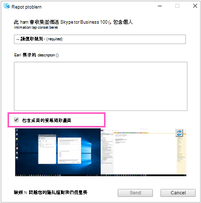

# <a name="turn-on-or-off-skype-for-business-client-feedback-reporting"></a>開啟或關閉商務用 Skype 用戶端意見反應報告

您可以讓商務用 Skype Online 使用者使用內建的商務用 Skype 應用程式意見回饋工具，讓使用者報告問題，並直接向 Microsoft 提供有關其使用體驗的意見。 
  

  
使用者可以使用此工具，從裝置上的應用程式複製記錄，協助 Microsoft 進一步調查及疑難排解他們可能有的問題。 
  

  
您也可以使用  _EnableOnlineFeedbackScreenshot_ 設定，讓使用者在意見回饋中納入裝置螢幕擷取畫面。
  

  
> [!IMPORTANT]
> 應用程式的意見回饋工具所收集的記錄，最多會在美國儲存 90 天，而這個問題正在調查中。 因此，如果這項意見回饋工具違反貴組織的資料保護原則，請不要啟用。 
  
## <a name="start-windows-powershell"></a>啟動 Windows PowerShell

> [!NOTE]
> 商務用 Skype Online Connector 目前是最新 Teams PowerShell 模組的一部分。 如果您使用的是最新的 Teams PowerShell 公開發行，則不需要安裝商務用 Skype Online Connector。
1. 安裝 [Teams PowerShell 模組](https://docs.microsoft.com/microsoftteams/teams-powershell-install)。
    
2. 開啟 Windows PowerShell 命令提示程式，然後執行下列命令： 

   ```powershell
   # When using Teams PowerShell Module

   Import-Module MicrosoftTeams
   $userCredential = Get-Credential
   Connect-MicrosoftTeams -Credential $userCredential
   ```
   如果您想要有關啟動 Windows PowerShell 的資訊，請參閱在單一 Windows PowerShell 視窗中連接到所有[Microsoft 365 或 Office 365](https://technet.microsoft.com/library/dn568015.aspx)服務，或設定[您的電腦以使用 Windows PowerShell。](../set-up-your-computer-for-windows-powershell/set-up-your-computer-for-windows-powershell.md)
   
## <a name="turn-on-client-app-feedback-reporting-for-all-the-users-in-your-organization"></a>開啟組織中所有使用者的用戶端應用程式意見回應報告

若要為貴組織的使用者啟用意見回饋報告，並允許他們提交裝置螢幕擷取畫面，請執行：
 
  ```PowerShell
  Set-CsClientPolicy -Identity EnableOnlineFeedback -EnableOnlineFeedback $true -EnableOnlineFeedbackScreenshots $true
  ```
## <a name="want-to-know-more-about-windows-powershell"></a>想要進一瞭解更多 Windows PowerShell 嗎？
- Windows PowerShell 就是管理使用者，以及允許或禁止使用者執行哪些操作。 使用 Windows PowerShell，您可以使用單點系統管理來管理 Microsoft 365 或 Office 365 和商務用 Skype Online，當您有多個任務作作時，可以簡化您的日常工作。 若要開始使用 Windows PowerShell，請參閱以下主題：
    
  - [Windows PowerShell 與 Lync Online 的簡介](https://go.microsoft.com/fwlink/?LinkId=525039)
    
  - [為何要使用 Windows PowerShell 管理 Microsoft 365 或 Office 365 的六個原因](https://go.microsoft.com/fwlink/?LinkId=525041)
    
- 與只使用 Microsoft 365 系統管理中心相比，Windows PowerShell 在速度、簡化和生產力方面有許多優點，例如當您一次為許多使用者進行設定變更時。 在下列主題中瞭解這些優點：
    
  - [使用 Windows PowerShell 管理 Microsoft 365 或 Office 365 的最佳方式](https://go.microsoft.com/fwlink/?LinkId=525142)
    
  - [使用 Windows PowerShell 管理商務用 Skype Online](https://go.microsoft.com/fwlink/?LinkId=525453)
    
  - [使用 Windows PowerShell 執行一般商務用 Skype Online 管理工作](https://go.microsoft.com/fwlink/?LinkId=525038)

## <a name="related-topics"></a>相關主題
[設定商務用 Skype Online](set-up-skype-for-business-online.md)

[讓商務用 Skype 使用者新增 Skype 連絡人](let-skype-for-business-users-add-skype-contacts.md)

  
 
