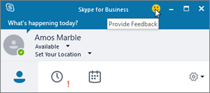

# <a name="turn-on-or-off-skype-for-business-client-feedback-reporting"></a>開啟或關閉商務用 Skype 用戶端意見反應報告

[!INCLUDE [sfbo-retirement](../../Hub/includes/sfbo-retirement.md)]

您可以啟用您的 商務用 Skype Online 使用者使用內建的 商務用 Skype App 意見回饋工具，讓使用者報告問題，並直接提供他們體驗的意見回饋給 Microsoft。 
  

  
使用者可以使用此工具，從裝置上的應用程式複製記錄，協助 Microsoft 進一步調查及疑難排解他們可能有的問題。 
  

  
您也可以使用  _EnableOnlineFeedbackScreenshot_ 設定，讓使用者將裝置螢幕擷取畫面納入他們的意見回饋。
  

  
> [!IMPORTANT]
> 應用程式的意見回饋工具所收集的記錄會在美國儲存最多 90 天，而此問題正在調查中。 因此，如果違反貴組織的資料保護原則，請不要啟用此意見回饋工具。 
  
## <a name="start-windows-powershell"></a>開始Windows PowerShell

> [!NOTE]
> 商務用 Skype Online 連接器目前是最新 Teams PowerShell 模組的一部分。 如果您使用的是最新的 Teams PowerShell 公開發行版本，則不需要安裝商務用 Skype Online 連接器。
1. 安裝[powerShell Teams模組](/microsoftteams/teams-powershell-install)。
    
2. 開啟 Windows PowerShell命令提示符，然後執行下列命令： 

   ```powershell
   # When using Teams PowerShell Module

   Import-Module MicrosoftTeams
   $userCredential = Get-Credential
   Connect-MicrosoftTeams -Credential $userCredential
   ```
   若要進一Windows PowerShell，請參閱連線視窗中連線所有 Microsoft 365 或 Office 365 [Windows PowerShell](/microsoft-365/enterprise/connect-to-all-microsoft-365-services-in-a-single-windows-powershell-window)服務，或設定您的電腦[Windows PowerShell。](../set-up-your-computer-for-windows-powershell/set-up-your-computer-for-windows-powershell.md)
   
## <a name="turn-on-client-app-feedback-reporting-for-all-the-users-in-your-organization"></a>開啟組織中所有使用者的用戶端應用程式意見回應報告

若要為貴組織的使用者啟用意見回饋報告，並允許他們提交裝置螢幕擷取畫面，請執行：
 
  ```PowerShell
  Set-CsClientPolicy -Identity EnableOnlineFeedback -EnableOnlineFeedback $true -EnableOnlineFeedbackScreenshots $true
  ```
## <a name="want-to-know-more-about-windows-powershell"></a>想要進一Windows PowerShell？
- Windows PowerShell管理使用者，以及允許或不允許使用者執行哪些操作。 使用 Windows PowerShell，您可以使用單一系統管理Microsoft 365或 Office 365 商務用 Skype管理線上，當您有多個工作需要執行時，可以簡化您的日常工作。 若要開始使用Windows PowerShell，請參閱以下主題：
    
  - [Windows PowerShell 與 Lync Online 的簡介](../set-up-your-computer-for-windows-powershell/set-up-your-computer-for-windows-powershell.md)
    
  - [您可能會想要使用 Windows PowerShell 管理Microsoft 365或Office 365](/microsoft-365/enterprise/why-you-need-to-use-microsoft-365-powershell)
    
- Windows PowerShell比只使用 Microsoft 365 系統管理中心，在速度、簡易性及生產力方面有許多優點，例如當您一次對許多使用者進行設定變更時。 請從下列主題瞭解這些優點：
    
  - [使用 Microsoft 365 管理Office 365或Windows PowerShell](/previous-versions//dn568025(v=technet.10))
    
  - [使用 Windows PowerShell 管理 商務用 Skype Online](../set-up-your-computer-for-windows-powershell/set-up-your-computer-for-windows-powershell.md)
    
  - [使用 Windows PowerShell 執行常見的線上商務用 Skype管理工作](../set-up-your-computer-for-windows-powershell/set-up-your-computer-for-windows-powershell.md)

## <a name="related-topics"></a>相關主題
[設定商務用 Skype Online](set-up-skype-for-business-online.md)

[讓商務用 Skype 使用者新增 Skype 連絡人](let-skype-for-business-users-add-skype-contacts.md)

  
