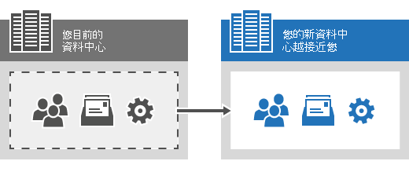

# 為什麼我無法立即使用商務用 Skype Online 系統管理中心？

我們知道當您無法完成工作時，這會令人頭疼，因此我們將說明這裡發生的情況，以及為什麼它值得等待。 
  
首先，以下是技術說明：
  
我們正在將您的商務用 Skype Online 服務（也就是您的使用者和組織設定）遷移至另一個更靠近您的 Microsoft datacenter。 這將會改善您的服務並減少延遲時間。 
  
如需更多技術詳細資料，請參閱在[資料移動期間和之後]( https://go.microsoft.com/fwlink/?LinkId=526418)。
  
## 是的，這意味著什麼？

首先，讓我們來細分幾個字詞。
  
- **資料中心**這是儲存 Microsoft 365 或 Office 365 中資訊的物理位置，例如您的檔案和電子郵件訊息。 如果您確實想要深入瞭解 Microsoft 365 和 Office 365 資料中心的資料中心，請參閱[這篇文章](https://www.microsoft.com/online/legal/v2/?docid=25)。
    
- **遷移**這相當於「移動」。 在這種情況下，這表示我們要將商務用 Skype Online 使用者和設定從一個資料中心移至另一個更靠近您的服務。
    
- **延遲**這是您存取 Microsoft 365 系統管理中心所需的時間，請設定變更，然後儲存這些變更。
    
- **相關識別碼**您可能會在您剛剛收到的訊息中看到這個清單。 Microsoft 支援工程師會利用此資訊來協助您針對錯誤進行疑難排解。 如果您與 Microsoft 支援人員聯繫，可能會要求您輸入相關 ID。
    
這就是我們正在將所有商務用 Skype Online 使用者和服務設定移至更接近您的另一個位置的程式。 越接近越好。 好消息是在這小段時間之後，您的商務用 Skype Online 服務將會改善。
  

  
## 哪些商務用 Skype Online 功能仍可以運作？

雖然您無法存取商務用 Skype Online 系統管理中心，但在遷移期間，下列商務用 Skype Online 功能仍能運作：
  
- 線上會議
    
- 目前狀態資訊
    
## 我可以完成其他工作嗎？

確定. 當我們正在遷移您的商務用 Skype Online 服務時，您仍然可以使用 Microsoft 365 中的其他系統管理中心（例如，Microsoft 365 和 Exchange 系統管理中心）。 不過，除了商務用 Skype Online 系統管理中心之外，您將無法在遷移期間使用商務用 Skype Online 遠端 PowerShell Cmdlet。 
  
## 相關主題
[設定商務用 Skype Online](set-up-skype-for-business-online.md)

[讓商務用 Skype 使用者新增 Skype 連絡人](let-skype-for-business-users-add-skype-contacts.md)

  
 
