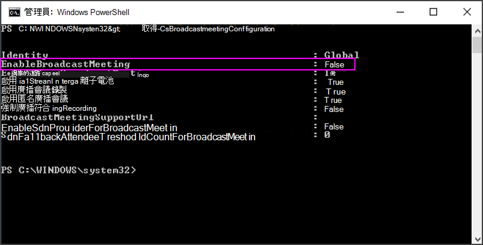
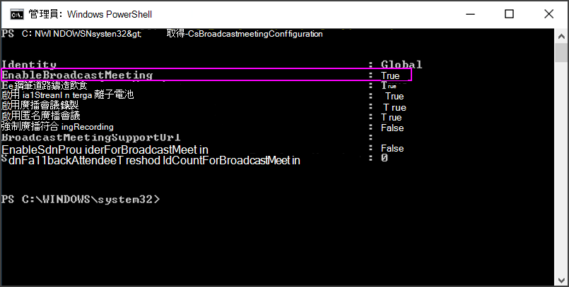

# <a name="enable-skype-meeting-broadcast"></a>啟用 Skype 會議廣播

[!INCLUDE [sfbo-retirement](../../Hub/includes/sfbo-retirement.md)]

> [!IMPORTANT]
> 商務用 SkypeOnline 將于 2021 年 7 月 31 日停用，此時將結束服務存取權。 我們鼓勵客戶開始升級至 Microsoft Teams 中通訊和團隊合作的核心Microsoft 365。

在貴組織人員可以使用會議廣播Skype之前，您必須啟用它。 若要這麼做，您必須知道如何使用Windows PowerShell。 如果您不知道Windows PowerShell，請考慮雇用[Microsoft 合作夥伴](https://go.microsoft.com/fwlink/?linkid=391089)來執行此步驟。


> [!NOTE]
> 系統Microsoft Teams系統管理中心已商務用 Skype系統管理中心 (舊版) 。 系統管理中心商務用 Skype所有管理Teams設定。 您必須被指派全域系統管理員或系統管理員的[Azure AD](/azure/active-directory/roles/permissions-reference)系統管理員商務用 Skype，才能商務用 Skype系統管理中心Teams功能。 若要深入了解，請參閱[在 Microsoft Teams 系統管理中心中管理商務用 Skype 設定](/MicrosoftTeams/skype-for-business-settings?bc=%2fskypeforbusiness%2fbreadcrumb%2ftoc.json&toc=%2fskypeforbusiness%2fsfbotoc%2ftoc.json)。

  
## <a name="enable-skype-meeting-broadcast-using-the-skype-for-business-admin-center"></a>使用 Skype 系統管理中心啟用商務用 Skype廣播

 **使用 商務用 Skype系統管理中心**

1. 使用全域系統管理員帳戶或 商務用 Skype 帳戶登錄 [https://portal.office.com/adminportal/home](https://portal.office.com/adminportal/home) 。
    
2. 在系統管理中心，前往 **系統管理中心**  >  **Teams。**
    
3. 在 Teams **系統** 管理中心，前往舊版入口網站Online 會議 廣播會議，然後選取 Skype  >    >  ******會議廣播**。
    
## <a name="enable-skype-meeting-broadcast-using-powershell"></a>使用 powerShell Skype會議廣播

1. 安裝[powerShell Teams模組](/microsoftteams/teams-powershell-install)。
    
2. 開啟 Windows PowerShell命令提示符，然後執行下列命令： 

   ```powershell
   # When using Teams PowerShell Module
   
   Import-Module MicrosoftTeams
   $userCredential = Get-Credential
   Connect-MicrosoftTeams -Credential $userCredential
   ```
3. 請Skype會議廣播的目前狀態：
    
   ```PowerShell
   Get-CsBroadcastMeetingConfiguration
   ```

    確認參數  _EnableBroadcastMeeting 設定_ 為 `False` 。
    
     
  
9. 請Skype組織啟用會議廣播：
    
   ```PowerShell
   Set-CsBroadcastMeetingConfiguration -EnableBroadcastMeeting $True
   ```

    您可以再次進行，確認已啟用  `Get-CsBroadcastMeetingConfiguration` 設定。
    
     
  
    > [!TIP]
    > 進行變更之後，最多可能需要一小時，Skype會議廣播入口網站生效。 
  
10. 您的使用者現在可以與公司中的其他使用者召開廣播會議。 若要開始使用，請指向會議廣播Skype[內容？](https://support.office.com/article/c472c76b-21f1-4e4b-ab58-329a6c33757d)
    
## <a name="configure-your-network-to-broadcast-meetings-with-external-attendees"></a>設定您的網路以廣播與外部出席者的會議

如果您有防火牆，而且想要與公司外部人員 (非聯盟企業) 進行廣播，您必須使用以下指示來設定您的網路：為 Skype 會議廣播[設定](set-up-your-network-for-skype-meeting-broadcast.md)您的網路。 
  
如果您沒有防火牆的組組經驗，請考慮雇用 [Microsoft 合作夥伴](https://go.microsoft.com/fwlink/?linkid=391089) 來執行此步驟。
  
若要略過此步驟，改為將另一個企業新增到您的聯盟，請參閱允許使用者與外部使用者[商務用 Skype聯絡](../set-up-skype-for-business-online/allow-users-to-contact-external-skype-for-business-users.md)。 
  
## <a name="related-topics"></a>相關主題

[Windows PowerShell 與 Lync Online 的簡介](../set-up-your-computer-for-windows-powershell/set-up-your-computer-for-windows-powershell.md)
  
[設定商務用 Skype Online](../set-up-skype-for-business-online/set-up-skype-for-business-online.md)

  
