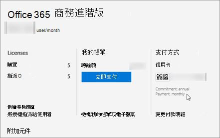

# Office 365 企業版 E1、E3 及 E4

[!INCLUDE [sfbo-retirement](../../../Hub/includes/sfbo-retirement.md)]

如果您已經購買[E1](https://products.office.com/business/office-365-enterprise-e1-business-software)Office 365 企業版[E3](https://products.office.com/business/office-365-enterprise-e3-business-software)或 E4 方案，以下是您需要購買的附加元件授權，以取得更多商務用 Skype功能。

|||
|:-----|:-----|
|**若要新增此功能**   |**以下是您需要購買的東西**   |
|**音訊會議**   為要 **排** 程或主持電話撥入式會議的每一個人購買 1 個音訊會議授權。 出席者不需要授權。   |**音訊會議** 附加元件  購買授權後，Microsoft 就會成為您的音訊會議提供者。 |
|**可撥入會議免付費號碼，以及從會議撥出以撥打全球任何電話號碼來新增人員的能力**   |[通訊點數](/microsoftteams/add-funds-and-manage-communications-credits)|
|**電話系統**   |1. **Office 365 電話系統** 附加元件   2. 通話方案：從Office 365。    或者，使用 [現有提供者的電話語音](../../skype-for-business-and-microsoft-teams-add-on-licensing/skype-for-business-and-microsoft-teams-add-on-licensing.md#bkmk_existing)。    |
|**雲端語音信箱**1   |針對 E1 和 E4 方案，Exchange Online方案 2。  或者，切換到 Office方案 2 隨附Exchange Online套件，例如 Office 365 E3。 |
|**通話方案**   |1.**電話系統** 附加元件   2.[通話方案](/MicrosoftTeams/calling-plans-for-office-365)：您只有在購買附加元件 **電話系統才能購買**。   |

1 適用于內部部署使用者。 詳細資訊請參閱為內部[雲端語音信箱使用者規劃服務。](/skypeforbusiness/hybrid/plan-cloud-voicemail)
   
 > [!IMPORTANT]
 > Office 365E4 授權已正式停用。 如需詳細資訊[，請參閱Office 365 企業版 E4重要資訊](https://support.office.com/article/important-information-for-office-365-enterprise-e4-customers-f9572348-43a2-43fa-a3d8-3b6c9c042147)。
  
## E1 和 E3 客戶：如何查看價格和購買

1. 登入系統管理中心。

2. 前往 **計費**  >  **訂閱**  >  **附加元件**  >  **購買附加元件**。

   

3. 購買 **授權電話系統，** 您就會看到購買通話方案的價格和選項。

### 合作夥伴：如何查看價格和購買

E3 方案是您的動作套件的一部分。 若要購買 **電話系統****和音訊會議** 附加元件：

1. 從我們的行銷網站購買 E3 [的一個座位](https://go.microsoft.com/fwlink/?LinkId=24393)。 選擇將座新增到現有租使用者的選項。

2. 請登錄系統管理中心，然後前往帳單訂閱  >    >  **附加元件**。

    現在，您將看到購買電話和音訊 **電話系統附加元件** 的價格和選項。 

## 為什麼我看不到購買附加元件的選項？

在少數情況下，您不會看到在 商務用 Skype中購買附加元件Microsoft 365 系統管理中心。

- **您透過 goDaddy Microsoft 365 商務標準版購買。** 在這種情況下，您無法購買商務用 Skype附加元件。 您需要切換到 E3 方案 (GoDaddy 不會銷售) ，然後您可以購買。 [請連絡商務產品的客戶支援 - 管理說明](https://support.office.com/article/32a17ca7-6fa0-4870-8a8d-e25ba4ccfd4b)。

- **您擁有每月承諾，而非年度承諾**。 在某些情況下，每月承諾的客戶無法購買附加元件 (與付款條件不同，付款條件可以是每月付款) 。 這是我們正在修正的已知問題。 [請連絡商務產品的客戶支援 - 管理說明](https://support.office.com/article/32a17ca7-6fa0-4870-8a8d-e25ba4ccfd4b)。

    
