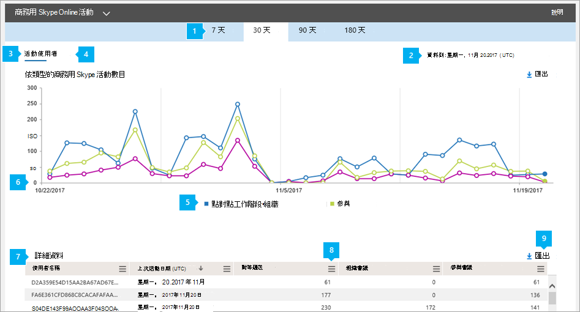

# 活動報告

[!INCLUDE [sfbo-retirement](../../Hub/includes/sfbo-retirement.md)]

報表 **儀表板** 會顯示您組織中Microsoft 365 Office 365活動概觀。 它可讓您深入查看個別的產品層級報告，以進一步深入瞭解每個產品內的活動。 例如，您可以使用 商務用 Skype 活動報表來查看使用者使用對等或有組織的會議會話，或是他們參與會議會話的量。 

如需深入瞭解 [，請查看報告](https://support.office.com/article/0d6dfb17-8582-4172-a9a9-aed798150263) 概觀。
  
此報告與其他報表商務用 Skype一起，提供您整個組織活動的詳細資訊。 當您調查、規劃及為貴組織做出其他商務決策時，這些詳細資料非常實用。
  
> [!NOTE]
> 當您以系統管理員在 商務用 Skype 登入時，可以看到所有Microsoft 365 系統管理中心。 
  
## 如何取得活動商務用 Skype報表

1. 請前往系統管理中心>**報告**  >  **使用方式**。
    
2. 在 [**使用方式商務用 Skype，** 在左側的 [選取報表清單> 上，選擇 [商務用 Skype ****  >  ******活動**> 小工具。 

  
## 解譯商務用 Skype活動報告

您可以查看活動圖和使用者商務用 Skype來查看使用者的活動。  
  

  
***
 
您可以 **商務用 Skype** 活動電子郵件活動報告，查看過去 7 天、30 天、90 天或 180 天的趨勢。 不過，如果您按一下報告中的特定日期，表格 (請參閱數位 7) 會顯示自目前日期起最多 28 天的資料 (而不是報表的產生日期) 。

> [!NOTE]
> 如果您按一下特定日期的詳細資訊，表格只會顯示 30 天內的資料，到報表產生日期為止。

***
 
每個報表都有產生此報表的日期。 報告通常會反映啟用時間起 24 到 48 小時的延遲。 
***
 
使用活動圖表上的互動式圖表資料來瞭解使用趨勢，以及查看貴組織中進行的會議活動數目。 它會顯示整個組織的點對點工作階段、已組織及參與會議會話的總數和類型。   
***
 
使用使用者圖表上的互動式圖表資料來瞭解使用趨勢，並查看參與貴組織進行之會議活動的唯一使用者數目。 它會顯示使用者總數，以及點對點工作階段、已組織及 **參與會議會話** 的類型。  
***
 
您可以按一下圖例中的專案，來篩選圖表上看到的數列。 例如，在 [**活動** 圖上，按一下或點一下點對點工作階段、已組織或參與的會話，以查看每個會話的相關資訊。  變更此選取範圍不會變更格線表格中的資訊。 
***
 
每個圖表都有一個水準 ("X"，) 垂直軸 ("Y") 。
*    在 **活動圖表** 上，Y 座標軸是對等、組織及參與已召開的會議會話總數。
*    在使用者 **活動** 圖表上，Y 座標軸是參與每種類型的對等、組織及參與會議的唯一使用者數目。

這兩個圖表上的 X 軸是此特定報表的選取日期範圍。 
***
 
下表顯示每個使用者所有會議活動的明細。 這會顯示所有已指派商務用 Skype使用者及其會議活動。 您可以新增其他欄至資料表。
* **使用者** 名稱是使用者的名稱。
* **已刪除** 表示使用者授權已移除。  
  > [!NOTE]
  > 只要在所選時段內獲得授權，已刪除使用者的活動仍然會顯示在報告中。 刪除 **欄** 可協助您注意，使用者可能已不再作用中，但已對報告中的資料有影響。
     
* **刪除日期** 是移除使用者授權的日期。
* **UTC (的最後**) 日期是使用者最近參與點對點工作階段，或組織會議或參與會議的時間。
* **對等顯示** 使用者使用的對等會議會話總數。
* **已組織會議** 會顯示該使用者組織的會議總數。
* **參與的會議會顯示** 此使用者參與的會議總數。
* **指派的產品** 是Microsoft 365 Office 365指派給該使用者的產品。 

如果貴組織的政策禁止您檢視可識別使用者資訊的報告，您可以變更所有這些報表的隱私權設定。 請參閱系統管理中心 **中** 活動報告區段的隱藏 [使用者詳細資料](https://support.office.com/article/0d6dfb17-8582-4172-a9a9-aed798150263)。
***
 
按一下或點一 **下** 任一欄的 [欄」 圖示，即可從報表新增或移除欄。             
***
 
您也可以按一下或點Excel .csv匯出，將報表資料匯出至 **檔案。**               這會匯出所有使用者的資料，並可讓您執行簡單的排序和篩選，以便進一步分析。 如果您的使用者少於 2000 人，您可以在報表本身的表格內排序和篩選。 如果您有超過 2000 個使用者，若要篩選和排序，您必須匯出資料。 
   
## 想要查看其他商務用 Skype報表？

- [商務用 Skype裝置使用方式報告](device-usage-report.md)您可以查看已安裝應用程式Windows作業系統和行動裝置等裝置，商務用 Skype應用程式用於 IM 和會議。
    
- [商務用 Skype會議召集人活動報告](conference-organizer-activity-report.md)您可以查看使用者組織使用 IM、音訊/視像、應用程式共用、Web、撥入/撥出 - 協力廠商和撥入/撥出 - Microsoft 的會議。
    
- [商務用 Skype對等活動報表](peer-to-peer-activity-report.md)您可以查看使用者使用 IM、音訊/視像、應用程式共用和傳輸檔案的多少。
    
- [商務用 Skype封鎖報表的使用者](users-blocked-report.md)您可以看見貴組織中遭到封鎖的使用者，無法撥打 PSTN 通話。
    
- [商務用 Skype PSTN 使用方式報告](pstn-usage-report.md)您可以看見用於內/外通話的分鐘數，以及這些通話的成本。

- [商務用 Skype PSTN 分鐘](pstn-minute-pools-report.md)數庫報表，您可以查看組織內當月使用的分鐘數。

- [商務用 Skype會話詳細資料包表](session-details-report.md)您可以查看個別使用者的通話體驗詳細資料。

    
## 相關主題
[系統管理中心的活動報告](https://support.office.com/article/0d6dfb17-8582-4172-a9a9-aed798150263)

  
 
