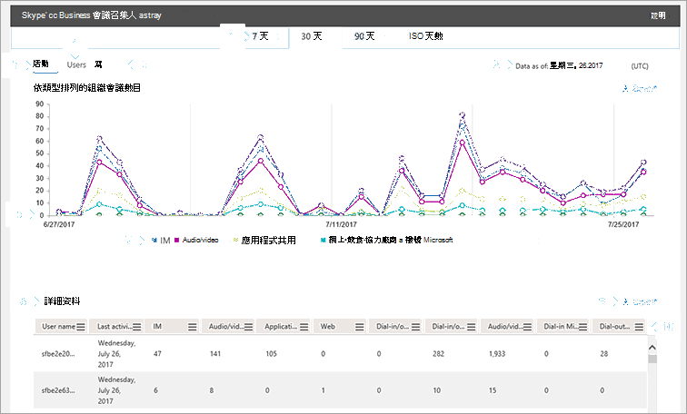

# 會議召集人活動報告

新的 Office 365 [**報告**] 儀表板會在您組織中的 Office 365 產品上顯示活動概覽。 它可讓您深入瞭解個別的產品層級報告，讓您更精確地瞭解每個產品內的活動。 例如，您可以使用商務用**Skype 會議召集人活動**報告，查看您的使用者使用 IM、音訊/視頻、應用程式共用、Web、撥入/取出-協力廠商以及撥入/取出-Microsoft 的方式來組織會議的數量。 

若要深入瞭解，請參閱[報表概覽](https://support.office.com/article/0d6dfb17-8582-4172-a9a9-aed798150263)。
  
此報告以及其他商務用 Skype 報告，提供您組織中組織會議活動的詳細資料。 當您正在調查、規劃及針對您的組織進行其他業務決策時，這些詳細資料非常有用。 
  
> [!NOTE]
> 當您以系統管理員身分登入 Microsoft 365 系統管理中心時，您可以看到所有商務用 Skype 報告。 
  
## 如何取得商務用 Skype 會議召集人報告

1. 移至 [系統管理中心] > [**報告** > **使用方式**]。
    
2. 在 [**使用狀況**] 頁面上，選取左側 [**選取報告] 清單**中的 [**商務** >用 Skype**會議召集人活動**]。 或者，按一下 [**商務用 skype] 活動**小工具，然後按一下 [商務用**skype] 活動**清單上的 [**商務用 skype 會議召集人] 活動**。
  
## 解讀商務用 Skype 會議召集人報告

您可以透過查看 [**活動**]、[**使用者**] 和 [**紀要**] 圖表，來取得您的商務用 Skype 會議。
  

  
***
 您可以在過去7天、30天、90天或180天的趨勢中，查看**商務用 Skype 會議召集人活動**報告。 不過，如果您在報表中按一下某個特定的日期，該表（請參閱編號7）將會顯示30天的資料，最多為產生報告的日期（請參閱編號2）。

> [!NOTE]
> 如果您按一下某一天的詳細資料，該表將只會顯示在產生報告時的日期，30天內的資料。

***
 每個報告都有產生此報告的日期。 報告通常會反映來自啟用時間的24到48小時延遲時間。 
***
 在**活動**圖表上使用互動式圖表與即時資料，以瞭解使用趨勢，並查看組織中的會議總數，以及所擁有的會議類型。 它會顯示**IM**、**音訊/視頻**、**應用程式共用**、 **Web**、**撥入/取出-協力廠商**以及在整個組織中組織的**撥入/登出 Microsoft**會議的總數和類型。 
***
 使用 [**使用者**] 圖表上的互動式圖表與即時資料來瞭解使用趨勢，以及查看組織中有已組織會議的唯一使用者數目。 它會顯示您的使用者總數，以及**IM**類型、**音訊/視頻**、**應用程式共用**、**網頁**、**撥入/取出-協力廠商**，以及已組織的**電話撥入/取出 Microsoft**的會議。 
***
 在**分鐘**數圖表中使用互動式圖表與即時資料，以瞭解使用方式趨勢，以及使用者使用音訊/視頻以及撥入和撥出-Microsoft 作為會議提供者來組織會議時所使用的分鐘數。 它會顯示**音訊/視頻**和**撥入的 microsoft**通話分鐘數，以及在組織的會議期間使用的**撥出 microsoft**通話分鐘數。
***
 
每個圖表都有 "X" （水準）和 "Y" （垂直）軸。
*    在 [**活動**] 活動圖表中，Y 軸是 IM、音訊/視頻、應用程式共用、網頁、撥入/取出-協力廠商，以及使用者在組織中組織的電話撥入/登出 Microsoft 的總數。 
*    在 [**使用者**] 活動圖表上，Y 軸是指擁有 IM、音訊/視頻、應用程式共用、Web、撥入/撥出/協力廠商的使用者，以及由您的組織組織的會議撥入/登出 Microsoft 的使用者數。
*    在 [**時間**] 活動圖表上，Y 軸是在您的組織中組織之會議的音訊/視頻、撥入式 microsoft 分鐘數和撥出 microsoft 分鐘數的總時間。  

這兩個圖表的 X 軸都是此特定報表的已選取日期範圍。 
***
 
您可以按一下圖例中的專案，篩選您在圖表上看到的系列。 例如，在 [**活動**] 圖表中，按一下或敲擊 [ **IM**]、[**音訊/視頻**]、[**應用程式共用** **]、[** 撥入/取出 **-協力廠商**] 和 [**撥入/登出 Microsoft** ]，只查看與每個專案相關的資訊。 變更此選取範圍不會變更格線表格中的資訊。
***
 下表顯示每個使用者的組織會議活動明細。 這會顯示已指派商務用 Skype 的所有使用者，以及他們所組織的會議。 您可以在表格中新增額外的欄。 
* [**使用者名稱**] 是使用者的名稱。 
* [**已刪除**] 代表使用者的授權已被移除。  
  > [!NOTE]
  > 已刪除的使用者的活動只要在所選時段內的授權，就會顯示在報表中。 [**刪除**的資料] 欄可協助您注意，使用者可能已無法使用，但會參與報表中的資料。
     
* [**刪除日期**] 是指使用者的授權被移除的日期。 
* [**上次活動日期（utc）** ] 是該使用者的最後一個活動日期（utc）。 
* [ **Im** ] 會顯示已組織的 im 會議總數。 
* [**音訊/視頻**]：顯示已組織的音訊/視訊會議總數。
* [**應用程式共用**] 會顯示已組織之應用程式共用會議的總數。 
* [**網站**]：顯示已組織之網路會議的總數。 
* [**撥入/取出-協力廠商**] 會顯示使用協力廠商音訊會議提供者組織的撥入/撥出音訊會議總數。 
* [**撥入/取出 Microsoft** ] 會顯示已組織的撥入/撥出音訊會議總數。 
* [**音訊/視頻分鐘**數] 會顯示在已使用音訊/視頻的已組織會議中使用的總分鐘數。 
* [**撥入 Microsoft 分鐘**數]：顯示在會議中使用 Microsoft 作為音訊會議提供者之組織的電話撥入分鐘總數。 
* [**撥出 Microsoft 分鐘**數]：顯示在會議中使用 Microsoft 作為音訊會議提供者之組織的撥出分鐘數總計。 

如果您組織的原則禁止您查看使用者資訊可識別的報告，您可以變更所有這些報告的隱私權設定。 請參閱系統[管理中心 [活動報告](https://support.office.com/article/0d6dfb17-8582-4172-a9a9-aed798150263)] 中的 [**如何隱藏使用者層級詳細資料？** ] 區段。
***
 您也可以按一下或敲擊 [**匯出**]，將報告資料匯出至 Excel .csv 檔案。             ![商務用 Skype 報告 [匯出] 按鈕。](../images/de7e2ab7-d70c-422f-a0ec-178b10f7dd51.png) 這會匯出所有使用者的資料，並可讓您進行簡單的排序與篩選，以進行進一步分析。 如果您的使用者少於2000，您可以在報表本身的資料表中排序和篩選。 如果您有超過2000的使用者，若要篩選和排序，您必須匯出資料。
***
 按一下或敲擊任何欄中的 [**欄**] 圖示，以新增或移除報告中的欄。             ![商務用 Skype Online 報告 [管理] 按鈕。](../images/4c8f5387-cebb-4d6c-b7d3-05c954a2c234.png)
   
## 想要查看其他商務用 Skype 報表嗎？

- [商務用 Skype 活動報告](activity-report.md)您可以查看使用者使用對等、組織的方式，以及參與會議會話的數量。
    
- [商務用 Skype 裝置使用方式報告](device-usage-report.md)您可以查看裝置，包括已安裝商務用 Skype 應用程式的 Windows 作業系統和行動裝置，以及用於 IM 和會議的行動裝置。
    
- [商務用 Skype 會議參與者活動報告](conference-participant-activity-report.md)您可以查看有多少 IM、音訊/視頻、應用程式共用、網頁和撥入/撥出會議會議都在參與。
    
- [商務用 Skype 對等活動報告](peer-to-peer-activity-report.md)您可以查看您的使用者使用 IM、音訊/視頻、應用程式共用和傳送檔案的數量。
    
- [商務用 Skype 使用者封鎖報告](users-blocked-report.md)您可以看到貴組織中已封鎖進行 PSTN 通話的使用者。
    
- [商務用 SKYPE PSTN 使用方式報告](pstn-usage-report.md)您可以在輸入/撥出通話中看到所花費的分鐘數，以及這些通話的成本。
    
- [商務用 SKYPE PSTN 分鐘池報告](pstn-minute-pools-report.md)您可以查看貴組織內的當月所消耗的分鐘數。

- [商務用 Skype 會話詳細資料包表](session-details-report.md)您可以查看個別使用者的通話體驗的詳細資料。

## 相關主題
[系統管理中心的活動報告](https://support.office.com/article/0d6dfb17-8582-4172-a9a9-aed798150263)

  
 
