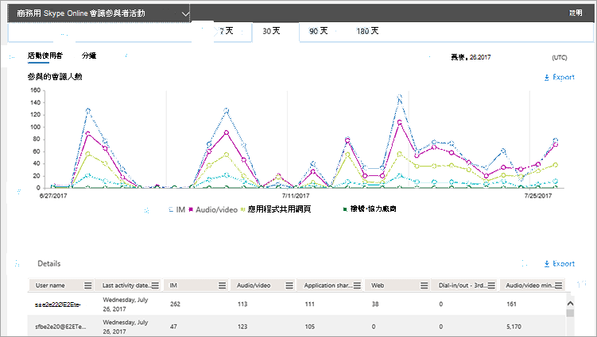

# 會議參與者活動報告Conference participant activity report

做為 Office 365 系統管理員，新的 [**報告**] 儀表板會顯示貴組織內 Office 365 產品使用方式的相關資料。As an Office 365 admin, the new **Reports** dashboard shows you data on the usage of the Office 365 products within your organization. 您可以使用**商務用 Skype 會議參與者活動**報告，查看貴組織中的使用者參與了多少 IM、音訊/視頻、應用程式共用、網頁和撥入/取出會議。You can use the **Skype for Business conference participant activity** report to see how many IM, audio/video, application sharing, Web and dial-in/out conferences are being participated in by users in your organization.

若要深入瞭解，請參閱[報表概覽](https://support.office.com/article/0d6dfb17-8582-4172-a9a9-aed798150263)。Check out the [Reports overview](https://support.office.com/article/0d6dfb17-8582-4172-a9a9-aed798150263) to learn more.
  
此報告以及其他商務用 Skype 報告，提供您組織中會議活動的詳細資料。This report, along with the other Skype for Business reports, gives you details on conferencing activity across your organization. 當您正在調查、規劃及針對您的組織進行其他業務決策時，這些詳細資料非常有用。These details are very helpful when you are investigating, planning, and making other business decisions for your organization.
  
> [!NOTE]
> 當您以系統管理員身分登入 Microsoft 365 系統管理中心時，您可以看到所有商務用 Skype 報告。You can see all of the Skype for Business reports when you log on as an administrator to the Microsoft 365 admin center. 
  
## 如何取得商務用 Skype 會議參與者報告How to get to the Skype for Business conference participant report

1. 移至 [系統管理中心] > [**報告** > **使用方式**]。Go to the admin center > **Reports** > **Usage**.
    
2. 在 [**使用狀況**] 頁面上，按一下左側 [**選取報告] 清單**中的 [**商務用 Skype 會議參與者活動**]。On the **Usage** page, click **Skype for Business conference participant activity** on the **Select a report list** on the left. 或者，按一下 [**商務用 skype] 活動**小工具，然後按一下 [商務用**skype 活動**] 清單上的 [**商務用 skype 會議參與者活動**]。Or, click the **Skype for Business activity** widget and then click **Skype for Business conference participant activity** on the **Skype for Business activity** list.
    
     
  
    > [!IMPORTANT]
    > 視您擁有的 Office 365 訂閱而定，您可能不會在這裡看到所有產品和活動報告。Depending on the Office 365 subscription you have, you might not see all the products and activity reports shown here. 
  
## 解讀商務用 Skype 會議參與者活動報告Interpret the Skype for Business conference participant activity report

  
***
 您可以在過去7天、30天、90天或180天的趨勢中，查看**商務用 Skype 會議參與者活動**報告。The **Skype for Business Conference Participant Activity** report can be viewed for trends over the last 7 days, 30 days, 90 days, or 180 days. 不過，如果您在報表中按一下某個特定的日期，該表（請參閱編號7）將會顯示30天的資料，最多為產生報告的日期（請參閱編號2）。However, if you click into a particular day in the report, the table (see number 7) will show data for 30 days, up to the date (see number 2) for when the report was generated.
> [!NOTE]
> 如果您按一下某一天的詳細資料，該表將只會顯示在產生報告時的日期，30天內的資料。If you click into the details of a specific day, the table will only show data for the 30 days up to the date when the report was generated.
     
***
 每個報告都有產生此報告的日期。Each report has a date for when this report was generated. 報告通常會反映來自啟用時間的24到48小時延遲時間。The reports usually reflect a 24- to 48-hour latency from time of activity. 
***
 使用**活動**圖表上的互動式圖表資料來瞭解使用趨勢，以及查看已參與的會議總數，以及您組織中所擁有的會議類型。Use the interactive chart data on the **Activity** chart to understand usage trends and to see the total number of conferences that were participated in and the type of conferences that are being held in your organization. 它會顯示您組織內參與的**IM**、**音訊/視頻**、**應用程式共用**、**網頁**及**撥入/撥入/外**會議的總數和類型。It will show you the total number and types of **IM**, **Audio/video**, **Application sharing**, **Web**, and **Dial-in/out - 3rd party** conferences that were participated in across your organization.
***
 使用 [**使用者**] 圖表上的互動式圖表資料來瞭解使用趨勢，以及查看已參與在您組織中的會議的唯一使用者數目。Use the interactive chart data on the **Users** chart to understand usage trends and to see the number of unique users that have participated in conferences that are being held in your organization. 它會顯示使用者總數，以及已組織的**IM**、**音訊/視頻**、**應用程式共用**、**網頁**及**撥入/撥入/外**傳送。It will show you the total number of users along with the types of **IM**, **Audio/video**, **Application sharing**, **Web**, and **Dial-in/out - 3rd party** of conferences that were organized.
***
 在**分鐘**數圖表中使用互動式圖表資料，以瞭解使用方式趨勢，並查看使用者使用音訊/視頻以及撥入和撥出電話組織會議時所使用的分鐘數服務.Use the interactive chart data on the **Minutes** chart to understand usage trends and to see the number of minutes that are used by users when they organize a conference using audio/video, and dial-in and dial-out - Microsoft as their audio conferencing provider. 它會顯示在參與會議期間所使用之**音訊/影片**的總分鐘數。It will show you the total number of minutes of **Audio/video** that are used during conferences that were participated in.
***
 您可以按一下圖例中的專案，篩選您在圖表上看到的系列。You can filter the series you see on the chart by clicking on an item in the legend. 例如，在 [**活動**] 圖表中，按一下或點兩下 [ **IM**]、[**音訊/視頻**]、[**應用程式共用**]、[ **Web**] 和 [撥入/上傳] **-協力廠商**，即可只查看與每一筆相關的For example, on the **Activity** chart, click or tap **IM**, **Audio/video**, **Application sharing**, **Web**, and **Dial-in/out - 3rd party** to see only the info related to each one. 變更此選取範圍不會變更格線表格中的資訊。Changing this selection doesn't change the info in the grid table. 
***
 每個圖表都有 "X" （水準）和 "Y" （垂直）軸。Each chart has an 'X' (horizontal) and 'Y' (vertical) axis.  
*    在 [**活動**] 活動圖表上，Y 軸是您組織中您的使用者參與的 IM、音訊/視頻、應用程式共用、網頁和撥入/撥出/取出協力廠商會議的總數。On the **Activity** activity chart, the Y axis is the total number of IM, audio/video, application sharing, Web, and dial-in/out 3rd party conferences your users in your organization participated in. 
*    在 [**使用者**] 活動圖表上，Y 軸是為您組織中的使用者所參與的 IM、音訊/視頻、應用程式共用、Web 和撥入/取出三方會議所擁有的總使用者數。On the **Users** activity chart, the Y axis is the total number users that held IM, audio/video, application sharing, Web, and dial-in/out 3rd party conferences your users in your organization participated in.
*    在 [**分鐘**] 活動圖表上，Y 軸是您組織中您的使用者參與會議所用的電話總分鐘數。On the **Minutes** activity chart, the Y axis is the total number of minutes that audio/video was used for conferences that your users in your organization participated in.

這兩個圖表的 X 軸都是此特定報表的已選取日期範圍。The X axis on both charts is the selected date range for this specific report.
***
 下表顯示每個使用者參與會議活動的明細。The table shows you a breakdown of the participated in conference activities per user. 這會顯示已指派商務用 Skype 的所有使用者，以及他們參與的會議。This shows all users that have Skype for Business assigned to them and conferences that they participated in. 您可以在表格中新增額外的欄。You can add additional columns to the table.
*    [**使用者名稱**] 是使用者的名稱。**User name** is the name of the user. 
*    [**已刪除**] 代表使用者的授權已被移除。**Deleted** indicates that the user's license was removed.     **注意：** 已刪除的使用者的活動只要在所選時段內的授權，就會顯示在報表中。**Note:**  Activity for a deleted user will still display in a report as long as he or she was licensed at some time during the selected time period. [**刪除**的資料] 欄可協助您注意，使用者可能已無法使用，但會參與報表中的資料。The **Deleted** column helps you to note that the user may no longer be active, but contributed to the data in the report.      
*    [**刪除日期**] 是指使用者的授權被移除的日期。**Deleted date** is the date on which the user's license was removed. 
*    [**上次活動日期（utc）** ] 是該使用者的最後一個活動日期（utc）。**Last activity date (UTC)** is the last activity date (UTC) for that user.
*    [ **Im** ] 會顯示已參與的 im 會議總數。**IM** shows the total number of IM conferences that were participated in. 
*    [**音訊/視頻**]：顯示已參與的音訊/視訊會議總數。**Audio/video** shows the total number of audio/video conferences that were participated in.
*    [**應用程式共用**] 會顯示參與的應用程式共用會議總數。**Application sharing** shows the total number of application sharing conferences that were participated in.
*    [**網站**]：顯示已參與的 Web 會議總數。**Web** shows the total number of Web conferences that were participated in. 
*    [**撥入/取出-協力廠商**] 會顯示使用協力廠商音訊會議提供者組織的撥入/撥入式會議總數。**Dial-in/out - 3rd party** shows the total number of dial-in/out conferences that were organized that use a 3rd party audio conferencing provider. 
*    [**音訊/視頻分鐘**數]：顯示在參與使用音訊/視頻的會議時所使用的總分鐘數。**Audio/video minutes** shows the total number of minutes used when used participated in conferences that used audio/video. 

如果您組織的原則禁止您查看使用者資訊可識別的報告，您可以變更所有這些報告的隱私權設定。If your organization's policies prevents you from viewing reports where user information is identifiable, you can change the privacy setting for all these reports. 請參閱系統[管理中心 [活動報告](https://support.office.com/article/0d6dfb17-8582-4172-a9a9-aed798150263)] 中的 [**如何隱藏使用者層級詳細資料？** ] 區段。Check out the **How do I hide user level details?** section in the [Activity Reports in the admin center](https://support.office.com/article/0d6dfb17-8582-4172-a9a9-aed798150263).
***
 您也可以按一下或敲擊 [**匯出**]，將報告資料匯出至 Excel .csv 檔案。You can also export the report data into an Excel .csv file, by clicking or tapping **Export**.             ![商務用 Skype 報告 [匯出] 按鈕。](../images/de7e2ab7-d70c-422f-a0ec-178b10f7dd51.png) 這會匯出所有使用者的資料，並可讓您進行簡單的排序與篩選，以進行進一步分析。This exports data of all users and enables you to do simple sorting and filtering for further analysis. 如果您的使用者少於2000，您可以在報表本身的資料表中排序和篩選。If you have less than 2000 users, you can sort and filter within the table in the report itself. 如果您有超過2000的使用者，若要篩選和排序，您必須匯出資料。If you have more than 2000 users, in order to filter and sort, you will need to export the data.
***
 按一下或輕觸 [**欄**]，以新增或移除報告中的欄。Click or tap **Columns** to add or remove columns from the report.             ![商務用 Skype Online 報告 [管理] 按鈕。](../images/4c8f5387-cebb-4d6c-b7d3-05c954a2c234.png)
   
## 想要查看其他商務用 Skype 報表嗎？Want to see other Skype for Business reports?

- [商務用 Skype 活動報告](activity-report.md)您可以查看使用者使用對等、組織的方式，以及參與會議會話的數量。[Skype for Business activity report](activity-report.md) You can see how much your users are using peer-to-peer, organized, and participated in conferencing sessions.
    
- [商務用 Skype 裝置使用方式報告](device-usage-report.md)您可以查看裝置，包括已安裝商務用 Skype 應用程式的 Windows 作業系統和行動裝置，以及用於 IM 和會議的行動裝置。[Skype for Business device usage report](device-usage-report.md) You can to see the devices including Windows-based operating systems and mobile devices that have the Skype for Business app installed and are using it for IM and meetings.
    
- [商務用 Skype 會議召集人活動報告](conference-organizer-activity-report.md)您可以查看您的使用者使用 IM、音訊/視頻、應用程式共用、Web、撥入/取出-協力廠商以及撥入/登出-Microsoft 來組織會議的數量。[Skype for Business conference organizer activity report](conference-organizer-activity-report.md) You can see how much your users are organizing conferences that use IM, audio/video, application sharing, Web, dial-in/out - 3rd party, and dial-in/out - Microsoft.
    
- [商務用 Skype 對等活動報告](peer-to-peer-activity-report.md)您可以查看您的使用者使用 IM、音訊/視頻、應用程式共用和傳送檔案的數量。[Skype for Business peer-to-peer activity report](peer-to-peer-activity-report.md) You can see how much your users are using IM, audio/video, application sharing and transferring files.
    
- [商務用 Skype 使用者封鎖報告](users-blocked-report.md)您可以看到貴組織中已封鎖進行 PSTN 通話的使用者。[Skype for Business users blocked report](users-blocked-report.md) You can see the users in your organization that have been blocked from making PSTN calls.
    
- [商務用 SKYPE PSTN 使用方式報告](pstn-usage-report.md)您可以在輸入/撥出通話中看到所花費的分鐘數，以及這些通話的成本。[Skype for Business PSTN usage report](pstn-usage-report.md) You can see the number of minutes spent in inbound/outbound calls and cost for these calls.
    
- [商務用 SKYPE PSTN 分鐘池報告](pstn-minute-pools-report.md)您可以查看貴組織內的當月所消耗的分鐘數。[Skype for Business PSTN minute pools report](pstn-minute-pools-report.md) you can see the number of minutes consumed during the current month within your organization.

- [商務用 Skype 會話詳細資料包表](session-details-report.md)您可以查看個別使用者的通話體驗的詳細資料。[Skype for Business session details report](session-details-report.md) You can see details about individual user's call experiences.
    
## 相關主題Related topics
[系統管理中心的活動報告Activity Reports in the admin center](https://support.office.com/article/0d6dfb17-8582-4172-a9a9-aed798150263)

  
 