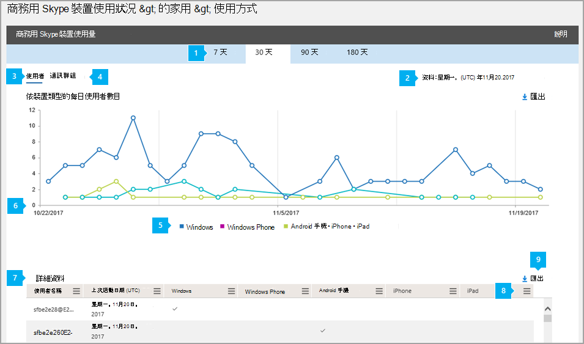

# 裝置使用報告

[!INCLUDE [sfbo-retirement](../../Hub/includes/sfbo-retirement.md)]

報表 **儀表板** 會顯示您組織中所有Microsoft 365 Office 365活動概觀。 它可讓您深入查看個別的產品層級報告，以進一步深入瞭解每個產品內的活動。 例如，您可以使用 **商務用 Skype** 裝置使用方式報告來查看已安裝 商務用 Skype 應用程式並用於 IM 和會議的裝置，包括 Windows 型作業系統和行動裝置。 

如需深入瞭解 [，請查看報告](https://support.office.com/article/0d6dfb17-8582-4172-a9a9-aed798150263) 概觀。
  
此報表與其他 商務用 Skype一起，提供您整個組織使用的用戶端/裝置類型詳細資料。 當您調查、規劃及為貴組織做出其他商務決策時，這些詳細資料非常實用。
  
> [!NOTE]
> 當您以系統管理員的商務用 Skype登入時，可以看到所有Microsoft 365 系統管理中心。 
  
## 如何取得裝置使用方式商務用 Skype報告

1. 請前往系統管理中心>**報告**  >  **使用方式**。
    
2. 在 [**使用方式商務用 Skype，** 按一下左側的 [選取報表清單> 上的 [裝置使用狀況說明> 。  或者，按一下 [商務用 Skype **活動** 小工具，然後按一下 [商務用 Skype **活動清單** 上的商務用 Skype **使用方式**。
    
     
  
    視您Microsoft 365或Office 365訂閱，您可能不會在這裡看到所有產品和活動報告。
    
## 解譯商務用 Skype使用方式報告

您可以查看使用者和通訊商務用 Skype來查看使用應用程式之裝置。  
  

  
***
 您可以 **商務用 Skype** 裝置使用方式報告，查看過去 7 天、30 天、90 天或 180 天的趨勢。 不過，如果您按一下報告中的特定日期，資料表 (請參閱數位 7) 會顯示 30 天內的資料，最多 30 天 (請參閱產生報表時的第 2) 個數字。

> [!NOTE]
> 如果您按一下特定日期的詳細資訊，表格只會顯示 30 天內的資料，到報表產生日期為止。
    
***
 
每個報表都有產生此報表的日期。 報告通常會反映啟用時間起 24 到 48 小時的延遲。 
***
 使用使用者圖表上的互動式圖表資料來瞭解使用趨勢，並查看使用組織中所使用的 商務用 Skype App 進行連接的使用者數目。 它會顯示已安裝 商務用 Skype 應用程式且正在整個組織中使用的 **Windows、Windows Phone、Android** 手機 **、iPhone** 和 **iPad** 裝置的使用者總數和類型。  
***
 使用通訊組橫條圖上的互動式圖表資料，瞭解使用貴組織中唯一裝置的使用者數目。 它會顯示使用裝置的使用者Windows、Windows Phone、Android 手機、iPhone和iPad使用者總數。     
***
 您可以按一下圖例中的專案，來篩選圖表上看到的數列。 例如，在 **[** 使用者」 圖表上，按一下或點Windows、Windows Phone、Android **手機**、iPhone或 **iPad，** 只查看與每個使用者相關的資訊。   變更此選取範圍不會變更格線表格中的資訊。 
***
 每個圖表都有一個水準 ("X"，) 垂直軸 ("Y") 。
*    在使用者 **圖表** 上，Y 座標軸是已安裝應用程式之裝置商務用 Skype使用者總數。
*    在 **發佈活動** 圖表上，Y 座標軸是已安裝應用程式之裝置與特定裝置類型商務用 Skype數目。 

這兩個圖表上的 X 軸是此特定報表的選取日期範圍。
***
 下表顯示每個使用者所有會議活動的明細。 這會顯示已指派商務用 Skype使用者及其會議活動。 您可以新增其他欄至資料表。
*    **使用者名稱** 是使用者的名稱。 
*    **UTC (上次**) 是使用者最近參與點對點工作階段，或組織會議或參與會議的時間。
*    **Windows** 使用者已安裝用戶端應用程式，商務用 Skype安裝于 Windows 型作業系統上且正在使用用戶端應用程式時，系統會選取此選項。 
*    **Windows Phone** 裝置上安裝用戶端應用程式，商務用 Skype已選取該Windows Phone且正在使用。
*    **如果使用者已安裝** Android 手機上的用戶端應用程式商務用 Skype且正在使用 Android 手機，系統即會選取 Android 手機。
*    **iPhone** 使用者已安裝用戶端應用程式，商務用 Skype已安裝用戶端應用程式iPhone且正在使用該應用程式。 
*    **iPad** 使用者已安裝用戶端應用程式，商務用 Skype已安裝用戶端應用程式iPad且正在使用中。 

如果貴組織的政策禁止您檢視可識別使用者資訊的報告，您可以變更所有這些報表的隱私權設定。 Check out the **How do I hide user level details?** section in the [Activity Reports in the admin center](https://support.office.com/article/0d6dfb17-8582-4172-a9a9-aed798150263). 
***
 按一下或點一 **下** 任一欄的 [欄」 圖示，即可從報表新增或移除欄。             
***
 您也可以按一下或點Excel .csv匯出，將報表資料匯出至 **檔案。**              這會匯出所有使用者的資料，並可讓您執行簡單的排序和篩選，以便進一步分析。 如果您的使用者少於 2000 人，您可以在報表本身的表格內排序和篩選。 如果您有超過 2000 個使用者，若要篩選和排序，您必須匯出資料。 
   
## 想要查看其他商務用 Skype報表？

- [商務用 Skype活動報告](activity-report.md)您可以查看使用者使用對等、組織及參與會議會話的多少。
    
- [商務用 Skype會議召集人活動報告](conference-organizer-activity-report.md)您可以查看使用者組織使用 IM、音訊/視像、應用程式共用、Web、撥入/撥出 - 協力廠商和撥入/撥出 - Microsoft 的會議。
    
- [商務用 Skype參與者活動報告](conference-participant-activity-report.md)您可以查看有多少 IM、音訊/視音訊、應用程式共用、Web 和撥入/撥出會議會議參與。
    
- [商務用 Skype對等活動報表](peer-to-peer-activity-report.md)您可以瞭解使用者正在使用 IM、音訊/視像、應用程式共用和傳輸檔案。
    
- [商務用 Skype封鎖報表的使用者](users-blocked-report.md)您可以看見貴組織中遭到封鎖的使用者，無法撥打 PSTN 通話。
    
- [商務用 Skype PSTN 使用方式報告](pstn-usage-report.md)您可以看見用於內/外通話的分鐘數，以及這些通話的成本。

- [商務用 Skype PSTN 分鐘](pstn-minute-pools-report.md)數庫報表，您可以查看組織內當月使用的分鐘數。

- [商務用 Skype會話詳細資料包表](session-details-report.md)您可以查看個別使用者的通話體驗詳細資料。
    
## 相關主題
[系統管理中心的活動報告](https://support.office.com/article/0d6dfb17-8582-4172-a9a9-aed798150263)

  
 
