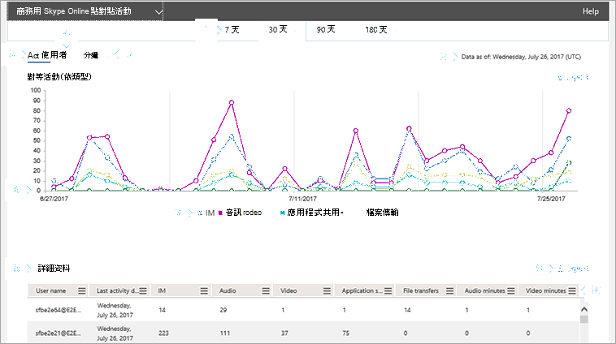

# 對等活動報告

新的 Office 365 [**報告**] 儀表板會在您組織中的 Office 365 產品上顯示活動概覽。 它可讓您深入瞭解個別的產品層級報告，讓您更精確地瞭解每個產品內的活動。 例如，您可以使用商務用**Skype 對等活動**報告來查看您的使用者使用的是 IM、音訊、影片、應用程式共用和傳送檔案的數量。 

查看[報表概覽](https://support.office.com/article/0d6dfb17-8582-4172-a9a9-aed798150263)。
  
此報告以及其他商務用 Skype 報告，提供您組織中活動的詳細資料。 當您調查、規劃及針對您的組織進行其他業務決策時，這些詳細資料非常有用。 
  
> [!NOTE]
> 當您以系統管理員身分登入 Microsoft 365 系統管理中心時，您可以看到所有商務用 Skype 報告。 
  
## 如何取得商務用 Skype 對等活動報告

1. 移至 [系統管理中心] > [**報告** > **使用方式**]。
    
2. 在 [**使用狀況**] 頁面上，在左側的 [**選取報告] 清單**中，選取 [**商務** > 用 Skype 對**等] 活動**。 或者，按一下 [**商務用 skype] 活動**小工具，然後按一下 [商務用**skype 活動**] 清單上的 [**商務用 skype**對等] 活動。

## 解讀商務用 Skype 對等活動報告

您可以透過查看 [**活動**]、[**使用者**] 和 [**紀要**] 圖表，來取得商務用 Skype 對等活動。
  

  
***
 針對過去7天、30天、90天或180天的趨勢，您可以查看**商務用 Skype 對等活動**報告。 不過，如果您在報表中按一下某個特定的日期，該表（請參閱編號7）將會顯示30天的資料，最多為產生報告的日期（請參閱編號2）。

> [!NOTE]
> 如果您按一下某一天的詳細資料，該表將只會顯示在產生報告時的日期，30天內的資料。

***
 每個報告都有產生此報告的日期。 報告通常會反映來自啟用時間的24到48小時延遲時間。 
***
 使用**活動**圖表上的互動式圖表資料來瞭解使用趨勢，以及查看貴組織中每個會話類型所保留的會話總數。 它會顯示您組織內的**IM**、**音訊**、**影片**、**應用程式共用**和檔案**傳輸**會話的總數和類型。 
***
 使用 [**使用者**] 圖表上的互動式圖表資料來瞭解使用趨勢，以及查看參與組織中的對等活動所需的唯一使用者數目。 它會顯示使用者總數，以及點對點工作階段中**IM**、**音訊**、**影片**、**應用程式共用**和檔案**傳輸**的類型。
***
 您可以在**分鐘數**圖表上使用互動式圖表資料來瞭解使用趨勢，並查看使用者使用音訊和影片執行對等活動時所使用的分鐘數。 它會顯示在點對點工作階段中使用之**音訊**和**影片**的總分鐘數。
***
 每個圖表都有 "X" （水準）和 "Y" （垂直）軸。 
*    在 [**活動**] 活動圖表上，Y 軸是您的使用者在組織中保留的 IM、音訊、影片、應用程式共用和傳輸檔案會話總數。
*    在 [**使用者**] 活動圖表上，Y 軸是保留 IM、音訊、影片、應用程式共用和傳送檔案會話的使用者總數。 
*    在 [**分鐘**] 活動圖表上，Y 軸是使用者在整個組織中使用音訊與視頻點對點工作階段所花費的總分鐘數。 

這兩個圖表的 X 軸都是此特定報表的已選取日期範圍。
***
 您可以按一下圖例中的專案，篩選您在圖表上看到的系列。 例如，在 [**活動**] 圖表中，按一下或敲擊 [ **IM**]、[**音訊**]、[**影片**]、[**應用程式共用**] 和 [檔案**傳輸**]，只會看到與每個檔案相關的資訊。 變更此選取範圍不會變更格線表格中的資訊。 
***
 下表顯示每個使用者對等活動的細目。 這會顯示已指派商務用 Skype 及其對等活動的所有使用者。 您可以在表格中新增額外的欄。
*    [**使用者名稱**] 是使用者的名稱。
*    [**已刪除**] 代表使用者的授權已被移除。     **注意：** 已刪除的使用者的活動只要在所選時段內的授權，就會顯示在報表中。 [**刪除**的資料] 欄可協助您注意，使用者可能已無法使用，但會參與報表中的資料。    
*    [**刪除日期**] 是指使用者的授權被移除的日期。 
*    [**上次活動日期（utc）** ] 是該使用者的最後一個活動日期（utc）。
*    **IM**會顯示使用者所使用的點對點工作階段總數。
*    [**音訊**]：顯示使用音訊的點對點工作階段總數。
*    [**影片**] 會顯示使用 [影片] 的點對點工作階段總數。
*    [**應用程式共用**] 會顯示對等應用程式共用會話的總數。
*    [檔案**傳輸**] 會顯示對等檔案傳輸會話的總數。
*    [**音訊分鐘**數] 會顯示在整個組織中所使用的音訊總時間。 
*    [**影片分鐘**數]：顯示在整個組織中使用的視頻總分鐘數。 

如果您組織的原則禁止您查看使用者資訊可識別的報告，您可以變更所有這些報告的隱私權設定。 請參閱系統[管理中心 [活動報告](https://support.office.com/article/0d6dfb17-8582-4172-a9a9-aed798150263)] 中的 [**如何隱藏使用者層級詳細資料？** ] 區段。 
***
 您也可以按一下或敲擊 [**匯出**]，將報告資料匯出至 Excel .csv 檔案。             ![商務用 Skype 報告 [匯出] 按鈕。](../images/de7e2ab7-d70c-422f-a0ec-178b10f7dd51.png) 這會匯出所有使用者的資料，並可讓您進行簡單的排序與篩選，以進行進一步分析。 如果您的使用者少於2000，您可以在報表本身的資料表中排序和篩選。 如果您有超過2000的使用者，若要篩選和排序，您必須匯出資料。
***
 ![商務用 Skype Online 報告 [管理] 按鈕。](../images/4c8f5387-cebb-4d6c-b7d3-05c954a2c234.png) 按一下或敲擊任何欄中的 [**欄**] 圖示，以新增或移除報告中的欄。         
   
## 想要查看其他商務用 Skype 報表嗎？

- [商務用 Skype 活動報告](activity-report.md)您可以查看使用者使用對等、組織的方式，以及參與會議會話的數量。
    
- [商務用 Skype 裝置使用方式報告](device-usage-report.md)您可以查看裝置，包括已安裝商務用 Skype 應用程式的 Windows 作業系統和行動裝置，以及用於 IM 和會議的行動裝置。
    
- [商務用 Skype 會議召集人活動報告](conference-organizer-activity-report.md)您可以查看您的使用者使用 IM、音訊/視頻、應用程式共用、Web、撥入/取出-協力廠商以及撥入/登出-Microsoft 來組織會議的數量。
    
- [商務用 Skype 會議參與者活動報告](conference-participant-activity-report.md)您可以查看有多少 IM、音訊/視頻、應用程式共用、網頁和撥入/撥出會議會議都在參與。
    
- [商務用 Skype 使用者封鎖報告](users-blocked-report.md)您可以看到貴組織中已封鎖進行 PSTN 通話的使用者。
    
- [商務用 SKYPE PSTN 使用方式報告](pstn-usage-report.md)您可以在輸入/撥出通話中看到所花費的分鐘數，以及這些通話的成本。
    
- [商務用 SKYPE PSTN 分鐘池報告](pstn-minute-pools-report.md)您可以查看貴組織內的當月所消耗的分鐘數。

- [商務用 Skype 會話詳細資料包表](session-details-report.md)您可以查看個別使用者的通話體驗的詳細資料。
    
## 相關主題
[系統管理中心的活動報告](https://support.office.com/article/0d6dfb17-8582-4172-a9a9-aed798150263)

  
 