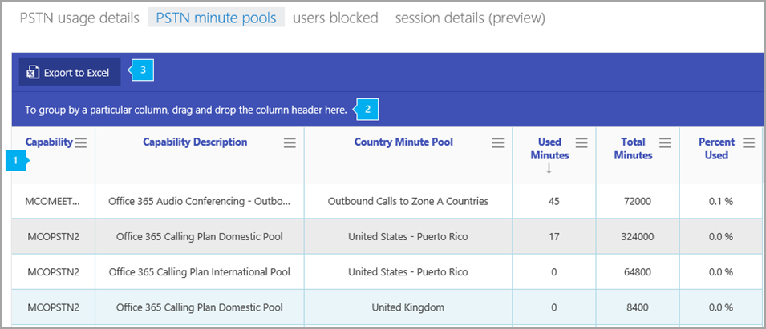

# PSTN 分鐘集區報告PSTN minute pools report

>[!NOTE]
>此報告僅供預覽客戶使用。This report is only available to preview customers.

新的商務用 Skype 系統管理中心**報告**區域會顯示您組織中的通話和音訊會議活動。The new Skype for Business Admin Center **Reports** area shows you calling and audio conferencing activity in your organization. 它可讓您深入探索報表，讓您更精確地瞭解每個使用者的活動。It enables you to drill into reports to give you more granular insight about the activities of each user. 例如，您可以使用商務用**SKYPE PSTN 分鐘池**報告來查看在您組織中的當月期間消耗的分鐘數。For example, you can use the **Skype for Business PSTN minute pools** report to see the number of minutes consumed during the current month within your organization.
  
查看[報表總覽](https://support.office.com/article/0d6dfb17-8582-4172-a9a9-aed798150263)以取得更多可用報表。Check out the [Reports overview](https://support.office.com/article/0d6dfb17-8582-4172-a9a9-aed798150263) for more reports that are available.
  
此報告以及其他商務用 Skype 報告，提供您組織中活動的詳細資料。This report, along with the other Skype for Business reports, gives you details on activity across your organization. 這些詳細資料在調查、規劃及針對組織進行其他業務決策時非常有用，以及設定[通訊點數](/microsoftteams/what-are-communications-credits)These details are very helpful when investigating, planning, and making other business decisions for your organization and for setting up [Communications Credits](/microsoftteams/what-are-communications-credits)
  
> [!NOTE]
> 當您以系統管理員身分登入 Microsoft 365 系統管理中心時，您可以看到所有商務用 Skype 報告。You can see all of the Skype for Business reports when you log on as an administrator to the Microsoft 365 admin center. 
  
## 如何取得商務用 Skype PSTN 分鐘池報告How to get to the Skype for Business PSTN minute pools report

 **使用商務用 Skype 系統管理中心** **Using the Skype for Business admin center**

- 移至系統管理中心 > 系統**管理中心** > **商務用 Skype 系統管理中心** > **報告** > **PSTN 分鐘池**。Go to the admin center > **Admin centers** > **Skype for Business admin center** > **Reports** > **PSTN minute pools**.
    
> [!NOTE]
> 視您所擁有的 Microsoft 365 或 Office 365 訂閱而定，您可能不會在這裡看到所有相同的詳細資料。Depending on the Microsoft 365 or Office 365 subscription you have, you might not see all the same details shown here. 
  
## 解讀商務用 Skype PSTN 分鐘池報告Interpret the Skype for Business PSTN minute pools report

您可以查看每個顯示的欄，以取得使用者的商務用 Skype 分鐘池。You can get a view into your user's Skype for Business minute pools by looking at each of the columns that are displayed.
  
這就是報表看起來的樣子。This is what the report looks like.
  
## 

  
***
 下表顯示的是依據授權（功能）和使用位置來細分分鐘數。The table shows you a breakdown of minute pools by license (capability) and usage location. 
*    **功能**是用於通話的授權/服務方案。**Capability** is the license/service plan used for the call. 您可能會在此報告中看到的授權/服務方案包括：The license/service plans you may see in this report include:
     * MCOPSTN1-國內通話方案（3000-每分鐘美國/1200-1 分鐘歐盟方案MCOPSTN1 - Domestic Calling Plan (3000-minute US/1200-minute EU plans
     * MCOPSTN2-國內 & 國際通話方案，您可以在此查看國內的泳池（3000-minute/加拿大/PR，1200-minute 歐洲國家/地區）和國際泳池（600-分鐘）。MCOPSTN2 - Domestic & International Calling Plan from which you will see a domestic pool (3000-minute US/Canada/PR, 1200-minute European countries) and an international pool (600-minutes). 只要在行事曆月份內達到國內或國際 cap，就會達到分鐘帽。Minute cap is reached whenever the domestic -OR- international cap is reached within the calendar month. 
     * MCOPSTN5-國內通話方案（120分鐘通話方案）MCOPSTN5 - Domestic Calling Plan (120-minute calling plan)
     * MCOPSTN6-國內通話方案（240分鐘通話方案）MCOPSTN6 - Domestic Calling Plan (240-minute calling plan)
     * MCOMEETADD-音訊會議MCOMEETADD - Audio Conferencing
*    [**功能描述**] 是通話使用之授權類型的描述。**Capability Description** is a description of the license type utilized for the call.
*    [**國家/分鐘] 池**是共用分鐘池之使用者的授權使用位置。**Country Minute Pool** is the license usage location of the user(s) who share the minute pool. 
*    [已**使用的分鐘**數] 是每個月所使用的分鐘數。**Used Minutes** is the number of minutes used each month.
*    [**總分鐘**數] 是指月份中可用的總分鐘數。**Total Minutes** is the total number of minutes available for the month. 
*    [已**使用百分比**] 是該月份所用的分鐘數百分比。**Percent Used** is the percent of minutes used for the month. 
***
 按一下以將欄拖曳至依據特定欄進行分組，如果您想要建立一個將一或多個欄中的所有資料組成群組的視圖 **，請在這裡拖曳欄標題**。Click to drag a column to **To group by a particular column, drag and drop the column header here** if you want to create a view that groups all of the data in one or more columns. 
***
 您也可以按一下或敲擊 [**匯出至 excel** ] 按鈕，將報告資料匯出至 Excel .csv 檔案。You can also export the report data into an Excel .csv file, by clicking or tapping the **Export to Excel** button.    這會匯出所有使用者的資料，並可讓您進行簡單的排序與篩選，以進行進一步分析。This exports data of all users and enables you to do simple sorting and filtering for further analysis. 如果您的使用者少於2000個，您可以在報表本身的資料表中排序和篩選。If you have fewer than 2000 users, you can sort and filter within the table in the report itself. 如果您有超過2000的使用者，若要篩選和排序，您必須匯出資料。If you have more than 2000 users, in order to filter and sort, you will need to export the data.
   
## 想要查看其他商務用 Skype 報表嗎？Want to see other Skype for Business reports?

- [商務用 Skype 活動報告](activity-report.md)您可以查看使用者使用對等、組織的方式，以及參與會議會話的數量。[Skype for Business activity report](activity-report.md) You can see how much your users are using peer-to-peer, organized, and participated in conferencing sessions.
    
- [商務用 Skype 裝置使用方式報告](device-usage-report.md)您可以查看裝置，包括已安裝商務用 Skype 應用程式的 Windows 作業系統和行動裝置，以及用於 IM 和會議的行動裝置。[Skype for Business device usage report](device-usage-report.md) You can to see the devices including Windows-based operating systems and mobile devices that have the Skype for Business app installed and are using it for IM and meetings.
    
- [商務用 Skype 會議召集人活動報告](conference-organizer-activity-report.md)您可以查看您的使用者使用 IM、音訊/視頻、應用程式共用、Web、/dial out-協力廠商及/dial 的方式來組織會議的數量。[Skype for Business conference organizer activity report](conference-organizer-activity-report.md) You can see how much your users are organizing conferences that use IM, audio/video, application sharing, Web, /dial out - 3rd party, and /dial out - Microsoft.
    
- [商務用 Skype 會議參與者活動報告](conference-participant-activity-report.md)您可以查看有多少 IM、音訊/視頻、應用程式共用、網頁和撥出音訊會議都在參與。[Skype for Business conference participant activity report](conference-participant-activity-report.md) You can see how many IM, audio/video, application sharing, Web and dial out audio conferences are being participated in.
    
- [商務用 Skype 對等活動報告](peer-to-peer-activity-report.md)您可以查看您的使用者使用 IM、音訊/視頻、應用程式共用和傳送檔案的數量。[Skype for Business peer-to-peer activity report](peer-to-peer-activity-report.md) You can see how much your users are using IM, audio/video, application sharing and transferring files.
    
- [商務用 Skype 使用者封鎖報告](users-blocked-report.md)您可以看到貴組織中已封鎖進行 PSTN 通話的使用者。[Skype for Business users blocked report](users-blocked-report.md) You can see the users in your organization that have been blocked from making PSTN calls.

- [商務用 Skype 會話詳細資料包表](session-details-report.md)您可以查看個別使用者的通話體驗的詳細資料。[Skype for Business session details report](session-details-report.md) You can see details about individual user's call experiences.
    
## 相關主題Related topics
[系統管理中心的活動報告Activity Reports in the admin center](https://support.office.com/article/0d6dfb17-8582-4172-a9a9-aed798150263)

  
   
