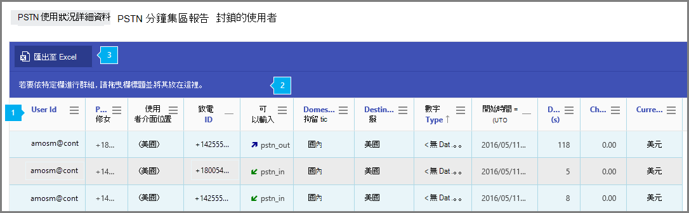

# PSTN 使用報告

[!INCLUDE [sfbo-retirement](../../Hub/includes/sfbo-retirement.md)]

新的系統管理商務用 Skype **報告** 區域會顯示貴組織的通話和音訊會議活動。 它可讓您深入瞭解報表，以進一步深入瞭解每個使用者的活動。 例如，您可以使用 **PSTN** 商務用 Skype詳細資料包表，查看用於輸入/外接通話的分鐘數，以及這些通話的成本。 您可以查看音訊會議 PSTN 使用方式詳細資料，包括通話費用，以便了解您的使用量和通話帳單詳細資料，以判斷貴組織的使用量。
  
請查看報告 [概觀以](https://support.office.com/article/0d6dfb17-8582-4172-a9a9-aed798150263) 查看更多可用的報告。
  
此報告與其他 商務用 Skype報告一起，提供您活動的詳細資訊，包括整個組織的通話使用量。 當您調查、規劃及為貴組織做出其他商務決策，以及設定通訊信用額度時，這些詳細資料非常 [實用](/microsoftteams/what-are-communications-credits)。
  
> [!NOTE]
> 當您以系統管理員的商務用 Skype登入時，可以看到所有Microsoft 365 系統管理中心。 
  
## 如何取得 PSTN 商務用 Skype詳細資料包告

 **使用商務用 Skype 系統管理中心**

- 請前往系統管理中心>系統管理商務用 Skype ****  >    >  **報告**  >  **PSTN 使用方式詳細資料**。
    
    > [!NOTE]
    > 視您Microsoft 365訂閱Office 365，您可能不會看到此處顯示的所有產品與報表。
  
## 解譯商務用 Skype PSTN 使用方式報告

您可以查看顯示的每一欄，商務用 Skype查看使用者的 PSTN 使用狀況。
  
這就是報表的外觀。
  

***
 下表顯示每個使用者所有 PSTN 使用量的明細。 這會顯示已指派商務用 Skype的所有使用者及其 PSTN 使用量。 您可以在表格中新增/移除欄。
*    **通話識別碼** 是通話的通話識別碼。 這是呼叫 Microsoft 服務支援時所使用的通話識別碼。
*    **使用者識別碼** 是使用者的登錄名稱。
*    **電話號碼** 是商務用 Skype來電的電話號碼，或撥出電話撥打的電話號碼。
*    **使用者位置** 是使用者所在的國家/地區。
*    來電 **顯示是** 來電者的電話號碼 (來電) 號碼、來電的起始號碼，或來電發自的 商務用 Skype 號碼。
*    **通話類型** 是通話是 PSTN 撥出或來電，以及通話類型，例如使用者撥打的通話或音訊會議。 您可能會看到的通話類型為： 

     **通話方案通話類型** 
     *    **user_in (** 使用者收到傳入 PSTN 通話)  
     *    **user_out (** 使用者撥打了外寄 PSTN)  
     *    **user_out_conf (** 新增 2 或多個 PSTN 參與者到通話中，例如 3 路電話會議)  
     *    **user_out_transfer (** 將通話轉接到 PSTN 號碼)  
     *    **user_out_forwarding (** 將通話轉往 PSTN 號碼) 

     **音訊會議通話類型**
     *    **conf_in (** 音訊會議橋接器的輸入) 。 針對此通話類型的記錄，在使用者 **識別碼** 欄中指定的使用者會對應到會議的召集人。
     *    **conf_out (** 音訊會議橋接器撥打外線電話，通常是將 PSTN 號碼新加到會議) 。 針對此通話類型的記錄，在使用者 **識別碼** 欄中指定的使用者會對應到會議的召集人。

     **UCAP (統一通訊應用程式)** 
     *    **ucap_in (** 傳入 PSTN 通話至 UC 應用程式，例如自動電話機或通話佇列)  
     *    **ucap_out (** UC 應用程式撥打出站 PSTN 通話，例如自動電話機或通話佇列) 
         > [!NOTE]
         > 從 UC 應用程式傳輸給使用者的通話 ，例如自動語音機或通話佇列，不會出現在 PSTN 使用方式報告中，因為這些通話支線是對等 (P2P) 音訊通話。 您可以在 商務用 Skype 系統管理中心的 「工具 > 商務用 Skype 通話分析」下存取 P2P 通話，並依據使用者名稱或 SIP 位址搜尋，以日期/時間與/或原始 CLID (通話線路識別碼) 關聯。 

     根據使用者的位置，國內 **/** 國際會告訴您所撥打的來電是否被視為國家/地區 (國內) 或國際 (國家/地區) 以外的國家/地區。 
*    **已撥號的** 目的地是撥打的國家/地區目的地名稱，例如法國、德國或美國 (美國) 。 
*    **號碼** 類型是使用者電話號碼、服務或免付費號碼的電話號碼類型。  
*    **UTC (開始時間)** 是通話開始或撥打的時間。 
*    **持續時間** 是通話已連接多久。  
*    **ConfID** 是音訊會議的會議 ID。 
*    **費用** 是向您的帳戶收取的金額或通話費用。 
*    **貨幣** 是用來計算通話成本的貨幣類型。 
*    **功能** 是通話所使用的授權。 您可能會看到以下授權類型： 
     *    **MCOPSTNPP** - Communications Credits   **MCOPSTN1** - 國內通話方案 (3000 分鐘美國 / 1200 分鐘的歐盟方案)  
     *    **MCOPSTN2** - 國際通話方案 
     *    **MCOPSTN5** - 國內通話方案 (120 分鐘的通話方案)  
     *    **MCOPSTN6** - 國內通話方案 (240 分鐘通話方案) 注意：有限可用性
     *    **MCOMEETADD** - 音訊會議
     *    **MCOMEETACPEA** - 每分鐘付費音訊會議
     
> [!NOTE]
> 如果您想要執行報表，只包含通話或會議訂閱中不包含的每分鐘付費通話，請篩選具有 「MCOPSTNPP」功能的報告。 這麼做會提供每分鐘通話的所有付費專案。  針對每分鐘付費音訊會議，請以「MCOMEETACPEA」而非「MCOPSTNPP」來篩選。  

> [!NOTE]
> 您可能也會在某些欄位中看到「無資料」。 「無資料」表示該欄位不適用於通話類型或功能。 

> [!NOTE]
> 如果您有 Telstra 或 Softbank 通話方案，將不會在 PSTN 使用方式報告中看到任何通話詳細資料記錄。 如需您的報告需求，請聯絡 Telstra 或 Softbank。 
***
 若要將欄拖曳到按特定欄分組，如果您想要建立將一或多個資料行中所有資料組成群組的視圖，請在這裡拖放欄標題。
 ***

## 匯出 PSTN 使用方式報告

按一下或點選 **[匯出** 至Excel按鈕可讓您下載 PSTN 使用方式報告。 除非特定國家/地區法規禁止保留資料 12 個月，否則您最多可以從目前日期匯出資料一年。

這會匯出所有使用者的資料，並可讓您執行簡單的排序和篩選，以便進一步分析。

匯出程式可能需要幾秒鐘到幾分鐘才能完成，視資料量而不同。 當伺服器完成匯出時，您會收到名為「**通話.匯出」的 zip 檔案 `identifier` 。.zip，** 識別碼是匯出的唯一識別碼，可用於疑難排解。

如果您同時擁有通話方案與直接路由，匯出的檔案可能包含這兩種產品的資料。 PSTN 使用方式報告檔案將會有檔案名 「**PSTN.calls.] `UTC date`.csv"。** 除了 PSTN 和直接路由檔案之外，該parameters.js包含檔案 **"on"，** 其中選取的匯出時間範圍和功能 (任何) 。

匯出的檔案是 CSV (分隔值) ，符合 [RFC 4180](https://tools.ietf.org/html/rfc4180) 標準。 檔案可以在任何符合Excel編輯器中開啟，而不需要任何轉換。

CSV 的第一列包含欄名稱。

### 匯出中的欄位

匯出的檔案包含線上報告中沒有的其他欄位。 這些可用於疑難排解和自動化工作流程。

> [!div class="has-no-wrap"]  
> | #  | 名稱 | [資料類型 (SQL Server) ](/sql/t-sql/data-types/data-types-transact-sql) | 說明 |
> | :-: | :-: | :-: |:------------------- |
> | 0 | UsageId | `uniqueidentifier` | 唯一通話識別碼 |
> | 1 | 通話識別碼 | `nvarchar(64)` | 通話識別碼。 不保證是唯一的 |
> | 2 | 會議 ID | `nvarchar(64)` | 音訊會議的識別碼 |
> | 3 | 使用者位置 | `nvarchar(2)` | 使用者的國家/地區代碼 [，ISO 3166-1 Alpha-2](https://en.wikipedia.org/wiki/ISO_3166-1_alpha-2) |
> | 4 | AAD ObjectId | `uniqueidentifier` | 在 Azure Active Directory 中Azure Active Directory。  此及其他使用者資訊在 bot 通話類型中為 null/empty， (ucap_in ucap_out)  |
> | 5 | Upn | `nvarchar(128)` | UserPrincipalName (在) 中Azure Active Directory。 這通常與使用者的 SIP 位址相同，而且可以與使用者的電子郵件地址相同 |
> | 6 | 使用者顯示名稱 | `nvarchar(128)` | 顯示使用者名稱 |
> | 7 | 來電顯示 | `nvarchar(128)` | 接聽來電的號碼或撥出電話的號碼。 [E.164](https://en.wikipedia.org/wiki/E.164) 格式 |
> | 8 | 通話類型 | `nvarchar(32)` | 通話是 PSTN 外寄或輸入通話，以及通話類型，例如使用者撥打的通話或音訊會議 |
> | 9 | 數位類型 | `nvarchar(16)` | 使用者的電話號碼類型，例如免付費號碼的服務 |
> | 10 | 國內/國際 | `nvarchar(16)` | 通話是國內通話 (國家/地區) 或 (國家/地區) 根據使用者的位置撥打國際電話 |
> | 11 | 已撥入目的地 | `nvarchar(64)` | 已撥打的國家/地區 |
> | 12 | 目的地號碼 | `nvarchar(32)` | 以 [E.164 格式](https://en.wikipedia.org/wiki/E.164) 撥打的號碼 |
> | 13 | 開始時間 | `datetimeoffset` | 通話開始時間 ([UTC、ISO 8601](https://en.wikipedia.org/wiki/ISO_8601))  |
> | 14 | 結束時間 | `datetimeoffset` | 通話結束時間 ([UTC、ISO 8601](https://en.wikipedia.org/wiki/ISO_8601))  |
> | 15 | 持續時間秒數 | `int` | 通話已連接多久 |
> | 16 | 連線費用 | `numeric(16, 2)` | 連線費用價格 |
> | 17 | 負責 | `numeric(16, 2)` | 向您的帳戶收取的金額或通話費用 |
> | 18 | 貨幣 | `nvarchar(3)` | 用來計算 ISO [4217 (通話費用的貨幣](https://en.wikipedia.org/wiki/ISO_4217))  |
> | 19 | 功能 | `nvarchar(32)` | 通話使用授權 |

    
## 想要查看其他商務用 Skype報表？

- [商務用 Skype活動報告](activity-report.md)您可以查看使用者使用對等、組織及參與會議會話的多少。
    
- [商務用 Skype裝置使用方式報告](device-usage-report.md)您可以查看裝置，包括Windows型作業系統，以及已安裝應用程式商務用 Skype且用於 IM 和會議的行動裝置。
    
- [商務用 Skype會議召集人活動報告](conference-organizer-activity-report.md)您可以查看使用者組織使用 IM、音訊/視像、應用程式共用、Web、/dial out - 協力廠商和 /dial out - Microsoft 的會議。
    
- [商務用 Skype會議參與者活動報告](conference-participant-activity-report.md)您可以查看有多少 IM、音訊/視像、應用程式共用、Web 和撥出音訊會議參與。
    
- [商務用 Skype對等活動報表](peer-to-peer-activity-report.md)您可以瞭解使用者正在使用 IM、音訊/視像、應用程式共用和傳輸檔案。
    
- [商務用 Skype使用者封鎖報表](users-blocked-report.md)您可以看見貴組織中遭到封鎖的使用者，無法撥打 PSTN 通話。

- [商務用 Skype PSTN 分鐘](pstn-minute-pools-report.md)數庫報表，您可以查看組織內當月使用的分鐘數。

- [商務用 Skype會話詳細資料包表](session-details-report.md)您可以查看個別使用者的通話體驗詳細資料。
    
## 相關主題
[系統管理中心的活動報告](https://support.office.com/article/0d6dfb17-8582-4172-a9a9-aed798150263)
  
  
