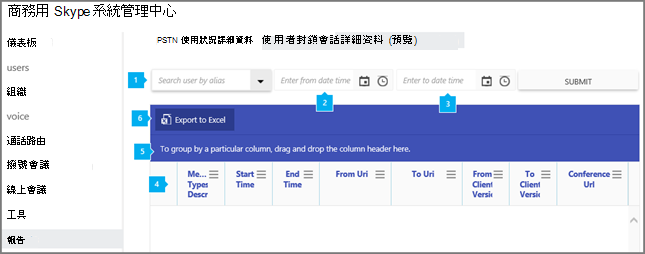

# 工作階段詳細資報告Session details report

[!INCLUDE [sfbo-retirement](../../Hub/includes/sfbo-retirement.md)]

報表 **儀表板** 會顯示您組織中所有Microsoft 365 Office 365活動概觀。The **Reports** dashboard shows you the activity overview across the Microsoft 365 or Office 365 products in your organization. 它可讓您深入查看個別的產品層級報告，以進一步深入瞭解每個產品內的活動。It enables you to drill in to individual product level reports to give you more granular insight about the activities within each product. 例如，您可以使用 商務用 Skype **會話詳細資料** 報表來查看個別使用者的通話體驗詳細資料。For example, you can use the **Skype for Business Session details** report to see details about individual user's call experiences.
  
請查看 [報告概觀](https://support.office.com/article/0d6dfb17-8582-4172-a9a9-aed798150263) 以查看更多可用報表。Check out [Reports overview](https://support.office.com/article/0d6dfb17-8582-4172-a9a9-aed798150263) for more reports that are available.
  
此報告與其他報告商務用 Skype提供您活動的詳細資訊，包括整個組織的會話詳細資料。This report, along with the other Skype for Business reports give you details on activity including session details across your organization. 當您調查、規劃及為貴組織做出其他商務決策，以及設定通訊信用額度時，這些詳細資料非常 [實用](/microsoftteams/what-are-communications-credits)。These details are very helpful when you investigating, planning, and making other business decisions for your organization and for setting up [Communications Credits](/microsoftteams/what-are-communications-credits).
  
> [!NOTE]
> 當您以系統管理員商務用 Skype登入系統管理中心時，Microsoft 365報告。You can see all of the Skype for Business reports when you log on as an administrator to the Microsoft 365 admin center. 
  
## 如何取得會話詳細商務用 Skype報表How to get to the Skype for Business Session details report

1. 前往系統管理中心> **報告**Go to the admin center > **Reports**
    
2. 從 **左側** 功能表選取 [報表，然後按一下 [ **使用方式**> 。Select **Reports** from the left menu, and then click **Usage**.
    
3. 在 [選取報表 **商務用 Skype\*\*\*\*清單中，按一下 [會話詳細資料**> 。In the list under **Select a report**, click **Skype for Business Session details**.
    
    > [!TIP]
    > 如果您未列出此報表，請前往系統管理商務用 Skype \*\*\*\*  >  **報告**  >  **會話詳細資料**。If you don't see this report listed, go to **Skype for Business admin center** > **Reports** > **Session details**. 
  
    > [!IMPORTANT]
    > 視您Microsoft 365訂閱Office 365，您可能不會看到此處顯示的所有產品與報表。Depending on the Microsoft 365 or Office 365 subscription you have, you might not see all the products and reports that are shown here. 
  
## 解譯商務用 Skype會話詳細資料包表Interpret the Skype for Business Session details report

您可以查看顯示的每一欄，商務用 Skype查看使用者的會話詳細資料。You can get a view into your user's Skype for Business session details by looking at each of the columns that are displayed.
  
這就是報表的外觀。This is what the report looks like.
  

  
***
 **使用別名搜尋** 使用者可讓您搜尋單一使用者，並顯示下表中該使用者的所有會話詳細資料。**Search user by alias** lets you search for a single user and displays all of the user's session details in the table below. 
***
 **輸入開始日期可讓您** 輸入開始日期。**Enter from date time** lets you put in the start date. 您可以使用日曆來選取日期，或手動輸入日期。You can use the calendar to select the date or enter the date manually. 此欄位必須填上。This field must be populated.
***
 **輸入至日期時間** 可讓您輸入結束日期。**Enter to date time** lets you put in the end date. 您可以使用日曆來選取日期，或手動輸入日期。You can use the calendar to select the date or enter the date manually. 如果未設定結束日期，預設值為開始日期起 30 天。If no end date is set, the default is 30 days from the start date.
***
 表格會顯示每個使用者所有會話詳細資料明細。The table shows you a breakdown of the all session details per user. 這會顯示已指派商務用 Skype使用者及其會話資訊。This shows all users that have Skype for Business assigned to them and their session information. 您可以在表格中新增/移除欄。You can add/remove columns to the table.   每個會話的表格都有下列欄：The table has the following columns for each session:
*    **對話方塊識別碼** 是 SIP 會話唯一識別碼的識別碼。**Dialog ID** is the ID for unique identifier of the SIP session.
*    **媒體類型描述** 描述會話是電話會議或 P2P 會話，以及音訊/視 (/應用程式共用) 。**Media types description** describes whether the session is a conference call or a P2P session and the type of media used (Audio/Video/Application Sharing).
*    **開始時間** 是會話開始的時間。**Start time** is the time when the session started.
*    **結束時間** 是會話結束的時間。**End time** is  the time when the session ended.
*    從 URI 是啟動會話的使用者或服務的 **URI。****From URI** is the URI of the user or service that initiated the session. 如果使用者從 PSTN 電話啟動會話，則可能是空白。May be blank if the user initiated the session from a PSTN phone.
*    **To URI** 是使用者或服務的 URI，是會話初始的目標。**To URI** is the URI of the user or service that was the target of the session initiation. 在會議的情況下，這是召集人的 URI。In the case of the conference, this is the organizer's URI. 如果會話的目標是 PSTN 電話號碼，則可能是空白。May be blank if the target of the session was a PSTN phone number.
*    **從用戶端版本** 會告訴您啟動會話的使用者或服務所使用的使用者代理程式及用戶端版本。**From client version** tells you the User Agent and version of the client used by the user or service that initiated the session.
*    **至用戶端版本** 會告訴您使用者代理程式，以及會話初始目標之使用者或服務所使用的用戶端版本。**To client version** tells you the User Agent and version of the client used by the user or service that was the target of the session initiation.
*    **會議 URL** 是會議的 SIP URL，如果會話是電話會議。**Conference URL** is the SIP URL for the conference, if the session was a conference call. 同一個電話會議中的所有使用者都會有相同的會議 URL。All users in the same conference call will have the same Conference URL. 
*    **從 Tel 號碼** 是會話目標的電話號碼 ，如果適用的話。**From Tel number** is the telephone number that was the target of the session, if applicable. 電話號碼的最後一位數可能會取代為 'x'，以保護使用者隱私權。The last digits of the phone number may be replaced with 'x' to protect user privacy.
*    **到 Tel number** 是會話目標的電話號碼 ，如果適用的話。**To Tel number** is the telephone number that was the target of the session, if applicable. 電話號碼的最後一位數可能會取代為 'x'，以保護使用者隱私權。The last digits of the phone number may be replaced with 'x' to protect user privacy.
*    **From 端點識別碼** 是 From 使用者所使用端點的唯一 GUID。**From Endpoint Id** is a unique GUID of the endpoint used by the From user. 用來識別使用者是否要從同一個端點傳達多個會話。Used to identify whether user is communicating multiple sessions from same endpoint. 如果使用者使用 PSTN 電話，或會話是由服務啟動，則可能是空白。May be blank if user is using a PSTN phone or if the session was initiated from a service.
*    **To 端點識別碼** 是 To 使用者所使用端點的唯一 GUID。**To Endpoint Id** is a unique GUID of the endpoint used by the To user. 用來識別使用者是否要從同一個端點傳達多個會話。Used to identify whether user is communicating multiple sessions from same endpoint. 如果使用者使用 PSTN 電話、從服務啟動會話，或會話無法建立，則可能是空白。May be blank if user is using a PSTN phone, if the session was initiated from a service, or a session failed to establish.
*    **Conf Instance** 是使用會議 URL 的會議實例的唯一 GUID。**Conf Instance** is a unique GUID for the instance of the conference using the Conference URL. 週期性會議會具有相同的會議 URL，但會議的每個實例都會有 Conf Instance 的差異。Recurring meetings will have the same Conference URL, but each instance of the meeting will have a difference Conf Instance.
*    代表 URI 是代表會話建立之委派者之 **URI。****On Behalf Of URI** is the URI of the delegator on whose behalf the session is being established.   URI 是指引用會話建立的使用者 **URI。****Referred By URI** is the URI of the user who referred the establishment of a session.
*    **回應代碼** 是建立會話的 SIP 回應程式碼，指出會話是否成功建立。**Response Code** is the SIP response code for the establishment of the session that indicates if the session was successfully established.

針對每個會話，有一個子資料工作表，根據案例提供不同的資料。For each session, there is a sub table with different data available depending on the scenario. 下列列出子資料工作表中適用于從和到使用者或服務之索引點。The following lists the tabs available in the sub table for the From and To user or services.
*    會話選項卡會顯示有關電腦和作業系統的資料。SESSION tab shows data about the machines and operating systems.
*    MEDIALINES 選項卡會顯示網路連接資訊和裝置資訊。MEDIALINES tab shows network connectivity information and device information.
*    AUDIOSTREAMS Tab 會顯示會話所涉及音訊流的網路績效資料。AUDIOSTREAMS tab shows network performance data about the audio streams involved in session.
*    AUDIOCLIENTEVENTS Tab 會顯示用戶端偵測到影響音訊體驗之問題的資料。AUDIOCLIENTEVENTS tab shows data about client detected issues impacting the audio experience.
*    AUDIOSIGNALS Tab 會顯示會話的音訊訊號處理資料。AUDIOSIGNALS tab shows data about the audio signal processing for the session.
*    APPSHARINGSTREAMS Tab 會顯示會話所涉及之應用程式共用或桌面共用流的網路績效資料。APPSHARINGSTREAMS tab shows network performance data about the application sharing or desktop sharing streams involved in session.
*    VIDEOCLIENTEVENTS Tab 會顯示用戶端偵測到影響視訊體驗之問題的資料。VIDEOCLIENTEVENTS tab shows data about client detected issues impacting the video experience.
*    VIDEOSTREAMS Tab 會顯示會話所涉及視音訊流的網路績效資料。VIDEOSTREAMS tab shows network performance data about the video streams involved in session.
*    TRACEROUTES Tab 會顯示會話期間透過 traceroute 收集的網路躍點。TRACEROUTES tab shows the network hops collected via traceroute during the session. 會話使用的實際媒體路徑可能會有所不同，而且只有在會話中有音訊時，才能使用這些資料。The actual media path used for the session may vary and this data is only available when there is audio in the session.
*    FEEDBACKREPORTS Tab 會顯示會話中使用者提供的任何通話問卷結束資料。FEEDBACKREPORTS tab shows any end of call survey data provided by the users in the session.
***
 若要將欄拖曳到按特定欄分組，如果您想要建立將一或多個資料行中所有資料組成群組的視圖，請在這裡拖放欄標題。Click to drag a column to **To group by a particular column, drag and drop the column header here** if you want to create a view that groups all of the data in one or more columns. 
***
 您也可以按一下或點選 Excel .csv匯出至 **Excel檔案。**You can also export the report data into an Excel .csv file, by clicking or tapping the **Export to Excel** button.    這會匯出所有使用者的資料，並可讓您執行簡單的排序和篩選，以便進一步分析。This exports data of all users and enables you to do simple sorting and filtering for further analysis. 如果您的使用者少於 2000 人，您可以在報表本身的表格內排序和篩選。If you have less than 2000 users, you can sort and filter within the table in the report itself. 如果您有超過 2000 個使用者，若要篩選和排序，您必須匯出資料。If you have more than 2000 users, in order to filter and sort, you will need to export the data.  
   
## 想要查看其他商務用 Skype報表？Want to see other Skype for Business reports?

- [商務用 Skype活動報告](activity-report.md)您可以瞭解使用者使用對等、組織及參與會議會話的多少。[Skype for Business activity report](activity-report.md) You can see how much your users are using peer-to-peer, organized, and participated in conferencing sessions.
    
- [商務用 Skype裝置使用方式報告](device-usage-report.md)您可以查看裝置，包括Windows型作業系統，以及已安裝應用程式商務用 Skype且用於 IM 和會議的行動裝置。[Skype for Business device usage report](device-usage-report.md) You can to see the devices including Windows-based operating systems and mobile devices that have the Skype for Business app installed and are using it for IM and meetings.
    
- [商務用 Skype會議召集人活動報告](conference-organizer-activity-report.md)您可以查看使用者組織使用 IM、音訊/視像、應用程式共用、Web、撥入/撥出 - 協力廠商和撥入/撥出 - Microsoft 的會議。[Skype for Business conference organizer activity report](conference-organizer-activity-report.md) You can see how much your users are organizing conferences that use IM, audio/video, application sharing, Web, dial-in/out - 3rd party, and dial-in/out - Microsoft.
    
- [商務用 Skype參與者活動報告](conference-participant-activity-report.md)您可以查看有多少 IM、音訊/視音訊、應用程式共用、Web 和撥入/撥出會議會議參與。[Skype for Business conference participant activity report](conference-participant-activity-report.md) You can see how many IM, audio/video, application sharing, Web and dial-in/out conferencing conferences are being participated in.
    
- [商務用 Skype對等活動報表](peer-to-peer-activity-report.md)您可以瞭解使用者正在使用 IM、音訊/視像、應用程式共用和傳輸檔案。[Skype for Business peer-to-peer activity report](peer-to-peer-activity-report.md) You can see how much your users are using IM, audio/video, application sharing and transferring files.
    
- [商務用 Skype PSTN 使用方式報告](pstn-usage-report.md)您可以看見用於內/外通話的分鐘數，以及這些通話的成本。[Skype for Business PSTN usage report](pstn-usage-report.md) You can see the number of minutes spent in inbound/outbound calls and cost for these calls.

- [商務用 Skype使用者封鎖報表](users-blocked-report.md)您可以看見貴組織中已禁止進行 PSTN 通話的使用者。[Skype for Business users blocked report](users-blocked-report.md) You can see the users in your organization that have been blocked from making PSTN calls.

- [商務用 Skype PSTN 分鐘](pstn-minute-pools-report.md)數庫報表，您可以查看貴組織內當月所耗用分鐘數。[Skype for Business PSTN minute pools report](pstn-minute-pools-report.md) you can see the number of minutes consumed during the current month within your organization.
    
## 相關主題Related topics
[系統管理中心的活動報告Activity Reports in the admin center](https://support.office.com/article/0d6dfb17-8582-4172-a9a9-aed798150263)

  
 
