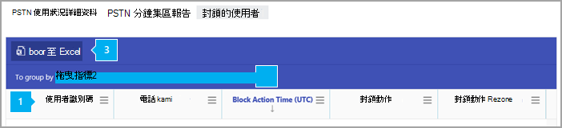

# 使用者封鎖報告

[!INCLUDE [sfbo-retirement](../../Hub/includes/sfbo-retirement.md)]

新的 商務用 Skype **報表** 儀表板會顯示您組織中商務用 Skype活動概觀。 它可讓您深入查看個別的產品層級報告，以進一步深入瞭解每個產品內的活動。 例如，您可以使用使用者封鎖商務用 Skype，查看貴組織中已封鎖的使用者進行 PSTN 通話。 此報告與其他 商務用 Skype報告一起，提供您活動的詳細資訊，包括整個組織的 PSTN 使用方式。
  
 請查看報告 [概觀以](https://support.office.com/article/0d6dfb17-8582-4172-a9a9-aed798150263) 查看更多可用的報告。
  
> [!NOTE]
> 當您以系統管理員商務用 Skype時，可以看到所有Microsoft 365 系統管理中心。 
  
## 如何取得使用者商務用 Skype的報告

 **使用商務用 Skype 系統管理中心**

- 前往系統管理中心>**系統管理商務用 Skype**  >    >  **報告**  >  **使用者已封鎖。**
    
## 解譯商務用 Skype封鎖的報告

您可以查看顯示的每一欄，以取得封鎖使用者的視圖。
  
這就是報表的外觀。 
  

下表顯示所有禁止撥打電話的使用者明細。 這會顯示已指派電話系統音訊會議的所有使用者。 您可以在表格中新增/移除欄。
***

*   **使用者識別碼** 是使用者的登錄。
*   **電話數位** 是指派給使用者的號碼。 
*   **[封鎖動作時間** (UTC) 使用者被封鎖進行通話的時間。
*   **封鎖動作** 是封鎖使用者的動作類型。
*   **封鎖動作原因** 是使用者被封鎖撥打電話的原因。
***
 
若要將欄拖曳到按特定欄分組，如果您想要建立將一或多個資料行中所有資料組成群組的視圖，請在這裡拖放欄標題。
***
 
您也可以按一下或點選匯出至Excel .csv，將報表資料匯出至 **Excel檔案。**

這會匯出所有使用者的資料，並可讓您執行簡單的排序和篩選，以便進一步分析。 如果您的使用者少於 2000 人，您可以在報表本身的表格內排序和篩選。 如果您有超過 2000 個使用者，若要篩選和排序，您必須匯出資料。
***

## 想要查看其他商務用 Skype報表？

- [商務用 Skype活動報告](activity-report.md)您可以瞭解使用者使用對等、組織及參與會議會話的多少。
    
- [商務用 Skype裝置使用方式報告](device-usage-report.md)您可以查看裝置，包括Windows型作業系統，以及已安裝應用程式商務用 Skype且用於 IM 和會議的行動裝置。
    
- [商務用 Skype會議召集人活動報告](conference-organizer-activity-report.md)您可以查看使用者組織使用 IM、音訊/視像、應用程式共用、Web、撥入/撥出 - 協力廠商和撥入/撥出 - Microsoft 的會議。
    
- [商務用 Skype會議參與者活動報告](conference-participant-activity-report.md)您可以查看有多少 IM、音訊/視音訊、應用程式共用、Web 和撥入/撥出會議會議參與。
    
- [商務用 Skype對等活動報表](peer-to-peer-activity-report.md)您可以瞭解使用者正在使用 IM、音訊/視像、應用程式共用和傳輸檔案。
    
- [商務用 Skype PSTN 使用方式報告](pstn-usage-report.md)您可以看見用於內/外通話的分鐘數，以及這些通話的成本。

- [商務用 Skype PSTN 分鐘](pstn-minute-pools-report.md)數庫報告，您可以查看貴組織內當月使用的分鐘數。

- [商務用 Skype會話詳細資料包表](session-details-report.md)您可以查看個別使用者的通話體驗詳細資料。
   
## 相關主題
[系統管理中心的活動報告](https://support.office.com/article/0d6dfb17-8582-4172-a9a9-aed798150263)

  
 
