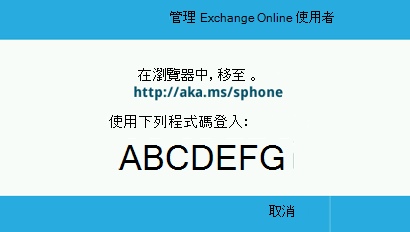
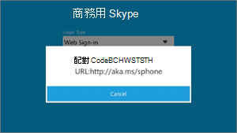
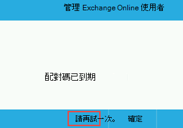
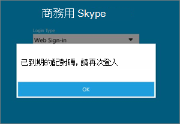
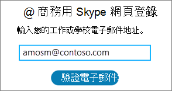
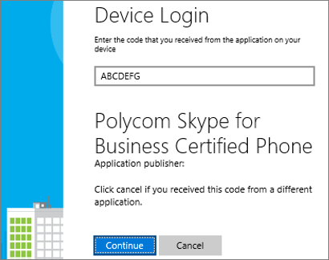
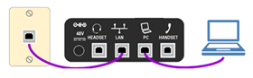

# 部署商務用 Skype Online 手機

這是部署指南，可協助您部署商務用 Skype Online IP 電話。
  
在所有類型的企業中，有電話號碼可以讓使用者撥打和接聽語音通話，而且這也是執行商務作業的重要需求。 擁有電話號碼的使用者可以在所有商務用 Skype 裝置上進行語音通話，包括 IP 電話、電腦及行動裝置。 您可以閱讀[取得商務用 Skype Online 的電話](getting-phones-for-skype-for-business-online.md)，進一步瞭解商務用 skype IP 手機。
  
## IP 電話的部署步驟

### 步驟 1-下載製造商的管理員指南和電話手冊

在您開始之前，請先下載手機制造商的管理指南和手機使用者手冊。
  
- 針對 Polycom 手機，請參閱[Polycom 部署指南](http://www.polycom.com/voice-conferencing-solutions/desktop-ip-phones.html)。
    
- 針對 Yealink 手機，請參閱[Yealink 商務用 SKYPE HD SIP 手機方案](http://www.yealink.com/products_top_2.html)。
    
- 針對 AudioCodes 手機，請參閱[AudioCodes 提供管理指南](https://www.audiocodes.com/solutions-products/products/products-for-microsoft-365/ip-phones-room-solutions)。
    
### 步驟 2-確認您正在購買或遷移商務用 Skype 支援的 IP 電話與固件

商務用 skype Online 支援的電話和固件與商務用 Skype Server 也是相容的，但反之並非總是如此。 若要確認您要購買或提供支援的電話和固件，請參閱[取得商務用 Skype Online 的電話](getting-phones-for-skype-for-business-online.md)。
  
### 步驟 3-檢查是否已安裝正確的固件，並視需要更新固件

檢查您手機上的固件版本。 作為
  
- **Polycom [VVX 手機**]，移至**設定** > **狀態** > **平臺** > **應用程式** > **主要**。
    
- **Yealink [電話**]，移至 [主要電話] 畫面上的 [**狀態**]。
    
- **AudioCodes [電話**]，從 [開始] 畫面移至 [**功能表** > **裝置狀態** > **固件版本**]。
    
    > [!NOTE]
    > 如需遠端存取電話的詳細資料，請參閱製造商管理指南。 請參閱上方的使用者指南和電話手冊連結。 
  
- **Lync Phone Edition （lpw）電話**，移至 [開始] 畫面中的 [**功能表** > **系統資訊**]。
    
### 步驟 4-裝置更新考慮

> [!NOTE]
> Polycom 之前，請先5.5.1 固件，然後再建立一個製造商專用的裝置鎖機制，該裝置會以商務用 Skype 實現「電話-鎖定」取代。 將使用「裝置鎖」保護的 5.4. a.x 中的手機升級為5.5.1，並不會從「裝置-鎖定」繼承 PIN 碼，這可以讓手機離開不安全。 已啟用「裝置鎖定」的使用者必須啟用下列 Polycom 裝置設定檔參數，讓使用者能夠控制升級的時間（popUpSK，deviceUpdate = 1）。 
  
固件更新是由商務用 Skype 服務來管理。 每個商務用 Skype 認證手機的固件都會上傳到商務用 Skype 補救伺服器，且預設會在所有手機上啟用裝置更新。 電話會自動下載並安裝最新的認證組建，這取決於電話和巡迴檢測間隔中的非啟用時間。 您可以使用[CsIPPhonePolicy](https://technet.microsoft.com/en-us/library/mt629497.aspx) Cmdlet 來停用裝置更新設定，並將_EnableDeviceUpdate_參數設定為`false`。
  

  
當有新的固件可供下載和安裝時，電話會通知使用者。 Polycom [電話] 會通知使用者，並提供**更新**或**延遲**的選項。
  
![顯示 [更新及推遲] 選項的螢幕擷取畫面。](../../images/50956fa0-da0c-4085-9bb5-4a2e99aecebb.png)
  
若是 Polycom 電話，您可以選取 [ **SwUpdate**] 來更新手機上的固件。
  
![顯示 [SwUpdate] 選項的螢幕擷取畫面](../../images/376c1998-6ce6-44b6-a84d-ae7d96b1c307.png)
  
您也可以選擇使用合作夥伴置備系統管理固件更新。 如需合作夥伴置備系統管理（包括高級電話自訂），請參閱製造商管理指南。
  
> [!CAUTION]
> 請務必使用單一裝置更新頒發機構（帶內裝置更新或協力廠商置備伺服器）來避免更新迴圈。 
  
### 步驟 5-配置與基礎結構電話設定

您可以使用商務用 Skype 頻帶內管理 Windows PowerShell Cmdlet 來設定最常用的電話選項和原則。 如需這些參數和設定的詳細資料，請參閱[設定 CsIPPhonePolicy](https://technet.microsoft.com/en-us/library/mt629497.aspx) 。
  
如需網路基礎結構規劃，請參閱[Skype 操作架構](https://www.skypeoperationsframework.com/)。
  
### 步驟 6-準備使用者以進行登入

若要讓使用者能夠成功登入商務用 Skype Online 手機並撥打電話，您必須確認已為使用者指派正確的授權。 您必須至少指派電話系統授權和通話方案。 如需其他資訊，您可以查看[商務用 skype 和 Microsoft 團隊附加元件授權](../../skype-for-business-and-microsoft-teams-add-on-licensing/skype-for-business-and-microsoft-teams-add-on-licensing.md)，以及[指派商務用 Skype 和 Microsoft 團隊](../../skype-for-business-and-microsoft-teams-add-on-licensing/assign-skype-for-business-and-microsoft-teams-licenses.md)授權。
  
您可以閱讀[電話系統和通話方案](/microsoftteams/calling-plan-landing-page)，以瞭解通話方案的詳細資訊
  
- 可供線上使用者使用的登**入選項**包括：
    
  - **POLYCOM VVX 5xx/6xx**手機的使用者將會看到：
    
     ![顯示 [Polycom 電話] 登入的螢幕擷取畫面](../../images/8a1ffb33-8a63-4242-bb76-d5fafb6a6472.png)
  
  - **YEALINK T48G/T46G**手機的使用者將會看到：
    
     ![螢幕擷取畫面顯示 [Yealink 電話登入]。](../../images/2a2892ae-850d-4781-8be0-4ffb8af068c9.png)
  
    如需製造商支援的登入選項的詳細資料，請參閱[取得商務用 Skype Online 的電話](getting-phones-for-skype-for-business-online.md)。
    
- **使用者識別碼**使用電話鍵台或螢幕小鍵盤（如果有的話），使用者可以使用其組織的使用者名稱和密碼登入手機。 例如，他們應該使用 UPN 格式，例如<em>amosm@contoso.com</em>的使用者名稱。
    
     ![顯示 [登入] 畫面的螢幕擷取畫面](../../images/f67fa8f4-66a5-451d-bdf2-a12daac15cb5.png)
  
    > [!NOTE]
    > LPW 和合作夥伴 IP 手機的商務用 Skype Online 不支援 PIN 驗證。 
  
- **使用電腦**當您在使用者的電腦上安裝較高乙太網路（BToE）軟體且已啟用時，使用者可以使用 Windows 商務用 Skype App 上的驗證視窗登入他們的手機。 請參閱[步驟7（選用）-如果您有裝置配對，且更好搭配乙太網路（BToE）使用](deploying-skype-for-business-online-phones.md#BK_BTOE)，以取得其他資訊。
    
  > [!NOTE]
  > 使用者必須使用組織的使用者名稱和密碼，才能登入電話。 例如，他們應該使用 UPN 格式，例如<em>amosm@contoso.com</em>的使用者名稱。
  
     ![顯示 [登入] 畫面的螢幕擷取畫面](../../images/f67fa8f4-66a5-451d-bdf2-a12daac15cb5.png)
  
- **使用 Web 登入**：這是線上使用者使用標準網頁瀏覽器進行驗證的新方法。 當使用者使用瀏覽器登入時，系統會提供一組指示以進行追蹤。
    
  - **POLYCOM VVX 5xx/6xx**手機的使用者將會看到：
    
     
  
  - **YEALINK T48G/T46G**手機的使用者將會看到：
    
     
  
    產生的程式碼將在15分鐘後到期。 當它到期時，使用者必須按一下 [**重試** **] 或 [確定]** 來產生新的程式碼（視電話而定）。
    
  - **POLYCOM VVX 5xx/6xx**手機的使用者將會看到：
    
     
  
  - **YEALINK T48G/T46G**手機的使用者將會看到：
    
     
  
    使用瀏覽器流覽至手機上顯示的位址，然後輸入商務用 Skype 的使用者名稱。
    
     
  
    輸入在手機上顯示的程式碼。
    
     
  
    確認網站顯示「[電話製造商名稱] 商務用**Skype 認證電話**」，然後按一下 [**繼續**]。
    
     
  
    按一下使用者的認證，或按一下 [**使用其他帳戶**]：
    
     
  
    出現下列頁面時，可以放心關閉瀏覽器。
    
     
  
    > [!NOTE]
    > LPW 商務用 Skype Online 的手機支援僅透過 USB tethering 登入。 
  
- **支援的部署**下表顯示目前支援之部署模型支援的驗證類型，包括 Exchange 整合、使用多重要素驗證（MFA）及商務用 Skype Online 與內部部署的 Skype 驗證。
    
|||||||
|:-----|:-----|:-----|:-----|:-----|:-----|
|**商務用 Skype**   |**證券**   |**電話登入方法**   |**商務用 Skype access**   |**已停用新式驗證與 MFA 的 Exchange 存取**   |**已啟用新式驗證與 MFA 的 Exchange 存取**   |
|Online    |Online    |網頁登入    |是的    |是的    |是的    |
|Online    |Online    |使用者名稱/密碼    |是的    |是的    |不    |
|Online    |內部部署    |網頁登入    |是的    |不    |不    |
|Online    |內部部署    |使用者名稱/密碼    |是的    |是的    |不    |
|內部部署    |線上/內部部署    |PIN 驗證    |是的    |不    |不    |
|內部部署    |線上/內部部署    |使用者名稱/密碼    |是的    |是的    |N/A    |
|內部部署    |線上/內部部署    |透過 PC 登入（BTOE）    |是的    |是的    |N/A    |
   
- **電話功能**根據 IP 電話夥伴，功能集可能會稍有不同。 若要取得完整的功能集，以及每個電話製造商功能的詳細資訊，請參閱[取得商務用 Skype Online 的電話](getting-phones-for-skype-for-business-online.md)。
    
- **電話鎖定**是商務用 Skype 認證手機中的最近推出的功能，用來保護電話。 如果已啟用，將會要求使用者在驗證成功時建立 PIN。 一旦建立，手機會在您定義的空閒超時過期時鎖定，使用者會手動鎖定其手機，或使用電話配對將手機鎖與其電腦鎖同步處理。 如果電話鎖定 PIN 輸入錯誤數次，手機將會登入使用者，或需要系統管理員的程式碼來解除鎖定電話，但這會視電話夥伴而定。 使用者的 PIN 應該介於6到15位數。
    
    您可以停用貴組織的電話封鎖功能（預設為啟用）、變更空閒超時，以及選擇使用者是否可以在來電時撥打或使用 inband 設定。 如需這些設定的詳細資訊，請參閱[設定 CsUCPhoneConfiguration](https://technet.microsoft.com/en-us/library/mt629497.aspx) 。
    
## 步驟7（選用）-如果您有裝置配對，且搭配乙太網路更好地搭配（BToE）

BToE 是一種手機 paining 機制，可讓合作夥伴 IP 電話使用其 Windows Skype for Business app 來配對使用者的手機。 BToE 可讓使用者：
  
- 使用商務用 Skype 桌面應用程式登入其 IP 電話（使用電腦）
    
- 同步處理電話鎖與電腦鎖
    
- 按一下以進行通話
    
BToE 可以設定為以兩種模式運作： [*自動*（預設）] 和 [*手動*]。 您也可以使用商務用 Skype 內設定中的使用者啟用（預設）/disabled。 在*手動*模式下作業時，使用者必須執行額外步驟，將手機與其 Windows app 配對。
  
 **若要將 BToE 部署至使用者**
  
1. 使用電腦埠將其電腦連線到他們的手機。
    
     
  
2. 從以下連結，從製造商網站下載並安裝最新的 BToE 軟體。 若要取得更佳的使用者體驗，您可以使用系統中心建構管理員（SCCM）等管理員發佈方案來散佈及安裝 BToE 軟體。 如需使用 SCCM 的說明，請參閱[System Center Configuration Manager 中的套件與程式](https://docs.microsoft.com/sccm/apps/deploy-use/packages-and-programs)。
    
   - [Polycom BToE 軟體下載網站](http://www.polycom.com/voice-conferencing-solutions/microsoft-phones.html)
    
   - [Yealink BToE 軟體下載](http://www.yealink.com/products_list_10.html)
    
   - [AudioCodes BToE 軟體下載](https://www.audiocodes.com/solutions-products/solutions/skype-for-business-microsoft-teams/skype-for-business-online)
    
3. BToE 的伺服器設定設定為 [**啟用**]，而且預設為 [**自動模式]** 。 若要變更這些設定，請參閱[設定 CsIPPhonePolicy](https://technet.microsoft.com/en-us/library/mt629497.aspx)。
    
> [!NOTE]
> Mac 和 VDI 平臺目前不支援 BToE。 
  
## 相關主題
[取得商務用 Skype 和 Microsoft 團隊的服務電話號碼](../../what-is-phone-system-in-office-365/getting-service-phone-numbers.md)

[以下是您在 Office 365 中使用電話系統所取得的結果](/MicrosoftTeams/here-s-what-you-get-with-phone-system)

[適用于音訊會議與通話方案的國家和地區可用性](/microsoftteams/country-and-region-availability-for-audio-conferencing-and-calling-plans/country-and-region-availability-for-audio-conferencing-and-calling-plans)

  
 
